# Setup the Environment

## Introduction
In this lab, you prepare your local machine with the core tools needed to build and enhance the CRM application.

### Objectives
- Install Visual Studio Code on the local machine.
- Install the Codex and SQL Developer extensions required for APEX development.

Estimated Time: 15 minutes

## Task 1: Install Visual Studio Code on your local machine
1. Open a browser and go to the Visual Studio Code download page at `https://code.visualstudio.com/Download`.
    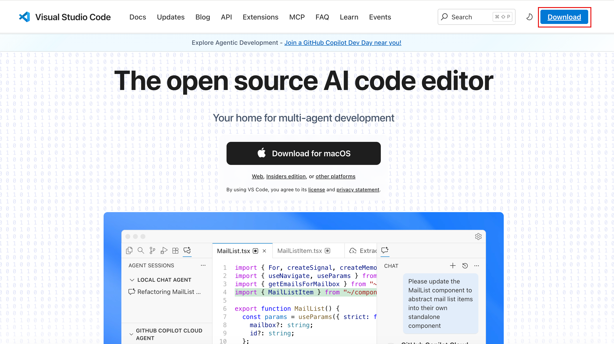
2. Choose the installer that matches your operating system (Windows, macOS, or Linux) and start the download.
    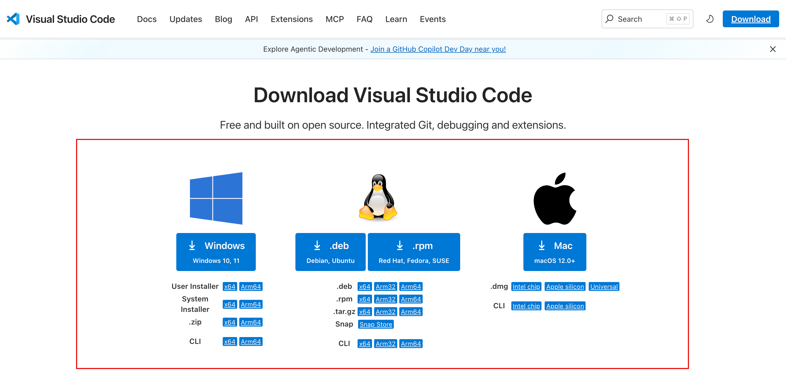
3. Run the downloaded installer and accept the default prompts to complete the installation.
    
4. Launch Visual Studio Code to confirm it opens successfully and pin it to your taskbar or dock for quick access.
    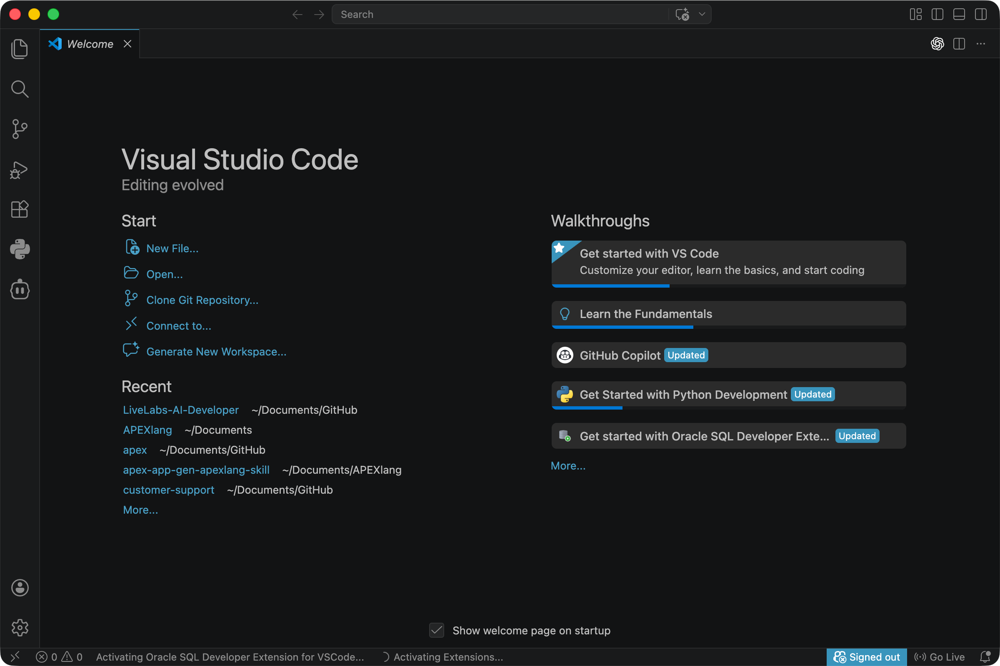

## Task 2: Install the extensions
1. In Visual Studio Code, open the Extensions view (`View` > `Extensions`) and search for `Codex`. In this workshop, we use Codex. However, you are free to choose your AI Coding Agent such as Claude Code.
    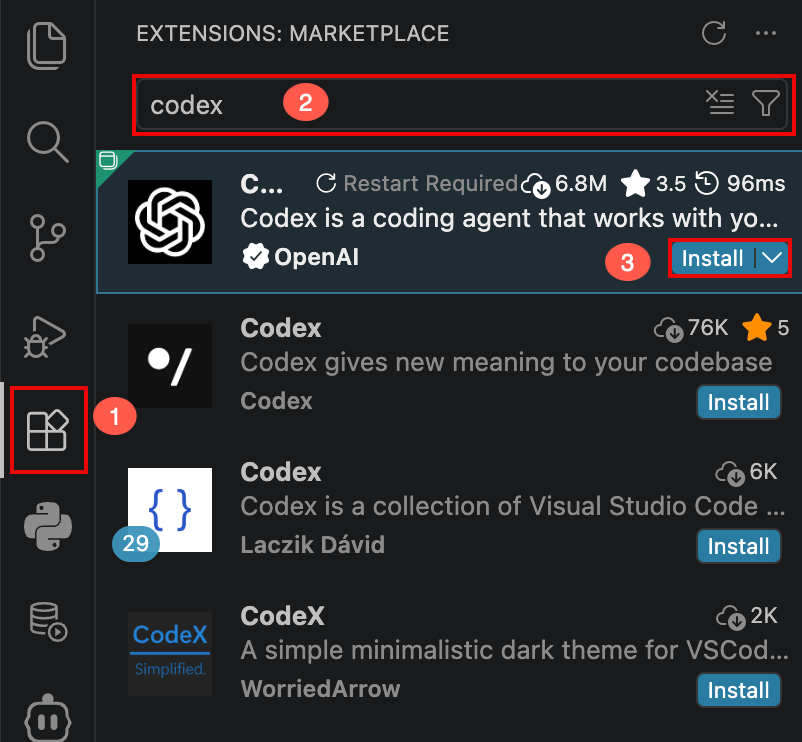
2. Select the Codex extension, click `Install`, then press `Ctrl+Shift+P` (Windows/Linux) or `Cmd+Shift+P` (macOS) and run `Codex: Set API Key` to paste your API key.
    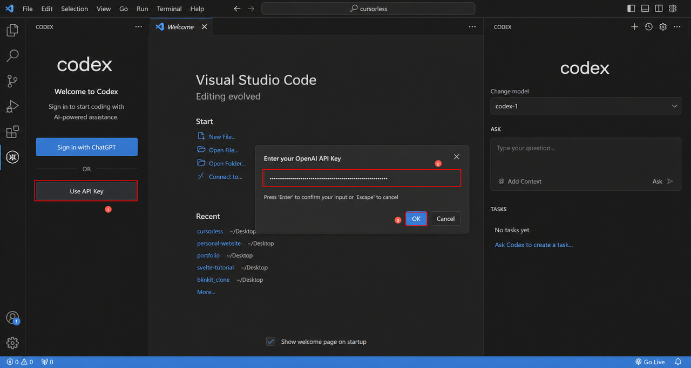
3. While in the Extensions view, search for the SQL Developer extension and install it.
    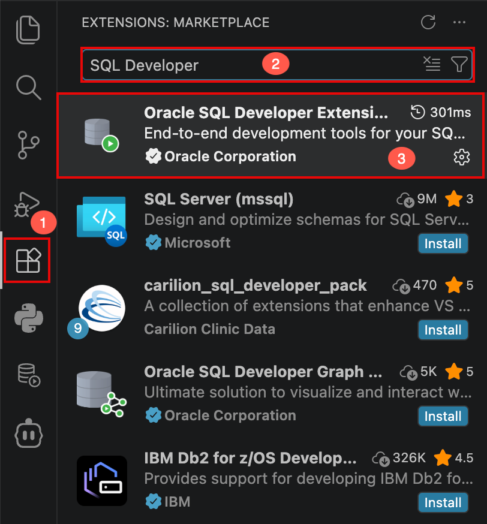
4. After installation, use the SQL Developer extension command palette entries to add a new connection, supplying the credentials for your APEX Workspace schema so the extension can reach the correct tenancy workspace.
    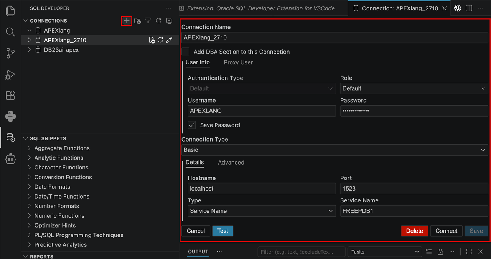

5. Switch back to Extensions view. Search for **Python** and click **Install**.
    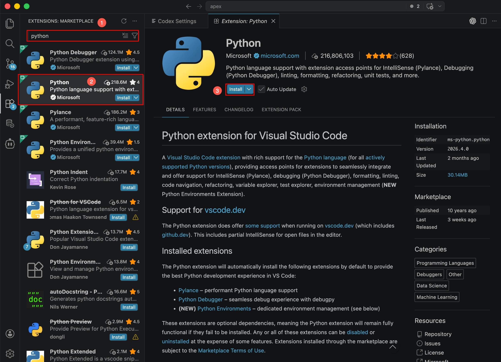

6. Finally, we need to install the SQLcl MCP server. Download the latest version of [SQLcl](https://www.oracle.com/database/sqldeveloper/technologies/sqlcl/download/) to your local machine. 
    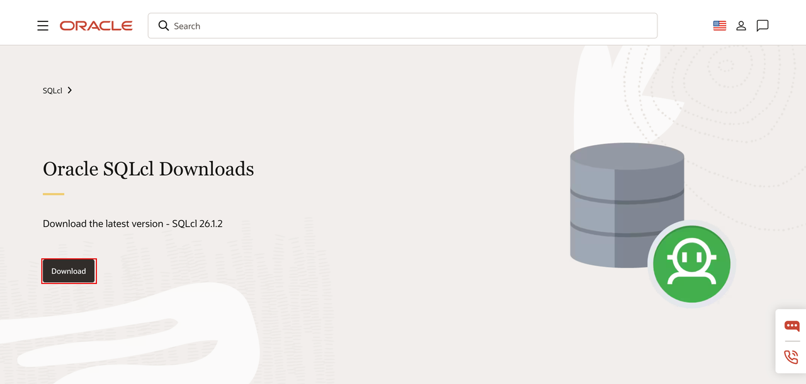

7. In the Codex chat agent, click on **Codex Settings**.
    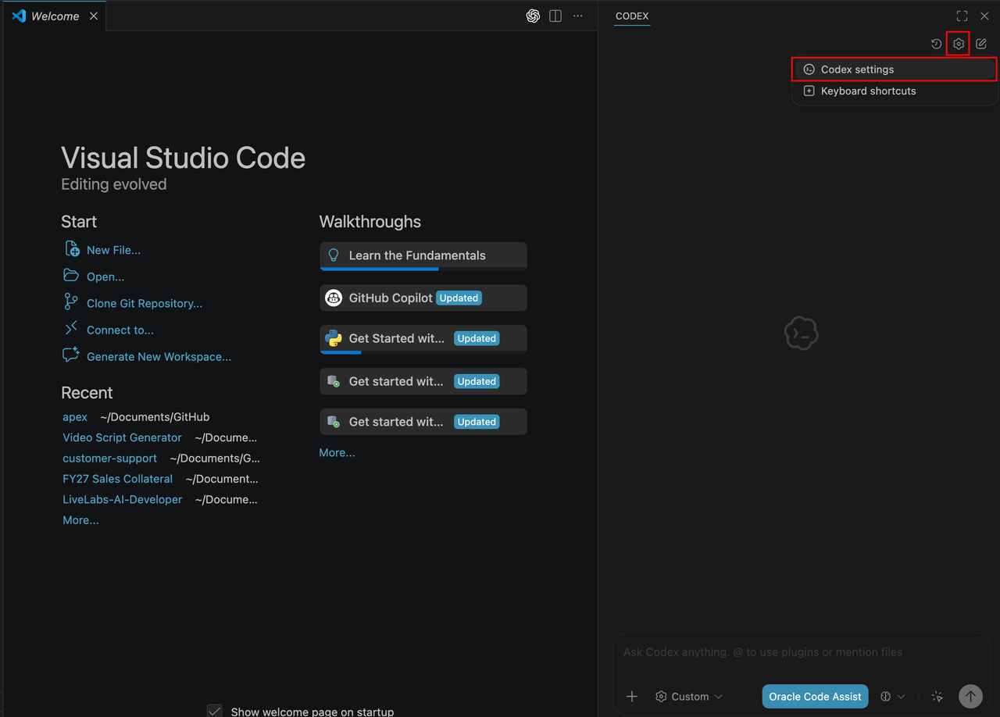

8. In the Codex Settings page, navigate to **MCP servers** and click **Add server**.
    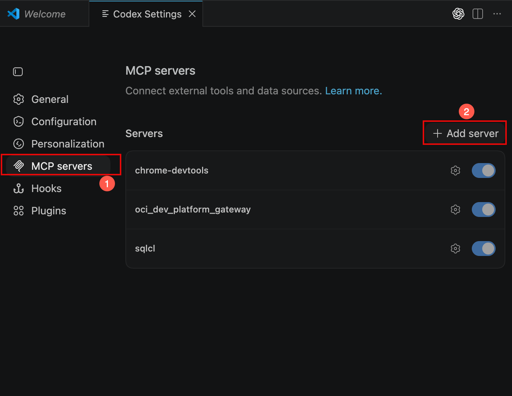

9. Enter the following details on the Connect to Custom MCP page:
    - Name: **sqlcl**
    - Command to launch: *Enter the path to the sqlcl/bin/sql folder on your local machine*
    - Arguments: **-mcp**

    Click **Save**.

    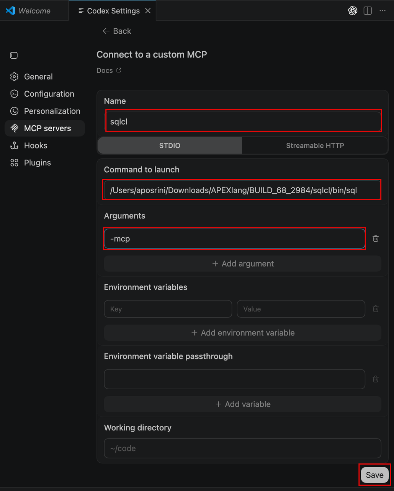

## Acknowledgements
- **Author** - Apoorva Srinivas, Prinicpal Product Manager
- **Last Updated By/Date** - Apoorva Srinivas, Principal Product Manager, April 2026
