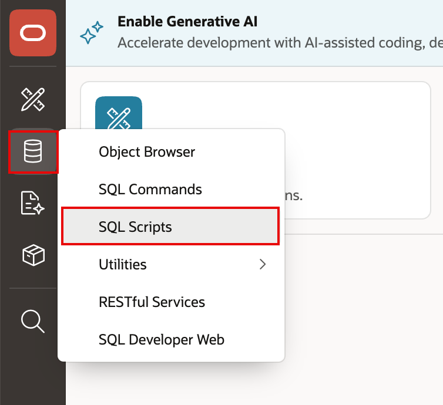
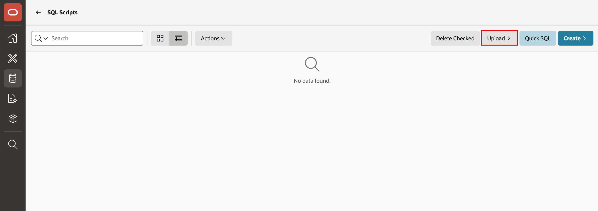
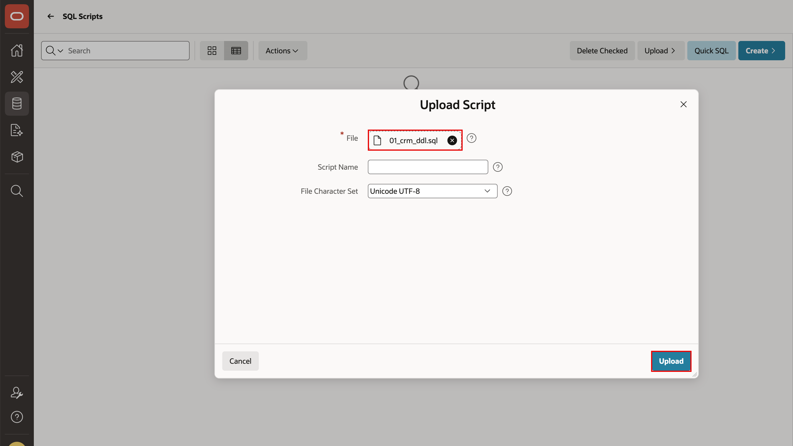
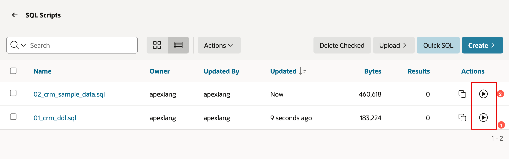
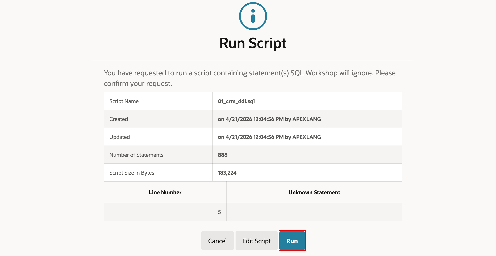
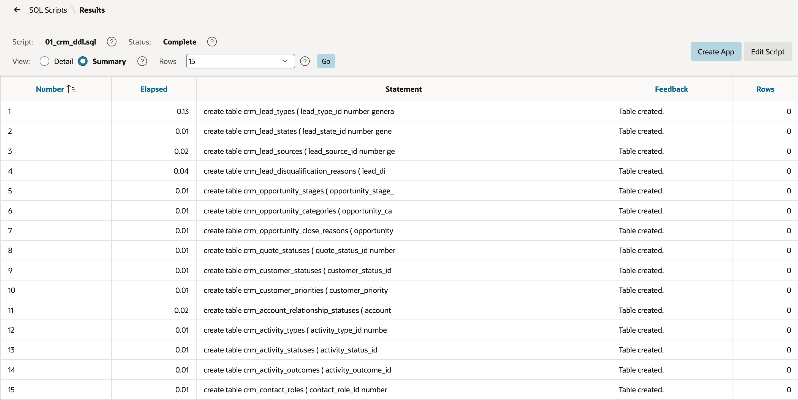

# Lab 2: Setup CRM Schema along with Sample Data

## Introduction
Prepare the CRM schema and sample data inside your APEX workspace so the application has a working dataset.

### Objectives
- Download the CRM schema installation scripts.
- Run the scripts through APEX SQL Workshop.

Estimated Time: 15 minutes

## Task 1: Download the scripts for installing CRM schema
1. Download the installation scripts required to create the CRM schema:
- [01\_crm\_ddl.sql](files/01_crm_ddl.sql)
- [02\_crm\_sample\_data.sql](files/02_crm_sample_data.sql)
    

## Task 2: Run the scripts in your APEX workspace > SQL Workshop > SQL scripts
1. Open SQL Workshop in your APEX workspace and navigate to **SQL Scripts**.
    

2. Click **Upload**.
    

3. Select the downloaded scripts from Task 1 (01\_crm\_ddl.sql and 02\_crm\_sample_date.sql) one after the other. Click **Upload**.
    
    

2. Execute the scripts one by one in sequence within SQL Scripts to deploy the CRM schema and sample data.
    

    

    

## Acknowledgements
- **Author** - Apoorva Srinivas, Prinicpal Product Manager
- **Last Updated By/Date** - Apoorva Srinivas, Principal Product Manager, April 2026
