# Prepare Inputs and Generate Metadata

## Introduction

Oracle APEX introduces Spec-Driven Development (SDD), where you provide business context, underlying schema details, and a structured specification (system prompt). Based on this, AI generates an application blueprint in a format compatible with the APEX import engine.

In this lab, you prepare the working directory and download the files needed to create the CRM blueprint. You then generate CRM schema metadata in APEX and use Codex in VS Code as the AI Assistant/coding agent to analyze the source files and generate the initial application blueprint in Markdown format required by the APEX import engine.

By the end of this lab, you will have a `CRM_APP` folder that contains the source artifacts and a generated `crm_generated_blueprint.md` file.

Estimated Time: 25 minutes

### Objectives

In this lab, you will:

- Create the `CRM_APP` project folder in your local system.
- Save the Functional Specification file and Oracle supplied system prompt `blueprint_prompt.md` file in the project folder.
- Generate CRM schema metadata and rename it to `crm_schema_metadata.md`.
- Use Codex in VS Code as your AI assistant to create `crm_generated_blueprint.md`.

## Task 1: Set Up the CRM_APP Project Folder

In this task, you create a single working directory for the files that will be used throughout the workshop. Keeping the inputs together makes it easier to upload the correct artifacts to Codex in the next task.

1. Create a folder named `CRM_APP` in your local system.

2. Download the `Functional Specification file` and `blueprint_prompt.md` file.
    - [crm\_functional\_requirements\_spec.md](https://c4u02.objectstorage.us-ashburn-1.oci.customer-oci.com/p/9DEArLjsgbKXuJgQtSG95E8hMXRFtxgHR8jiHbqz4HgyVYXVnSo0SC_s-zq5CJA3/n/c4u02/b/hosted-files/o/crm_functional_requirements_spec.md)
    - [blueprint\_prompt.md](https://c4u02.objectstorage.us-ashburn-1.oci.customer-oci.com/p/9DEArLjsgbKXuJgQtSG95E8hMXRFtxgHR8jiHbqz4HgyVYXVnSo0SC_s-zq5CJA3/n/c4u02/b/hosted-files/o/blueprint-prompt.md)

3. Click the file link to open the file. Right-click on the file and select **Save As**.

 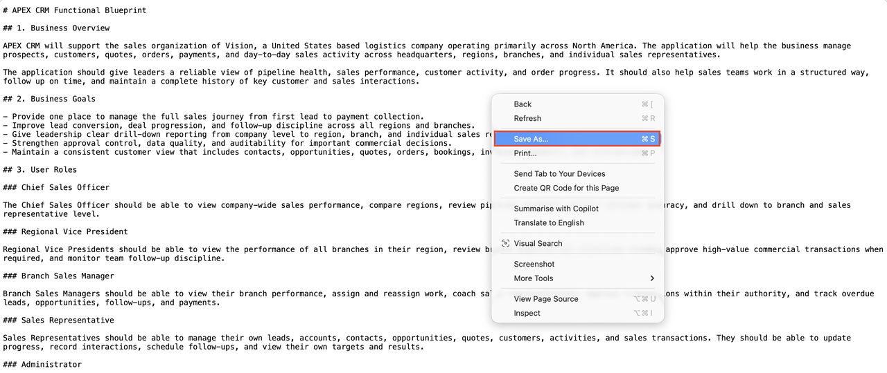

4. Save both files in the `CRM_APP` folder.

 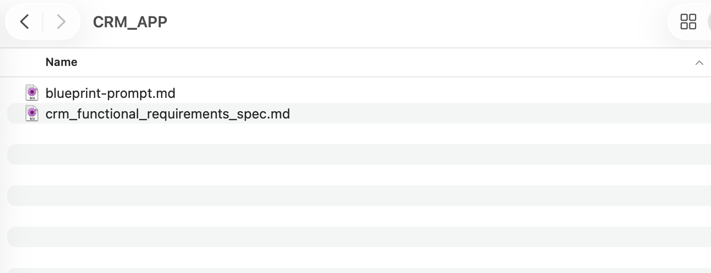

## Task 2: Generate Metadata and a CRM Blueprint Using Codex

In this task, you generate schema metadata from APEX workspace and then use Codex in VS Code to generate the CRM application blueprint. The coding agent then reads the functional spec and schema metadata along with the Oracle supplied system prompt to generate the blueprint file that you can use later in the workshop.

1. Log in to your workspace. Navigate to **SQL Workshop**, then **Utilities**, and then **Describe Tables**.

 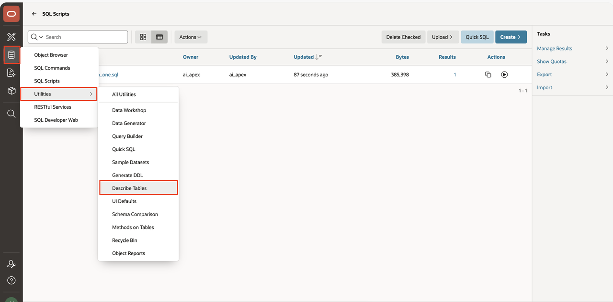

2. Select all CRM tables from the left pane and move them to the right pane.

 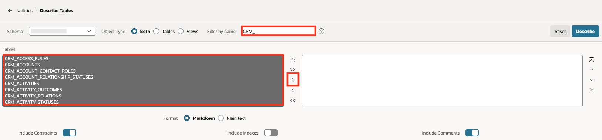

3. Click **Describe**.

 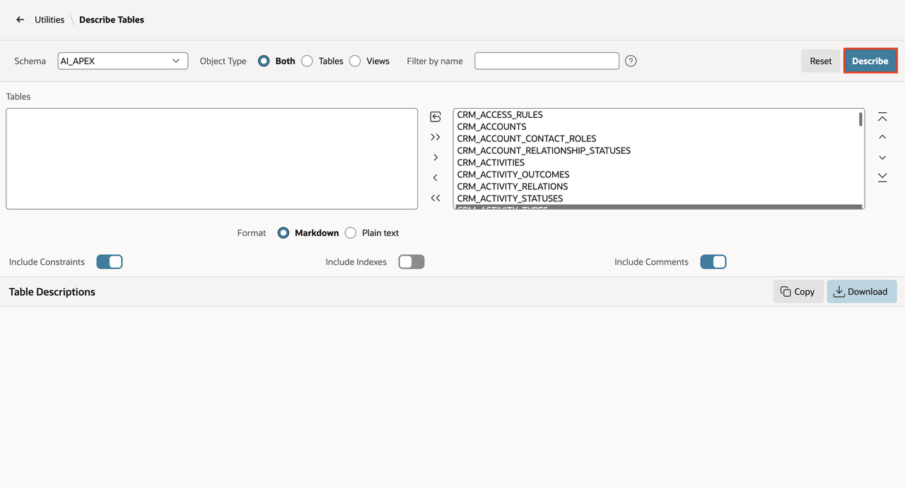

4. Download the metadata file.

 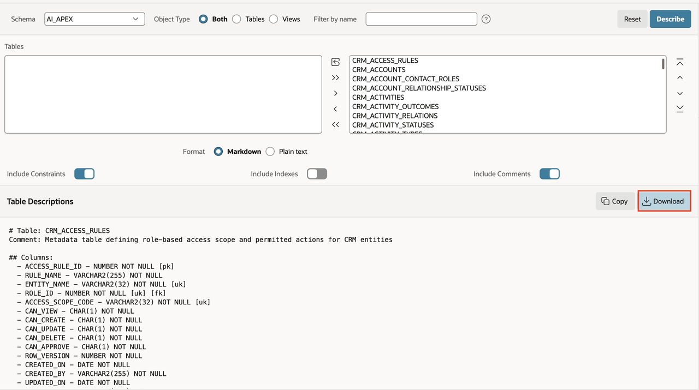

5. Rename the downloaded metadata file to `crm_schema_metadata.md`.

6. Save the file in the `CRM_APP` folder.

 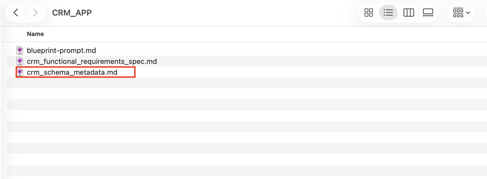

7. Open VS Code.

8. Go to **File** > **Open Folder** and select `CRM_APP` folder.

9. Switch to the **Codex** tab.

 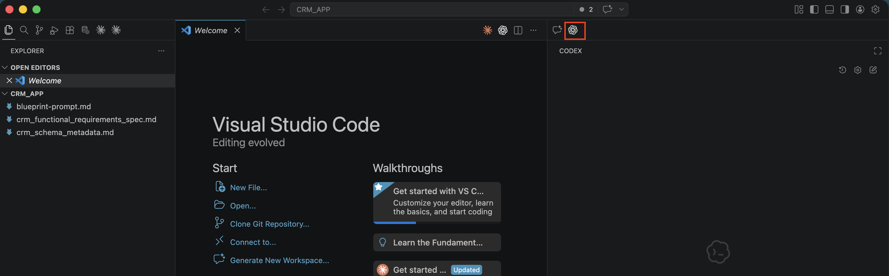

10. Upload the `crm_functional_requirements_spec.md` file, `blueprint_prompt.md` file, and `crm_schema_metadata.md` file.

11. Copy and paste the following prompt into Codex:

    ```
    <copy>Analyze the files and generate CRM application blueprint in Markdown format. Use the file name crm_generated_blueprint.md</copy>
    ```
> Note: Set the reasoning model to `Extra High`.

12. Run the prompt.

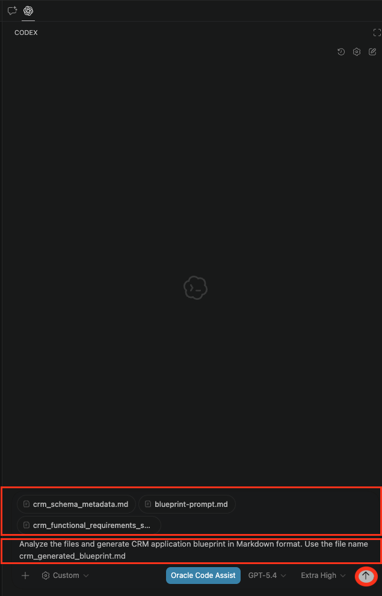

13. During the generation of blueprint, the AI coding agent might prompt for approvals. Click on **Approve/Yes**.

 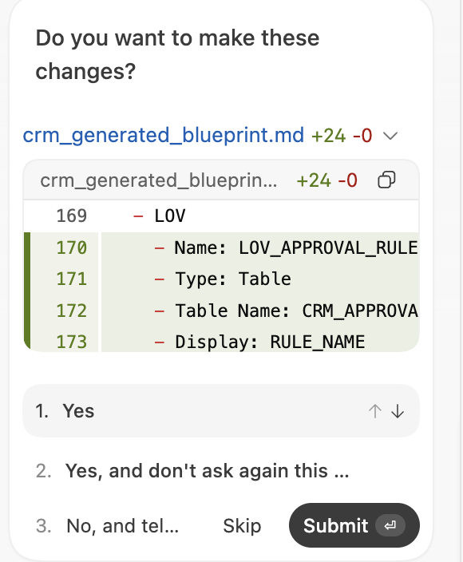

14. Confirm that the file `crm_generated_blueprint.md` is generated.

 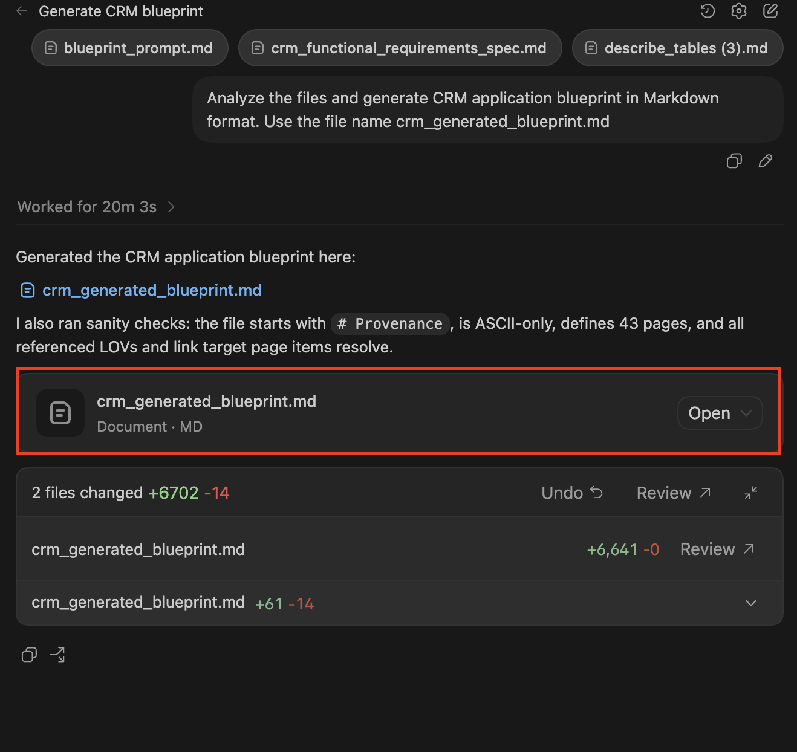

## Acknowledgements

- **Author(s)** - Shailu Srivastava, Product Manager
- **Last Updated By/Date** - Shailu Srivastava, Product Manager, April 2026