# Lab 4: Deploy, Configure, and Customize Application

## Introduction

In this lab, you work with a generated application blueprint and import into Oracle APEX workspace. 

You begin by preparing the APEX environment, including registering the schema for RESTful Services. Next, you import the generated blueprint file into the workspace. The APEX parser then deterministically converts this blueprint into an APEX application and installs it in your workspace.

After installation, you configure access by assigning roles using User Access Control. Finally, you launch the application and refine its appearance using Theme Roller.

Estimated Time: 20 minutes

### Objectives

In this lab, you will:

- Register the schema in RESTful Services.
- Import the generated blueprint file into APEX workspace.
- Configure user roles through User Access Control.
- Launch the application and customize the UI.

## Task 1: Prepare the APEX Environment

In this task, you prepare the workspace so the schema is ready for the remaining application setup steps. This keeps the deployment flow aligned with the source instructions before you import and configure the application.

1. Log in to your Workspace. Navigate to **SQL Workshop** > **RESTful Services** > **Register Schema With ORDS**.

 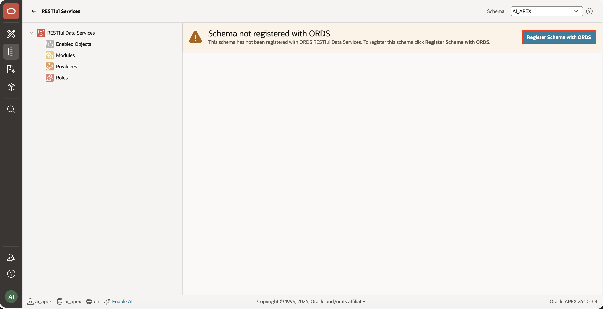

2. Click **Save Schema Attributes**.

 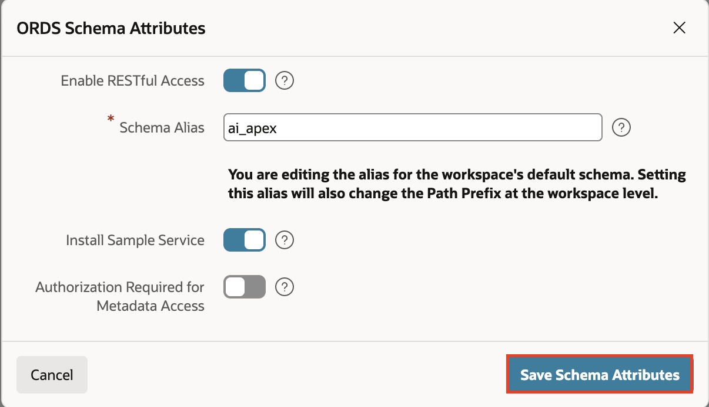

 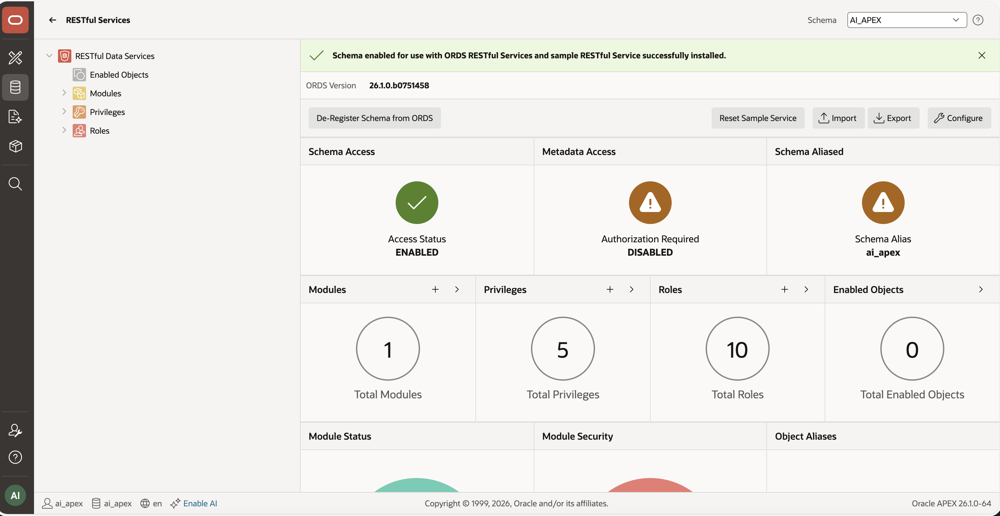

## Task 2: Import and Configure the Application

In this task, you import the generated blueprint file and validate the blueprint, correct errors if needed, and reimport. You then use User Access Control to assign roles and verify that access is set up correctly.

1. Log in to the APEX workspace.Navigate to **Import**.

 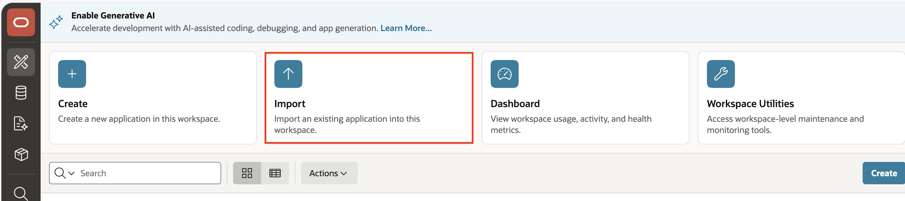

2. Upload the generated blueprint file. Choose File Type **Application Blueprint**

3. Click **Next**

 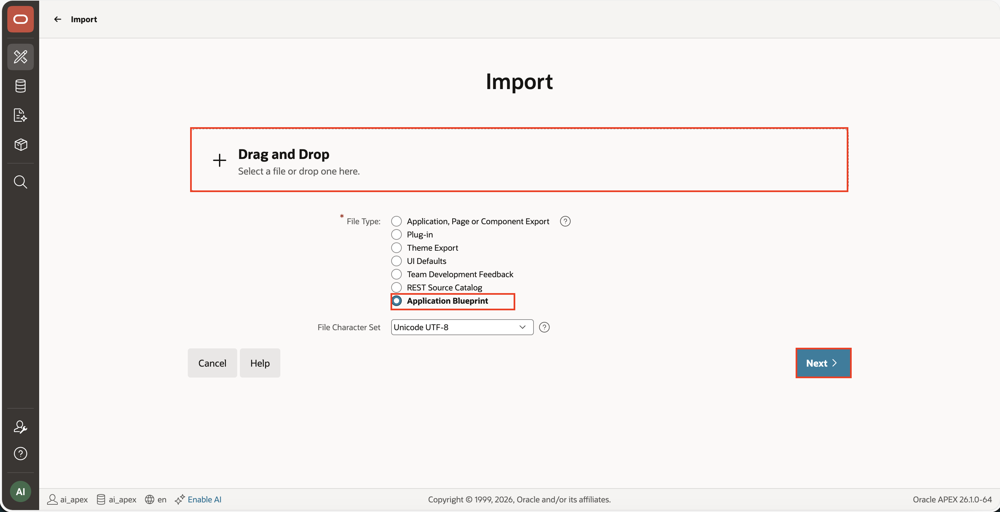

 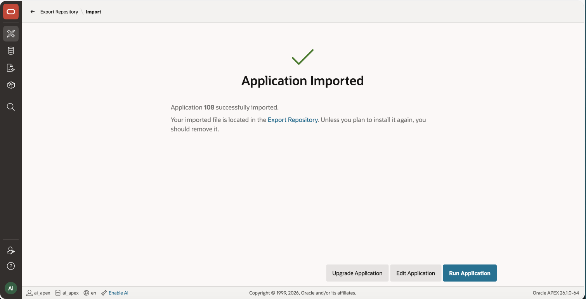

>    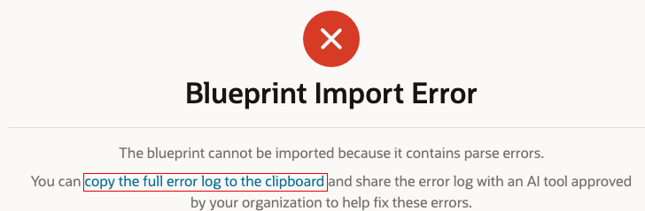

> **Note:** If a blueprint error appears after Step 3, click **Copy full error log to clipboard**. Paste the copied log into VS Code so your AI assistant can analyze it and fix the errors in the generated blueprint. Once the new file is ready, repeat Step 1 to 3 of Task 2.

4. Open the application. Navigate to **Shared Components**, and click **User Access Control**.

 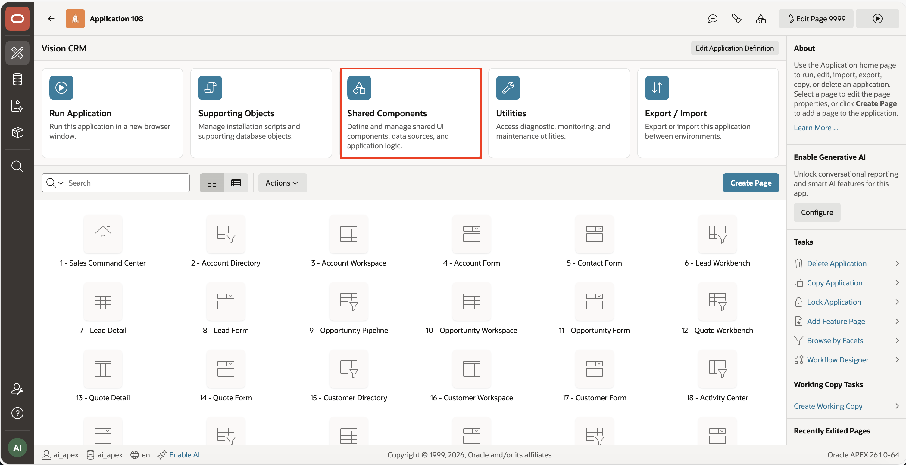

 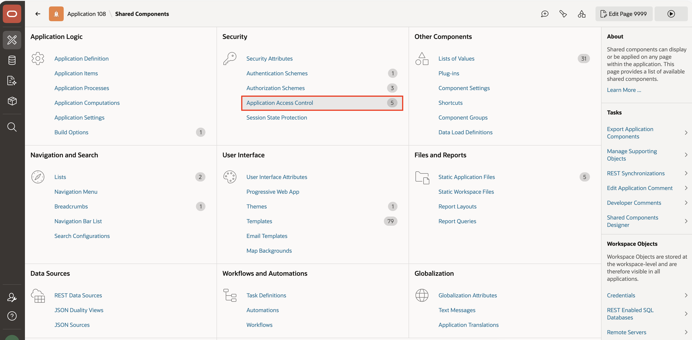

5. Click **Add User Role Assignment**.

  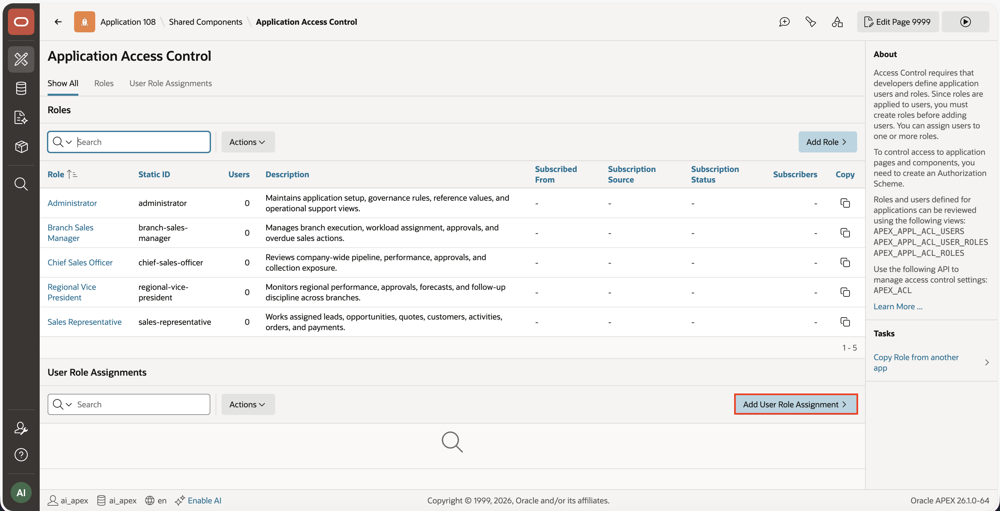

6. Enter the User Name and assign the appropriate roles. Click **Create Assignment**

  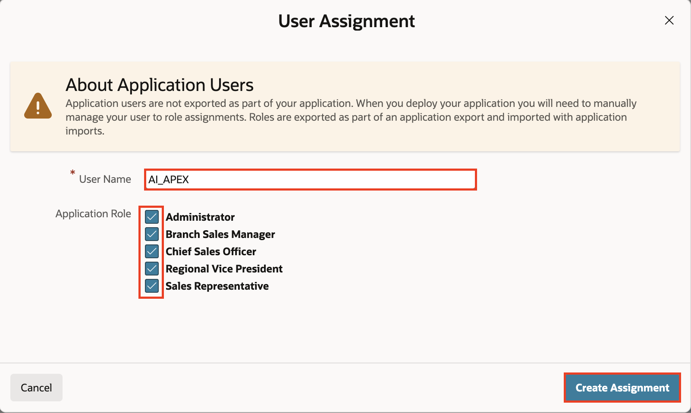

## Task 3: Run and Customize the Application

In this task, you run the application and apply the first round of UI customization. This final step confirms that the imported application runs and lets you tailor the appearance before moving on to later work.

1. Run the application.

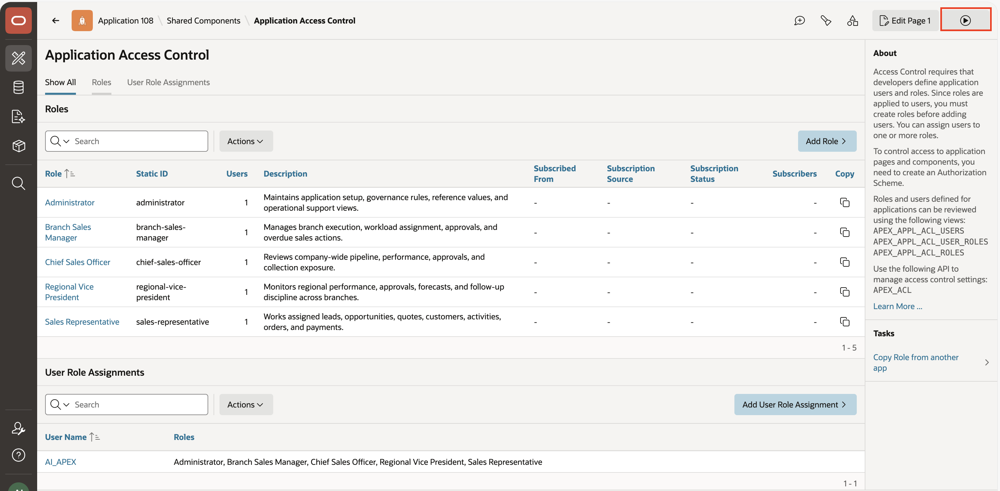

2. Navigate to **Developer Toolbar**. Click on **Customise**.Open **Theme Roller**.

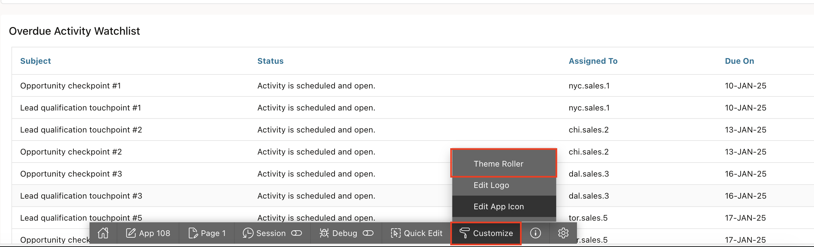

3. Customize the UI appearance.

4. Save the theme.

## Acknowledgements

- **Author(s)** - Shailu Srivastava, Product Manager
- **Last Updated By/Date** - Shailu Srivastava, Product Manager, April 2026