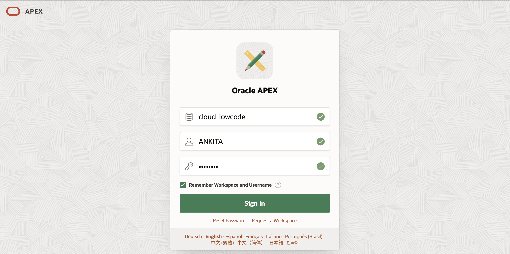
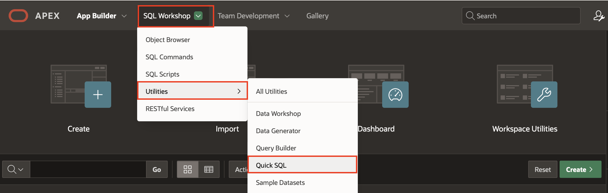
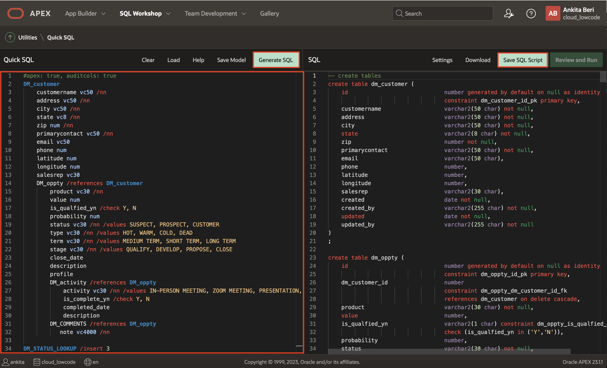
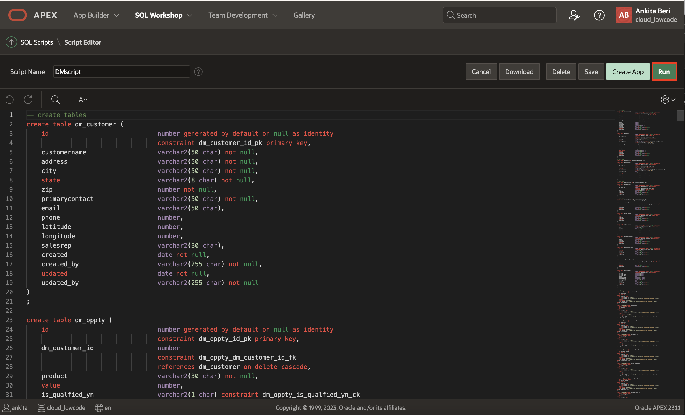
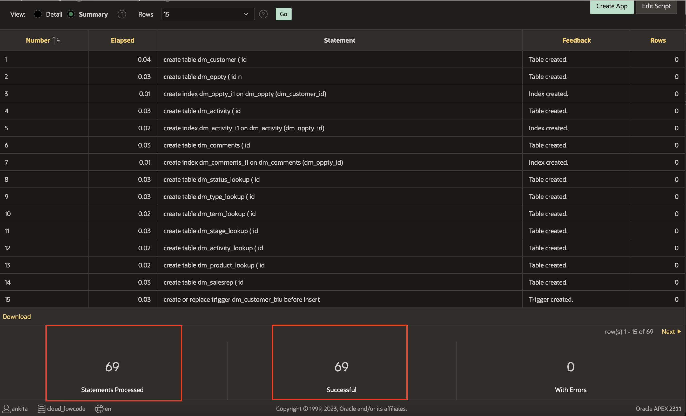
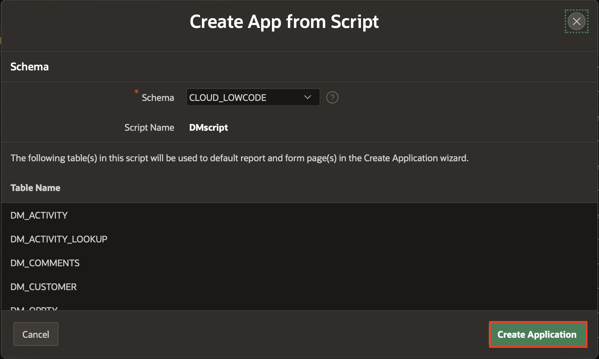
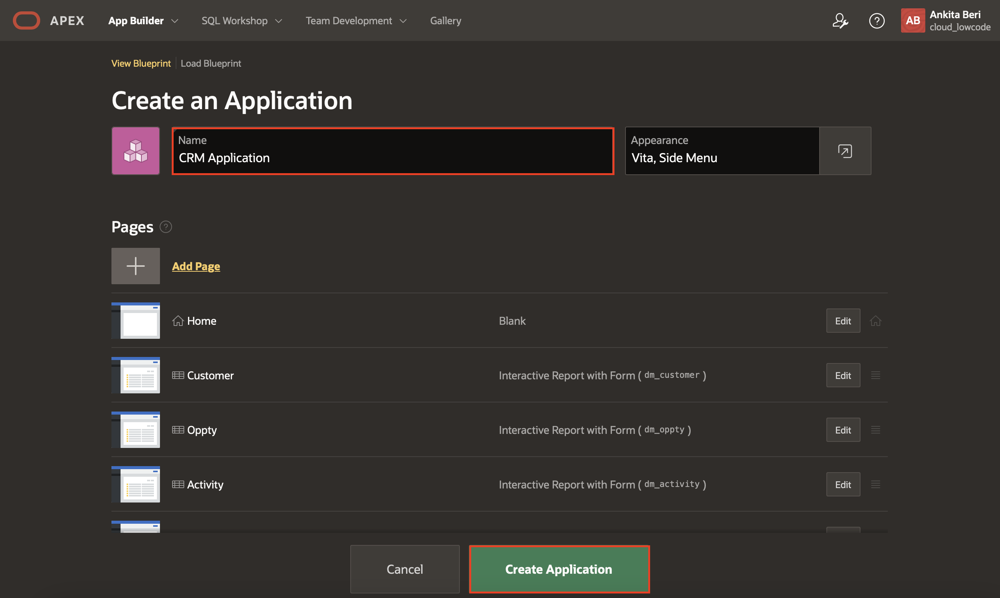
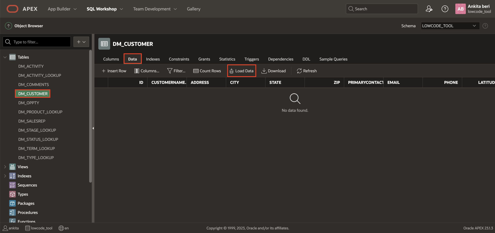

# Create Application Using Quick SQL

## Introduction

In this lab, you gain hands-on experience in building an APEX application using Quick SQL. Quick SQL offers an efficient approach to rapidly develop the SQL code required for creating simple tables and views within your APEX application.

The script will encompass multiple tables and views, including customer, opportunity, sales representatives, activity, and comments, to construct a comprehensive CRM data model.
By utilizing this feature, you can swiftly establish the essential database structure to support the CRM functionalities, making the process of creating the CRM data model a seamless and time-effective endeavor.

Estimated Time: 10 minutes

### Objectives

In this lab, you will:
- Create Quick SQL script from an indented text document.
- Create an APEX application using SQL Script.

## Task 1: Implement Quick SQL Script

1. Login into your Workspace

     

2. Click SQL Workshop. Select **Utilities** then Select **Quick SQL**.

    

3. In the Quick SQL pane:
   Copy the code below and paste it into the code editor:

   ```
   <copy>
   #apex: true, auditcols: true
   DM_customer
    customername vc50 /nn
    address vc50 /nn
    city vc50 /nn
    state vc8 /nn
    zip num /nn
    primarycontact vc50 /nn
    email vc50
    phone num
    latitude num
    longitude num
    salesrep vc30
    DM_oppty /references DM_customer
    product vc30 /nn
    value num
    is_qualfied_yn /check Y, N
    probability num
    status vc30 /nn /values SUSPECT, PROSPECT, CUSTOMER
    type vc30 /nn /values HOT, WARM, COLD, DEAD
    term vc30 /nn /values MEDIUM TERM, SHORT TERM, LONG TERM
    stage vc30 /nn /values QUALIFY, DEVELOP, PROPOSE, CLOSE
    close_date
    description
    profile
    DM_activity /references DM_oppty
    activity vc30 /nn /values IN-PERSON MEETING, ZOOM MEETING, PRESENTATION, EMAIL, PHONE CALL
    is_complete_yn /check Y, N
    completed_date
    description
    DM_COMMENTS /references DM_oppty
        note vc4000 /nn

    DM_STATUS_LOOKUP /insert 3
     status vc30 /values SUSPECT, PROSPECT, CUSTOMER
    DM_TYPE_LOOKUP /insert 4
     type vc30 /values HOT, WARM, COLD, DEAD
    DM_TERM_LOOKUP /insert 3
     term vc30 /values MEDIUM TERM, SHORT TERM, LONG TERM
    DM_STAGE_LOOKUP /insert 4
     stage vc30 /values QUALIFY, DEVELOP, PROPOSE, CLOSE
    DM_ACTIVITY_LOOKUP /insert 5
     activity vc30 /values IN-PERSON MEETING, ZOOM MEETING, PRESENTATION, EMAIL, PHONE CALL
    DM_PRODUCT_LOOKUP /insert 8
     product vc40 /values WIDGETS, SPROCKETS, SPOKES, WIDGETS, COG WHEELS, GEARS, GRADER MACHINE, CHAIN MODULES
   DM_salesrep
     salesrep vc50
     salesrep_phone vc50
     salesrep_email vc50
     photo file

   view DM_customer_oppty DM_customer DM_oppty
   view DM_oppty_COMMENTS DM_oppty DM_COMMENTS
   view DM_activity_oppty DM_activity DM_oppty
   view DM_salesrep_customer_oppty DM_customer DM_oppty DM_salesrep
   view DM_salesrep_customer_oppty_activity_notes DM_customer DM_oppty DM_activity DM_comments DM_salesrep
  </copy>
  ```
4. In the SQL (left pane) toolbar, Click Generate SQL then in the SQL (right pane) toolbar, click Save SQL Script.

    

5. In the Save Script dialog, for Script Name, enter **DMScript**. Click Save Script.

    

6. Click **Review and Run**
   The script will be displayed in the Script Editor, within SQL Scripts.

    

7. Click **Run**    

    

8. On the Run Script page, Click **Run Now**

    

9. The Script Results page will be displayed listing the statements processed, successful, and with errors.

    

  {Note: If you do not see 69 statements processed then return to Quick SQL and click Generate SQL, resave the script and then run it again. If you do not see 69 successful, then review the errors displayed in Feedback within the results.}

## Task 2: Create an App from Script

1. In the Script Editor page, Click Create App

     

2. Click Create Application

       

3. On the Create an Application page, for Name enter CRM APP.
   Click **Create Application**

     

4. Your new application will be displayed in Page Designer.
   Click Run Application.  

      

5. In the runtime environment, the login page will be displayed.

   Enter your Username and Password (Username should be Demo).

   Click Sign In.

   The new application will be displayed.  

      

## Task 3: Load data using .csv file

1. Return to the App Builder tab. Click SQL Workshop then select **Object Browser**.

    

2. Under Tables, Select **DM_customer**. Click on **Data**, below that Select **Load Data**.

    

3. Upload [**customer.csv**](files/customer.csv)

    

4. Click **Load Data**

    

5. Click **View Table**

    

    

 *Repeat the same steps to load data for tables DM_oppty, DM_activity, DM_comments, DM_salesrep.*
 [**oppty.csv**](files/oppty.csv)
 [**salesrep.csv**](files/salesrep.csv)
 [**activity.csv**](files/activity.csv)
 [**comments.csv**](files/comments.csv)

## Summary

You now know how to utilize the Create Application wizard directly from SQL Scripts to create the first cut of your application.

You may now **proceed to the next lab**.   

## Acknowledgments
- **Author** - Tom Edwards - Director of Application Development Business Development, Ankita Beri - Product Manager
- **Contributor** - Ankita Beri, Product Manager
- **Last Updated By/Date** - Ankita Beri, Product Manager, June 2023
