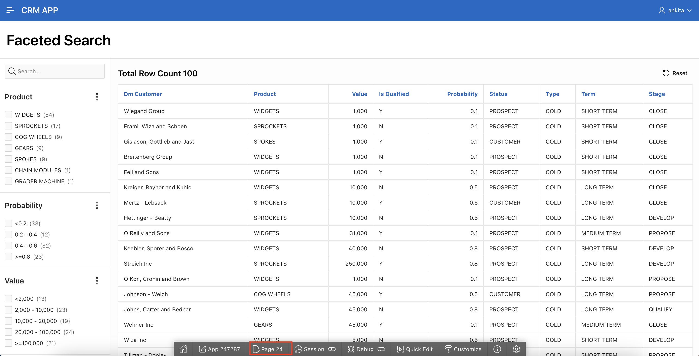

# Create Faceted Search Page

In this lab, you learn to create a Faceted Search Page. A faceted search page will display and filter Opportunity data using an intuitive experience.

Estimated Time: 10 minutes

### Objectives

In this lab, you will:
- Create Faceted Search page using DM_oppty table.

## Task 1: Create Faceted Search Page

1. Click on App Builder and Select CRM APP. Click Create Page.

   

2. In Create a Page Wizard screen select Faceted Search and Click Next.

    

3. In Create Faceted Search wizard:
    - For Name - Type Faceted Search
    - For Table / View Name - Select **DM_OPPTY**  
  Click Next.

    

4. Select Facets. If Face selection is not shown, Click Refresh
   Make sure to have these seven (7) selections: PRODUCT, VALUE, PROBABILITY, STATUS, TYPE ,TERM, STAGE.

   Click **Create Page**

    

5. Click green Save & Run button to view the faceted search page report.

    

    

## Task 2: Improve Faceted Search Page  

1. From developer toolbar, Edit Page 24.

    

2. In left render pane:

     - Click P24_VALUE

     - Drag and drop to underneath P24_SEARCH

  

3. In the right pane under List of Values:
   Change Type to -Select-

      

4. Click Save & Run button
   In the first Value range, enter 45000 and Click Go.

  

  ## **Summary**

  You now know how to create and edit Faceted Search page.

  You may now **proceed to the next lab**.   

  ## Acknowledgments
     - **Author** - Ankita Beri, Product Manager
     - **Last Updated By/Date** - Ankita Beri, Product Manager, June 2023
