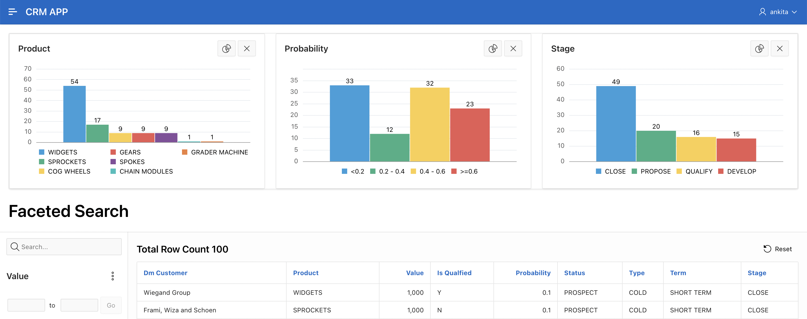

# Create Faceted Search Page

## Introduction

In this lab, you create a faceted search page that provides an intuitive and user-friendly experience to display and filter Opportunity data. This functionality allows users to easily explore and refine the data by applying various filters, making it convenient to access the specific information they need.

Estimated Time: 10 minutes

### Objectives

In this lab, you will:
- Create Faceted Search page using **DM_OPPTY** table.
- Create a Mini Dashboard at the top of the page using Charts.

## Task 1: Create Faceted Search Page

1. Click on App Builder and Select CRM APP. Click Create Page.

   

2. In Create a Page Wizard screen select Faceted Search and Click Next.

    

3. In Create Faceted Search wizard:
    - For Name - Type Faceted Search
    - For Table / View Name - Select **DM\_OPPTY**  
  Click Next.

    

4. Select Facets. If Face selection is not shown, Click Refresh
   Make sure to have these seven (7) selections: PRODUCT, VALUE, PROBABILITY, STATUS, TYPE ,TERM, STAGE.

   Click **Create Page**

    

5. Click green Save & Run button to view the faceted search page report.

    

    

## Task 2: Improve Faceted Search Page  

1. From developer toolbar, Edit Page 24.

    

2. In left render pane:

     - Click P24_VALUE

     - Drag and drop to underneath P24_SEARCH

  

3. In the right pane under List of Values:
   Change Type to -Select-

      

4. Click Save & Run button
   In the first Value range, enter 45000 and Click Go.

  

## Task 3: Add Mini-Dashboard

1. From developer toolbar, Select Edit Page 24.
In bottom middle in Layout pane, Click Region button and  Drag </> Static Content to top of page directly under Breadcrumb REGION BODY and release mouse.

    

2. In right details pane, under Identification, For Title : Type **Dashboard** and scroll down to Advanced section, For Static ID, Type **Dash**

    

3. In left render pane, Select Search.
In right details pane at the top to the right of Region, Click Attributes.

 In Settings section ,For Show Charts : Select **Selector** and
For Charts Selector : Type **#Dash**

    

4. In left render pane, Select Facets.
Hold Control key on keyboard & Select P24\_PRODUCT, P24\_PROBABILITY, P24\_STAGE

 In right details pane, scroll down to Advanced section:
Enable **Show Chart Initially**

   

5. Click Save & Run to view mini dashboard.

   

## Task 4: Add Actionable Link

1. Click Edit page 24
In left render pane, under Search Results, Click to expand Columns
and Select PRODUCT.

 In right details pane, in Identification section, Change Type to Link

 

2. Under Link section, Click button No Link Defined.
   In Link Builder – Target dialog
   - For Page : Select 5
   - For Clear Cache : Select 5
   - For Set Items : For Name : Select P5_ID and For Value : Select ID

 Click Ok

    

3. Click Save & Run button and Select any link from the Product column in the runtime environment.

    

## Summary

You now know how to create and edit Faceted Search page.

You may now **proceed to the next lab**.   

## Acknowledgments
- **Author** - Tom Edwards - Director of Application Development Business Development, Ankita Beri - Product Manager
- **Last Updated By/Date** - Ankita Beri, Product Manager, June 2023
