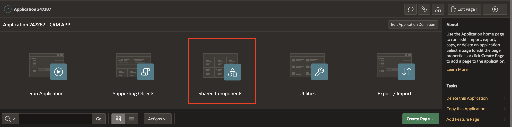
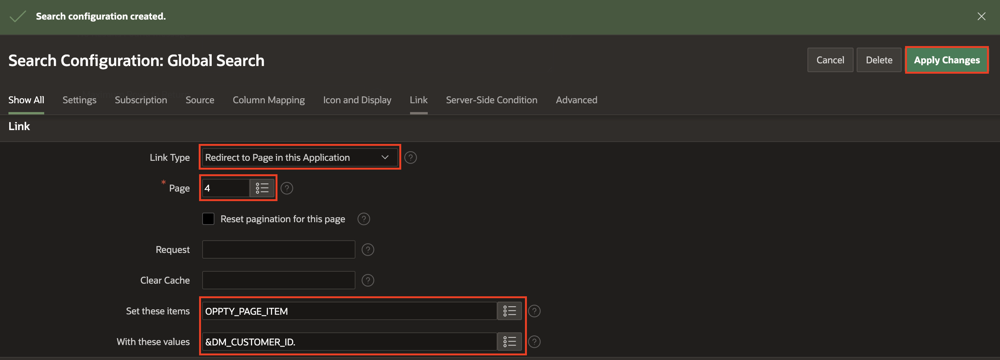

# Create Search Configuration

## Introduction

In this lab, you create a global search page using Search Configurations in Oracle APEX. The lab will involve working with a view that combines data from various database objects such as customers, opportunities, sales representatives, activities, and comments.

The Search Configuration feature enables you to incorporate declarative searches into your application, and then you can design a dedicated search page that showcases the search results. This functionality provides a streamlined way to search across multiple data entities, making it easier for users to access information about customers, opportunities, sales representatives, activities, and comments from a single point of access.

Estimated Time: 10 minutes

### Objectives

In this lab, you will:
- Create a declarative search for the application using search configuration  
- Create a search page that displays the search results.

## Task 1: Create a Search Configuration
In this task, you create a declarative search for an application by creating a search configuration on a data source.

1. From App Builder page, Click Shared Components.

   

2. Under Navigation and Search, Select **Search Configurations**.

   

3. Click Create

   

4. In Create Search Configuration wizard: For name: Enter **Global Search**, Leave Search Type Standard and Click **Next**.

   

5. In Create Search Configuration dialog leave all options as is and change Table / View Name to  **DM_SALESREP_CUSTOMER_OPPTY_ACTIVITY_COMMENTS**.
Click Next.

   

6. Select the following:
      - Primary Key Column : DM_CUSTOMER_ID
      - Title Column : CUSTOMERNAME
      - Description Column : CUSTOMERNAME

 Click **Create Search Configuration**.

     

7. Scroll down to Searchable Column(s).
  Find DM_OPPTY_DESCRIPTION, PROFILE, DM_ACTIVITY_DESCRIPTION, NOTE on left display and move them to right display.

     

8. Now, Scroll down to **Link** section
      - For Link Type : Select Redirect to Page in this Application
      - For Page : Select 4
      - For Set these items : Type OPPTY_PAGE_ITEM
      - For With these values : Type &DM_CUSTOMER_ID.

 Click Apply Changes.

     

## Task 2: Create a Search Page
In this task, you create a search page by running the Create Page Wizard.

1. Click Application n/

    

2. Click Create Page

    

3. Select Search Page

    

4. In Create Search Page wizard:

      - For Name : Enter Search

      - For Search Configurations : Check Global Search

  Click Create page

    

5. Click Save & Run. Type a search term to get the search results.

## Summary

You now know how to create Search Configuration and Search page.

You may now **proceed to the next lab**.   

## Acknowledgments
- **Author** - Tom Edwards - Director of Application Development Business Development, Ankita Beri - Product Manager
- **Last Updated By/Date** - Ankita Beri, Product Manager, August 2023
