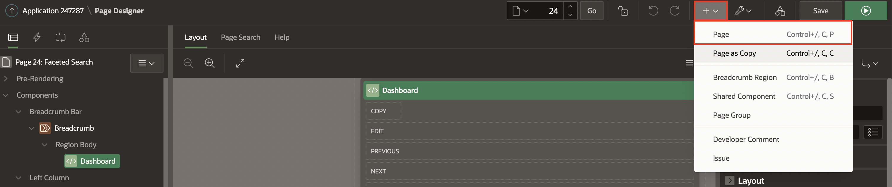
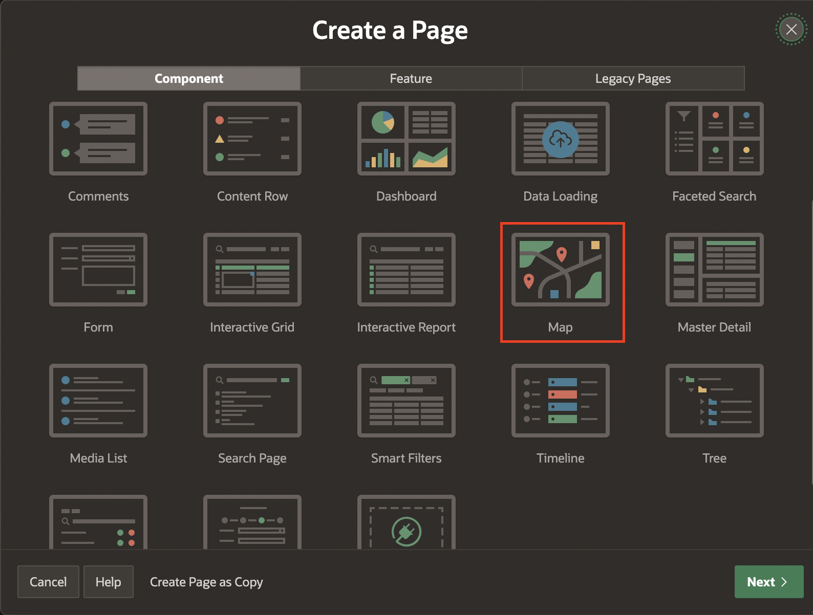
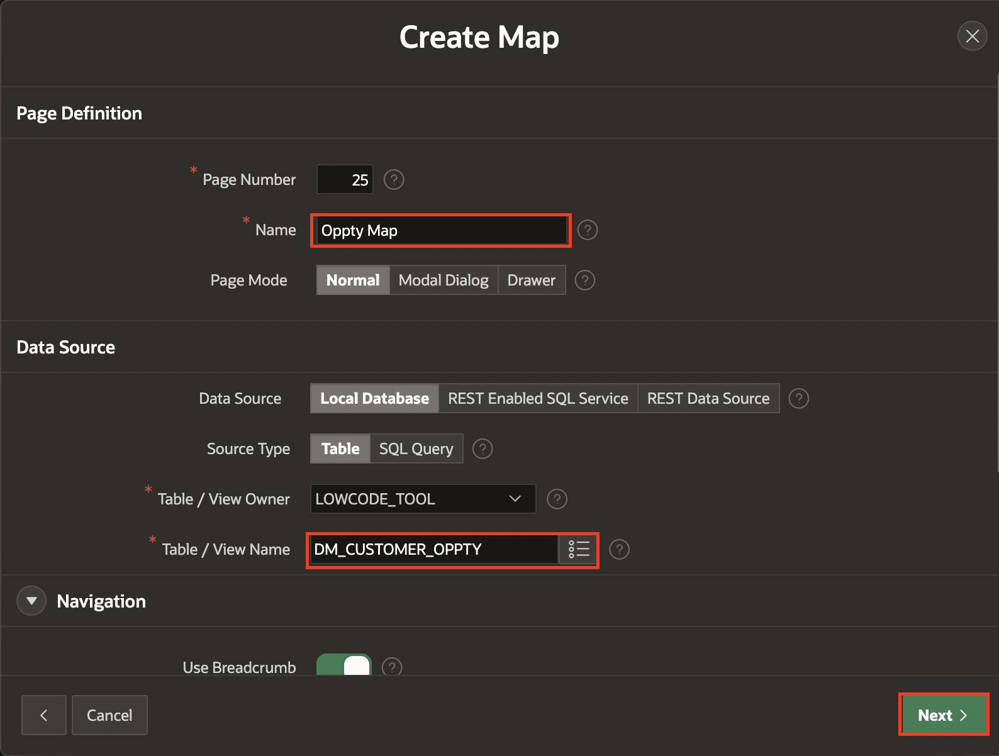
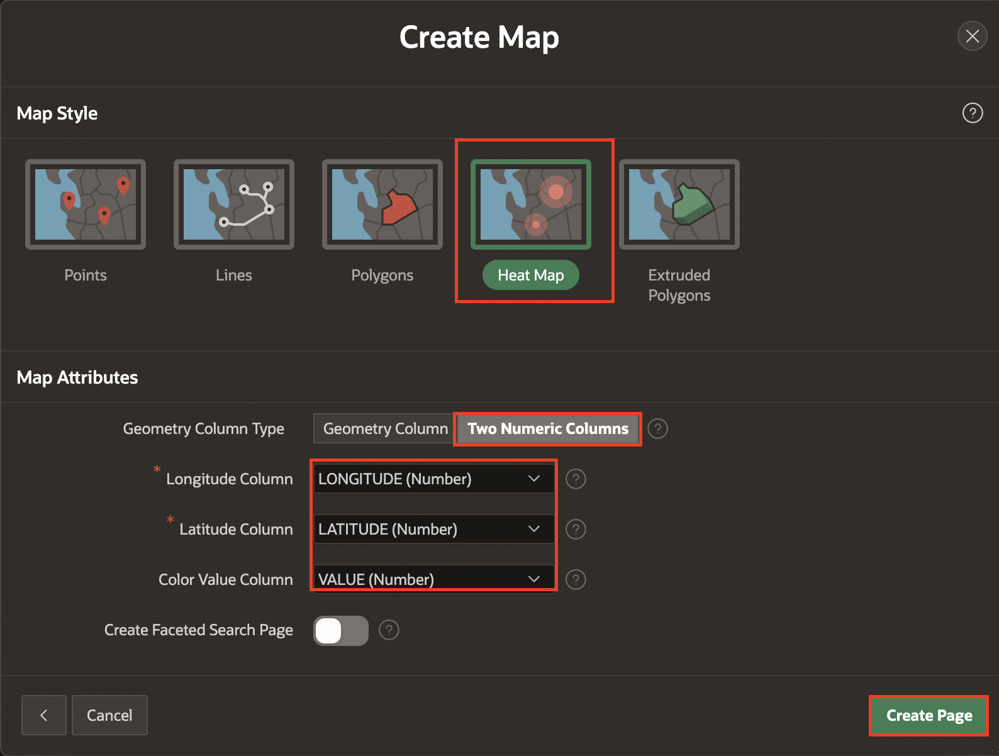
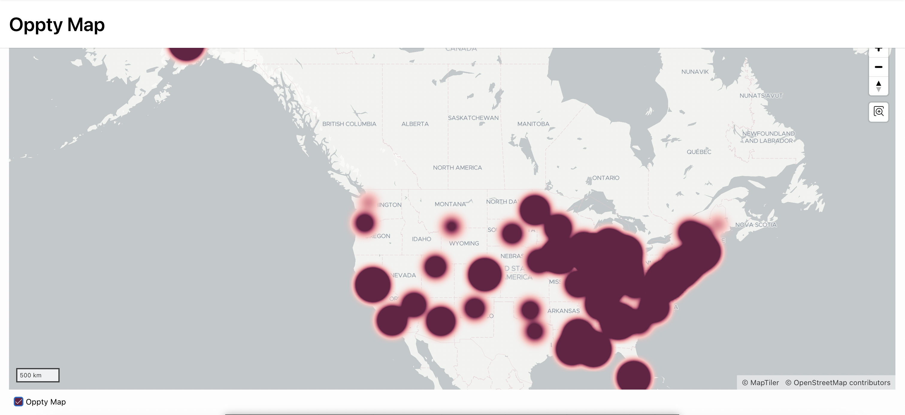
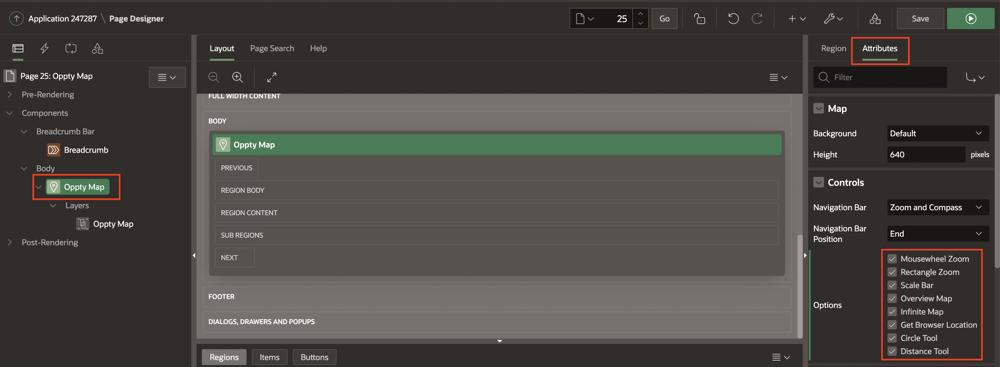
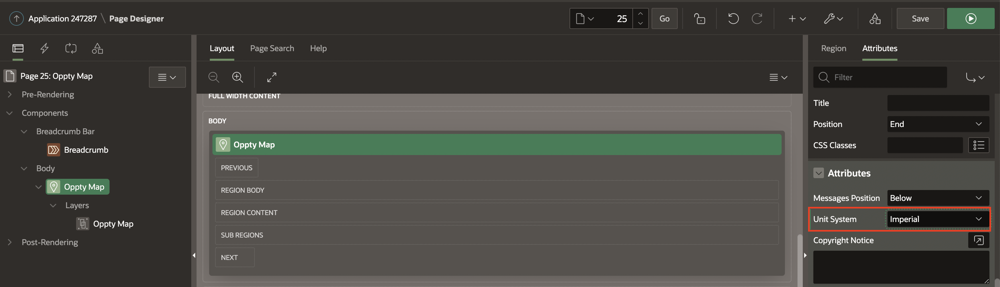
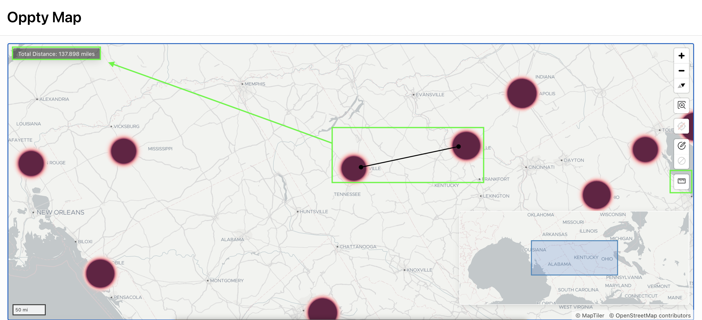

# Add a Heat Map

## Introduction

In this lab, you learn to create an OPPTY HEAT MAP to view opportunity data on a map.

Heat Maps are used to visualize the point density. The more points that are clustered together, the more intense the color becomes. Use this option to visualize the spatial distribution of population or incidents.

Estimated Time: 5 minutes

## Task 1: Creating a Map page

1. From the Page Designer toolbar, Click Create Menu (+) and Select Page.

    

2.  In Create a Page dialog page, Select Map.

    

3. In Create Map dialog page:
    - For Name Oppty : Enter Optty Map
    - For Table / View name: Select DM_CUSTOMER_OPPTY

   Click Next

    
4. Under Map Style : Select Heat Map
   Under Map Attributes:
      - For Geometry Column Type : Select Two Numeric Columns
      - For Longitude : Select LONGITUDE (Number)
      - For Latitude : Select LATITUDE (Number)
      - For Color Value Column :Select Value (Number)

   Click Create Page

   

5. Click Save & Run to view the map on runtime environment.

   

6. From developer toolbar on the bottom of the screen, Select Edit Page 25.

 In left render pane, Click Oppty Map. Then, In right details pane at the top to the right of Region, Click Attributes.

 In Controls section, Click every option to enable everything.

 Also, Change Unit System to **Imperial**.

 Click Save & Run.

  

  

7. In Runtime environment, Click ruler icon, place a point on the map, and click to another position to get a distance.

   

## **Summary**

You now know how to create a heat map.

You may now **proceed to the next lab**.   

## Acknowledgments
- **Author** - Ankita Beri, Product Manager
- **Last Updated By/Date** - Ankita Beri, Product Manager, July 2023   
