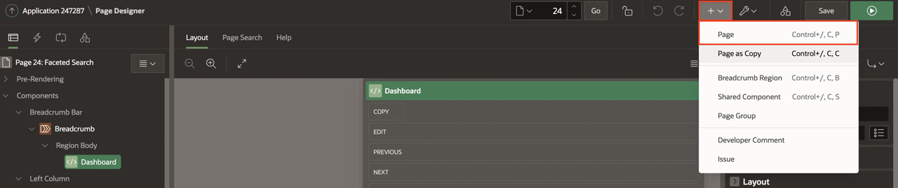
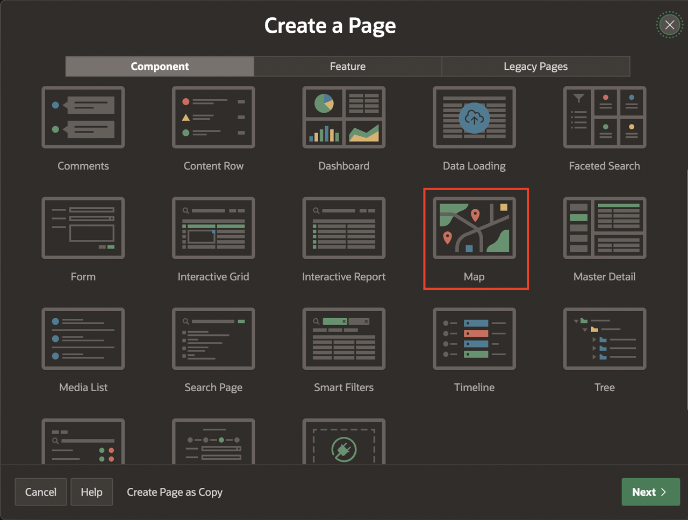
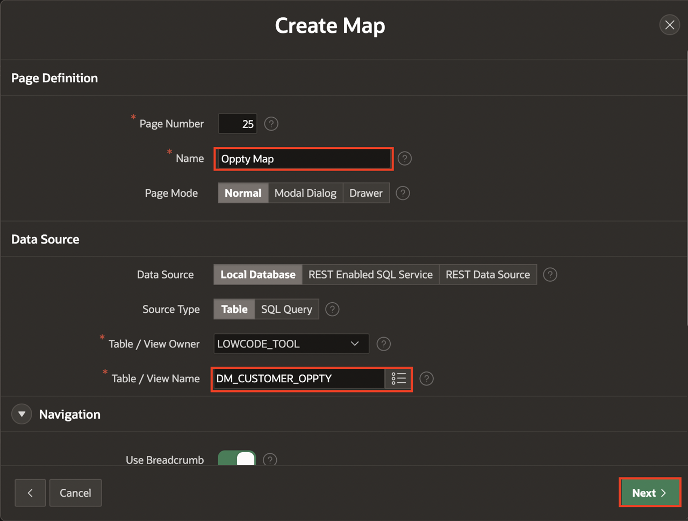
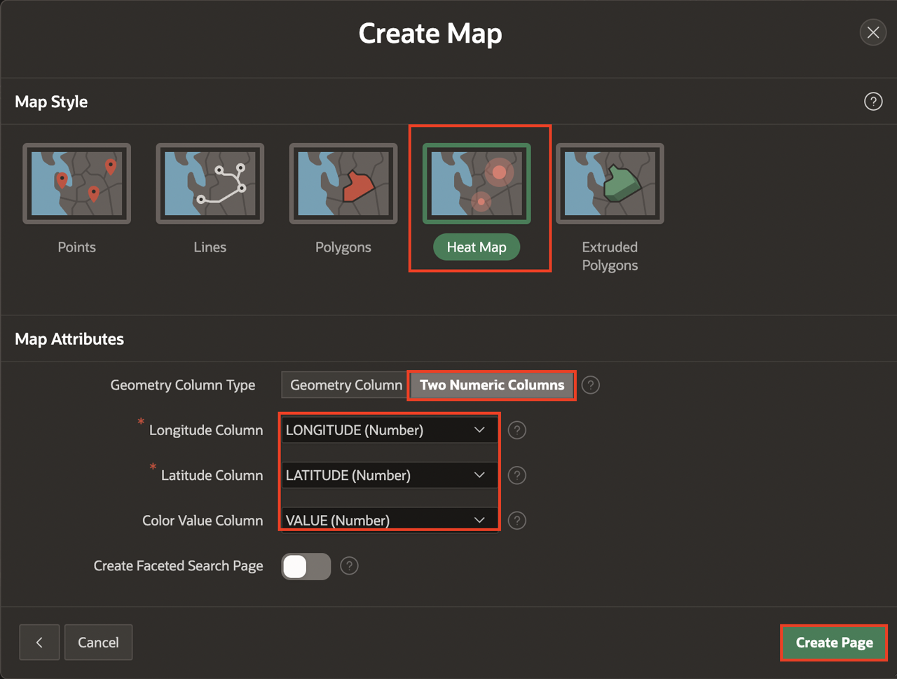
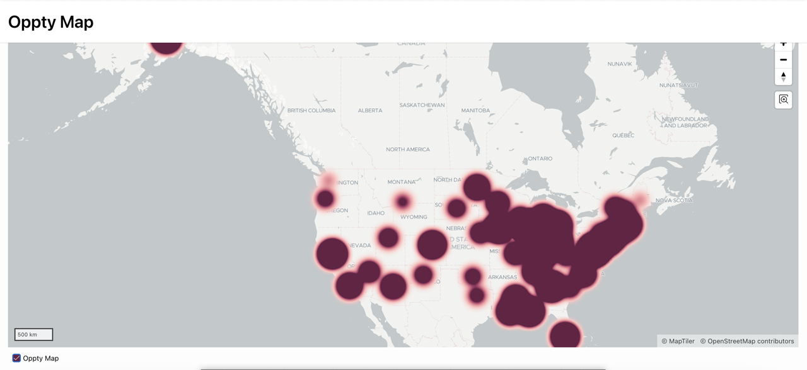
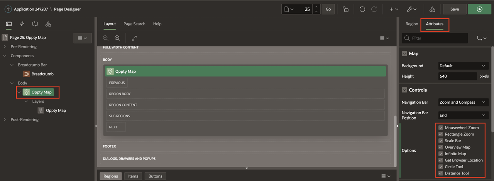
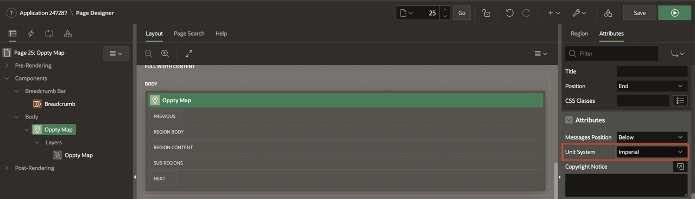
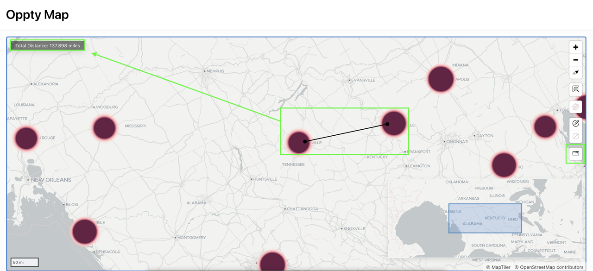

# Add a Heat Map

## Introduction

In this lab, you generate an OPPTY HEAT MAP, which allows you to view opportunity data represented on a map.

Heat Maps are graphical tools employed to visualize point density. As more points are grouped closely together, the color intensity increases, providing a clear representation of spatial distribution in terms of population or incidents. This option is particularly useful for understanding the concentration of opportunities in specific geographical areas.

Estimated Time: 5 minutes

## Task 1: Creating a Map page

1. From the Page Designer toolbar, Click Create Menu (+) and Select Page.

    

2.  In Create a Page dialog page, Select Map.

    

3. In Create Map dialog page:
    - For Name Oppty : Enter Optty Map
    - For Table / View name: Select DM_CUSTOMER_OPPTY

   Click Next

    
4. Under Map Style : Select Heat Map
   Under Map Attributes:
      - For Geometry Column Type : Select Two Numeric Columns
      - For Longitude : Select LONGITUDE (Number)
      - For Latitude : Select LATITUDE (Number)
      - For Color Value Column :Select Value (Number)

   Click Create Page

   

5. Click Save & Run to view the map on runtime environment.

   

6. From developer toolbar on the bottom of the screen, Select Edit Page 25.

 In left render pane, Click Oppty Map. Then, In right details pane at the top to the right of Region, Click Attributes.

 In Controls section, Click every option to enable everything.

 Also, Change Unit System to **Imperial**.

 Click Save & Run.

  

  

7. In Runtime environment, Click ruler icon, place a point on the map, and click to another position to get a distance.

   

## Summary

You now know how to create a heat map.

You may now **proceed to the next lab**.   

## Acknowledgments
- **Author** - Tom Edwards - Director of Application Development Business Development, Ankita Beri - Product Manager
- **Last Updated By/Date** - Ankita Beri, Product Manager, August 2023   
