# Implement Human Workflow

## Introduction

In this lab, you create a workflow that tracks interactions and assigns tasks to team members by utilizing the approvals component.

To begin with, you design a task definition, where you can configure various task parameters, assign participants, specify actions, and set due dates for activity requests. Additionally, you create a form page to allow users to submit activity requests. Finally, you add a Unified Task list page that displays the submitted activity requests by requestors, along with an Approval list that indicates completed or expired status tags. This enables an efficient management of the CRM workflow within the application.

Estimated Time: 15 minutes

## Task 1: Create an Activity Request Table

1. Navigate to SQL Workshop and click SQL Commands.

    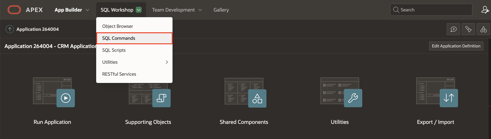

2. Copy and Paste the below SQL code into the Script Editor to create the ACTIVITY\_REQUEST Table and Click **Run**.

    ```
    <copy>
    CREATE TABLE "ACTIVITY_REQUEST"
   (	"REQ_ID" NUMBER GENERATED BY DEFAULT ON NULL AS IDENTITY MINVALUE 1 MAXVALUE 9999999999999999999999999999 INCREMENT BY 1 START WITH 8000 CACHE 20 NOORDER  NOCYCLE  NOKEEP  NOSCALE  NOT NULL ENABLE,
	"CUSTOMERNAME" VARCHAR2(200),
	"ACTIVITY" VARCHAR2(200),
	"UPDATED_BY" VARCHAR2(100),
	"STATUS" VARCHAR2(20),
	"ASSIGNED_TO" VARCHAR2(500),
	"PRIORITY" VARCHAR2(200),
	"CREATED_DATE" DATE,
	 CONSTRAINT "ACTIVITY_REQUEST_PK" PRIMARY KEY ("REQ_ID")
  USING INDEX  ENABLE
   ) ;
    </copy>
    ```

    

3. In the results section, you see that the ACTIVITY\_REQUEST table is created.

    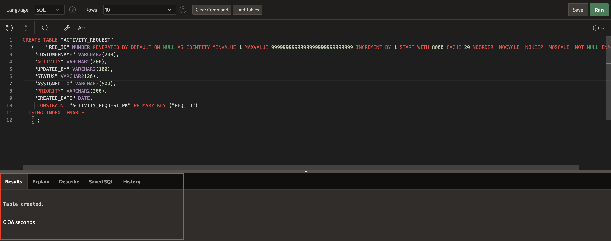


## Task 2: Create a Task Definition

1. Click **App Builder**, navigate to **CRM APP** application  and select **shared components**.

   

2. Under Workflows and Automations, select **Task Definitions**.

   

3. Click **Create**.

   

4. Specify the task definition name and define the metadata.

    - For Name - Enter **Activity Request**

    - For Subject - Enter **Request for &ACTIVITY. with &CUSTOMERNAME.**

    - For Potential Owner - Enter **&ASSIGNED\_TO.**


5. Click **Create**.

   


6. Under **Settings** Section:

    - For Task details Page Number - Click on **Create Task Details Page** button then click **OK**

    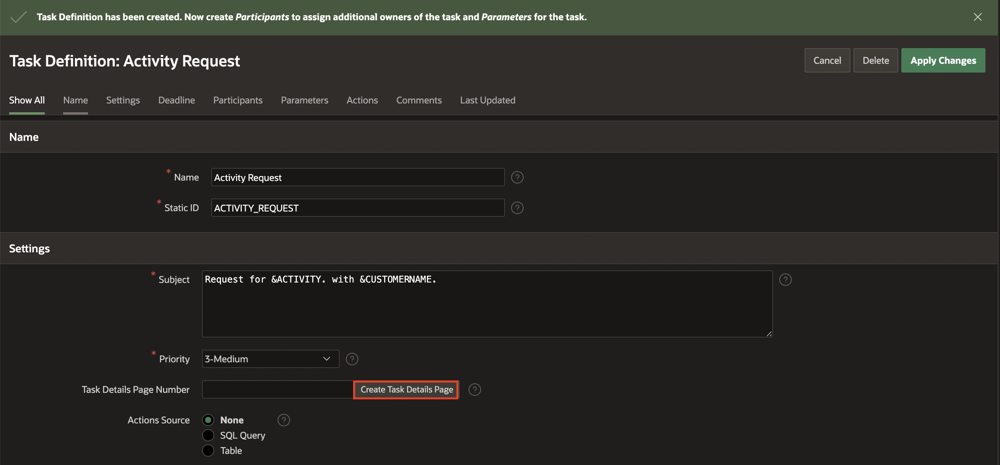

    - Click on the task definition - **Activity Request** to continue editing.

    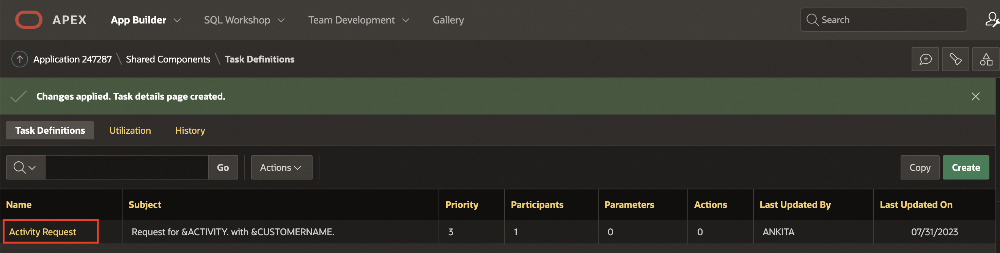

    - For Actions Source - Select SQL Query.

    - For Actions SQL query - Copy the code below and paste it into  the code editor:

    ```
    <copy>
    select ID , SALESREP, SALESREP_EMAIL
     from DM_SALESREP
    where  ID= :APEX$TASK_PK
    </copy>
    ```
    

7. **Under Parameters** Section - Select Add Row and fill in the 4 parameter fields listed below:

     | Static ID |  Label  | Data Type
     | --- |  --- | --- |
     | Activity | Activity | String |
     | ASSIGNED\_TO | Assigned To | String |
     | CUSTOMERNAME | Customer Name | String |
     | STATUS | Status | String |
     | UPDATED\_BY | Updated By| String |

     

     - Click **Apply Changes**.

8. Click on the task definition - **Activity Request** to continue editing.

  


9. Under **Actions** Section, Click **Add Action** button

     

    Specify the following:

    - For Name - Enter **CREATE\_ACTIVITY\_REQUEST**

    - For Type - Select Execute Code

    - On Event - Select Create

    - For Code: Copy the code below and paste it into  the code editor:

    ```
        <copy>
        declare
          l_req_id number;
          begin
          l_req_id := :APEX$TASK_ID;
       -- create a new record in the Activity Request table ACTIVITY_REQUEST
       insert into ACTIVITY_REQUEST values
       (to_number(l_req_id),
       :CUSTOMERNAME,
       :ACTIVITY,
       :UPDATED_BY,
       'PENDING',
       :ASSIGNED_TO,
       :PRIORITY,
       sysdate);
       end;
    </copy>
    ```
    - Click **Create** to save Create Event Action.

      

10. To Add the next action, Click **Add Action** button.

    Specify the following:

    - For Name - Enter **SEND\_EMAIL\_ON\_CREATION**

    - For Type - Select Send E-Mail

    - On Event - Select **Create**

    Under Send Email Settings:

    - To : &UPDATED_BY.

    - Subject : Activity Assigned - &CUSTOMERNAME.

    - Body Plain Text : Copy the text below and paste it into  the code editor:

    ```
    <copy>
    Hi,

    This is to inform you that an activity has been assigned to you.

    Please login into the portal to see more details.

    Regards,

    Support Team

    </copy>
    ```

     Click **Create** to add action.

       


11. Again, Click  **Add Actions** button.

    Specify the following:

    - For Name - Enter **UPDATE\_STATUS**

    - For Type - Select Execute Code

    - On Event - Select **Complete**

    - For Outcome  - Select **Approved**

    - For Code: Copy the code below and paste it into  the code editor:

    ```
    <copy>
    declare
      l_mgr number;
      l_task_id number;
      l_request_id number;
      l_req_status varchar2(10) :='PENDING';
    begin
     l_request_id := :APEX$TASK_ID;
      update ACTIVITY_REQUEST set status = 'COMPLETED'
       where req_id =:APEX$TASK_ID;
    end;
    </copy>
    ```

     Click **Create**

     

12. To Add the next action, Click **Add Action** button.

    Specify the following:

    - For Name - Enter **SEND\_EMAIL\_BEFORE\_EXPIRY**

    - For Type - Select Send E-Mail

    - On Event - Select **Before Expire**

    - Before Expire Interval - PT1M

    Under Send Email Settings:

    - To : &ASSIGNED\_TO.

    - Subject : Attention - Task Expiring

    - Body Plain Text : Copy the text below and paste it into  the code editor:

    ```
    <copy>
    Hi User,

    This is to inform you that your activity is due. Please take active action.

    Customer - &CUSTOMERNAME.
    Activity - &ACTIVITY.

     Regards,
     Support Team

    </copy>
    ```

     Click **Create** to add action.

       

13. Again, Click  **Add Actions** button.

    Specify the following:

    - For Name - Enter **ON\_EXPIRY**

    - For Type - Select Execute Code

    - On Event - Select **Expire**

    - For Code: Copy the code below and paste it into  the code editor:

    ```
    <copy>
    begin
      apex_approval.add_to_history( 'Task ' || :APEX$TASK_SUBJECT || ' Expired');
    end;
    </copy>
    ```

     Click **Create**

             


## Task 3: Create a Page to Submit an Activity
Add a page to Submit an Expense request.

1. Click **Application ID**, Application home page appears.

   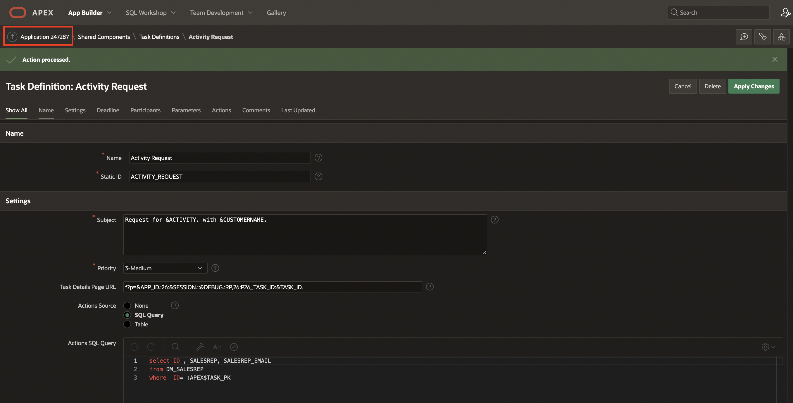

2. Click **Create**, create page wizard appears.

    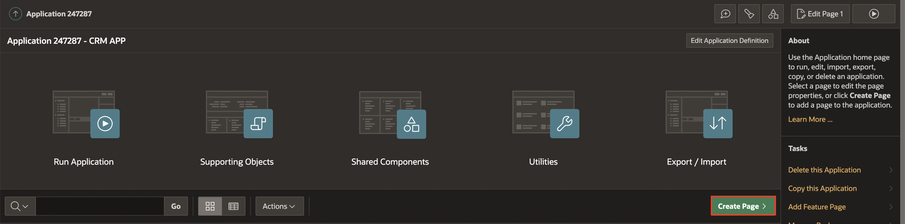

3. Select **Blank page** under component and click **Next**

    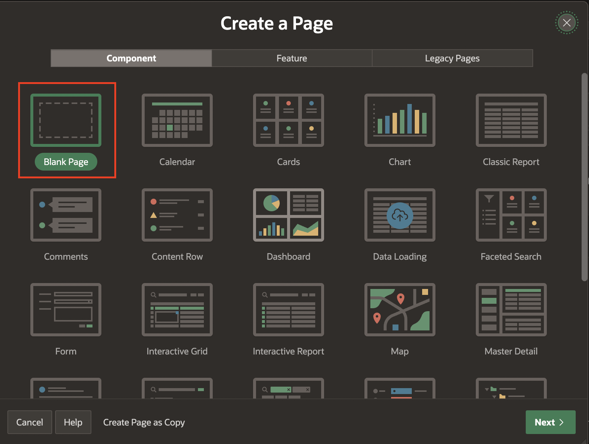

4. Specify Blank Page Attributes.

   Under **Page Definition** Section:

    - For Name - Enter **Request for Activity**

  Click **Create Page**.

   

5. In the left pane, select the Rendering tab. Right-click **Body** , select **Create Region**.

   

6. In the Property Editor, edit the appropriate attributes:

   Under **Identification** section:

    - For Title: Enter **Request for Activity**

    - For Type: Select **Form**

   Under **Source** section:

    - For Type: Select **SQL Query**

    - For SQL query: Copy the code below and paste it into  the code editor:

    ```
     <copy>
     Select ID , SALESREP\_email as Updated_by
       from DM_SALESREP
     where id = :P35\_ID;
    </copy>
    ```
    - For Page Item to Submit : P35\_id

    

7. Now, right-click the region (**Request for Activity**) and select Create Page Item.

     

   Under Identification Section:

    - For Name - Enter **P35\_CUSTOMER**

    - For Type - Select, **Select List**

  Under **List of Values** section:

    - For Type - Select **SQL Query**

    - For SQL Query - Copy the code below and paste it into  the code editor:

    ```
     <copy>
     select distinct CUSTOMERNAME as d , CUSTOMERNAME as r from DM_CUSTOMER;
    </copy>
    ```

    - For Null Display Value - Enter **--Select Customer--**

    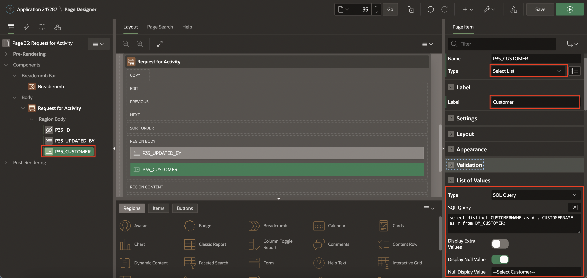

8. Right-click the region (**Request for Activity**) and select Create Page Item.

   Under Identification Section:

    - For Name - Enter **P35\_ACTIVITY**

    - For Type - Select, **Select List**

  Under **List of Values** section:

    - For Type - Select **SQL Query**

    - For SQL Query - Copy the code below and paste it into  the code editor:

    ```
     <copy>
     SELECT DISTINCT ACTIVITY AS D, ACTIVITY AS R FROM DM_ACTIVITY_LOOKUP;
     </copy>
    ```

    - For Null Display Value - Enter **--Select Activity--**

   

9. Right-click the region (**Request for Activity**) and select Create Page Item.

   Under Identification Section:

    - For Name - Enter **P35\_ASSIGNED\_TO**

    - For Type - Select, **Select List**

  Under **List of Values** section:

    - For Type - Select **SQL Query**

    - For SQL Query - Copy the code below and paste it into  the code editor:

    ```
     <copy>
     Select DISTINCT SALESREP , SALESREP_EMAIL from DM_SALESREP
     </copy>
    ```

    - For Null Display Value - Enter **--Select Sales Representative--**

   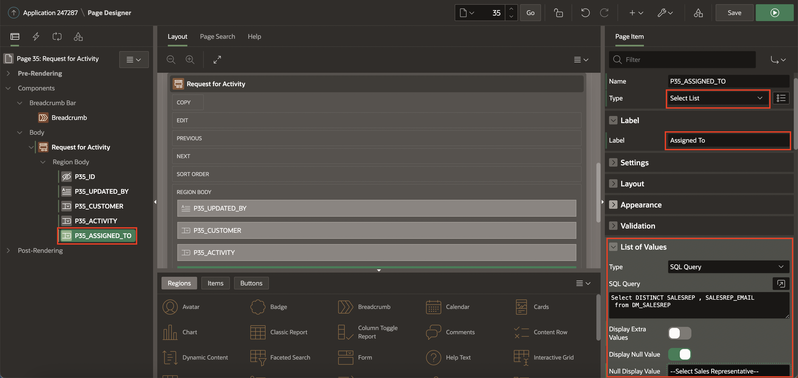   


10. Right-click region (**Request for Activity**) and select Create Page Item.

     Under Identification Section:

      - For Name - Enter **P3\_PRIORITY**

      - For Type - Select Select list

  Under **List of Values** section:

      - For Type - Select **Shared Component**

      - For list of values - Select UNIFIED\_TASK\_LIST.LOV.PRIORITY

      - For Null Display Value - Enter **--Select Priority--**

      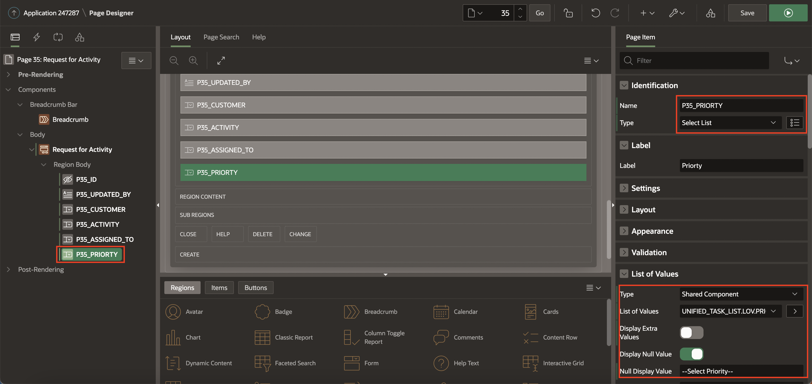  

11. Select **P35\_ID** page item ,

     - Change type to **hidden**  

     - Disable Value Protected uner Settings Section.

     - Enable the primary key under **Source** section.

    

12. Select **P35\_UPDATED\_BY** page item, Change type to **Display** and Enter **Request initiator** as label.

    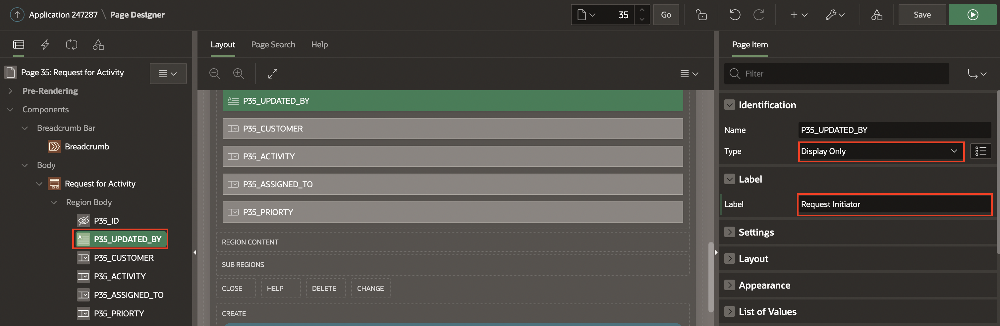  

13. Click **Save** to apply changes.

14. On the Rendering tab (left pane). Under Pre-Rendering, Right-click **Before Header** and click **Create Process**.

    

    In the Property Editor, enter the following:

    - For Name - Type **Fetch salesrep details**

    - For Type - Select Execute code

    - For Sequence - Enter 9

    - For PL/SQL Code - Enter the following PL/SQL code:

        ```
        <copy>
        Select id , salesrep_email INTO
               :P35_ID , :P35_UPDATED_BY
        from dm_salesrep where UPPER(SALESREP_EMAIL) = UPPER(:APP_USER);
        </copy>
        ```
    

15. Click **Save**.

16. Now add a process on the **Processing tab** to submit a request. Right-click Processing and click **Create Process**.

    

    In the Property Editor, enter the following:

     - For Name - Type **Apply for Activity**

     - For Type - Select **Human Task - Create**

    Under **Settings** Section:

     - For Definition - Select **Activity request**

     - For Priority : Enter **P35\_PRIORITY**

     - For Details Primary key Element: Select **P35\_ID**

     - For Success Message: Type **Request submitted successfully**

    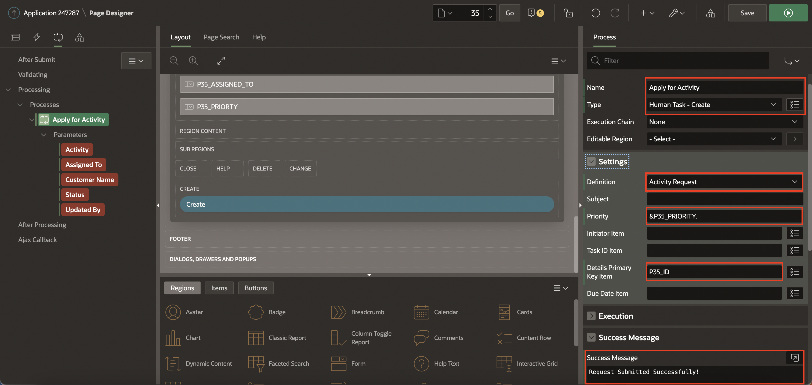

17. Under Parameters for Submit Expense request process:

    a) For  Activity, enter the following:

       - For Type - Select ITEM

       - For Value - Select **P35\_ACTIVITY**

    b) For Assigned To, enter the following:

       - For Type - Select ITEM

       - For Value - Select  **P35\_ASSIGNED_TO**

    c) For Customer Name, enter the following:

       - For Type - Select ITEM

       - For Value - Select **P35\_CUSTOMER**

    d) For  Status, enter the following:

       - For Type - Select Static Value

       - For Static Value - Enter **PENDING**

18. Click **Save**

19. On Rendering tab, Right-click Body and select **Create Button**.

    

    In the Property Editor, enter the following:

      - For Button Name - Enter **Create**

      - For Label - Enter **Submit Request**

      - For position - Select **Create**

      - For Hot - Select On

    

20. Navigate to Processing tab, Select Process **Apply for Activity**.

    Under **Server-Side Condition** Section:

      - For When Button Pressed : Select **Create**


21. Click **Save**.

## Task 4: Create Unified Task Lists
Add a Unified Task list page to see the submitted activity request list by a requestor and the Completed list by the sale Representative.

1. Select Create (+) on the toolbar in the Page Designer and then Click **Page** to create a Unified Task List page.

     

2. Under Components, Select Unified Task List and click **Next**

     

3. Specify the following page attributes:

    - For Name - Type **My Activity Approvals**

    - For Report Context - Select **My Tasks**

    Click **Create Page**.

    

4. To create another Unified Task list page, Again, Select Create (+) on the toolbar in the Page Designer and then Click **Page**.

    

5. Under Components, Select Unified Task List and click **Next**

    

6. Specify the following page attributes:

    - For Name - Type **My Activity Requests**

    - For Report Context - Select **Initiated by Me**

    Click **Create Page**.

    


## Summary
You now know how to create a task definition, Create Page to apply for Activity and Create Unified Task Lists.

You may now **proceed to the next lab**.

## Acknowledgments
- **Author** - Tom Edwards - Director of Application Development Business Development, Ankita Beri - Product Manager
- **Contributor** - Ankita Beri, Product Manager
- **Last Updated By/Date** - Ankita Beri, Product Manager, August 2023
