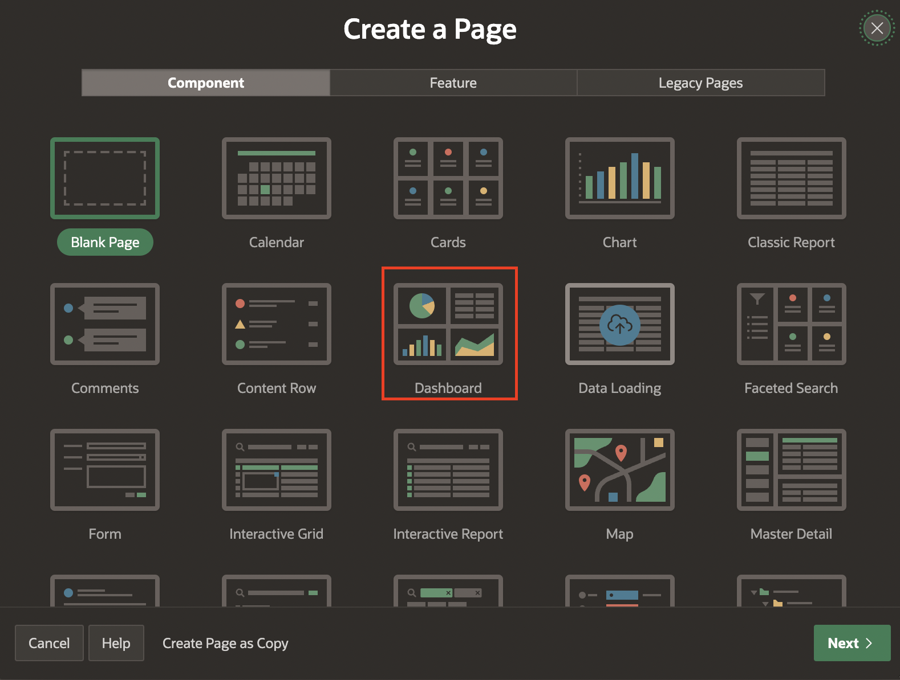
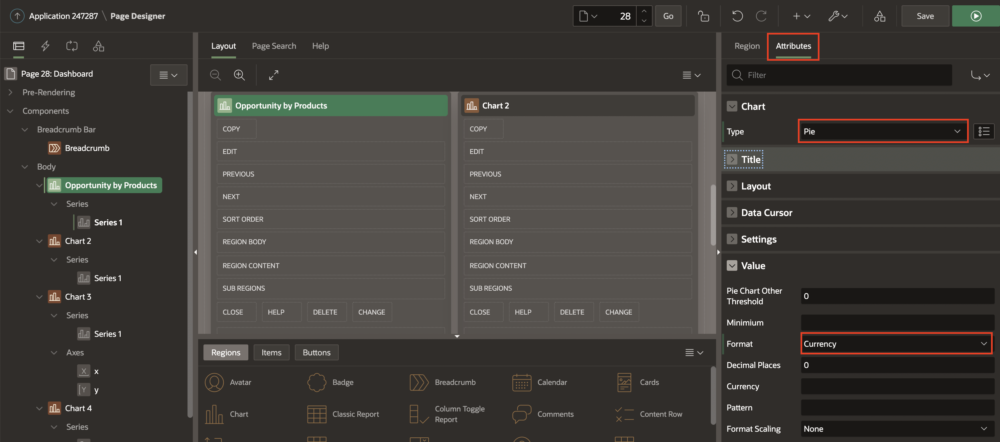
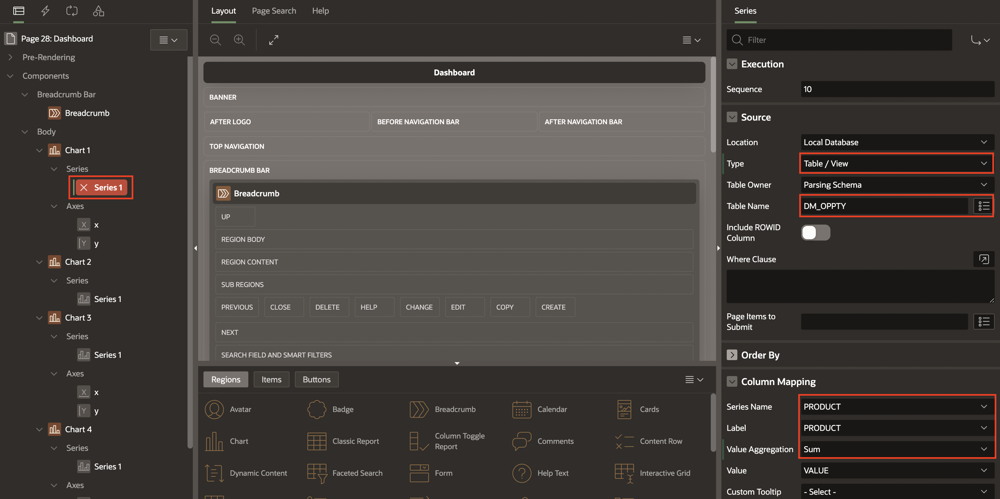
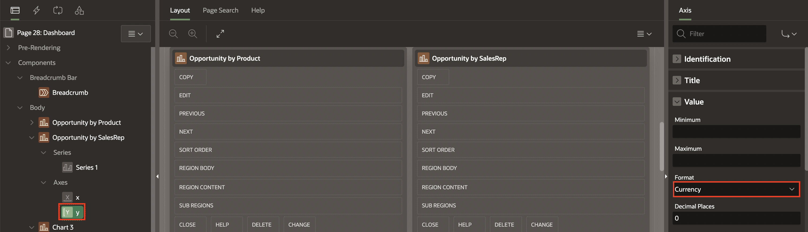
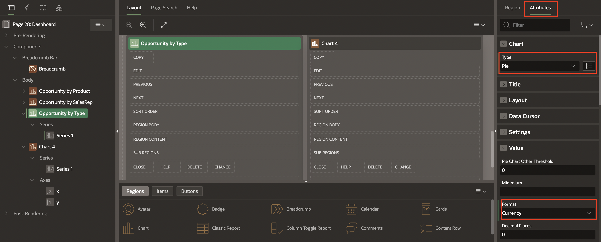
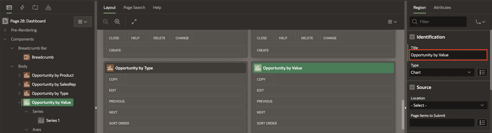
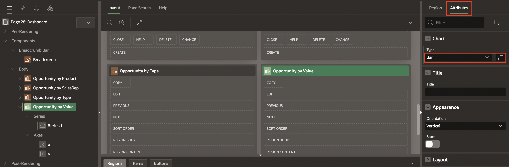
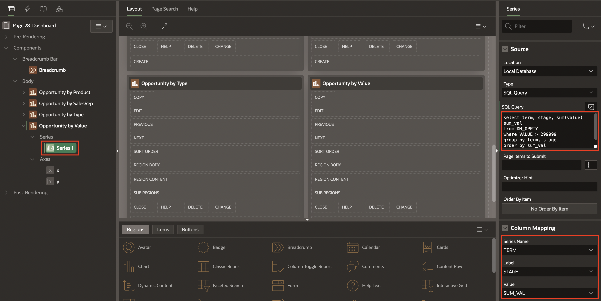

# Implement Opportunity Dashboard

## Introduction

In this lab, you create Dashboard page with up to four charts by running the Create Page Wizard.

Estimated Time: 5 minutes

## Task 1: Create Dashboard

1. Go to App Builder Home Page and Click **Create Page**.

    

2. In Create a Page dialog, Click Dashboard.

    

3. In Create Dashboard page, Enter following Attributes and Click **Create Page**.

    - For Name : Enter **Dashboard**

    - For Dashboard Layout : Select **Grid of 4 charts**

    

4. In the Page designer, Navigate to left render pane, under Body, Select Chart1.
   Under Identification :

    - For Title  : Enter **Opportunity by Product**

    

5. In right render pane, Click Attributes.

    Under Chart section:

    - For Type : Select  **Pie**

  Under Value section:

    - For Format : Select Currency

    

6. In left render pane, Select Series 1.

   Under Source Section:

    - For Location Local Database :  Select Table/View

    - For Table : Select **DM\_OPPTY**

   Under Column Mapping Section:

    - For Series Name : Select PRODUCT
    - For  Label Column : Select PRODUCT
    - For Value Aggregation : Select SUM
    - For Value : Select VALUE

    

7. In left render pane, under Body Select **Chart 2**.

   Under Identification Section :

    - For Title  : Enter **Opportunity by SalesRep**

    

8. In right details pane at top, next to Region, Click Attributes.

 Under Chart section:

     - For Type : Select **Bar**

 Under Appearance section:

     - For Slide Stack : Toggle to On

   

9. In left render pane, Select Series 1.
   Under Source Section:

    - For Location Local Database :  Select Table/View

    - For Table/View : Select View **DM\_CUSTOMER\_OPPTY**

  Under Column Mapping Section:

    - For Series Name : Select SALESREP

    - For  Label Column : Select SALESREP

    - For Value Aggregation : Select SUM

    - For Value : Select VALUE

    

10. Under Series, Select Y Axes:

     Under Value section:

      - For Format - Select Currency

    

11. In left render pane, under Body Select **Chart 3**.

    Under Identification Section :

    - For Title  : Enter **Opportunity by SalesRep**

    

12. In left render pane, under Body Select **Chart 3**.

    Under Identification Section :

    - For Title  : Enter **Opportunity by Type**

    

13. In right details pane at top, Click Attributes:

    Under Chart section:

      - For Type : Select **Pie**

    Under Value Section:

      - For Format : Select **Currency**

  

14. In left render pane, Select Series 1

    Under Source Section:

    - For Location Local Database : Select Table/View

    - For Table/View : Select **DM\_OPPTY**

    Under Column Mapping Section:

    - For Series Name : Select TYPE

    - For Label : Select TYPE

    - For Value Aggregation : Select SUM

    - For Value : Select VALUE

  


15. Under left render pane, Navigate to Body and Select **Chart 4**.

      Under Identification Section :

      - For Title  : Enter **Opportunity by Value >$300k**

      

16. In right details pane at top, Click Attributes:

      Under Chart section:

        - For Type : Select **Bar**

    

17. In left render pane, Select Series 1

      Under Source Section:

      - For SQL Query : Copy and paste the below SQL code in the code editor

      ```
      <copy>
      select term, stage, sum(value) sum_val
      from DM_OPPTY
       where VALUE >=299999
       group by term, stage
       order by sum_val
      </copy>
      ```

      Under Column Mapping Section:

      - For Series Name : Select TERM

      - For Label : Select STAGE

      - For Value : Select SUM_VAL

    

18. Click Save & Run.

    

## Summary
You now know how to create a dashboard using create page wizard

You may now **proceed to the next lab**.

## Acknowledgments
- **Author** - Tom Edwards - Director of Application Development Business Development, Ankita Beri - Product Manager
- **Contributor** - Ankita Beri, Product Manager
- **Last Updated By/Date** - Ankita Beri, Product Manager, August 2023
