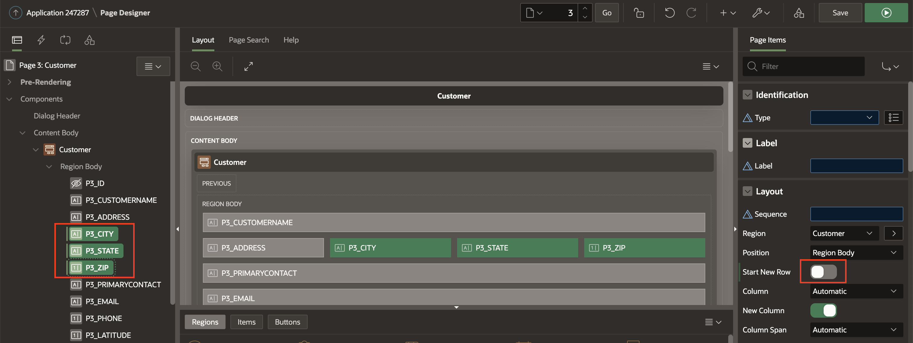
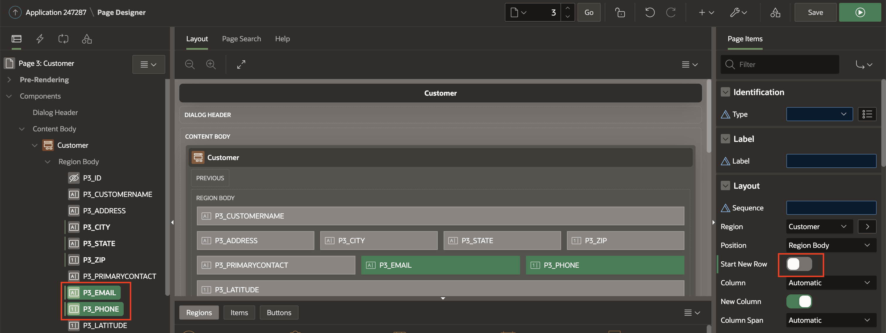
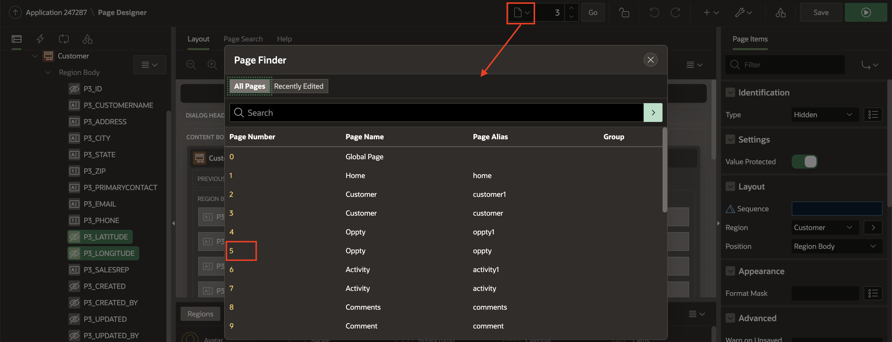
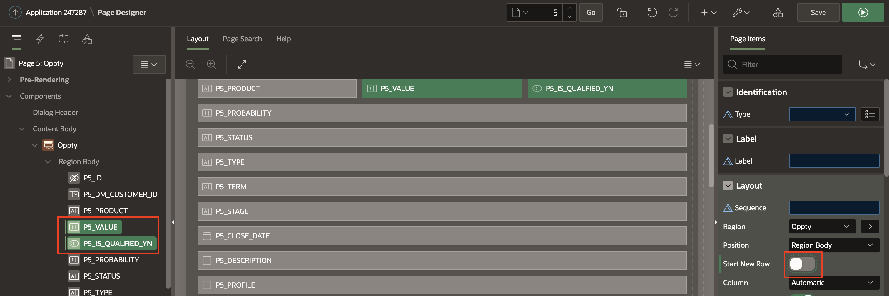

# Improve the Form

## Introduction

In this lab, you enhance the **Customer** and **Opportunity** forms to make it more user friendly for the sales person to maintain the customer and opportunity data.

To do this, you make use of the developer toolbar and page designer.

Estimated Time: 5 minutes

### Objectives

In this lab, you will:
- Enhance Customer and Opportunity Form

## Task 1: Enhancing the Customer Form

Form pages allow end users to readily update a single record of information. It is very common for these pages to be modal pages, whereby they display over the top of the original page, and the original page is greyed out and not accessible without first closing the modal page. Advantages of modal pages include that the same page can be called from numerous other pages, they include all of the processing, validations, and so forth within the page definition, and they are user friendly and make for a very straight forward user experience.

By default, the form pages generated by the Create Application Wizard are modal pages. The modal page for maintaining Customers takes up significant real estate. This could be improved by placing the City, State and Zip on the same line. Also, Email and Phone to be placed on the same line. Lastly, the Longitude and Latitude are not being used, so you should restrict data entry by changing the type to hidden.

1. Click App Builder and Run the CRM Application.

     

2. In the Runtime environment, on the Customer Report page, click the edit icon for any record. The modal form page for the selected record will be displayed.

 In the Developer Toolbar, at the bottom of the screen, click Edit Page 3.

     

 *Note: End users who log directly into the app will not see this toolbar.*    

3. In Page Designer, within Layout (or the Rendering tree in the left pane), Hold shift or control key on your keyboard and Select P3_CITY, P3_STATE, P3_ZIP. In the Property Editor (right pane), deselect Layout > Start New Row.

     

4. Again, Hold shift or control key on your keyboard, Select P3_EMAIL and P3_PHONE
In the Property Editor (right pane), deselect Layout > Start New Row.

     

5. Now, Select **P3_LATITUDE** and **P3_LONGITUDE**. In right details pane, in Identification section Change Type to **Hidden** and Click **Save**

     

## Task 2: Enhancing the Opportunity Form.

1. To edit the Oppty form, Find the page selector and Select 5 to go to Page 5.

    

2. Within Layout (or the Rendering tree in the left pane), Hold shift or control key on your keyboard and Select P5_VALUE, P5_IS_QUALIFIED_YN . In the Property Editor (right pane), deselect Layout > Start New Row.  

    

3. Again, Hold shift or control key on your keyboard, Select P5_STATUS, P5_TYPE, P5_TERM,  P5_STAGE, P5_CLOSE_DATE. In the Property Editor (right pane), deselect Layout > Start New Row and Click **Save**.

   

## Summary

You now know how to enhance forms in an APEX application.

You may now **proceed to the next lab**.   

## Acknowledgments
- **Author** - Ankita Beri, Product Manager
- **Last Updated By/Date** - Ankita Beri, Product Manager, July 2023
