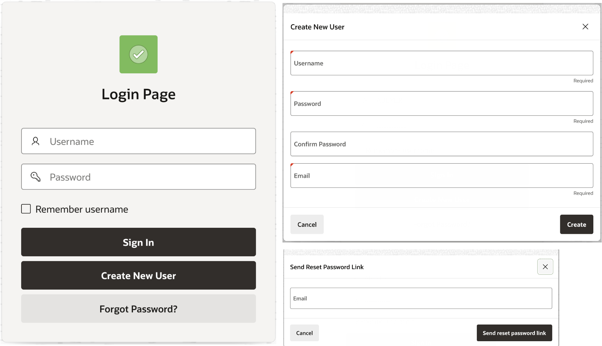

# Introduction

Estimated Time: 5 minutes

## About this Workshop

This workshop walks you through creating a custom authentication scheme that allows end users to create their accounts and manage their own login information without ever seeing the APEX application’s back end.

Estimated Time: 90 minutes total

### Use Case
Sometimes companies want to develop external (customer-facing) applications that require end users to access the application and create their login directly from the front end. As APEX is configured right now, APEX applications support the use of APEX accounts, Database Accounts, LDAP Directory, and Social Sign-in, among others, as methods of authentication (see [Preconfigured APEX Authentication Schemes](https://docs.oracle.com/en/database/oracle/application-express/21.2/htmdb/preconfigured-authentication-schemes.html#GUID-CD382D4A-AC00-4185-B37F-9A5BC9417A7B)). This means that creating end-user credentials is either via a third-party or by an existing user that has back-end access to the APEX Workspace and/or database. This is where custom authentication comes into the picture.

### Workshop Objectives
In this workshop, you will learn how to:
* Create your own custom authentication scheme
* Allow end users to create their own account
* Implement account activation functionality
* Build out password resetting capabilities

### Workshop Prerequisites
This workshop assumes you have:
* An existing APEX Workspace
* Familiarity with application development in APEX (specifically how to use App Builder and SQL Workshop)
* Some understanding of SQL *(is helpful, but not required)*

## Lab Breakdown
* **Lab 1:** Creating the Custom Authentication Scheme
* **Lab 2:** Allowing End Users to Create their Own Account
* **Lab 3:** Implementing Additional Functionality

## What is APEX?
[Oracle Application Express (APEX)](https://apex.oracle.com/en/) is a low-code development platform that enables you to build scalable, secure enterprise apps, with world-class features, that can be deployed anywhere. It provides you with all the tools you need to build apps in a single, extensible platform, which runs as a part of Oracle Database. Using APEX, developers can quickly develop and deploy compelling apps that solve real problems and provide immediate value.

An [authentication scheme](https://docs.oracle.com/en/database/oracle/application-express/21.2/htmdb/understanding-authentication.html#GUID-144A774D-2B05-4BE5-9550-6951EE0B536B) determines how users can interact with your APEX applications by establishing the identity of each user via some type of credentials (usually a username and password). You do have the option to not require authentication, thus allowing anyone to access your application, however, this is not recommended nor common. More often than not, customers choose to require authentication by either selecting a [preconfigured authentication scheme](https://docs.oracle.com/en/database/oracle/application-express/21.2/htmdb/preconfigured-authentication-schemes.html#GUID-CD382D4A-AC00-4185-B37F-9A5BC9417A7B) or by creating a custom authentication scheme. In this workshop, we will be covering the latter.

## Learn More
* [Get started with APEX Development](https://apex.oracle.com/en/learn/getting-started/)
* [Understanding Authentication](https://docs.oracle.com/en/database/oracle/application-express/21.2/htmdb/understanding-authentication.html#GUID-144A774D-2B05-4BE5-9550-6951EE0B536B) in Oracle APEX
* [Preconfigured APEX Authentication Schemes](https://docs.oracle.com/en/database/oracle/application-express/21.2/htmdb/preconfigured-authentication-schemes.html#GUID-CD382D4A-AC00-4185-B37F-9A5BC9417A7B)

## Acknowledgements
* **Author** - Ana Beyer, Cloud Engineer, Oracle
* **Last Updated By/Date** - Ana Beyer, March 2022
