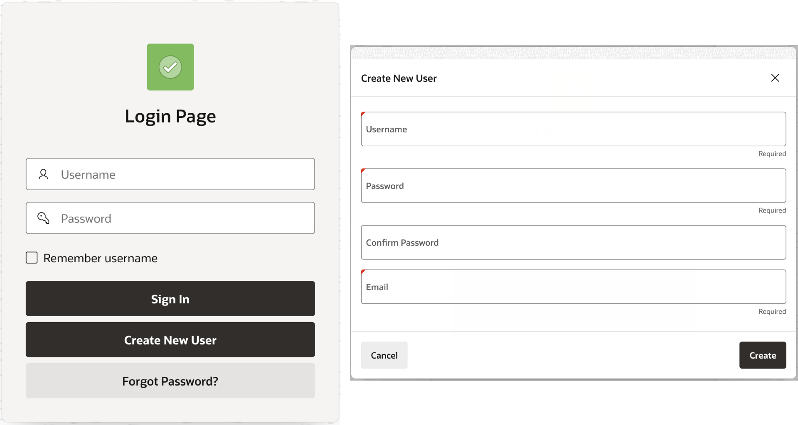
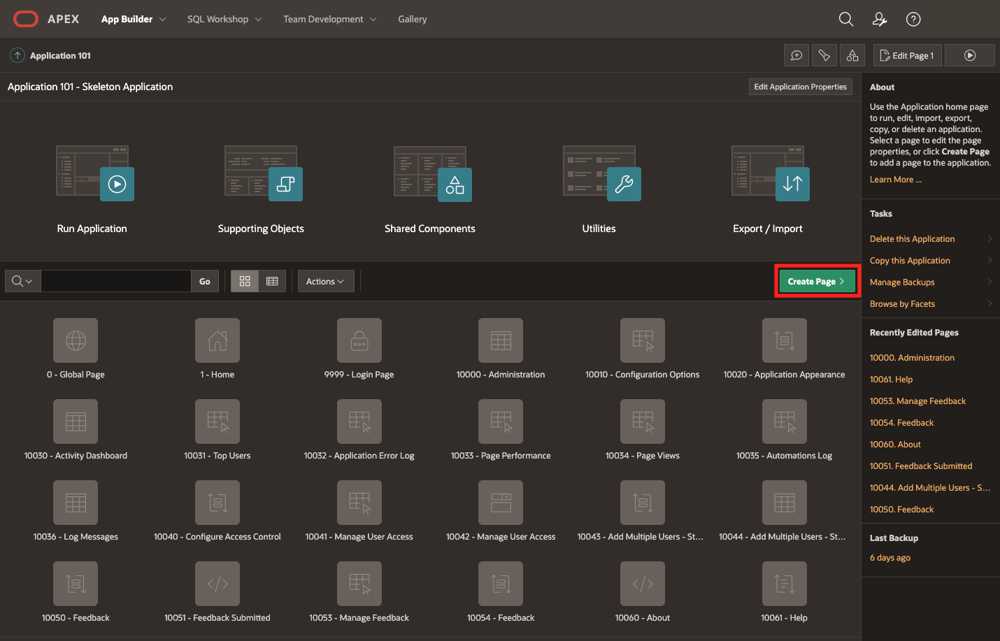
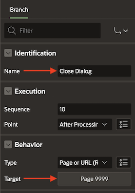

# Allow end users to create their own account

## Introduction

This lab walks you through the steps to create the "Create New User" page shown below. This page will be accessible from the Login page so that end users can directly fill out this form to create an account.



Estimated Time: 20 minutes

### Objectives

In this lab, you will:
* Create a new user page
* Add a button to the Login page to access the "Create New User" page

### Prerequisites

This lab assumes you have:
* All previous labs completed

## Task 1: Create a New User Page

Now that we have the custom authentication Scheme set up, we need to create a page where users can create their accounts. This page will look something like the screenshot in this lab's [introduction](#Introduction). The user is prompted to enter an email, username, and password, and then confirm that password. They then press “Create New User” to create the account, which will automatically return the user to the Login page and will display a success message. In the backend, this page will check that the username and email haven’t already been taken by someone else and that the password meets a minimum set of requirements. These checks will be implemented via Validations in APEX (see the [Learn More](#LearnMore) section).

*Remember to save your work throughout. We recommend doing so in the Page Designer each time you add/edit a Page Item, Button, Validation, etc. The **Save** button can be found in the top-right corner.*

1. From within App Builder, and with your application selected, click **Create Page &gt;**.

	

2. For **Page Type**, with **Component** selected, choose **Form** and then **Form** again.

3. You can keep the auto-assigned **Page Number** or manually enter one yourself (make sure it’s not already being used). Give the page a **Name** like “Create New User” and select “Modal Dialog” for **Page Mode**. Then click **Next &gt;**.

	

4.	Leave everything as is and click **Next &gt;** again.

5.	For the **Data Source** part of the wizard, find your users table for the **Table / View Name** and click **Next &gt;**.

	

6.	Double-click on the **ACCOUNT_STATUS** column so that this field does not appear in the form (because this is set automatically in the backend and not by the user).

7. Then select the **Primary Key Column** as the **USER_ID** column and click **Create**.

	

8. Change the **EMAIL** and **USERNAME** item **Type** to “Text Fields”, and the **PASSWORD** item **Type** to “Password”. To do so, select the page item in the left-side pane, and change the **Type** field in the right-side pane from the dropdown menu.

   Make the **EMAIL** page item of **Subtype** “E-Mail” as well so that it will automatically check that the value entered is a properly formatted email address.

	 

9. Add another page item (right-click on the **PASSWORD** page item in the left-side pane and click “Create Page Item Below”) and name it something like **CONFIRM_ PASSWORD** so that the user has to re-enter their password to confirm it (keep the **PXX_** prefix where “XX” is your page number). Change the **Type** to “Password”.

	

10.	Next create a **Validation** on the **EMAIL** page item (right-click on the page item in the left-side pane and click “Create Validation”) and call it something like **UNIQUE_ EMAIL**. This Validation will check that this email is not already taken by another user. In the right-side pane, the **Validation Type** should be set as “No Rows returned” and then copy & paste the code snippet below as the associated SQL Query. Change “XX” in **PXX_ EMAIL** to the page number assigned to this page (see top-left of page). Then provide an **Error Message** that will appear if a user enters an email that is taken.

	 

	```
	<copy>
	select * from user_creds where email = :PXX_EMAIL;
	</copy>
	```

11. Similarly, create a **Validation** on the **USERNAME** page item following the same process as in the previous step (step 10), but in the **SQL Query** change **email** to **username** and **PXX_ EMAIL** to **PXX_ USERNAME**.

12. Next create a **Validation** on the **PASSWORD** page item of **Type** “Function Body (returning Error Text)”. This will check that the password entered meets a standard set of minimum requirements. Specifically, the password must be at least 8 characters long, have at least one special character, one upper and lower case letter, and have at least one number. Copy & paste the following code snippet as the **PL/SQL Function Body Returning Error Text**.

	> **Note:** Remember to change the “XX” in **PXX_PASSWORD** to your assigned page number. From here on out, assume that this will always be the case for all code snippets. To make it easier to edit the code block, click on the Popout Icon, , and click **OK** in the bottom-right of the dialog when you're finished editing.

	```
	<copy>
	BEGIN
	IF 8 <= LENGTH(:PXX_PASSWORD) THEN
  	IF REGEXP_LIKE(:PXX_PASSWORD, '^.*[0-9]') THEN
	IF REGEXP_LIKE(:PXX_PASSWORD, '^.*[a-z]', 'c') THEN
	IF REGEXP_LIKE(:PXX_PASSWORD, '^.*[A-Z]', 'c') THEN
	IF REGEXP_LIKE(:PXX_PASSWORD, '^.*[!@#$%^&*()_]', 'c') THEN
	RETURN '';
	ELSE
  	RETURN 'Password missing a special character';
	END IF;
	ELSE
		RETURN 'Password missing an uppercase';
	END IF;   
	ELSE
		RETURN 'Password missing a lowercase';
	END IF;
	ELSE
		RETURN 'Password missing a numeric value';
	END IF;
	ELSE
		RETURN 'Password must be at least 8 characters long and your password length is currently'||' '||LENGTH(:PXX_PASSWORD);
	END IF;
	END;
	</copy>
	```
13. Create a **Validation** on the **CONFIRM_PASSWORD** page item that you created in step 9 and make it of **Type** “Function Body (returning Boolean)”. In the **PL/SQL Function Body** field, copy & paste the code snippet below, changing the page numbers as applicable. Add an **Error Message** that you want to appear if the user enters two passwords that do not match.

	```
	<copy>
	BEGIN

	IF :PXX_PASSWORD = :PXX_CONFIRM_PASSWORD THEN
		RETURN TRUE;
	ELSE RETURN FALSE;
	END IF;

	END;
	</copy>
	```

14.	Under **Region Buttons** there should be 4 default buttons already created. Feel free to delete the **DELETE** and **SAVE** buttons as you will not be needing them (right-click on them in the left-side pane and click “Delete”).

	

15.	The default **CANCEL** button has a Dynamic Action already associated with it. We are going to add another **TRUE** Action by expanding the **CANCEL** hierarchy in the left-side pane (click on the “&gt;” icon next to **CANCEL**).  Right-click on “Cancel Dialog” in the left-side pane and click “Create TRUE Action”.

	

16.	In the right-side pane change **Action** to “Refresh”, **Selection Type** to “Region” and **Region** to “Create New User” from the dropdown.

	

17.	In the **Processing** tab on the left-side pane (denoted by ), click on “Process form …” under **Processes** and add a **Success Message** and **Error Message** notifying the user that their account has/hasn’t been created.

	

18.	There is a default “Close Dialog” process created that we don’t need. To delete this process, right-click on it and click “Delete”.

	

19.	Create a **Branch** (right-click on **After Processing** and click “Create Branch”) of **Behavior Type** “Page or URL (Redirect)” and route it back to the Login page (should be page 9999 by default). Feel free to name this something like “Close Dialog”.

	 

20.	Then add an **Ajax Callback** (right-click on **Ajax Callback** and click “Create Process”) of **Type** “Clear Session State”. Feel free to name this something like “Display messages”. This callback forces the success/error messages associated with step 17 to appear even after this modal dialog closes.

	 

21.	Finally, navigate back to the **Rendering** tab on the left-side pane (denoted by ) and click on “Page XX: Create New User”. In the right-side pane, search for “Security” in the search/filter bar (or scroll down to this section yourself). Change the **Authentication** setting to “Page is Public” from the dropdown.

22.	Click **Save** in the top-right corner.

This concludes this task. You may now **proceed to the next task.**

## Task 2: Add Button to Login Page for "Create New User" Page

Now that we have a Create New User page to go to, we need to add a button to the Login page that directs us here. Follow the steps outlined below to do so.

1. Navigate to the Login page (should be page 9999 by default).

2. In the left-side pane, right-click on the **LOGIN** button and click **Create Button Below**.

	

3. In the right-side pane, give it a **Button Name** and **Label** (something like **CREATE_ NEW_ USER** and “Create New User”, respectively).

	

4. If you want the button to be centered and appear like the default “Sign In” button appears, change the **Button Position** to “Next” from the dropdown menu, and in the **Appearance** section, toggle **Hot** to the on position.

	

5. In the **Behavior** section, change the **Action** to “Redirect to Page in this Application” and select the page number for your Create New User page.

	

6. Click **Save** in the top-right corner and click the "Save and Run Page" button () to preview your newly updated Login page.

This concludes this lab. You may now **proceed to the next lab**.

## Learn More

* [Adding a New Page to an Application](https://docs.oracle.com/en/database/oracle/application-express/19.2/htmdb/adding-database-app-pages.html#GUID-0BCE05D2-A757-476D-B46C-F823D822FF3B) in Oracle APEX
* [Validations](https://docs.oracle.com/en/database/oracle/apex/22.1/htmdb/understanding-validations.html) in Oracle APEX
* [Managing Buttons](https://docs.oracle.com/en/database/oracle/application-express/19.2/htmdb/creating-buttons.html) in Oracle APEX
* [About Dynamic Actions](https://docs.oracle.com/en/database/oracle/application-express/19.2/htmdb/managing-dynamic-actions.html#GUID-93732CF5-42AD-4400-B1B9-5F6AA3D80715) in Oracle APEX

## Acknowledgements
* **Author** - Ana Beyer, Cloud Engineer, Oracle
* **Last Updated By/Date** - Ana Beyer, February 2023
