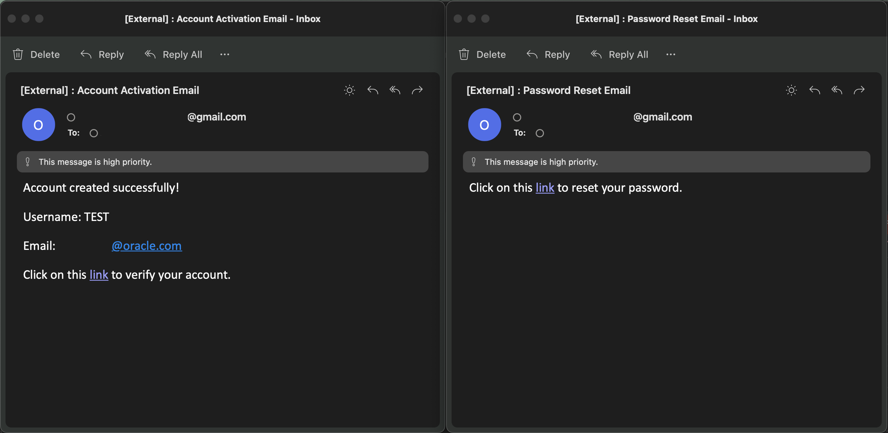
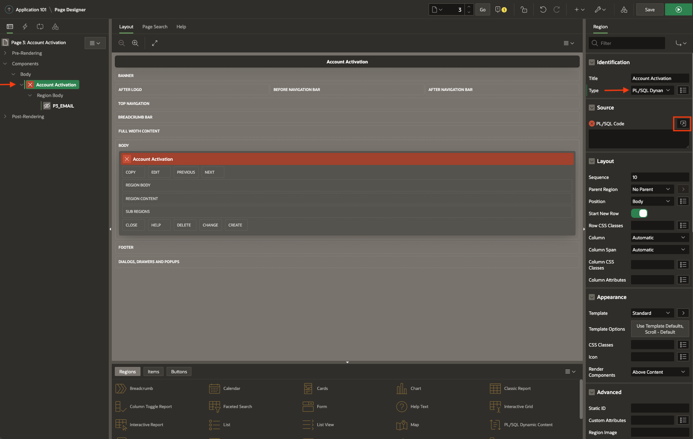
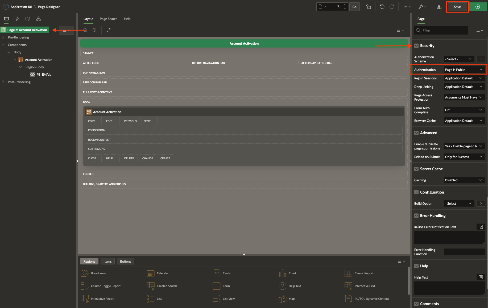
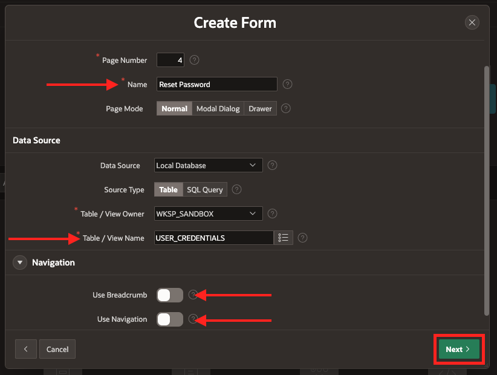
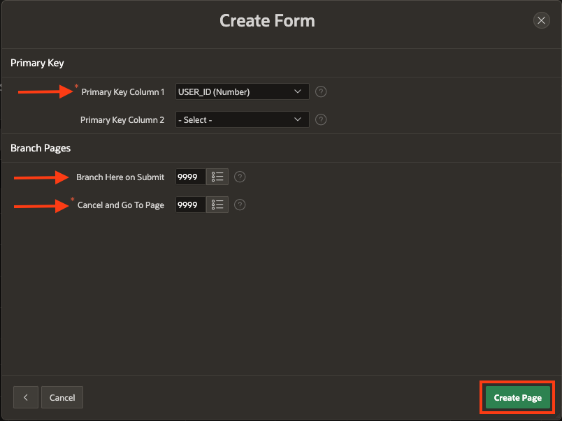
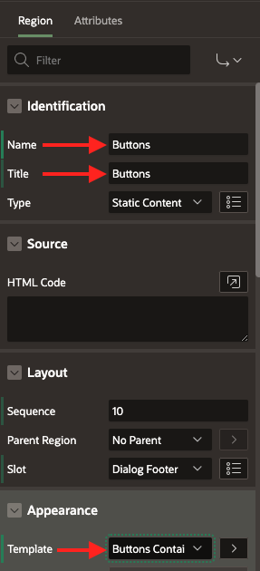

# Implement additional functionality

## Introduction

This lab does not pertain directly to custom authentication. Instead, this lab will provide the steps to implement additional functionality that often goes hand-in-hand with authentication: the requirement to activate an account (by verifying your email) before logging in and the ability to reset one’s password.



Estimated Time: 45 minutes

### Objectives

In this lab, you will:
* Set up account activation functionality (Tasks 1, 2)
* Set up password forgetting/resetting capabilities (Tasks 3, 4)

### Prerequisites

This lab assumes you have:
* All previous labs completed
* You have an Approved Sender email address set up with your Oracle Cloud account (see [Learn More](#LearnMore) section)

## Task 1: Create an Account Activation Page

Many websites and applications require an account verification or account activation step between when the account is created and the user can log in. The implementation in this lab builds out this functionality.

As mentioned in [Lab 2, Task 1: Create a New User Page](?lab=allow-end-users-create&nav=open#Task1:CreateaNewUserPage), our user credentials table makes use of an **ACCOUNT_ STATUS** flag that is either set to 0, meaning the account is disabled, or 1, meaning it is enabled. At account creation, this flag is automatically set to 0. We take advantage of this flag in the next 2 tasks, for activating accounts, as well as in the following 2 tasks for forgetting/resetting passwords.

*Remember to save your work throughout. We recommend doing so in the Page Designer each time you add/edit a Page Item, Button, Validation, etc. The **Save** button can be found in the top-right corner.*

1. From within App Builder and with your application selected, click **Create Page &gt;**.

	

2. For **Page Type**, with **Component** selected, choose **Blank Page** and click **Next &gt;**.

	

3.	You can keep the auto-assigned **Page Number** or manually enter one yourself (make sure it’s not already being used). Give the page a **Name** like “Account Activation” and keep **Page Mode** set to **Normal**. Leave **Page Group** and **Breadcrumb** as is. Where it says **Navigation**, click on the “&gt;” to expand this section. De-select **Use Breadcrumb** and **Use Navigation**. Then click **Create Page**.

	

4.	Your new “Account Activation” page should automatically open. Right-click on “Account Activation” in the left-side pane (under **Body**) and click on **Create Page Item**.

	

5.	In the right-side pane, give the item a **Name**, like **EMAIL** (keep the “PXX_” prefix). And select **Hidden** as the **Type** from the dropdown menu. Leave everything else as is in the right-side pane.

	

6.	Now in the left-side pane, select “Account Activation” under **Body** and in the right-side pane, change the **Type** to **PL/SQL Dynamic Content** from the dropdown menu. Click on the icon next to **PL/SQL Code** to open a code editor popup window.

	

7. We recommend first copying & pasting the following block of code into a local notepad or text editor and making edits there before copying & pasting it into the code editor popup window. You will need to change **PXX_EMAIL** to the item name you gave in step 7. You will also need to change "application-login-url" to your application’s Login page URL. **Keep the double quotes in the code.**

   *To obtain your application's login URL, return to App Builder, locate your application, and click the Play button next to it. The URL that this window opens to is the login URL you're looking for (exclude any trailing "session=...").*

	 ```
 	<copy>
	declare
	v_email nvarchar2(100);
	v_verified number;
	account_exists number;

	BEGIN
	select count(*) into account_exists from user_creds where email = :PXX_EMAIL;
	if account_exists = 0 then
	    htp.p('
	    <style>
	    .class1{
	        text-align:center;
	    }
	    </style>
	    <div style = "text-align:center;">
	        <h4>
	        Invalid Account Activation link.
	        </h4>
	    </div>
	    ');
	end if;
	select email into v_email from user_creds where email = :PXX_EMAIL;
	select account_status into v_verified from user_creds where email =:PXX_EMAIL;
	if v_email is not null and v_verified = 0 then
	    update users set account_status = 1 where email = :PXX_EMAIL;
	    htp.p('
	    <style>
	    .class1{
	        text-align:center;
	    }
	    </style>
	    <div style = "text-align:center;">
	        <h4>
	        Congratulations, your account is now activated.</br>
	        <a href="application-login-url">click here</a> to log in.
	        </h4>
	    </div>
	    ');
	elsif v_email is not null and v_verified = 1 then
	    htp.p('
	    <style>
	    .class1{
	        text-align:center;
	    }
	    </style>
	    <div style = "text-align:center;">
	        <h4>
	        This account has already been activated.</br>
	        <a href="application-login-url">Return to login</a>
	        </h4>
	    </div>
	    ');
	end if;
	exception WHEN NO_DATA_FOUND THEN null;
	END;
 	</copy>
 	```

8.	Along the top bar of the code editor, click on the checkmark and make sure a “Validation successful” message appears before proceeding. Then click **OK** in the bottom-right corner of the code editor popup window.

	

9.	Finally, click on “Page XX: Account Activation” in the left-side pane, and in the right-side pane search for “Security” in the search/filter bar. Change the **Authentication** setting to “Page is Public” from the dropdown. Click **Save** in the top-right corner when done.

	

This concludes this task. You may now **proceed to the next task.**

## Task 2: Set up Account Activation Email

Now that we have an Account Activation page to go to, we need to build out the functionality that sends the account activation email once the user creates an account. This will be done from the “Create New User” page (created in [Lab 2, Task 1](?lab=allow-end-users-create&nav=open#Task1:CreateaNewUserPage)). Follow the steps outlined below to send an account activation email once a user creates an account.

1.	On the “Create New User” page, navigate to the Processing tab on the left-side pane (denoted by ) and right-click on “Process form…” and select **Create Process**.

	

2.	Name this process something like “Send link” and make it of **Type** “Execute Code”. Under **Location** select “Local Database” from the dropdown.

	

3.	Before copying & pasting into the **PL/SQL Code** box, we recommend making the necessary code changes in a local notepad or text editor. You will have to change all the page items to your corresponding page items with the correct page number. You will also need to change the URL to your account activation page’s URL. (include the "https://" at the beginning and the "?" between the URL and the **PXX_ EMAIL** page item). For the "p_from" field, replace the fake email address with the email address that you want this account activation email to be sent from.

	> **Note:** This "p_from" email must be added to your OCI account as an Approved Sender from the OCI console. See the blog post linked in the [Learn More](#LearnMore) section for steps on how to set up an Approved sender.

	* *The "PYY_ EMAIL" in the URL is the page number for the "Account Activation" page that we created in Task 1, whereas all the other "PXX_ " prefixes for various page items refer to the current "Create New User" page.*
	* *To obtain the "Account Activation" page's URL, return to App Builder, click on your application, locate and click on the "Account Activation" page, and click on the preview button in the top-right corner. The URL that this window opens to is the login URL you're looking for (exclude the "session=...").*

	```
	<copy>
	declare
	l_body       clob;
	l_body_html  clob;
	v_email nvarchar2(100);

	BEGIN
	l_body      := 'Please use a HTML mail client.';
	select email into v_email from user_creds
	where user_id = :PXX_USER_ID;
	l_body_html :=
		'<html><head></head><body>' ||
	     '<p>Account created successfully!</p>' ||
	     '<p>Username: ' || :PXX_USERNAME || '</p>' ||
	     '<p>Email: ' || :PXX_EMAIL || '</p>' ||
	     '<p>Click on this <a href="https://url-to-account-activation-page-here?PYY_EMAIL='||v_email||'">link</a> to verify your account.</p>' ||
	     utl_tcp.crlf ||
		'</body></html>';
	apex_mail.send(
	    p_to        => :PXX_EMAIL,
	    p_from      => 'your.approved.sender.email.address@website.com',
	    p_body      => l_body,
	    p_body_html => l_body_html,
	    p_subj      => 'Account Activation Email'); apex_mail.push_queue();
	  commit;
	end;
	</copy>
	```

4.	Click **Save** and test that when you create a user from the frontend of the application, an account activation email is delivered to your email’s inbox (*Make sure to check your Spam folder too*).

This concludes this task. You may now **proceed to the next task.**

## Task 3: Create a Reset Password Page

In addition to Account Activation requirements, many applications have functionality for resetting a user’s password in case the user forgets it. To do so, we will have a Forgot/Reset password button directly on the Login page, and upon clicking this button, we will require users to input the email associated with their account. If the account is activated (referencing the **ACCOUNT_ STATUS** flag as mentioned in [Lab 1, Task 2: Set Up a User Credentials Table](?lab=create-custom-auth-scheme#Task2:SetUpaUserCredentialsTable)) and belongs to an existing user, a reset password email will be sent to the email with a unique link for the user to reset their password.

The following two tasks will walk you through the creation of the Forgot/Reset Password functionality, which will involve the creation of two pages: one for sending the reset password link (what we’re referring to as the "Forgot Password" functionality) and another for the actual password reset (where the aforementioned link takes you and what we’re referring to as the "Reset Password" functionality). Let’s first create the page where the actual password resetting occurs.

1. Using the **Create Page** wizard as in previous tasks, create a page of **Page Type** "Form".

	

2. Name it something like "Reset Password". Choose the **Data Source** to be the user credentials table you created and then click **Next &gt;**.

	

3. Make the **Primary Key Column 1** **USER_ ID**. Change the **Branch Here on Submit** and **Cancel and Go To Page** to the default Login page (9999). Then click **Create Page**.

	

4. Change the **EMAIL** page item to **Type** “Hidden”, **USERNAME** to **Type** “Display Only”, and **PASSWORD** to **Type** “Password”.

	  

5. With the **USERNAME** page item selected in the left-side pane, scroll down in the right-side pane to the **Source** section and change the **Form Region** to “- Select -” and the **Type** to “SQL Query (returning single value)”. Copy & paste the code snippet below into the **SQL Query** text box, changing **PXX_EMAIL** to reflect your page number. Also, change the **Used** value to “Always, replacing any existing value in session state” from the dropdown menu.

	

	```
 <copy>
 SELECT username FROM user_creds where email = :PXX_EMAIL;
 </copy>
 ```

6. *This step is not required*, but I like to add minimum password requirements to the password field so that users are forced to give a “strong” password. To do this, we need to create a Validation. Right-click on the **PASSWORD** page item and click “Create Validation”. Make it of **Type** “Function Body (returning Error Text)” and copy & paste the code snippet below, changing all **PASSWORD** fields to have the right page number.

	> **Note:** This Validation requires that the password is a minimum of 8 characters and includes at least one number, one uppercase letter, one lowercase letter, and one special character.

	 

	```
	<copy>
	BEGIN
	IF 8 <= LENGTH(:PXX_PASSWORD) THEN
	    IF REGEXP_LIKE(:PXX_PASSWORD, '^.*[0-9]') THEN
	 IF REGEXP_LIKE(:PXX_PASSWORD, '^.*[a-z]', 'c') THEN
	 IF REGEXP_LIKE(:PXX_PASSWORD, '^.*[A-Z]', 'c') THEN
	 IF REGEXP_LIKE(:PXX_PASSWORD, '^.*[!@#$%^&*()_]', 'c') THEN
	 RETURN '';
	 ELSE
	    RETURN 'Password missing a special character';
	 END IF;
	 ELSE
	    RETURN 'Password missing an uppercase';
	 END IF;   
	 ELSE
	    RETURN 'Password missing a lowercase';
	 END IF;
	 ELSE
	 		RETURN 'Password missing a numeric value';
 	 END IF;
   ELSE
	 		RETURN 'Password must be at least 8 characters long and your password length is currently'||' '||LENGTH(:PXX_PASSWORD);
	END IF;
	END;
	</copy>
	```

7. Create a page item where the user must confirm the new password they entered in the **PASSWORD** field by right-clicking on the **PASSWORD** page item in the left-side pane and clicking “Create Page Item Below”.

	

8. Now in the right-side pane, name this new page item something like **CONFIRM_ PASSWORD** (while still keeping the “PXX_” prefix) and make it **Type** “Password”.

	

9. Right-click on this new page item in the left-side pane and click “Create Validation” to create a Validation that confirms that the two password fields match. In the right-side pane, give this Validation a name and make it of **Type** “Function Body (returning Boolean)”. In the **PL/SQL Function Body** text box, copy & paste the following code snippet, changing the page items to match your page numbers accordingly.

	
	

	```
	<copy>
	if :PXX_PASSWORD = :PXX_CONFIRM_PASSWORD then
  	return true;
	else return false;
	end if;
	</copy>
	```

10. Add an **Error Message** that you want to be displayed if the passwords provided do not match.

	

11.	From the left-side pane, delete the default **CANCEL**, **DELETE**, and **SAVE** buttons (right-click on them and click “Delete”).

	

12.	We’re going to adapt the default **CREATE** button to our use of resetting the user’s password, so select this button in the left-side pane. In the right-side pane, change the **Button Name** to something like **RESET_PASSWORD**. Under the **Behavior** section, select “- Select -” from the dropdown menu for **Database Action**.

	 

13.	What if someone nefariously tries to access a reset password page that they shouldn’t have access to? Let’s make this “Reset Password” region (containing all our form page items) only visible if the link is accessed by the intended user. Under **Components &gt; Body** in the left-side pane, click on the “Reset Password” region. In the right-side pane, scroll down to the **Server-side Condition** section. Under **Type**, select “Function Body” from the drop-down menu and copy & paste the code snippet below into the **PL/SQL Function Body** text box, changing the **PXX_ EMAIL** fields accordingly.

	

	```
	<copy>
	declare
	account_exists number;
	v_verified number;
	begin

	select count(*) into account_exists from user_creds where email = :PXX_EMAIL;

	if account_exists = 0 then
	    return false; -- don't load form
	elsif account_exists = 1 then
	    select account_status into v_verified from user_creds where email = :PXX_EMAIL;
	else return false; -- don't load form
	end if;

	-- will only get to this if statement if the account exists
	if v_verified = 1 then
	    return false; -- don't load form
	elsif v_verified = 0 then
	    return true; -- load form
	else return false; -- don't load form
	end if;

	end;
	</copy>
	```

14. If we don’t load the form (because someone is trying to access the reset password link inappropriately), then we also need to have something appear letting the user know that it is an invalid link. To do so, we’re going to create another region. In the left-side pane, right-click on **Body** and select “Create Region”.

	

15.	Name this new region something like “Invalid Reset Password Link”. In the right-side pane under the **Appearance** section, select “Alert” from the dropdown menu for **Template**. This makes it so that the alert shown in the screenshot below appears when someone tries to access this page without a valid email link.

	
	

16. Now scroll down to the **Server-side Condition** section. Under **Type**, select “Function Body” from the drop-down menu and copy & paste the code snippet below into the **PL/SQL Function Body** text box, changing the **PXX_ EMAIL** fields accordingly.

	```
	<copy>
	declare
	account_exists number;
	v_verified number;

	begin


	select count(*) into account_exists from user_creds where email = :PXX_EMAIL;

	if account_exists = 0 then
	    return true; -- show invalid link message
	elsif account_exists = 1 then
	    select account_status into v_verified from user_creds where email = :PXX_EMAIL;
	else return true; -- show invalid link message
	end if;

	-- will only get to this if statement if account exists
	if v_verified = 0 then
	    return false; -- DO NOT show invalid link message
	else return true; -- show invalid link message
	end if;

	end;
	</copy>
	```

17. To verify this, first, make this page public by selecting “Page XX: Reset Password” in the left-side pane, and in the **Security** section, select “Page is Public” for **Authentication** and "Unrestricted" for **Page Access Protection**. Now click the play button in the top-right corner to preview. Because the page isn’t being accessed from a valid email, you should see the “Invalid Reset Password Link” warning appear. If the page doesn't appear as expected, walk through steps 13-17 again.

	

18.	Now we need to write the processes that update the password in the backend and set the account as enabled again so the user can now log in to their account. Navigate to the **Processing** tab in the left-side pane (denoted by ) and delete the default process that is there by right-clicking on it and clicking “Delete” (should be called something like “Process form for Reset Password”).

	

19. Right-click on **Processing** and click “Create Process”. In the right-side pane, give this process a **Name** (something like “Update Password”). Copy & paste the code snippet below in the **PL/SQL Code** text box, changing page item names accordingly to match your page number.

	
	

	```
	<copy>
	UPDATE user_creds
	SET PASSWORD = :PXX_PASSWORD
	WHERE email = :PXX_EMAIL;
	</copy>
	```

20.	Add a **Success Message** and **Error Message** as well (if you’d like).

	

21.	To create another process, right-click on **Processes** in the left-side pane and click “Create Process”. Name it something like “Enable Account” and copy & paste the code snippet below into the **PL/SQL Code** text box.

	```
	<copy>
	UPDATE user_creds
	SET ACCOUNT_STATUS = 1
	WHERE email = :PXX_EMAIL;
	</copy>
	```

22. Now click **Save** in the top-right corner.

This concludes this task. You may now **proceed to the next task.**

## Task 4: Create Page for "Forgot Password" Functionality

Now we will create a Send Reset Password Link page that implements the Forgot Password functionality.

1. Create a page of **Page Type** “Blank” and of **Page Mode** “Modal Dialog” and name it something like “Send Reset Password Link”. Leave everything else as the default settings.

	 

2.	Right-click on **Components** in the left-hand side pane and click “Create Region”.

	

3.	In the right-side pane, give it a **Title** (something like “Forgot Password”) and make it of **Type** “Form”. Under **Source** provide the user credentials table name in the **Table Name** field. Page items corresponding to the table columns will now appear in the left-side pane.

	> **Note:** For formatting/appearance purposes, I like to change **Template** (in the **Appearance** section) to "- Select -", but that is a personal preference choice.

	

4.	Make the **USER_ ID** item **Type** “Hidden”, and the **EMAIL** item **Type** “Text Field” and **Subtype** “E-Mail”. Delete the **USERNAME**, **PASSWORD**, and **ACCOUNT_STATUS** page items (right-click and click "Delete").

	

5.	Next, create a Validation on the **EMAIL** page item and call it something like **ACCOUNT_EXISTS**. This Validation will check that this email is associated with a user’s account. The **Validation Type** should be set as “Rows returned” and copy & paste the code snippet below as the associated **SQL Query**. Change variable names accordingly. Then provide an **Error Message** that will appear if the email doesn’t match any account.

	 

	```
	<copy>
	SELECT * FROM user_creds
	WHERE email = :PXX_EMAIL;
	</copy>
	```

6.	Create another Validation on the **EMAIL** page item named something like **ACCOUNT_ IS_ACTIVE** of **Type** "Function Body (returning Error Text)" and copy & paste the code snippet below into the **PL/SQL Function Body Returning Error Text** box, changing variables accordingly. This will ensure that the user requesting a password reset hasn’t already asked for one.

	

	```
	<copy>
	declare v_verified number(1);
	begin
	select account_status into v_verified from user_creds
	where email = :PXX_EMAIL;

	if v_verified = 0 then
	    return 'This account has not been activated yet or you have already requested a password reset. Please check email for further instructions.';
	end if;
	end;
	</copy>
	```

7. In the right-side pane, scroll down to the **Server-side Condition** section. For **Type**, select "Rows returned" from the dropdown and copy & paste the code below where it says **SQL Query**, changing the **PXX_EMAIL** variable accordingly.

	

	```
	<copy>
	SELECT * FROM USER_CREDS
	WHERE email = :PXX_EMAIL;
	</copy>
	```

8.	Now we need to create buttons. On the left-side pane, right-click on **Dialog Footer** and click “Create Region”, name it something like “Buttons” and in the right-side pane, for **Template** under the **Appearance** section, select “Buttons Container” from the dropdown menu.

	 

9.	In the left-side pane, right-click on this new region and click “Create Button”. In the right-side pane, give it the **Button Name** and **Label** “Cancel”. You can experiment with **Button Position** based on your preference – I have mine set to “Close”.

	 

10.	In the right-side pane under **Behavior**, select “Defined by Dynamic Action” as the **Action**. Then right-click on the button in the left-side pane and click “Create Dynamic Action”. You can just name it “Cancel”.

	  

11.	Click on “Show” in the left-side pane under **True** associated with this Dynamic Action. In the right-side pane, select “Cancel dialog” as the **Action** from the dropdown menu.

	

12.	Now right-click on your buttons region in the left-side pane and create another button, this time named **SEND_EMAIL** with **Label**  “Send reset password link”. I have this button in **Button Position** “Next” and with **Hot** (in **Appearance** section) toggled on, but as I mentioned, this is up to your personal preference.

	

13.	Now navigate to the **Processing** tab in the left-side pane (denoted by ) and right-click on “Processing” and click “Create Process”. This first process will be for sending the reset password link. It should be of **Type** “Execute Code” and the **Source Location** should be “Local Database”.

	
	


14. Copy & paste the code snippet below into a local notepad or text editor *before* the **PL/SQL Code** box so you can make the following changes. Change "URL_ TO_ PAGE" to the appropriate URL for your reset password page and the approved sender email you want the email to be sent from. **PYY_ EMAIL** should represent the page number of the Reset Password Page from [Task 3](#Task3:CreateaResetPasswordPage), while **PXX_EMAIL** should represent the current page number. **Keep the double and single quotes surrounding and within the URL as well as the the '?' and '=''.** Then once the code block is edited with your correct information, copy & paste from your local notepad or text editor into the **PL/SQL Code** box in the right-side pane.

	```
	<copy>
	declare
	l_body       clob;
	l_body_html  clob;

	BEGIN
	l_body      := 'Please use a HTML mail client.';

	l_body_html :=
	    '<html><head></head><body>' ||
	     '<p>Click on this <a href="URL_TO_PAGE?PYY_EMAIL='||:PXX_EMAIL||'">link</a> to reset your password.</p>' ||
	     utl_tcp.crlf ||
	    '</body></html>';

	apex_mail.send(
	    p_to        => :PXX_EMAIL,
	    p_from      => 'APPROVED_SENDER_EMAIL',
	    p_body      => l_body,
	    p_body_html => l_body_html,
	    p_subj      => 'Password Reset Email'); apex_mail.push_queue();

	  commit;
	end;
	</copy>
	```

15.	Within this same process, add a **Success Message** in the right-side pane that you want to be displayed once the reset password link is sent.

	

16.	Now we need to create the process that temporarily disables the associated account so that this user cannot log in or try to reset their password again until they follow the link that’s been sent to their email. Right-click on “Processes” in the left-side pane and click “Create Process”. It should be of **Type** “Execute Code” and the **Source Location** should be set to “Local Database”. Copy & paste the code snippet below, changing the email field to whatever the page item is called on your page.

	

	```
	<copy>
	UPDATE user_creds SET ACCOUNT_STATUS = 0 WHERE email = :PXX_EMAIL;
	</copy>
	```

17.	Now we want to make sure we branch back to the Login page after everything is done. In the left-side pane, right-click on “After Processing” and click “Create Branch”. In the right-side pane, give it a **Name** like “Return to login” and where it says **Target** under **Behavior**, link it to your Login page (9999 by default).

	
	


18.	Return to the **Rendering** tab in the left-side pane (denoted by ) and click on “Page XX: Send Reset Password Link”. In the right-side pane search for “Security” in the search/filter bar. Change the **Authentication** setting to “Page is Public” from the dropdown.

	

19. The last thing we need to do is add a "Forgot Password" button to the Login Page, so let's navigate to our Login Page (page 9999 by default). In the left-side pane, right-click on "Next" and click "Create Button".

	

20. Give the button a **Name** and **Label**, something like "FORGOT_PASSWORD" and "Forgot Password?", respectively.

 	

21. Under **Behavior** in the right-side pane, change the **Action** to "Redirect to Page in this Application". Select the **Target** as your "Send Reset Password Link" page (your page number might differ from the screenshot).

	

22. Click **Save** in the top-right corner to save your work.

**Congratulations! This concludes the workshop: Implement custom authentication in APEX.**

## Learn More

* [Setting up an Approved Sender in the OCI Console](https://blogs.oracle.com/apex/post/sending-email-from-your-oracle-apex-app-on-autonomous-database) for an APEX app
* [Adding a New Page to an Application](https://docs.oracle.com/en/database/oracle/application-express/19.2/htmdb/adding-database-app-pages.html#GUID-0BCE05D2-A757-476D-B46C-F823D822FF3B) in Oracle APEX
* [Managing Buttons](https://docs.oracle.com/en/database/oracle/application-express/19.2/htmdb/creating-buttons.html) in Oracle APEX
* [About Dynamic Actions](https://docs.oracle.com/en/database/oracle/application-express/19.2/htmdb/managing-dynamic-actions.html#GUID-93732CF5-42AD-4400-B1B9-5F6AA3D80715) in Oracle APEX

## Acknowledgements
* **Author** - Ana Beyer, Cloud Engineer, Oracle
* **Last Updated By/Date** - Ana Beyer, February 2023
