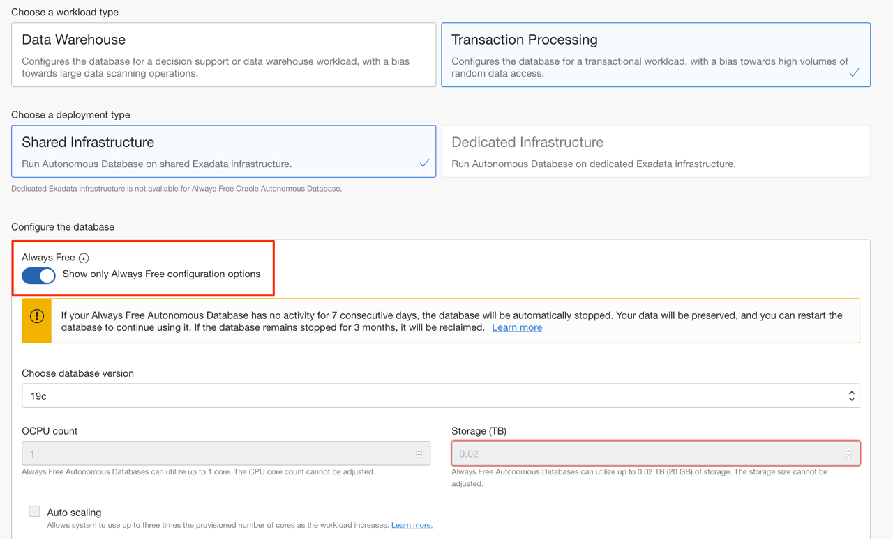

# Introduction

## Workshop Overview

Welcome to the Low Code - Oracle APEX on Autonomous Database workshop.

Estimated Time: 95 minutes

### About Oracle APEX

Oracle Application Express (APEX) is a low-code development platform that enables you to build scalable, secure enterprise apps, with world-class features, that can be deployed anywhere.

Using APEX, developers can quickly develop and deploy compelling apps that solve real problems and provide immediate value. You won't need to be an expert in a vast array of technologies to deliver sophisticated solutions. Focus on solving the problem and let APEX take care of the rest.

If you have Oracle Database, you already have Oracle APEX. APEX is a fully supported no-cost feature of Oracle Database – the most complete, integrated, and secure data platform for any scale deployment. This solid foundation enables apps built using APEX to natively access and interact with all of the capabilities of Oracle Database.

### Objectives

- Obtain an APEX free development environment
- Build your first app through uploading a Spreadsheet
- Improve the Faceted Search page
- Improve the Interactive Report and form pages
- Improve Calendar page
- Link pages
- Define new tables and views
- Create an application on the new data structures
- Refine the application

*Note: This lab assumes you are using Oracle APEX 20.2.*

### Workshop Parts

#### Part 1

| # | Module | Est. Time |
| --- | --- | --- |
| 1 | [Creating an App from a Spreadsheet](?lab=part-1---lab-1-create-app-spreadsheet) | 5 minutes |
| 2| [Improving the Faceted Search](?lab=part-1---lab-2-improve-faceted-search) | 10 minutes |
| 3 | [Improving the Report and Form](?lab=part-1---lab-3-improve-report-form) | 20 minutes |
| 4 | [Linking the Calendar](?lab=part-1---lab-4-link-calendar) | 5 minutes |

Total estimated time: 40 minutes

#### Part 2

| Lab # | Lab | Est. Time |
| --- | --- | --- |
| 5 | [Define New Data Structures](?lab=part-2---lab-1-define-new-data) | 15 minutes |
| 6 | [Create the Application](?lab=part-2---lab-2-create-application) | 5 minutes |
| 7 | [Regenerate the Application](?lab=part-2---lab-3-regenerate-application) | 5 minutes |
| 8 | [Improve Tasks](?lab=part-2---lab-4-improve-tasks) | 15 minutes |
| 9 | [Improve To Dos](?lab=part-2---lab-5-improve-dos) | 10 minutes |
| 10 | [Improve Links](?lab=part-2---lab-6-improve-links) | 5 minutes |

Total estimated time: 55 minutes

### **Let's Get Started!**

If the menu is not displayed, you can open by clicking the menu button () at the top of the page.

<if type="freetier">
### Create Your APEX Workspace


1. Log into your Oracle Cloud account.        
    From any browser go to [https://cloud.oracle.com/en_US/sign-in](https://cloud.oracle.com/en_US/sign-in).

    Enter your **Cloud Account Name** in the input field and click the **Next** button.

    

2. Enter your **User Name** and **Password** in the input fields, and click **Sign In**.

    

3. From within your Oracle Cloud environment, you will create an instance of the Autonomous Transaction Processing database service.

    From the Cloud Dashboard, select the navigation menu icon in the upper left-hand corner and then select **Autonomous Transaction Processing**.

    

4. Click **Create Autonomous Database**.

    

5. Select the **Always Free** option, enter **```SecretPassw0rd```** for the ADMIN password, then click **Create Autonomous Database**.

    
    
    

6. After clicking **Create Autonomous Database**, you will be redirected to the Autonomous Database Details page for the new instance.

    Continue when the status changes from:

    

    to:

    

7. Within your new database, APEX is not yet configured. Therefore, when you first access APEX, you will need to log in as an APEX Instance Administrator to create a workspace.

    Click the **Tools** tab.
    Click **Open APEX**.

    

    *Note: Always Free Autonomous Database will be stopped after being inactive for 7 days. If that happens, you need to click **More Actions** and then **Start** to start your Autonomous Database, and then **Open APEX**.*

8. Enter the password for the Administration Services and click **Sign In to Administration**.     
    The password is the same as the one entered for the ADMIN user when creating the ATP instance: **```SecretPassw0rd```**

    

9. Click **Create Workspace**.

    

10. In the Create Workspace dialog, enter the following:

    | Property | Value |
    | --- | --- |
    | Database User | DEMO |
    | Password | **`SecretPassw0rd`** |
    | Workspace Name | DEMO |

    Click **Create Workspace**.

    

11. In the APEX Instance Administration page, click the **DEMO** link in the success message.         
    *Note: This will log you out of APEX Administration so that you can log into your new workspace.*

    

12. On the APEX Workspace log in page, enter **``SecretPassw0rd``** for the password, check the **Remember workspace and username** checkbox, and then click **Sign In**.

    
</if>

## Downloads

- [Click here](../../spreadsheet/0-workshop-intro-and-setup/files/spreadsheet-app.sql) to download the completed application for workshop 1.
- [Click here](../../proof-of-concept/intro/files/proofofconcept-app.sql) to download the completed application for workshop 2.

## Learn More

- [APEX on Autonomous](https://apex.oracle.com/autonomous)
- [APEX Collateral](https://apex.oracle.com)
- [Tutorials](https://apex.oracle.com/en/learn/tutorials)
- [Community](https://apex.oracle.com/community)
- [External Site + Slack](http://apex.world)

You may proceed to the next lab.

## Acknowledgements

- **Author** - Salim Hlayel, APEX Product Management
- **Contributors** - Arabella Yao, Dylan McLeod, Jaden McElvey, LiveLabs QA, Tammy Bednar, Product Management
- **Last Updated By/Date** - Madhusudhan Rao, Apr 2022

