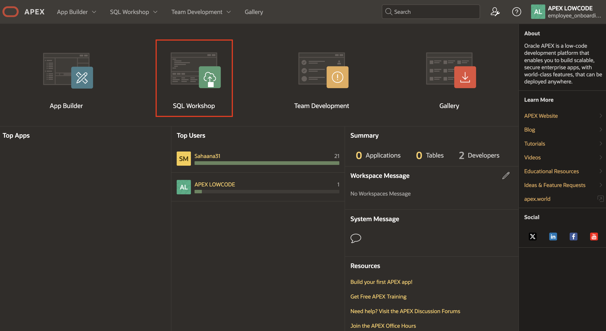
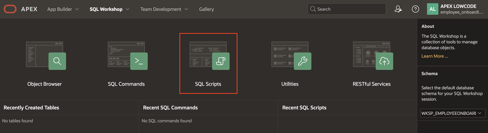
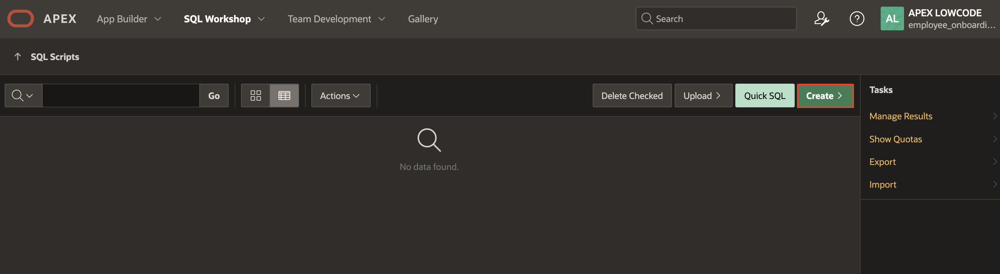
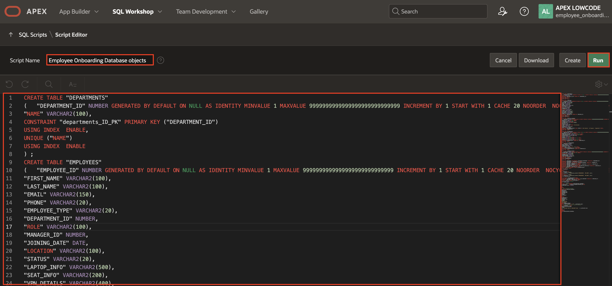
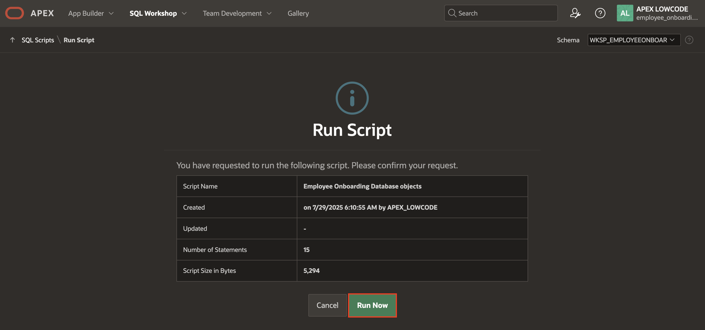
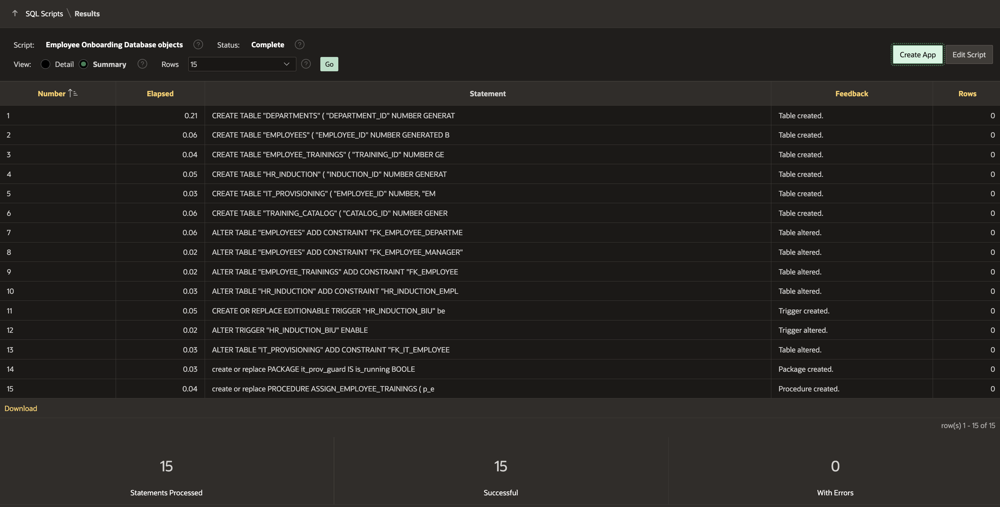

# Load Database Objects using SQL Workshop

## Introduction

This lab walks you through the database objects required for Employee On-boarding.
In this task, you'll use Quick SQL to quickly generate and execute a script for creating database tables. This script defines tables for an Online Bookstore app, including Users, Books, Orders, and more. Once executed, you can review the tables in the Object Browser.

Estimated Time: 10 minutes

### Objectives

In this lab, you will:

* Load the database objects that are required for this lab using SQL Scripts
* Objective 2
* Objective 3

## Task 1: Load Database objects

In this task you will use SQL Scripts to quickly load and execute the required database objects including tables, procedures and packages. This script defines tables for an Employee Onboarding, including Employee,Trainings,Books, Orders, and more. Once executed, you can review the tables in the Object Browser.

1. In the Workspace home page, click the **SQL Workshop**.

  

2. Click **SQL Scripts**.

  

3. Click the **Create** button.

  

4. In the Script Editor, enter the following:

    **Name**:  Employee Onboarding Database objects

    **Script**: Copy and paste the following in the code editor:

    ```
    <copy>
    CREATE TABLE "DEPARTMENTS"
      (	"DEPARTMENT_ID" NUMBER GENERATED BY DEFAULT ON NULL AS IDENTITY MINVALUE 1 MAXVALUE 9999999999999999999999999999 INCREMENT BY 1 START WITH 1 CACHE 20 NOORDER  NOCYCLE  NOKEEP  NOSCALE  NOT NULL ENABLE,
      "NAME" VARCHAR2(100),
      CONSTRAINT "departments_ID_PK" PRIMARY KEY ("DEPARTMENT_ID")
      USING INDEX  ENABLE,
      UNIQUE ("NAME")
      USING INDEX  ENABLE
      ) ;
    CREATE TABLE "EMPLOYEES"
      (	"EMPLOYEE_ID" NUMBER GENERATED BY DEFAULT ON NULL AS IDENTITY MINVALUE 1 MAXVALUE 9999999999999999999999999999 INCREMENT BY 1 START WITH 1 CACHE 20 NOORDER  NOCYCLE  NOKEEP  NOSCALE  NOT NULL ENABLE,
      "FIRST_NAME" VARCHAR2(100),
      "LAST_NAME" VARCHAR2(100),
      "EMAIL" VARCHAR2(150),
      "PHONE" VARCHAR2(20),
      "EMPLOYEE_TYPE" VARCHAR2(20),
      "DEPARTMENT_ID" NUMBER,
      "ROLE" VARCHAR2(100),
      "MANAGER_ID" NUMBER,
      "JOINING_DATE" DATE,
      "LOCATION" VARCHAR2(100),
      "STATUS" VARCHAR2(20),
      "LAPTOP_INFO" VARCHAR2(500),
      "SEAT_INFO" VARCHAR2(200),
      "VPN_DETAILS" VARCHAR2(400),
      CONSTRAINT "EMPLOYEES_PK" PRIMARY KEY ("EMPLOYEE_ID")
      USING INDEX  ENABLE,
      UNIQUE ("EMAIL")
      USING INDEX  ENABLE
      ) ;
    CREATE TABLE "EMPLOYEE_TRAININGS"
      (	"TRAINING_ID" NUMBER GENERATED ALWAYS AS IDENTITY MINVALUE 1 MAXVALUE 9999999999999999999999999999 INCREMENT BY 1 START WITH 1 CACHE 20 NOORDER  NOCYCLE  NOKEEP  NOSCALE  NOT NULL ENABLE,
      "EMPLOYEE_ID" NUMBER NOT NULL ENABLE,
      "CATALOG_ID" NUMBER NOT NULL ENABLE,
      "TRAINING_TYPE" VARCHAR2(50),
      "ASSIGNED_DATE" DATE DEFAULT SYSDATE,
      "DUE_DATE" DATE,
      "COMPLETED_DATE" DATE,
      "STATUS" VARCHAR2(20) DEFAULT 'Not Started',
      "SCORE" NUMBER(5,2),
      "ASSIGNED_BY" VARCHAR2(50),
      "NOTES" VARCHAR2(4000),
      CONSTRAINT "CHK_TRAINING_STATUS" CHECK (STATUS IN ('Not Started', 'In Progress', 'Completed')) ENABLE,
      PRIMARY KEY ("TRAINING_ID")
      USING INDEX  ENABLE
      ) ;
    CREATE TABLE "HR_INDUCTION"
      (	"INDUCTION_ID" NUMBER GENERATED BY DEFAULT ON NULL AS IDENTITY MINVALUE 1 MAXVALUE 9999999999999999999999999999 INCREMENT BY 1 START WITH 1 CACHE 20 NOORDER  NOCYCLE  NOKEEP  NOSCALE  NOT NULL ENABLE,
      "EMPLOYEE_ID" NUMBER NOT NULL ENABLE,
      "INDUCTION_START_TIME" TIMESTAMP (6) NOT NULL ENABLE,
      "INDUCTION_END_TIME" TIMESTAMP (6) NOT NULL ENABLE,
      "SESSION_DETAILS" VARCHAR2(4000 CHAR),
      "STATUS" VARCHAR2(20),
      "CREATED" DATE NOT NULL ENABLE,
      "CREATED_BY" VARCHAR2(255 CHAR) NOT NULL ENABLE,
      "UPDATED" DATE NOT NULL ENABLE,
      "UPDATED_BY" VARCHAR2(255 CHAR) NOT NULL ENABLE,
      CONSTRAINT "HR_INDUCTION_PK" PRIMARY KEY ("INDUCTION_ID")
      USING INDEX  ENABLE
      ) ;
    CREATE TABLE "IT_PROVISIONING"
      (	"EMPLOYEE_ID" NUMBER,
      "EMAIL_CREATED" CHAR(1),
      "LAPTOP_ALLOCATED" CHAR(1),
      "WORKFLOW_ID" NUMBER,
      CHECK (email_created IN ('Y', 'N')) ENABLE,
      CHECK (laptop_allocated IN ('Y', 'N')) ENABLE,
      CONSTRAINT "IT_PROVISIONING_PK" PRIMARY KEY ("EMPLOYEE_ID")
      USING INDEX  ENABLE
      ) ;
    CREATE TABLE "TRAINING_CATALOG"
      (	"CATALOG_ID" NUMBER GENERATED ALWAYS AS IDENTITY MINVALUE 1 MAXVALUE 9999999999999999999999999999 INCREMENT BY 1 START WITH 1 CACHE 20 NOORDER  NOCYCLE  NOKEEP  NOSCALE  NOT NULL ENABLE,
      "TRAINING_NAME" VARCHAR2(100) NOT NULL ENABLE,
      "DESCRIPTION" VARCHAR2(1000),
      "TRAINING_TYPE" VARCHAR2(50),
      "ESTIMATED_HOURS" NUMBER(4,1),
      "TARGET_AUDIENCE" VARCHAR2(20),
      PRIMARY KEY ("CATALOG_ID")
      USING INDEX  ENABLE,
      UNIQUE ("TRAINING_NAME")
      USING INDEX  ENABLE
      ) ;
    ALTER TABLE "EMPLOYEES" ADD CONSTRAINT "FK_EMPLOYEE_DEPARTMENT" FOREIGN KEY ("DEPARTMENT_ID")
      REFERENCES "DEPARTMENTS" ("DEPARTMENT_ID") ENABLE;
    ALTER TABLE "EMPLOYEES" ADD CONSTRAINT "FK_EMPLOYEE_MANAGER" FOREIGN KEY ("MANAGER_ID")
      REFERENCES "EMPLOYEES" ("EMPLOYEE_ID") DISABLE;
    ALTER TABLE "EMPLOYEE_TRAININGS" ADD CONSTRAINT "FK_EMPLOYEE" FOREIGN KEY ("EMPLOYEE_ID")
      REFERENCES "EMPLOYEES" ("EMPLOYEE_ID") ENABLE;
    ALTER TABLE "HR_INDUCTION" ADD CONSTRAINT "HR_INDUCTION_EMPLOYEE_FK" FOREIGN KEY ("EMPLOYEE_ID")
      REFERENCES "EMPLOYEES" ("EMPLOYEE_ID") ENABLE;
    CREATE OR REPLACE EDITIONABLE TRIGGER "HR_INDUCTION_BIU"
      before insert or update
      on hr_induction
      for each row
      begin
      if inserting then
      :new.created := sysdate;
      :new.created_by := coalesce(sys_context('APEX$SESSION', 'APP_USER'), user);
      end if;
      :new.updated := sysdate;
      :new.updated_by := coalesce(sys_context('APEX$SESSION', 'APP_USER'), user);
      end hr_induction_biu;
      /
    ALTER TRIGGER "HR_INDUCTION_BIU" ENABLE;
    ALTER TABLE "IT_PROVISIONING" ADD CONSTRAINT "FK_IT_EMPLOYEE" FOREIGN KEY ("EMPLOYEE_ID")
      REFERENCES "EMPLOYEES" ("EMPLOYEE_ID") ENABLE;
    create or replace PACKAGE it_prov_guard IS
      is_running BOOLEAN := FALSE;
      END it_prov_guard;
      /
    create or replace PROCEDURE ASSIGN_EMPLOYEE_TRAININGS (
      p_employee_id     IN EMPLOYEE_TRAININGS.EMPLOYEE_ID%TYPE,
      p_employment_type IN VARCHAR2
      )
      AS
      BEGIN
      -- Insert matching trainings
      INSERT INTO EMPLOYEE_TRAININGS (
      EMPLOYEE_ID,
      CATALOG_ID,
      TRAINING_TYPE,
      ASSIGNED_DATE,
      DUE_DATE,
      STATUS,
      ASSIGNED_BY
      )
      SELECT
      p_employee_id,
      CATALOG_ID,
      TRAINING_TYPE,
      SYSDATE,
      SYSDATE + 7,
      'Not Started',
      'HR System'
      FROM TRAINING_CATALOG
      WHERE TARGET_AUDIENCE IN ('All', p_employment_type);
      -- If no rows were inserted, raise an exception
      IF SQL%ROWCOUNT = 0 THEN
      RAISE_APPLICATION_ERROR(
      -20001,
      'No trainings found for employment type: ' || p_employment_type
      );
      END IF;
      COMMIT;
      END ASSIGN_EMPLOYEE_TRAININGS;
    /
    </copy>
    ```

  and click **Run**.

  

5. In the confirmation screen, click **Run Now**.

  

6. The Results page lists the summary of the executed script.

  

## Summary

You have successfully completed the initial steps for designing the **Employee Onboarding** application. You have created the required database objects.

## Acknowledgements

- **Author** - Roopesh Thokala, Senior Product Manager; Sahaana Manavalan, Senior Product Manager, July 2025
- **Last Updated By/Date** - Sahaana Manavalan, Senior Product Manager, August 2025
