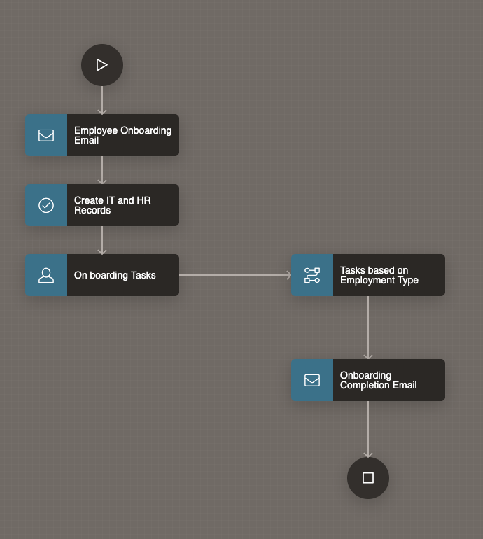
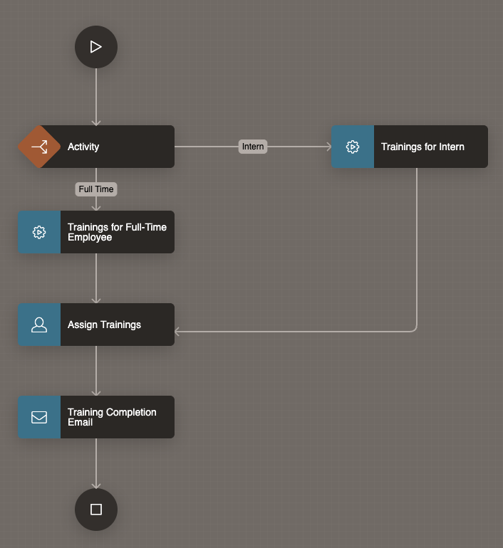

# Identify Business steps

## Introduction

In this lab, you will design an Employee Onboarding Application that streamlines the hiring and onboarding process using Oracle APEX Workflows. The onboarding process ensures that newly hired employees are assigned system access, devices, and mandatory training sessions before officially joining.

The application consists of two workflows:

1. Employee Onboarding Workflow (Parent) – Handles onboarding initiation, HR and IT setup, task assignments, and completion notifications.

2. Employment Type Workflow (Child) – Determines and assigns trainings based on whether the employee is Full-Time or an Intern.

To achieve this, we will:

- Break down the business logic into executable steps.

- Identify conditions (Full-Time vs. Intern).

- Define the key participants (HR, IT, Employee, Workflow automation).

*Note: In APEX Workflow terminology, we refer to an executable step as an **Activity** and a sequence/condition as a **Connection**.*

### Objectives

In this lab, you will:

- Identify Business steps required to create **Employee Onboarding** Application.

Estimated Time: 10 minutes

### Prerequisites

1. Access to Oracle APEX.

## Breaking down the Business Logic

We will first define the Employee Onboarding Workflow (Parent), followed by the Employment Type Workflow (Child).

### Steps in Onboarding a New Hire

**Employee Onboarding Workflow**

| Step No. | Step Description                                             | Step Type | Actor                  |
|---------|-------------------------------------------------------------|-----------|------------------------|
| 1      | Sales Manager recruits a new hire and initiates recruitment by submitting a new hire request| Manual | Sales Manager |
| 2     | HR receives the request and confirms onboarding details (start date, role, etc.). | Manual | HR |
| 3      | Create the new hire record in the Application | Manual | HR |
| 4     | Send onboarding initiation email to new hire| Automatic  | Workflow |
| 5 | Create IT and HR Records | Automatic  | Workflow |
| 6 | On boarding Tasks to setup an email id and allocate laptop for the new hire | Automatic  | Workflow |
| 7    | Invoke Employment Type Workflow to determine training needs. | Automatic | Workflow |
| 8     | Send Onboarding completion email to new hire. | Automatic    | Workflow                |
{: title="Employee Onboarding Workflow Steps"}

**Employment Type Workflow:**

| Step No. | Step Description                                             | Step Type | Actor                  |
|---------|-------------------------------------------------------------|-----------|------------------------|
| 1       | Branch based on employment type: Full-Time or Intern. | Automatic | Workflow              |
| 2      | If Full-Time: Assign mandatory trainings (HR, Security, Role,etc). | Automatic | Workflow              |
| 3      | If Intern: Assign intern specific orientation trainings. | Automatic | Workflow              |
| 4       |Notify employee with assigned training details. | Automatic | Workflow                 |
| 5      | Employee completes assigned training tasks. | Manual | Employee                 |
| 6      | Send Training Completion Email to HR and Manager. | Automatic | Workflow    |
{: title="Employment Type Workflow Steps"}

This structure shows how the parent onboarding process automatically invokes the child workflow to handle employment specific training. It ensures smooth coordination between HR, IT, and Training while automating notifications and follow ups.

This comprehensive breakdown illustrates the significance of workflow in managing complex business processes, making the system efficient and responsive.

- Employee Onboarding Workflow

    

- Employment Type Workflow

    

## Summary

You now understand the significance of workflow in managing complex business processes, making the system efficient and responsive.

## What's Next

In the next lab, you will create a flowchart based on the automated steps, helping us visualize the flow of the business logic and its seamless execution. Stay tuned as we dive into the practical implementation of this intuitive employee onboarding system!

You may now **proceed to the next Lab**.

## Acknowledgements

- **Author** - Sahaana Manavalan, Senior Product Manager; Roopesh Thokala, Senior Product Manager, August 2025
- **Last Updated By/Date** - Sahaana Manavalan, Senior Product Manager, August 2025
