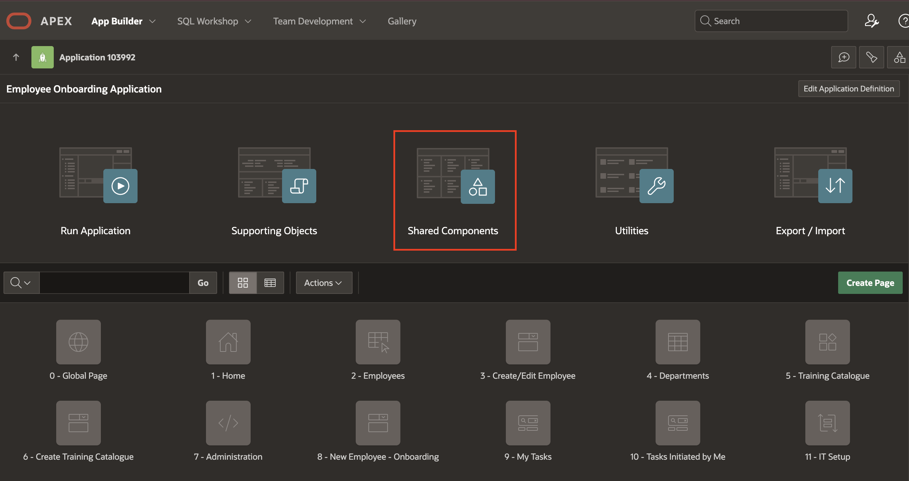
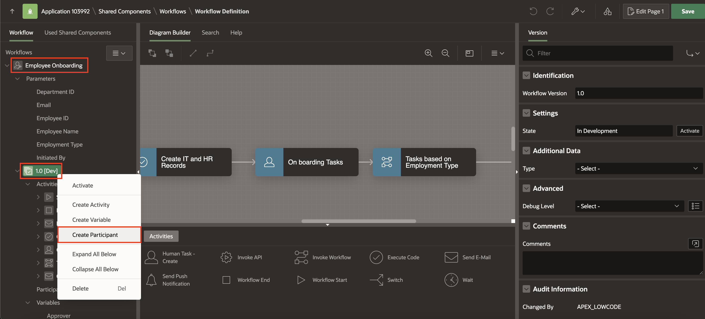
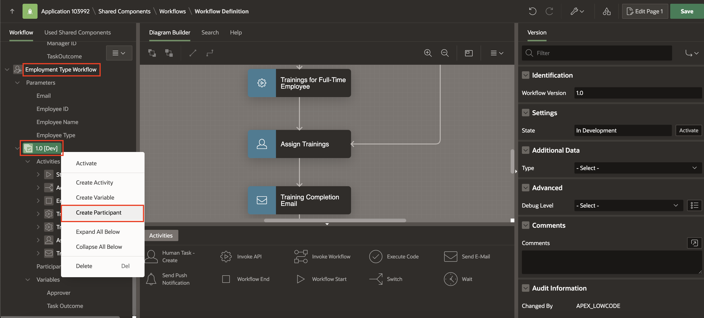
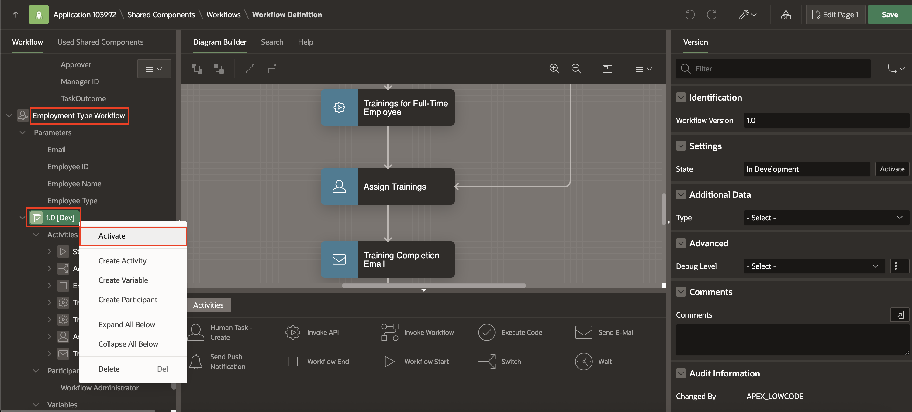
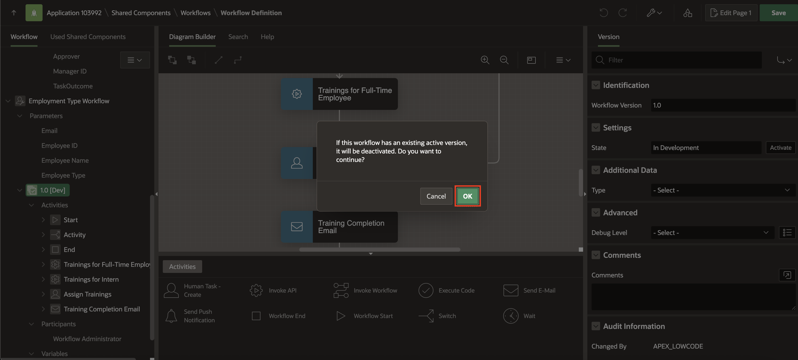
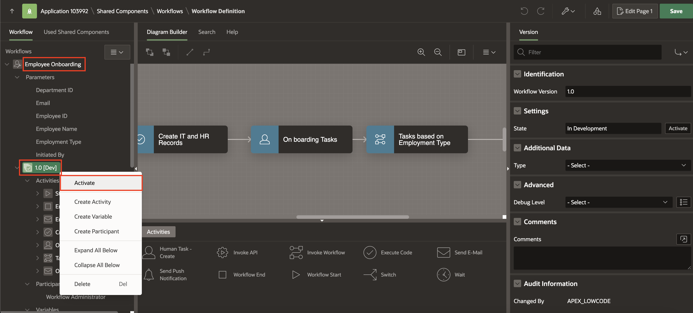

# Activate the Employee Onboarding Application

## Introduction

In this lab, you add an ADMIN participant and activate the workflow.

Workflows marked as **Active** are ready for production use and represent the live version of your business processes. The APEX Workflow engine exclusively processes workflow versions that have an 'Active' status, ensuring only approved workflows run in your production environment.

- Only one version of a workflow can be active at any given time, preventing conflicts and ensuring consistency.
- Active workflows are the only versions recognized by the start_workflow API and workflow engine in production applications.
- While Active, certain workflow changes can still be made and saved without disrupting running processes.
- An Active workflow versions can be deactivated when you need to retire them from production use.

### Objectives

- Add a Participant.

- Activate the Workflow.

Estimated Time: 5 minutes

### Prerequisites

- All the previous Labs have been completed.

## Task 1: Add Participant

1. From the **Application Homepage** , navigate to **Shared Components**.

    

2. Under **Workflows and Automations**, select **Workflows**.

    

3. Select **Employee Onboarding**.

    

4. Navigate to **Employee Onboarding** workflow. Under **1.0** workflow version, right-click **Participants** and select **Create Participant**.

    

5. In the Property Editor, enter/select the following:

    - Under Identification:

        - Name: **ADMIN**

        - Type: **Workflow Administrator**

    - Under Value:

        - Type: **Static Value**

        - Static Value: **STEVE**

    

6. Follow the same steps for **Employment Type Workflow** to add a participant.

    

    

7. Click **Save**.

    

## Task 2: Activate the Workflow

1. On the Workflow Definition page, go to **Employment Type Workflow** and under **1.0** workflow version, right-click and select **Activate** as well as click **OK** to confirm.

    

    

2. Now, right-click **Employee Onboarding** workflow and select **Activate**.

    

3. Click **Save**.

    

## Summary

In this hands-on lab, you learned how to:

- Add a Participant.

- Activate the Workflow.

## Acknowledgements

- **Author** - Roopesh Thokala, Senior Product Manager; Sahaana Manavalan, Senior Product Manager, August 2025
- **Last Updated By/Date** - Sahaana Manavalan, Senior Product Manager, August 2025
