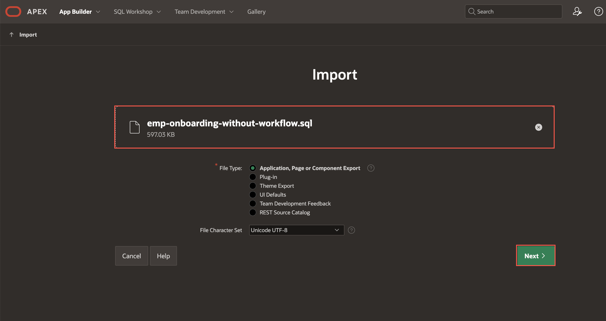
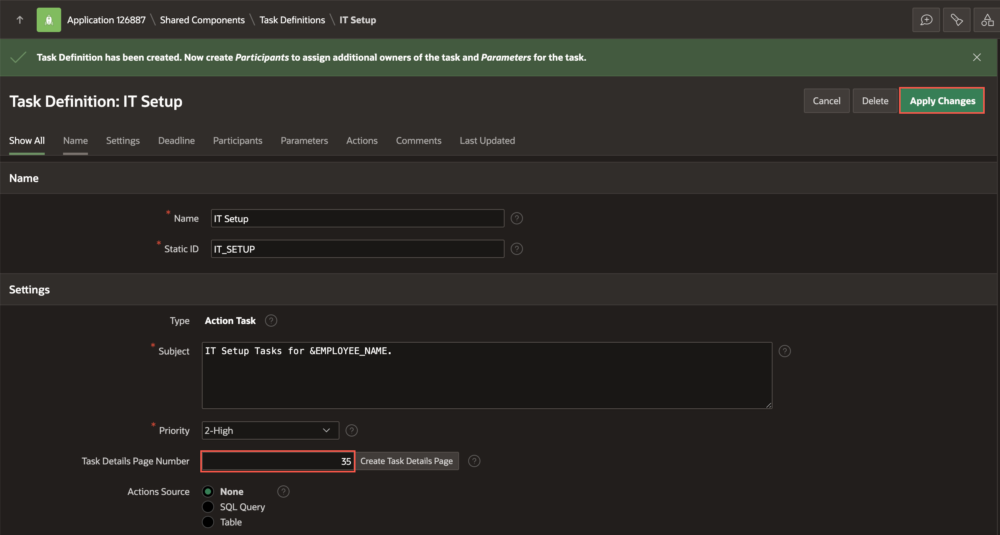
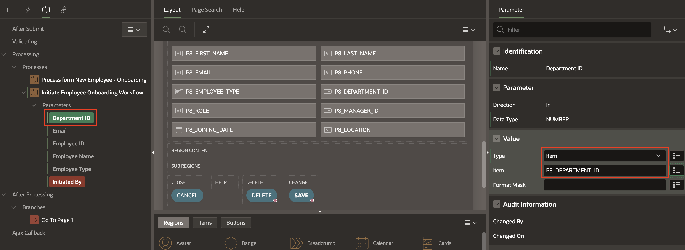

# Appendix: Download and Install Instructions

This lab focuses on a set of simplified tasks designed to help you quickly understand and practice APEX workflows. The starter app is preconfigured, so you can dive straight into executing the tasks and learning the core concepts. Let’s get started!

## Objectives

In this lab, you will:
- Download and install the starter app designed to help you concentrate on APEX Workflows.
- Create Task Definitions
- Create Workflows
- Explore the App

## Task 1: Import the Starter App into an APEX Workspace

1. Navigate to **App Builder** and click **Import**.

    

2. Drag and drop your downloaded zip file, then click **Next**.

    

3. Click **Install Application**.

    

4. Click **Install Supporting Objects**.

    


## Task 2: Create Workspace Users

In this task, you will create multiple **Workspace users** in Oracle APEX to represent different roles for the **Employee Onboarding** application. Defining these users will help you simulate how HR, IT, and Sales employees interact with the application and allow you to test the onboarding workflow from different perspectives.

You will create the following users:

|   Employee Name |  Department |
| -------------- | --------- |
|    STEVE       |   HR  |
|   AMY     |    IT  |
|   ALEX | Sales |
| MONICA | Sales |
{: title="List of Users to Create in the Workspace"}

*Note: MONICA is a new hire in the Sales Department, for whom we will be initating a workflow request.*

1. On the Workspace home page, click **Administration** icon and select **Manage Users and Groups**.

    

2. Click **Create Multiple Users**.

    

3. In the **Create multiple Users**, enter the list of email addresses and set the following attributes:

    - List of Email Addresses: Copy and Paste the below email addresses and replace yourdomain.com with your actual domain.

      ```
      <copy>
      AMY@yourdomain.com
      STEVE@yourdomain.com
      ALEX@yourdomain.com
      MONICA@yourdomain.com
      </copy>
      ```

    - Usernames: **Exclude @ domain as part of the username**

    - Password and Confirm Password: **Enter a password**

    *Note: These users are not Workspace Administrators or Developers, they are End Users and will only have access to the Employee Onboarding application.*

    Click **Next**.

    

4. Click **Create Valid Users**.

    

## Task 3: Create Task Definitions for IT Setup

In this task, you will create a Task Definition for IT Setup and assign it to the IT staff.

1. In your Employee Onboarding Application home page, navigate to **Shared Components**.

    

2. Under Workflows and Automations, select **Task Definitions**.

    

3. Click **Create**.

    

4. In the Create Task Definition wizard, enter/select the following:

    - Name: **IT Setup**
    - Type: **Action Task**
    - Subject: **IT Setup Tasks for &EMPLOYEE_NAME.**
    - Priority: **2-High**

    Click **Create**.

    

5. Under **Settings**, for Task Details Page Number enter **35**. Click **Apply Changes**.

    

6. In the Task Definitions page, select **IT Setup**.

    

7. Under **Settings**, enter/select the following:

    - Actions Source: **SQL Query**

    - Actions SQL Query: Copy and paste the below SQL Query:
        ```
         <copy>
         Select * from EMPLOYEES WHERE EMPLOYEE_ID = :APEX$TASK_PK;
         </copy>
        ```

        This step ties our task to the system of records, in this case, the employee's records.

    *Note: APEX$TASK\_PK is a substitution string holding the primary key value of the system of records (in this case, the employee's number).*

    

8. Navigate to **Participants** tab, and click **Add Row**. Enter/select the following details:

    - Participant Type: **Potential Owner**

    - Value Type: **SQL Query**

    - Value: Copy and paste the below code
        ```
         <copy>
         select upper(e.first_name)
         from employees   e
         join departments d
         on e.department_id = d.department_id
         where d.name = 'IT';
         </copy>
        ```

    

9. Navigate to **Parameters** tab, and add the below Parameters by clicking **Add Row**.

    | Static ID     |   Label    |
    |--------------------|------------|
    | DEPARTMENT   | Department |
    | EMAIL       | Email |
    | EMPLOYEE_ID       | Employee ID |
    | EMPLOYEE_NAME     | Employee Name  |
    {: title="List of Parameters to be added for the Task Definition"}

    

10. Click **Apply Changes**.

## Task 4: Create Task Definitions to Allocate Trainings

1. In the Task Definitions page, click **Create**.

    

2. In the **Create Task Definition** dialog, enter/select the following details:

    - Name: **Allocate Trainings**

    - Type: **Action Task**

    - Subject: **Allocate Trainings for &EMPLOYEE_NAME.**

    Click **Create**.

    

3. Under **Settings**, for Task Details Page Number enter **36**. Click **Apply Changes**.

    


4. Select **Allocate Trainings** to open the task definition in edit mode and enter/select the following:

    - Under Settings:

        - Actions Source: **SQL query**

        - Actions SQL Query: Provide the following SQL statement:
            ```
             <copy>
             select * from EMPLOYEE_TRAININGS where EMPLOYEE_ID = :APEX$TASK_PK;
            </copy>
            ```

    *Note: APEX$TASK\_PK is a substitution string holding the primary key value of the system of records (in this case, the employee's id)*

    

    

5. Now, navigate to **Participants** tab, click **Add Row** and enter/select the following:

    - Participant Type: **Potential Owner**

    - Value Type: **SQL Query**

    - Value: Copy and paste the below code:

        ```
         <copy>
         select upper(first_name) from employees  where employee_id = :APEX$TASK_PK;
         </copy>
        ```

    

6. Navigate to **Parameters** tab. Add the below Parameters by clicking **Add Row**.

    | Static ID     | Label |
    |---------------|---------|
    | EMAIL        | Email  |
    | EMPLOYEE\_NAME               | Employee Name |
    {: title="List of Task Parameters to be added"}

    

7. Navigate to **Deadline** tab. Enter/select the following:

    - Due On Type: **Interval**
    - Due On Interval: **P2D**
    - Expiration Policy: **Renew**
    - Maximum Renewal Count: **3**

    *Note: The Due On Interval is set to **P2D**, which represents a period of 2 days.*

    

8. Click **Apply Changes**.

9. Select **Allocate Trainings** to open the task definition in edit mode.

   

10. Navigate to the **Actions** tab, and click **Add Action**.

    

11. Enter/Select the following in the Edit Action page:

    - Under Action:

        - Name: **Send Email**
        - Type: **Send E-Mail**
        - On Event: **Before Expire**
        - Before Expire Interval: **PT1H**

    - Under Send Email Settings:

        - To: **&EMAIL.**
        - Subject: **Reminder: Upcoming Training Task – Complete Before Due Date**
        - Body Plain Text: copy and paste the following:

            ```
             <copy>
             Hi &EMPLOYEE_NAME.,

             This is a friendly reminder about your upcoming onboarding training module that's approaching its due date.
             To ensure you stay on schedule with your onboarding process, we recommend completing this training before the deadline. The content includes essential information designed to help you succeed in your new position.

             Should you have any questions or encounter difficulties accessing the training materials, please don't hesitate to contact us. Our team is committed to supporting you throughout your onboarding experience.
             We appreciate your dedication and look forward to your continued progress!

             Best regards,
             HR Team,
             ACME Corporation.
             </copy>
            ```

    Click **Create**.

    

    

12. Click **Apply Changes**.

    

## Task 5: Create Employment Type Workflow

Execute [Lab 5: Create Employment Type Workflow](?lab=5-create-emp-type-wf) and proceed to next task.

## Task 6: Create Employee Onboarding Workflow

Execute [Lab 6: Create Employee Onboarding Workflow](?lab=6-create-empon-wf) and proceed to next task.

## Task 7: Create and Configure Page Process
1. Navigate to the **Processing** tab.

2. Under **Processing** tab, right-click **Processing** and select **Create Process**.

    

3. In the Property Editor, enter/select the following:

      - Under Identification:

          - Name: **Initiate Employee Onboarding Workflow**

          - Type: **Workflow**

      - Under Settings:

          - Definition: **Employee Onboarding**

          - Details Primary Key Item: **P8\_EMPLOYEE\_ID**

      - Success message: **Employee Onboarding Initiated**

     

4. Now, configure Parameters for the Workflow Page Process. Update the following **Parameters** one after the other:

    | Parameter |  Type  | Item |
    | --- |  --- | ---- |
    | Department ID | Item | P8\_DEPARTMENT\_ID |
    | Email | Item | P8\_EMAIL |
    | Employee ID | Item | P8\_EMPLOYEE\_ID |
    | Employee Name | Item | P8\_FIRST\_NAME |
    | Employee Type | Item | P8\_EMPLOYEE\_TYPE |
    | Initiated By | Expression |    :APP_USER      |
    {: title="List of Parameters to be linked"}

    

    *Note: Your Page Number may vary.*

5. Click **Save**.

    

Optionally, execute [Lab 8: Create Archive Tasks and Archive Workflow](?lab=8-archived-tasks).

## Task 8: Explore the App

Execute [Lab 10: Explore the App](?lab=10-running-the-app) and proceed to next task.


Optionally, execute [Lab 11: Activate Workflow](?lab=11-activate-workflow) to activate the workflow.


## Acknowledgments

 - **Author** - Apoorva Srinivas, Senior Product Manager
 - **Last Updated By/Date** - Apoorva Srinivas, Senior Product Manager, September 2025