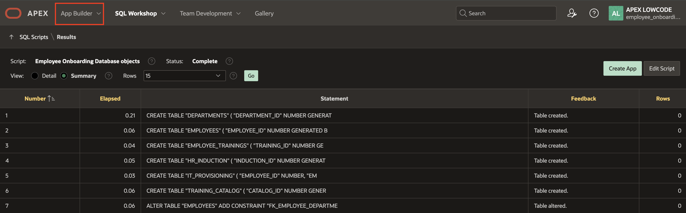
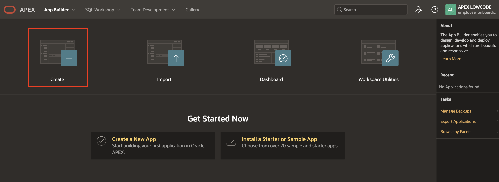
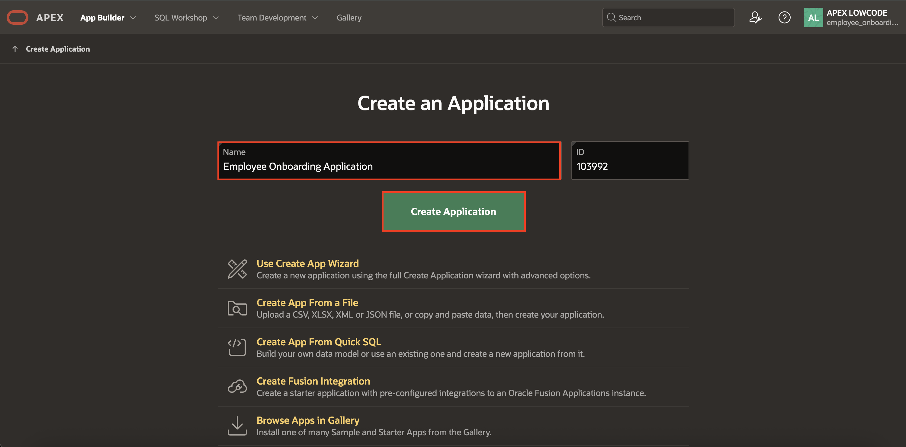
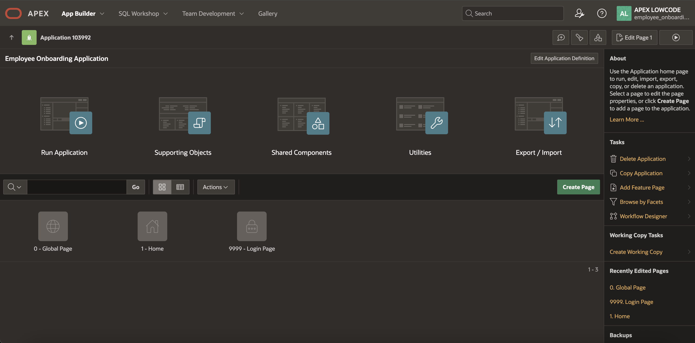
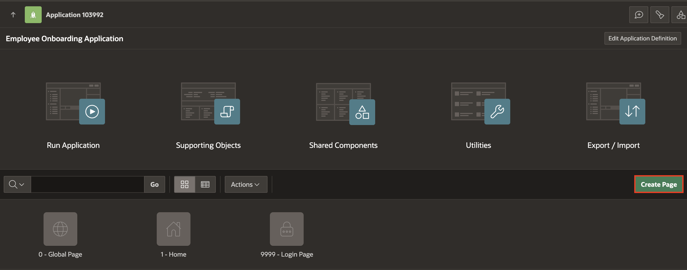

# Title of the Lab

## Introduction

In this lab, you will create a new application named Employee Onboarding Application. Then, you will quickly build admin pages for employee, training catalogue and department data.

Estimated Lab Time: 15 minutes

### Objectives

In this lab, you will:

* Objective 1
* Objective 2
* Objective 3

## Task 1: Create Employee Onboarding Application

Task 2 opening paragraph.

1. Click on App Builder.

  
2. In the App Builder home page, click **Create** to create an application.

  
3. In the Create Application Wizard, enter name as **Employee Onboarding Application** and click **Create Application**.

  
4. The application is now created.

  

## Task 1: Create a Navigation Entry

In this task, you will create a navigation entry for the admin pages and link the pages in task 3 to this entry.

1. Click **Shared Components**.

  

2. Under Navigation and Search, select **Navigation Menu**.

  

3. Click **Navigation Menu**.

  

4. Under List Enteries, select **Create List Entry**.

  

5. Enter/Select the following:

    - Under Entry
        - Image/Class: **fa-database-user**
        - List Entry Label: **Administration**

    - Target > Target Type: **- No Target -**

    Click **Create List Entry**.

  

6. Click on the Application ID to go back to the Application homepage.

  

## Task 3: Create Admin Pages - Employee, Departments & Training Catalogue

In this task you will create Employee, Departments and Training Catalogue Pages and add them to a common Admin Page.

1. In the Application Home page, click **Create Page**

  

2. In the create page wizard, select **Interactive Report** and click **Next**.

  

3. Enter/select the following:

    - Under Page Definition:
        - Name: **Employees**
        - Include Form page: **Toggle On**
        - Form Page Name: **Create/Edit Employee**
        - Form Page Mode: **Drawer**

    - Under Data Source:
        - Table/View Name: **Employees**

    - Under Navigation:
        - Use Breadcrumb: **Toggle OFF**
        - Use Navigation: **Toggle On**
        - Parent Navigation Menu Entry: **Administration**
        - Icon: **fa-users**

    And click **Next**.

  

4. Select Primary key as **EMPLOYEE_ID(Number)** and click **Create Page**.

  

5. Your Employee page is now created. In page designer, on the top right, click the **+** icon and select **Page**.

  

6. In the Create a Page wizard, select **Interactive Grid** and click **Next**.

  

7. Enter/select the following:

    - Under Page Definition:

        - Name: **Departments**

    - Under Data Source:

        - Table/View Name: **Departments**
        - Editing Enabled: **Toggle On**

    - Under Navigation:

        - Use Breadcrumb: **Toggle OFF**
        - Use Navigation: **Toggle ON**
        - Parent Navigation Menu Entry: **Administration**
        - Icon: **fa-address-card-o**

    And click **Next**.

  

8. Select Primary key as **DEPARTMENT_ID(Number)** and click **Create Page**.

  

9. Your Department page is now created. In page designer, on the top right, click the **+** icon and select **Page**.

  

10. In the Create a Page wizard, select **Content Row** and click **Next**.

  

11. In the Page wizard, enter/select the following:

    - Under Page Definition:
        - **Name:** Training Catalogue

    - Under Navigation:
        - Use Breadcrumb: **Toggle Off**
        - Use Navigation: **Toggle On**
        - Parent Navigation Menu Entry: **Administration**
        - Icon: **fa-badge-list**

    And click **Create Page**.

  

12. In the rendering tree, select **Training Catalogue** region and enter/select the following in the property editor:

    - Under Source:
        - SQL Query: copy and paste the below sql query

          ```
          <copy>
          select * from TRAINING_CATALOG
          </copy>
          ```
    - Under Appearance:
        - Template: **Standard**

    - Under Attributes:
        - Under Settings:
          - Overline: **&TARGET_AUDIENCE.**
          - Title: **&TRAINING_NAME.**
          - Description:**&DESCRIPTION.**
          - Miscellaneous: **Estimated Time: &ESTIMATED_HOURS. hours**

  

  

  

13. Now let's create a form page to input the training calatogues. Click the **+ icon** on the top right corner and select **Page**.

  

14. In the create a page wizard, select **Form**.

  

15. Enter/select the following in the page wizard:

    - Under page Definition:
        - Name: **Create Training Catalogue**
        - Page Mode: **Drawer**

    - Under Data Source:
        - Table/View Name: **TRAINING_CATALOG**

    And click **Next**.

  

16. Select **Primary key Column 1** :  CATALOG_ID(Number) and click **Create Page**.

  

  Now that you have your form page ready, let us link the Training Catalogue Page to the form page.

17. Click on the **Page Finder Icon** and select the **Training Catalogue Page**.

  

18. In the rendering tree, under Training Catalogue region and right click on **Actions**.

  

19. In the property editor, enter/select the following:

    - Under Identification:
        - Position: **Primary Actions**
        - Template: **Button**
        - Label: **Edit**

    - Under Link:
        - Target :
            -  Page: **6** (Create Training Catalog page)
            - Set Items:
                - Name: **P6\_CATALOG\_ID**
                - Value: **&CATALOG_ID.**

          And click **Ok**.

  

20. In the rendering tree, right click on **Training Catalogue** region and select **Create Button**.

  

21. In the property editor, enter/select the following:

    - Under Identification:
        - Button Name: **Create**
        - Label: **Create Training**

    - Under Layout:
        - Slot: **Above Region [Legacy]**

    - Under Behavior:
        - Action: **Redirect to Page in this Application**
        - Target > Page: **6** (Create Training Catalogue) and Click **Ok**.

  

22. Save the page.

    

## Task 2: Create Email Template

1. Navigate to **Shared Components**.

    

2. Under **User Interface**, select **Email Templates**.

    

3. Click **Create Template**.

    

4. Enter the following in the Template Details:

    - Under Identification:

        - Template Name: **Onboarding Email**
        - Email Subject: **Welcome to Acme Corp! Here’s Everything You Need to Get Started**

    - Under HTML Format:

      - Header: copy and paste the below code

          ```
           <copy>
           <b style="font-size: 24px;">Employee Onboarding</b>
           </copy>
          ```

      - Body: copy and paste the below code

          ```
           <copy>
           <strong>Hello #FIRST_NAME#,</strong><br><br>

            Welcome to <strong>ACME Corp</strong>! We are thrilled to have you join our team. Below are the details you will need to get started on Day One.<br><br>

            <strong>📅 Joining Information</strong><br><br>
            <br>

            <strong>🗂️ Documents Required</strong><br><br>
            Please make sure to have the following documents ready:<br><br>

            <ul>
              <li>Government-issued photo ID</li>
              <li>Educational certificates</li>
              <li>PAN Card / Tax ID</li>
              <li>Signed offer letter</li>
            </ul>

            If you're joining remotely, these can be uploaded via the <a href="https://acmecorp.com/onboarding/employee_portal">Employee Portal</a>.<br><br>

            <strong>❓ FAQs & Support</strong><br><br>

            <ul>
              <li><a href="https://acmecorp.com/onboarding/faqs">New Hire FAQs</a></li>
              <li>HR Contact: <strong>Sana Mehta</strong> – <a href="mailto:hr@acmecorp.com">hr@acmecorp.com</a> / +91-98765-43210</li>
            </ul>
            <br>

            <strong> Employee Portal Access</strong><br><br>

            Everything you need—from training modules to onboarding tasks—is available on our Employee Portal.<br><br>

            📹 <a href="https://www.youtube.com/watch?v=dQw4w9WgXcQ">Watch a short walkthrough video</a><br><br>

            Your login credentials will be sent to you via a secure channel shortly.<br><br>

            If you have any questions before your start date, feel free to get in touch. We’re here to help and can’t wait to see you on your first day!<br><br>

            Welcome aboard, <strong>#FIRST_NAME#</strong>!<br><br>

            —<br>
            <strong>#HR_NAME#</strong><br>
            HR Onboarding Coordinator<br>
            ACME Corp<br>
            +91-12345-67890 | <a href="mailto:onboarding@acmecorp.com">onboarding@acmecorp.com</a>

           </copy>
          ```

    

## Summary

In this task, you learnt how to create administration pages to create and manage Employees, Department and Training Catalogues.
## Learn More

*(optional - include links to docs, white papers, blogs, etc)*

* [URL text 1](http://docs.oracle.com)
* [URL text 2](http://docs.oracle.com)

## Acknowledgements

- **Author** - Roopesh Thokala, Senior Product Manager; Sahaana Manavalan, Senior Product Manager, August 2025
- **Last Updated By/Date** - Sahaana Manavalan, Senior Product Manager, August 2025
