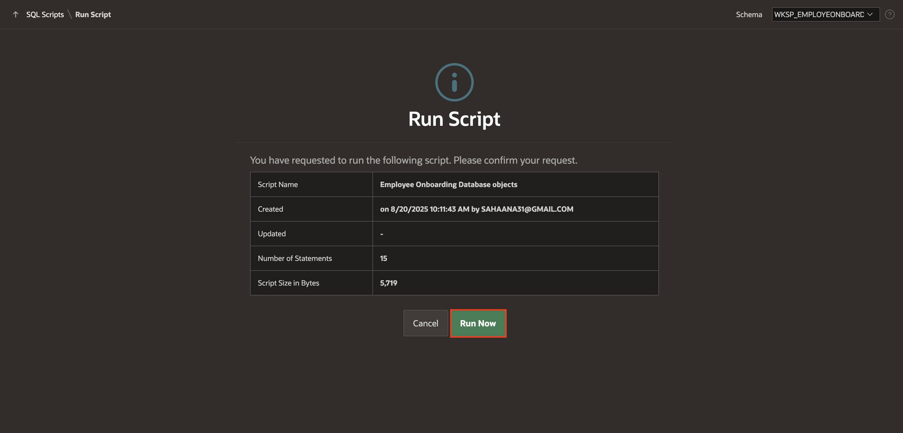
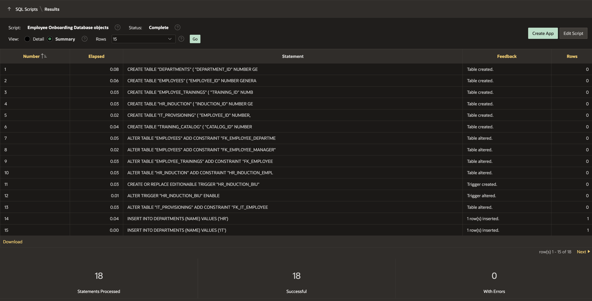

# Load Database Objects & Create Workspace Users

## Introduction

This lab walks you through the database objects required for the Employee Onboarding application. This task also shows you how to create multiple workspace users representing different roles within the Employee Onboarding application, enabling you to test various user experiences and access levels for the Workflows.

You'll use SQL scripts to execute a script for creating database objects and inserting data in the tables. This script defines tables, a package and a procedure that will be used for the Employee Onboarding app, including Employees, Departments, Employee Trainings, and more. Once executed, you can review the tables in the Object Browser.

Estimated Time: 10 minutes

### Objectives

In this lab, you will:

- Create Workspace users.

- Load the database objects that are required for this lab using SQL Scripts

### Downloads

If you would like to skip the part of building the app from scratch, download the starter app [here](https://c4u04.objectstorage.us-ashburn-1.oci.customer-oci.com/p/EcTjWk2IuZPZeNnD_fYMcgUhdNDIDA6rt9gaFj_WZMiL7VvxPBNMY60837hu5hga/n/c4u04/b/livelabsfiles/o/labfiles%2Femp_onboarding_starter_app.sql).

Complete the following steps:

1. Follow on screen instructions to import and install the app with supporting objects.
2. Execute **Lab 2 > Task 1** to create workspace users.

Then, skip to **Lab 4**.

## Task 1: Create Workspace Users

In this task, you will create multiple **Workspace users** in Oracle APEX to represent different roles for the **Employee Onboarding** application. Defining these users will help you simulate how HR, IT, and Sales employees interact with the application and allow you to test the onboarding workflow from different perspectives.

You will create the following users:

|   Employee Name |  Department |
| -------------- | --------- |
|    STEVE       |   HR  |
|   AMY     |    IT  |
|   ALEX | Sales |
| MONICA | Sales |
{: title="List of Users to Create in the Workspace"}

*Note: MONICA is a new hire in the Sales Department, for whom we will be initating a workflow request.*

1. On the Workspace home page, click **Administration** icon and select **Manage Users and Groups**.

    

2. Click **Create Multiple Users**.

    

3. In the **Create multiple Users**, enter the list of email addresses and set the following attributes:

    - List of Email Addresses: Copy and Paste the below email addresses and replace yourdomain.com with your actual domain.

      ```
      <copy>
      AMY@yourdomain.com
      STEVE@yourdomain.com
      ALEX@yourdomain.com
      MONICA@yourdomain.com
      </copy>
      ```

    - Usernames: **Exclude @ domain as part of the username**

    - Password and Confirm Password: **Enter a password**

    *Note: These users are not Workspace Administrators or Developers, they are End Users and will only have access to the Employee Onboarding application.*

    Click **Next**.

    

4. Click **Create Valid Users**.

    

## Task 2: Load Database objects

In this task you will use SQL Scripts to quickly load and execute the required database objects including tables, package and procedures. This script defines the database objects for an Employee Onboarding, including  Employees, Departments, Employee Trainings, and more. Once executed, you can review the tables in the Object Browser.

1. Navigate to **SQL Workshop** > **SQL Scripts**.

    

2. Click **Create**.

    

3. In the Script Editor, enter the following:

    - Script Name:  **Employee Onboarding Database objects**

    - Script: Copy and paste the following in the code editor:

    ```sql
    <copy>
    -- Create DEPARTMENTS table to store department information
    CREATE TABLE "DEPARTMENTS"
    (
        "DEPARTMENT_ID" NUMBER GENERATED BY DEFAULT ON NULL AS IDENTITY MINVALUE 1 MAXVALUE 9999999999999999999999999999 INCREMENT BY 1 START WITH 1 CACHE 20 NOORDER NOCYCLE NOKEEP NOSCALE NOT NULL ENABLE,
        "NAME" VARCHAR2(100),
        CONSTRAINT "departments_ID_PK" PRIMARY KEY ("DEPARTMENT_ID")
            USING INDEX ENABLE,
        UNIQUE ("NAME")
            USING INDEX ENABLE
    );

    -- Create EMPLOYEES table to store employee details
    CREATE TABLE "EMPLOYEES"
    (
        "EMPLOYEE_ID" NUMBER GENERATED BY DEFAULT ON NULL AS IDENTITY MINVALUE 1 MAXVALUE 9999999999999999999999999999 INCREMENT BY 1 START WITH 1 CACHE 20 NOORDER NOCYCLE NOKEEP NOSCALE NOT NULL ENABLE,
        "FIRST_NAME" VARCHAR2(100),
        "LAST_NAME" VARCHAR2(100),
        "EMAIL" VARCHAR2(150),
        "PHONE" VARCHAR2(20),
        "EMPLOYEE_TYPE" VARCHAR2(20),
        "DEPARTMENT_ID" NUMBER,
        "ROLE" VARCHAR2(100),
        "MANAGER_ID" NUMBER,
        "JOINING_DATE" DATE,
        "LOCATION" VARCHAR2(100),
        "STATUS" VARCHAR2(20),
        "LAPTOP_INFO" VARCHAR2(500),
        "SEAT_INFO" VARCHAR2(200),
        "VPN_DETAILS" VARCHAR2(400),
        CONSTRAINT "EMPLOYEES_PK" PRIMARY KEY ("EMPLOYEE_ID")
            USING INDEX ENABLE,
        UNIQUE ("EMAIL")
            USING INDEX ENABLE
    );

    -- Create EMPLOYEE_TRAININGS table to track trainings assigned to employees
    CREATE TABLE "EMPLOYEE_TRAININGS"
    (
        "TRAINING_ID" NUMBER GENERATED ALWAYS AS IDENTITY MINVALUE 1 MAXVALUE 9999999999999999999999999999 INCREMENT BY 1 START WITH 1 CACHE 20 NOORDER NOCYCLE NOKEEP NOSCALE NOT NULL ENABLE,
        "EMPLOYEE_ID" NUMBER NOT NULL ENABLE,
        "CATALOG_ID" NUMBER NOT NULL ENABLE,
        "TRAINING_TYPE" VARCHAR2(50),
        "ASSIGNED_DATE" DATE DEFAULT SYSDATE,
        "DUE_DATE" DATE,
        "COMPLETED_DATE" DATE,
        "STATUS" VARCHAR2(20) DEFAULT 'Not Started',
        "SCORE" NUMBER(5,2),
        "ASSIGNED_BY" VARCHAR2(50),
        "NOTES" VARCHAR2(4000),
        CONSTRAINT "CHK_TRAINING_STATUS" CHECK (STATUS IN ('Not Started', 'In Progress', 'Completed')) ENABLE,
        PRIMARY KEY ("TRAINING_ID")
            USING INDEX ENABLE
    );

    -- Create HR_INDUCTION table to store HR induction session details
    CREATE TABLE "HR_INDUCTION"
    (
        "INDUCTION_ID" NUMBER GENERATED BY DEFAULT ON NULL AS IDENTITY MINVALUE 1 MAXVALUE 9999999999999999999999999999 INCREMENT BY 1 START WITH 1 CACHE 20 NOORDER NOCYCLE NOKEEP NOSCALE NOT NULL ENABLE,
        "EMPLOYEE_ID" NUMBER NOT NULL ENABLE,
        "INDUCTION_START_TIME" TIMESTAMP (6) NOT NULL ENABLE,
        "INDUCTION_END_TIME" TIMESTAMP (6) NOT NULL ENABLE,
        "SESSION_DETAILS" VARCHAR2(4000 CHAR),
        "STATUS" VARCHAR2(20),
        "CREATED" DATE NOT NULL ENABLE,
        "CREATED_BY" VARCHAR2(255 CHAR) NOT NULL ENABLE,
        "UPDATED" DATE NOT NULL ENABLE,
        "UPDATED_BY" VARCHAR2(255 CHAR) NOT NULL ENABLE,
        CONSTRAINT "HR_INDUCTION_PK" PRIMARY KEY ("INDUCTION_ID")
            USING INDEX ENABLE
    );

    -- Create IT_PROVISIONING table to track IT provisioning status for employees
    CREATE TABLE "IT_PROVISIONING"
    (
        "EMPLOYEE_ID" NUMBER,
        "EMAIL_CREATED" CHAR(1),
        "LAPTOP_ALLOCATED" CHAR(1),
        "WORKFLOW_ID" NUMBER,
        CHECK (email_created IN ('Y', 'N')) ENABLE,
        CHECK (laptop_allocated IN ('Y', 'N')) ENABLE,
        CONSTRAINT "IT_PROVISIONING_PK" PRIMARY KEY ("EMPLOYEE_ID")
            USING INDEX ENABLE
    );

    -- Create TRAINING_CATALOG table to store available trainings
    CREATE TABLE "TRAINING_CATALOG"
    (
        "CATALOG_ID" NUMBER GENERATED ALWAYS AS IDENTITY MINVALUE 1 MAXVALUE 9999999999999999999999999999 INCREMENT BY 1 START WITH 1 CACHE 20 NOORDER NOCYCLE NOKEEP NOSCALE NOT NULL ENABLE,
        "TRAINING_NAME" VARCHAR2(100) NOT NULL ENABLE,
        "DESCRIPTION" VARCHAR2(1000),
        "TRAINING_TYPE" VARCHAR2(50),
        "ESTIMATED_HOURS" NUMBER(4,1),
        "TARGET_AUDIENCE" VARCHAR2(20),
        PRIMARY KEY ("CATALOG_ID")
            USING INDEX ENABLE,
        UNIQUE ("TRAINING_NAME")
            USING INDEX ENABLE
    );

    -- Add foreign key from EMPLOYEES to DEPARTMENTS
    ALTER TABLE "EMPLOYEES" ADD CONSTRAINT "FK_EMPLOYEE_DEPARTMENT" FOREIGN KEY ("DEPARTMENT_ID")
        REFERENCES "DEPARTMENTS" ("DEPARTMENT_ID") ENABLE;

    -- Add self-referencing foreign key for employee manager (disabled by default)
    ALTER TABLE "EMPLOYEES" ADD CONSTRAINT "FK_EMPLOYEE_MANAGER" FOREIGN KEY ("MANAGER_ID")
        REFERENCES "EMPLOYEES" ("EMPLOYEE_ID") DISABLE;

    -- Add foreign key from EMPLOYEE_TRAININGS to EMPLOYEES
    ALTER TABLE "EMPLOYEE_TRAININGS" ADD CONSTRAINT "FK_EMPLOYEE" FOREIGN KEY ("EMPLOYEE_ID")
        REFERENCES "EMPLOYEES" ("EMPLOYEE_ID") ENABLE;

    -- Add foreign key from HR_INDUCTION to EMPLOYEES
    ALTER TABLE "HR_INDUCTION" ADD CONSTRAINT "HR_INDUCTION_EMPLOYEE_FK" FOREIGN KEY ("EMPLOYEE_ID")
        REFERENCES "EMPLOYEES" ("EMPLOYEE_ID") ENABLE;

    -- Trigger to automatically set CREATED/UPDATED fields and user info for HR_INDUCTION
    CREATE OR REPLACE EDITIONABLE TRIGGER "HR_INDUCTION_BIU"
        BEFORE INSERT OR UPDATE
        ON hr_induction
        FOR EACH ROW
    BEGIN
        IF inserting THEN
            :new.created := sysdate;
            :new.created_by := coalesce(sys_context('APEX$SESSION', 'APP_USER'), user);
        END IF;
        :new.updated := sysdate;
        :new.updated_by := coalesce(sys_context('APEX$SESSION', 'APP_USER'), user);
    END hr_induction_biu;
    /

    -- Enable the HR_INDUCTION_BIU trigger
    ALTER TRIGGER "HR_INDUCTION_BIU" ENABLE;

    -- Add foreign key from IT_PROVISIONING to EMPLOYEES
    ALTER TABLE "IT_PROVISIONING" ADD CONSTRAINT "FK_IT_EMPLOYEE" FOREIGN KEY ("EMPLOYEE_ID")
        REFERENCES "EMPLOYEES" ("EMPLOYEE_ID") ENABLE;

    -- Insert initial department records
    INSERT INTO DEPARTMENTS (NAME) VALUES ('HR');
    INSERT INTO DEPARTMENTS (NAME) VALUES ('IT');
    INSERT INTO DEPARTMENTS (NAME) VALUES ('Sales');

    -- Create a package to guard IT provisioning logic
    CREATE OR REPLACE PACKAGE it_prov_guard IS
        is_running BOOLEAN := FALSE;
    END it_prov_guard;
    /

    -- Procedure to assign trainings to an employee based on employment type
    CREATE OR REPLACE PROCEDURE ASSIGN_EMPLOYEE_TRAININGS (
        p_employee_id     IN EMPLOYEE_TRAININGS.EMPLOYEE_ID%TYPE,
        p_employee_type IN VARCHAR2
    )
    AS
    BEGIN
        -- Insert matching trainings for the employee
        INSERT INTO EMPLOYEE_TRAININGS (
            EMPLOYEE_ID,
            CATALOG_ID,
            TRAINING_TYPE,
            ASSIGNED_DATE,
            DUE_DATE,
            STATUS,
            ASSIGNED_BY
        )
        SELECT
            p_employee_id,
            CATALOG_ID,
            TRAINING_TYPE,
            SYSDATE,
            SYSDATE + 7,
            'Not Started',
            'HR System'
        FROM TRAINING_CATALOG
        WHERE TARGET_AUDIENCE IN ('All', p_employee_type);

        -- Raise error if no trainings were assigned
        IF SQL%ROWCOUNT = 0 THEN
            RAISE_APPLICATION_ERROR(
                -20001,
                'No trainings found for employee type: ' || p_employee_type
            );
        END IF;

        COMMIT;
    END ASSIGN_EMPLOYEE_TRAININGS;
    /
    </copy>
    ```

    Click **Run**.

    

4. In the confirmation screen, click **Run Now**.

    

5. The Results page lists the summary of the executed script.

    

## Summary

You have successfully completed the initial steps for designing the **Employee Onboarding** application. You have created the required database objects.

## Acknowledgements

- **Author** - Sahaana Manavalan, Senior Product Manager; Roopesh Thokala, Senior Product Manager, August 2025
- **Last Updated By/Date** - Sahaana Manavalan, Senior Product Manager, August 2025
