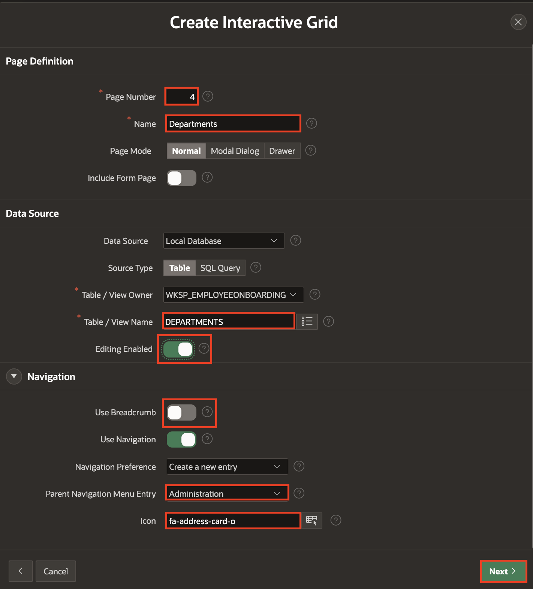
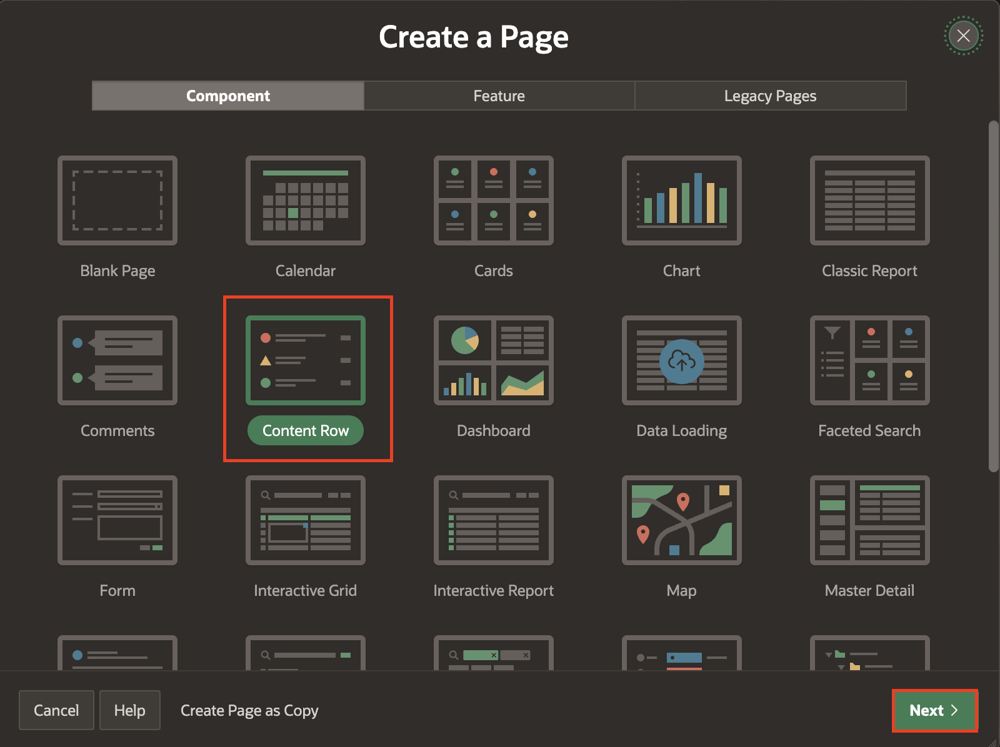
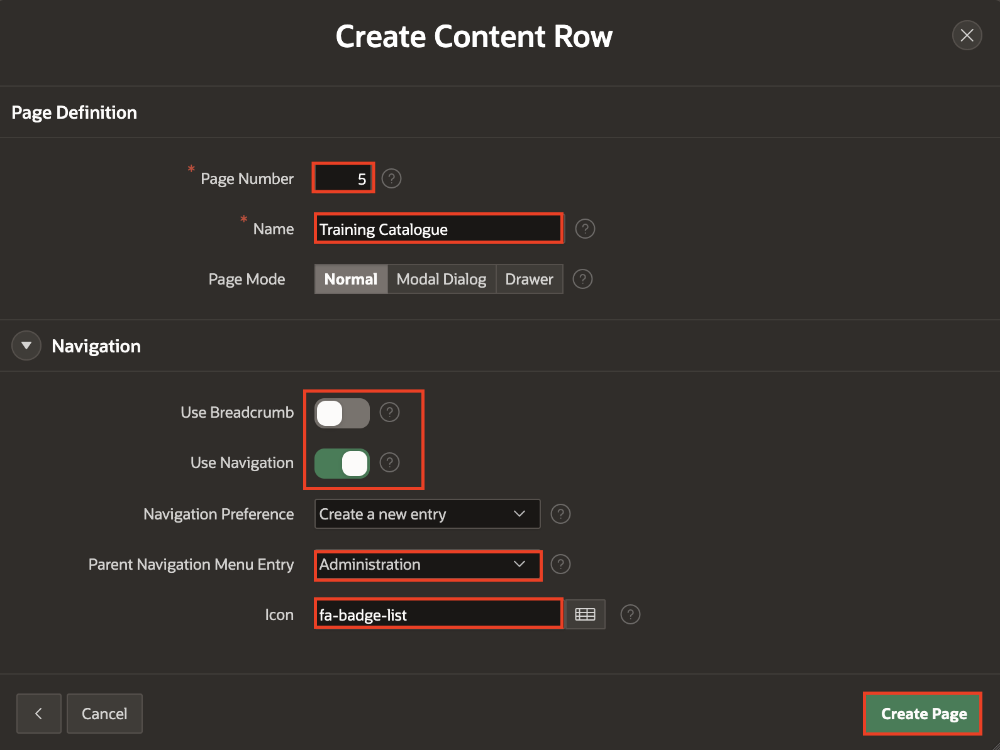
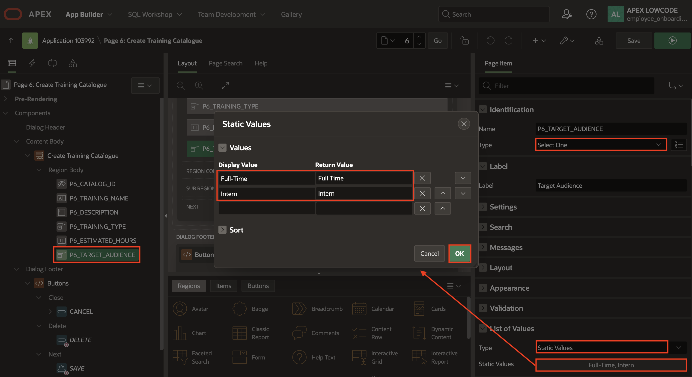

# Create an Employee Onboarding Application with Admin Pages and Email Template

## Introduction

In this lab, you will create an Employee Onboarding Application using Oracle APEX. You will build administration pages to manage key onboarding data, including Employees, Departments, and the Training Catalog. You will also organize these pages under a common Administration menu and create a customized Email Template to support the onboarding communication process.

Estimated Lab Time: 15 minutes

### Objectives

In this lab, you will:

* Create the Employee Onboarding Application

* Add a Navigation Entry for the Administration page

* Build Administration Pages for Employees, Departments, and the Training Catalog

* Create an Email Template for the onboarding process

## Task 1: Create Employee Onboarding Application

In this task you will create an application.

1. Click **App Builder**.

    
2. In the App Builder home page, click **Create** to create an application.

    
3. In the Create Application Wizard, enter Name as **Employee Onboarding Application** and click **Create Application**.

    

4. The application is now created. This is the Application Home page.

  

## Task 2: Create a Navigation Entry

In this task, you will create a navigation entry for an **Administrion** page.

1. Click **Shared Components**.

    

2. Under **Navigation and Search**, select **Navigation Menu**.

    

3. Click **Navigation Menu**.

    

4. Under **List Enteries**, select **Create List Entry**.

    

5. Enter/Select the following:

    - Under Entry

        - Image/Class: **fa-database-user**
        - List Entry Label: **Administration**

    - Target > Target Type: **- No Target -**

    Click **Create List Entry**.

    

6. Click on the **Application ID** to go back to the Application Home page.

    

## Task 3: Create Admin Pages - Employee, Departments & Training Catalogue

In this task, you will build the administrative setup pages that will allow HR and administrators to input and manage core data for the onboarding application. These pages will serve as the backbone for the workflows you design, ensuring that employee, department, and training details are properly maintained.

1. In the Application Home page, click **Create Page**

    

2. In the create page wizard, select **Interactive Report** and click **Next**.

    

3. Enter/select the following:

    - Under Page Definition:

        - Page Number: **2**
        - Name: **Employees**
        - Include Form page: **Toggle ON**
        - Form Page Name: **Create/Edit Employee**
        - Form Page Mode: **Drawer**

    - Under Data Source:

        - Table/View Name: **EMPLOYEES**

    - Under Navigation:

        - Use Breadcrumb: **Toggle OFF**
        - Parent Navigation Menu Entry: **Administration**
        - Icon: **fa-users**

    Click **Next**.

    

4. Select Primary Key Column 1: **EMPLOYEE_ID (Number)** and click **Create Page**.

    

5. Your Employee page is now created. In page designer, on the top right, click the **+** icon to create a page and select **Page**.

    

6. In the Create a Page wizard, select **Interactive Grid** and click **Next**.

    

7. Enter/select the following:

    - Under Page Definition:

        - Page Number: **4**
        - Name: **Departments**

    - Under Data Source:

        - Table/View Name: **DEPARTMENTS**
        - Editing Enabled: **Toggle ON**

    - Under Navigation:

        - Use Breadcrumb: **Toggle OFF**
        - Parent Navigation Menu Entry: **Administration**
        - Icon: **fa-address-card-o**

    Click **Next**.

    

8. Select Primary Key Column 1: **DEPARTMENT_ID (Number)** and click **Create Page**.

    

9. Your Department page is now created. In page designer, on the top right, click the **+** icon and select **Page**.

    

10. In the Create a Page wizard, select **Content Row** and click **Next**.

    

11. In the Page wizard, enter/select the following:

    - Under Page Definition:

        - Page Number: **5**
        - Name: **Training Catalogue**

    - Under Navigation:

        - Use Breadcrumb: **Toggle OFF**
        - Use Navigation: **Toggle ON**
        - Parent Navigation Menu Entry: **Administration**
        - Icon: **fa-badge-list**

    Click **Create Page**.

    

12. In the rendering tree, select **Training Catalogue** region and enter/select the following in the property editor:

    - Under Source:

        - SQL Query: Modify/Replace SQL query with below sql query

          ```
          <copy>
          select * from TRAINING_CATALOG
          </copy>
          ```

    - Under Appearance:

        - Template: **Standard**

    

    

13. In the **Attributes** tab, enter the following:

    - Under Settings:

        - Overline: **&TARGET_AUDIENCE.**
        - Title: **&TRAINING_NAME.**
        - Description: **&DESCRIPTION.**
        - Miscellaneous: **Estimated Time: &ESTIMATED_HOURS. hours**

    

14. Click **Save** to save the page.

    

15. Now let's create a form page to input the training calatogues. Click the **+ icon** on the top right corner and select **Page**.

    

16. In the create a page wizard, select **Form**.

    

17. Enter/select the following in the page wizard:

    - Under page Definition:

        - Page Number: **6**
        - Name: **Create/Edit Training Catalogue**
        - Page Mode: **Drawer**

    - Under Data Source:

        - Table/View Name: **TRAINING_CATALOG**

    Click **Next**.

    

18. Select Primary Key Column 1: **CATALOG_ID (Number)** and click **Create Page**.

    

19. In the rendering tree, select **P6\_TRAINING\_TYPE** and enter/select the following in the property editor:

    - Identification > Type: **Select One**

    - Under List of Values:

        - Type: **Static Values**
        - Static Values: enter the following values in the modal form

            | Display Value | Return Value |
            | -----------| -----------|
            | Virtual | Virtual |
            | Classroom | Classroom |
            {: title="List of Values to be added for Training Type"}

        Click **Ok**.

    

20. Similarly, in the rendering tree, select **P6\_TARGET\_AUDIENCE** and enter/select the following in the property editor:

    - Identification > Type: **Select One**

    - Under List of Values:

        - Type: **Static Values**
        - Static Values: enter the following values in the modal form

            | Display Value | Return Value |
            | -----------| -----------|
            | Full-Time | Full Time |
            | Intern | Intern |
            {: title="List of Values to be added for Target Audience"}

        Click **Ok**.

    

21. In the rendering tree, use **Control + Click** to select multiple items : **P6\_TRAINING\_NAME**, **P6\_TRAINING\_TYPE**, **P6\_ESTIMATED\_HOURS** and **P6\_TARGET\_AUDIENCE** and in the property editor enter/select the following:

    - Appearance >  Template: **Required - Floating**

    - Validation > Value Required: **Toggle ON**

    

22. Click **Save**.

    

    Now that you have your form page ready, let us link the Training Catalogue Page to the form page.

23. Click on the **Page Finder Icon** and select the **Training Catalogue** Page.

    

24. In the rendering tree, under **Training Catalogue** region, right click on **Actions** and select **Create Action**.

    

25. In the property editor, enter/select the following:

    - Under Identification:

        - Position: **Primary Actions**
        - Template: **Button**
        - Label: **Edit**

    - Under Link:

        - Target :
            -  Page: **6**
            - Set Items:

                | Name  | Value |
                | -----------| -----------|
                | P6\_CATALOG\_ID | &CATALOG_ID. |
                {: title="List of Values to be added for Edit Button"}

          Click **Ok**.

    

26. In the rendering tree, right click on **Training Catalogue** region and select **Create Button**.

    

27. In the property editor, enter/select the following:

	- Under Identification:

        - Button Name: **Create**
        - Label: **Create Training**

    - Under Layout:

        - Slot: **Above Region [Legacy]**

    - Under Behavior:

        - Action: **Redirect to Page in this Application**
        - Target > Page: **6** and click **Ok**.

    

28. Navigate to the **Dynamic Actions** tab, right click on **Dialog Closed** and select **Create Dynamic Action**.

    

29. Select the newly created action, and enter/select the following in the propery editor:

    - Identification > Name: **Dialog Close**

    - Under When:

        - Selection Type: **JavaScript Expression**
        - JavaScript Expression: **document**

    

30. Under the **Dialog Close** Event, select **Refresh**, and in the propery editor, set Affected Elements > Region: **Training Catalogue**.

    

31. Click **Save**.

    

## Task 4: Create Email Template

1. Click on the **Shared Components** icon to navigate to shared Components.

    

2. Under **User Interface**, select **Email Templates**.

    

3. Click **Create Email Template**.

    

4. Enter the following in the Template Details and click **Create Email Template**.

    - Under Identification:

        - Template Name: **Onboarding Email**
        - Email Subject: **Welcome to Acme Corp! Here’s Everything You Need to Get Started**

    - Under HTML Format:

        - Header: copy and paste the below code

            ```
            <copy>
            <b style="font-size: 24px;">Employee Onboarding</b>
            </copy>
            ```

        - Body: copy and paste the below code

          ```
           <copy>
           <strong>Hello #FIRST_NAME#,</strong><br><br>

            Welcome to <strong>ACME Corp</strong>! We are thrilled to have you join our team. Below are the details you will need to get started on Day One.<br><br>

            <strong>📅 Joining Information</strong><br><br>
            <br>

            <strong>🗂️ Documents Required</strong><br><br>
            Please make sure to have the following documents ready:<br><br>

            <ul>
              <li>Government-issued photo ID</li>
              <li>Educational certificates</li>
              <li>PAN Card / Tax ID</li>
              <li>Signed offer letter</li>
            </ul>

            If you're joining remotely, these can be uploaded via the <a href="https://acmecorp.com/onboarding/employee_portal">Employee Portal</a>.<br><br>

            <strong>❓ FAQs & Support</strong><br><br>

            <ul>
              <li><a href="https://acmecorp.com/onboarding/faqs">New Hire FAQs</a></li>
              <li>HR Contact: <strong>Sana Mehta</strong> – <a href="mailto:hr@acmecorp.com">hr@acmecorp.com</a> / +91-98765-43210</li>
            </ul>
            <br>

            <strong> Employee Portal Access</strong><br><br>

            Everything you need—from training modules to onboarding tasks—is available on our Employee Portal.<br><br>

            <br><br>

            Your login credentials will be sent to you via a secure channel shortly.<br><br>

            If you have any questions before your start date, feel free to get in touch. We’re here to help and can’t wait to see you on your first day!<br><br>

            Welcome aboard, <strong>#FIRST_NAME#</strong>!<br><br>

            —<br>
            <strong>#HR_NAME#</strong><br>
            HR Onboarding Coordinator<br>
            ACME Corp<br>
            +91-12345-67890 | <a href="mailto:onboarding@acmecorp.com">onboarding@acmecorp.com</a>

           </copy>
          ```

    

## Summary

In this task, you learned how to build administration pages to create and manage Employees, Departments, and Training Catalogs. You also added a navigation entry for the main Administration page. Additionally, you created an email template for the Onboarding process.

## Acknowledgements

- **Author** - Roopesh Thokala, Senior Product Manager; Sahaana Manavalan, Senior Product Manager, August 2025
- **Last Updated By/Date** - Sahaana Manavalan, Senior Product Manager, August 2025
