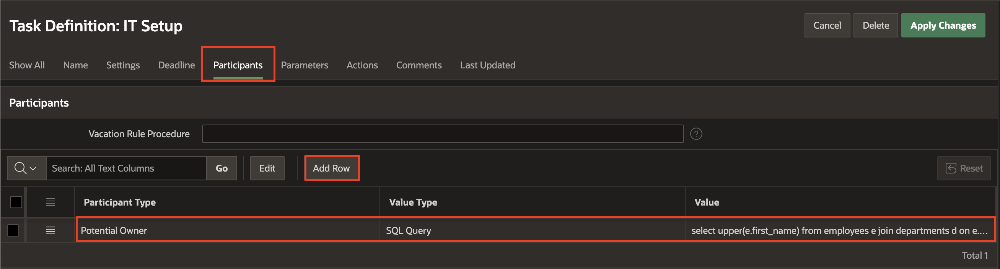
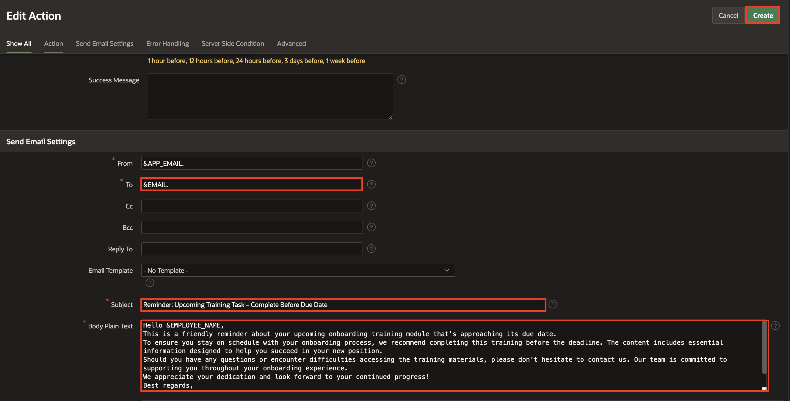

# Create Task Definitions for Employee Onboarding Workflow

## Introduction

In this lab, you will define key Tasks using Oracle APEX’s Tasks Component to support the Employee Onboarding process. These tasks will automate and manage essential actions such as IT setup and training allocation for new employees. You'll configure task details, assign participants dynamically using SQL, define task parameters, and set up automated email reminders based on deadlines.

These task definitions will later be integrated into a complete onboarding workflow.

Estimated Time: 10 minutes

### Objectives

In this lab, you will:

* Create a task definition for IT Setup with participant assignment and employee specific actions

* Define a task for Training Allocation with dynamic data source and reminder email setup

* Add participants and parameters for each task

* Configure task deadlines, renewal policies, and notification actions

### Prerequisites

* All previous labs successfully completed

## Task 1: Create Task Definitions for IT Setup

In this task, you will create a task definition for IT Setup and assign it to the IT staff.

1. Click **Shared Components**.

    

2. Under Workflows and Automations, select **Task Definitions**.

    

3. Click **Create**.

    

4. In the Create Task Definition wizard, enter/select the following:

    - Name: **IT Setup**
    - Type: **Action Task**
    - Subject: **IT Setup Tasks for &EMPLOYEE_NAME.**
    - Priority: **2-High**

    Click **Create**.

    

5. Under **Settings** notice that the Task Details Page Number is empty. Click **Create Task Details Page** button to generate the details page for this task.

   You get a popup dialog asking if the next available page number should be used. Click **OK**.

    

    

6. In the Task Definitions page, select **IT Setup**.

    

7. Under **Settings**, enter/select the following:

    - Actions Source: **SQL Query**
    - Actions SQL Query: Copy and paste the below SQL Query:
        ```
         <copy>
         Select * from EMPLOYEES WHERE EMPLOYEE_ID = :APEX$TASK_PK;
         </copy>
        ```

    

    This step ties our task to the system of records, in this case, the employee's records.

    > **Note:** _APEX$TASK\_PK is a substitution string holding the primary key value of the system of records (in this case, the employee's number)._

8. Navigate to **Participants** tab, and click **Add Row**. Enter/select the following details:

    - Participant Type: **Potential Owner**

    - Value Type: **SQL Query**

    - Value: Copy and paste the below code
        ```
         <copy>
         select upper(e.first_name)
         from employees   e
         join departments d
         on e.department_id = d.department_id
         where d.name = 'IT';
         </copy>
        ```

    

9. Navigate to **Parameters** tab, and add the below Parameters by clicking **Add Row**.

    | Static ID     |   Label    |
    |--------------------|------------|
    | DEPARTMENT   | Department |
    | EMAIL       | Email |
    | EMPLOYEE_ID       | Employee ID |
    | EMPLOYEE_NAME     | Employee Name  |
    {: title="List of Parameters to be added for the Task Definition"}

    

10. Click **Apply Changes**.

## Task 2: Create Task Definitions to Allocate Trainings

1. In the Task Definitions page, click **Create**.

    

2. In the **Create Task Definition** dialog, enter/select the following details:

    - Name: **Allocate Trainings**

    - Type: **Action Task**

    - Subject: **Allocate Trainings for &EMPLOYEE_NAME.**

    Click **Create**.

    

3. Under **Settings**, notice that the Task Details Page Number is empty. Click **Create Task Details Page**  to generate the details page for this task.

   You get a popup dialog asking if the next available page number should be used. Click **OK**.

    

    

4. Select **Allocate Trainings** to open the task definition in edit mode and enter/select the following:

    - Under Settings:

        - Actions Source: **SQL query**

        - Actions SQL Query: Provide the following SQL statement:
            ```
             <copy>
             select * from EMPLOYEE_TRAININGS where EMPLOYEE_ID = :APEX$TASK_PK;
            </copy>
            ```

    

    

    > **Note:** _APEX$TASK\_PK is a substitution string holding the primary key value of the system of records (in this case, the employee's id)._

5. Now, navigate to **Participants** tab, click **Add Row** and enter/select the following:

    - Participant Type: **Potential Owner**

    - Value Type: **SQL Query**

    - Value: Copy and paste the below code:
  
        ```
         <copy>
         select upper(first_name) from employees  where employee_id = :APEX$TASK_PK;
         </copy>
        ```


    

6. Navigate to **Parameters** tab. Add the below Parameters by clicking **Add Row**.

    | Static ID     | Label |
    |---------------|---------|
    | EMAIL        | Email  |
    | EMPLOYEE\_NAME               | Employee Name |
    {: title="List of Task Parameters to be added"}

    

7. Navigate to **Deadline** tab. Enter/select the following:

    - Due On Type: **Interval**
    - Due On Interval: **P2D**
    - Expiration Policy: **Renew**
    - Maximum Renewal Count: **3**

    

8. Click **Apply Changes**.

9. Select **Allocate Trainings** to open the task definition in edit mode.

   

10. Navigate to the **Actions** tab, and click **Add Action**.

   

11. Enter/Select the following in the Edit Action page:

    - Under Action:
        - Name: **Send Email**
        - Type: **Send E-Mail**
        - On Event: **Before Expire**
        - Before Expire Interval: **PT1H**

    - Under Send Email Settings:

        - To: **&EMAIL.**
        - Subject: **Reminder: Upcoming Training Task – Complete Before Due Date**
        - Body Plain Text: copy and paste the following:

            ```
             <copy>
             Hi &EMPLOYEE_NAME.,

             This is a friendly reminder about your upcoming onboarding training module that's approaching its due date.
             To ensure you stay on schedule with your onboarding process, we recommend completing this training before the deadline. The content includes essential information designed to help you succeed in your new position.

             Should you have any questions or encounter difficulties accessing the training materials, please don't hesitate to contact us. Our team is committed to supporting you throughout your onboarding experience.
             We appreciate your dedication and look forward to your continued progress!

             Best regards,
             HR Team,
             ACME Corporation.
             </copy>
            ```

    Click **Create**.

    

    

12. Click **Apply Changes**.

    

## Summary

You have successfully created Human Task definitions for the Employee Onboarding Workflow using the Approvals Component. In the next section, we will integrate these tasks into the workflow to complete the design process.

## Acknowledgements

- **Author** - Sahaana Manavalan, Senior Product Manager; Roopesh Thokala, Senior Product Manager, August 2025
- **Last Updated By/Date** - Sahaana Manavalan, Senior Product Manager, August 2025
