# Build Employment Type-Based Workflows in Oracle APEX

## Introduction

In this lab, you will create an **Employment Type** Workflow to automate employee training assignments. The workflow will decide the training path based on whether the employee is **Full Time** or an **Intern**, and send follow up emails. You will learn how to set up workflow parameters, variables, activities, and connections to build a complete workflow process.

### Objectives

In this lab, you learn how to:

- Create and configure a new workflow in Oracle APEX

- Define workflow parameters and variables

- Add conditional logic to handle different employment types

- Invoke backend procedures for training assignment

- Create human tasks for training allocation and email notifications

- Connect all workflow activities to ensure a complete onboarding flow

Estimated Time: 20 minutes

### Prerequisites

- All the previous Labs have been completed.

## Task 1: Create the Workflow

To create a Workflow:

1. Navigate to **Shared Components**.

   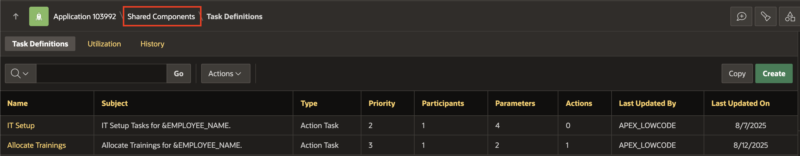

2. Under **Workflows and Automations**, select **Workflows**.

   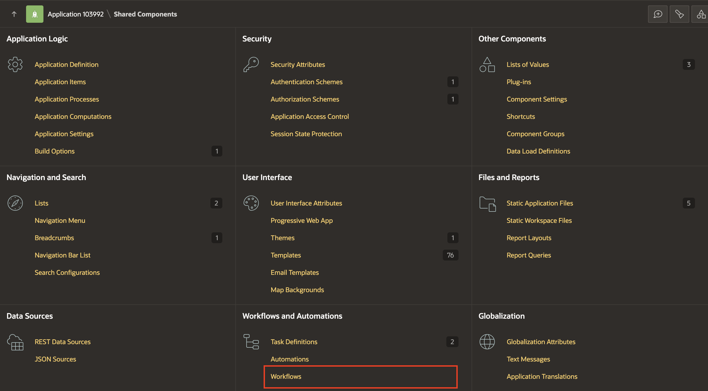

3. In the Workflows Page, click **Create**.

   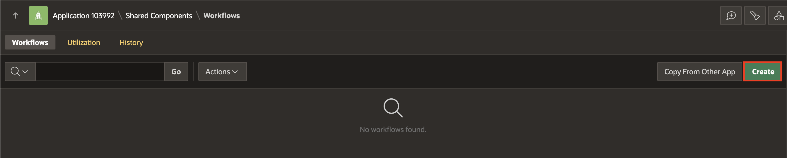

4. This will lead you to the Workflow Designer. A new workflow with a Start Activity, Execute Code Activity, and End Activity will be auto-created.

    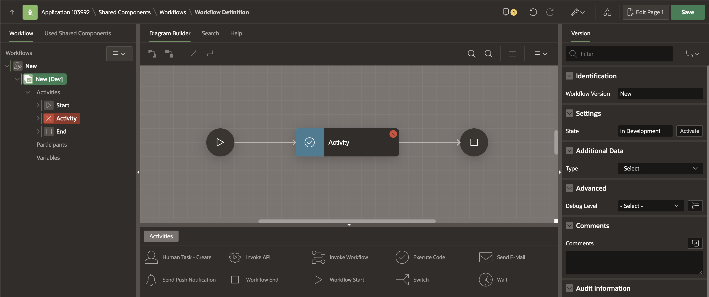

## Task 2: Modify Workflow Details

1. Select New in the Rendering tab, in the Property Editor, enter/select the following:

    - Under Identification:
        - Name: **Employment Type Workflow**
        - Title: **Employment Type Workflow**

    - Under Advanced:
        - Static ID: **Employment_Type_Workflow**


    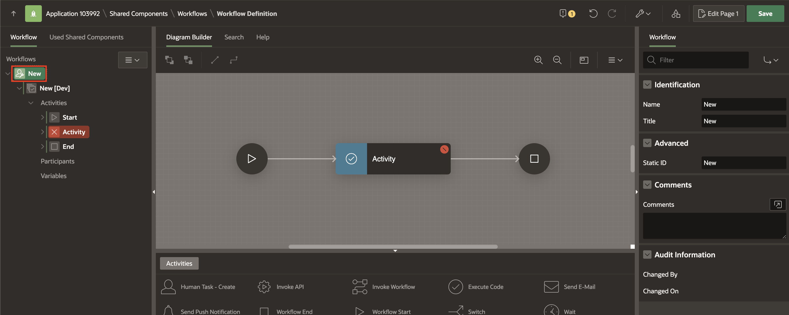

    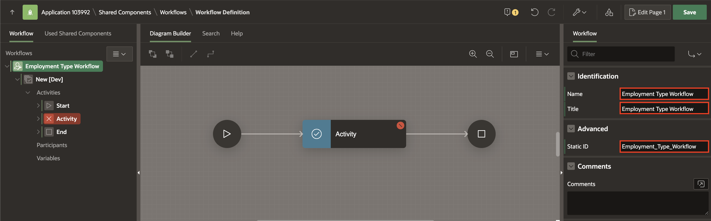

2. In the left pane, select **New[Dev]** and in the property editor, for Workflow Version enter **1.0**.

    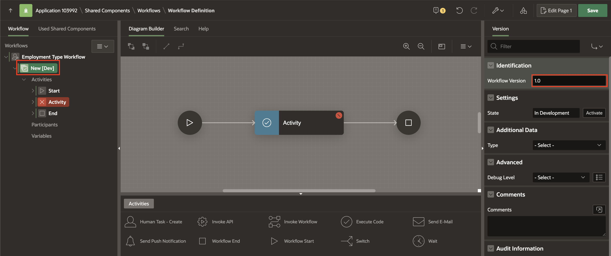

    > **Note:** _You may have noticed the label [Dev] next to the version in the tree on the left pane. This means that this version of the Workflow is In Development and all parts of it are editable. We will learn about workflow versioning- Active vs. In Development versions in future labs in this workshop._

4. At this point, we will remove this activity since we plan to introduce new specific activities in subsequent sections of this lab. To do this, either right-click on the highlighted RED activity in the Workflow tree and select **Delete**, or click the three dots at the bottom right corner of the activity in the Diagram. This will open a menu, and choose **Delete** from the options provided.

   

   

5. Navigate to **Start**. Under **Outgoing**, select **New** and select the following:

    - Activity > To: **End**

   

6. Click **Save**.

## Task 3: Add Inputs for Employment Type Workflow

In this lab, you explore various aspects of workflow data using the example of a doctor appointment application that you are building. You will focus on understanding parameters, variables, activity variables, and additional data.

Referring to the flow chart in Lab 1, illustrating the business logic, the appointment booking process initiates with the Hospital Staff submitting patient details to the system, marking the commencement of the workflow.

The inputs to the workflow will be the patient details. In workflow terminology, these are called **Workflow Parameters**.

You will define the following parameters for the Calculate fees Workflow:
   BOOKING\_ID,
   DNO,
   PATIENT\_NAME, PATIENT\_EMAIL, REQUEST\_DATE, STATUS

1. To create Workflow Parameters, right-click **Employment Type Workflow** Workflow and select **Create Parameter**.

   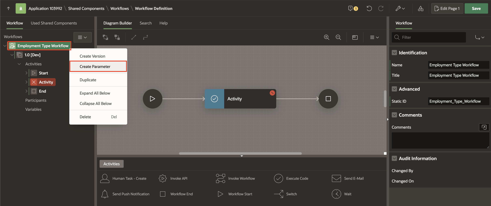

2. This adds a Parameter with a label "New" in the Workflow tree. In the Property Editor, enter/select the following:

    - Static ID: **EMAIL**

    - Label: **Email**

    - Data Type: **VARCHAR2**

   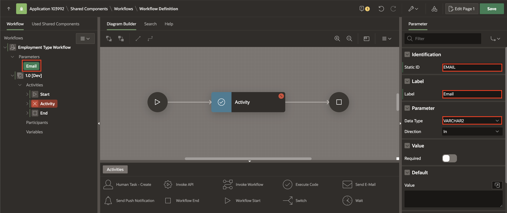

3. Similarly, add the following **Parameters** one after the other, given in the table below.

  |Static ID | Label | Data Type | Value Required| Direction |
  |----------|-------|------------|---|----------|
  | EMPLOYEE_ID | Employee ID | VARCHAR2 | Yes | In   |
  | EMPLOYEE_NAME | Employee Name | VARCHAR2 |  No  | In  |
  | EMPLOYMENT_TYPE | Employment Type | VARCHAR2 | Yes | In  |

  {: title="List of Parameters to be Created"}

    

## Task 4: Add Workflow Variables

The inputs provided to the Appointment Workflow are read-only in nature. This means that, once the workflow is submitted, their values will never be modified. The workflow needs to process and pass data from one activity to the next.

As an example, consider the following business scenario:

Before an appointment is confirmed, the workflow needs to compute the doctor's availability based on his/her current appointment schedule. So, availability of the doctor is a variable that will be determined based on this computation.

When an appointment is confirmed, the Booking ID for the appointment is carried forward to later activities which calculate and update the appointment fees.

Data such as Availability, Booking ID and Fee need to be updatable by the activities of the workflow as part of the execution. Such data is defined as **Workflow Variables**.

1. Right-click **1.0 [DEV]** (workflow version), select **Create Variable**.

    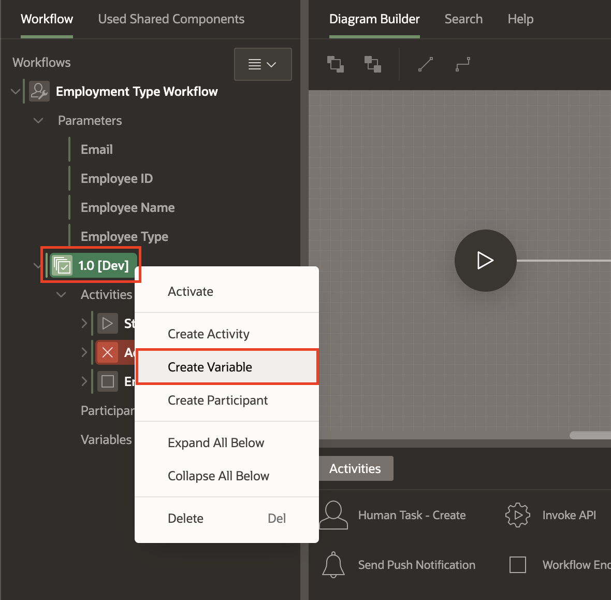

2. A new variable with Name **New** gets created in the tree. In the Property Editor, enter/select the following:

    - Identification > Static ID: **APPROVER**

    - Label > Label: **Approver**

   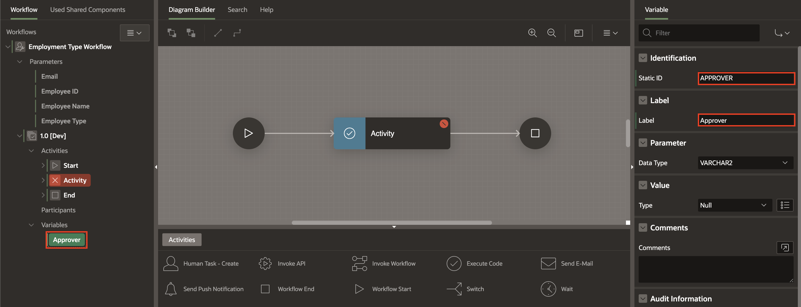

3. Similarly, create a variable **Task Outcome**. In the Property Editor, Enter/Select the following:

    - Identification > Static ID: **TASK_OUTCOME**

    - Label > Label: **Task Outcome**

   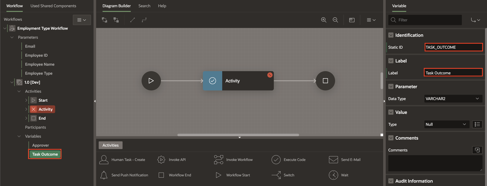

## Task 5: Add Workflow Activity for Full Time Employees

1. In the Workflow Designer, under 1.0[Dev], click on Activity and enter/select the following in the property editor:

    - Identification > Type: **Switch**
    - Switch > Type: **Check Workflow**
    - Compare >  Compare Variable: **EMPLOYEMENT_TYPE**

   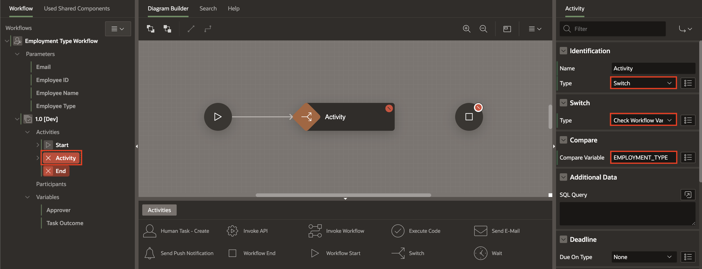

2. Now from the Activities Palette, drag a **Invoke API** Activity into the Diagram Builder area and drop it on the connection joining the Activity.

   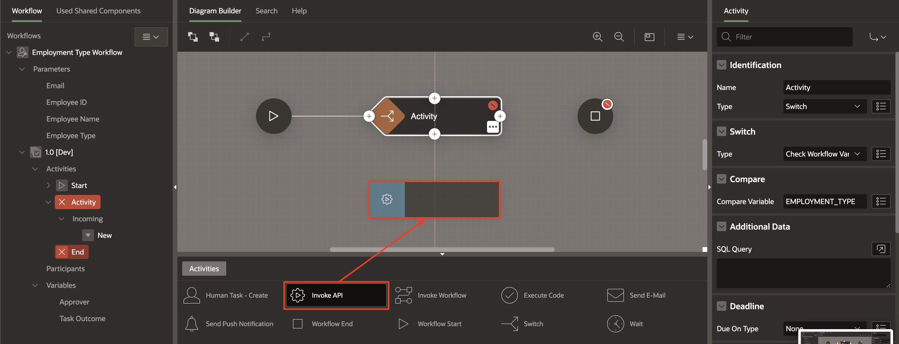

3. In the Property Editor, enter/select the following:

    - Identification > Name: **Trainings for Full-Time Employee**

    - Under Settings:
        - Type: **PL/SQK Procedure or Function**
        - Procedure or Function: **ASSIGN_EMPLOYEE_TRAININGS**

   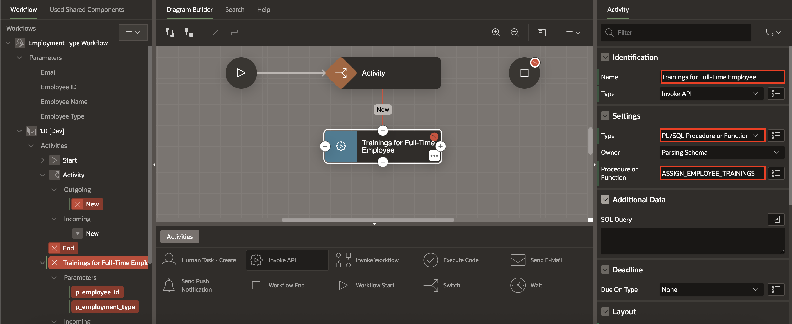

4. Click on the connection between Activity and Training for Full-Time, and enter/select the following in the property editor:

    - Indentification > Name: **Full Time**

    - Under Condition:
        - Operator: **Is Equal To**
        - Value: **Full Time**

   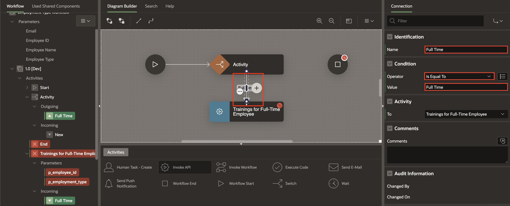

5. Notice in the rendering tree, there are some fields marked in Red. This activity has two Parameters, highlighted in RED to show that they are required.

6. Under **Trainings for Full-Time Employee** and select **p_employee_id** parameter. In the Property Editor, enter/select the following:

    - Value > Item : **EMPLOYEE_ID**

   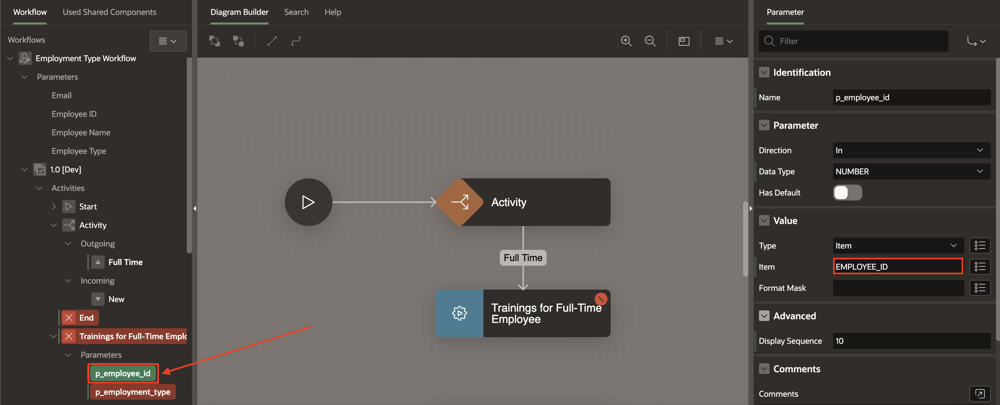

7. Similarly, select **p_employee_type** parameter.In the Property Editor, enter/select the following:

    - Value > Item : **EMPLOYEE_TYPE**

   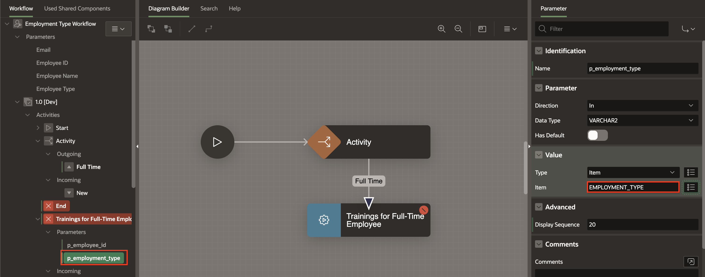

## Task 6: Create Activity for Interns

1. Similarly, Create another Activity for Intern as the Employment type. From the Activities palette, drag a **Invoke API** Activity into the Diagram Builder area and drop it on the connection joining the Activity. In the Property Editor, enter/select the following:

    - Identification > Name: **Trainings for Intern**

    - Under Settings:
        - Type: **PL/SQK Procedure or Function**
        - Procedure or Function: **ASSIGN_EMPLOYEE_TRAININGS**

   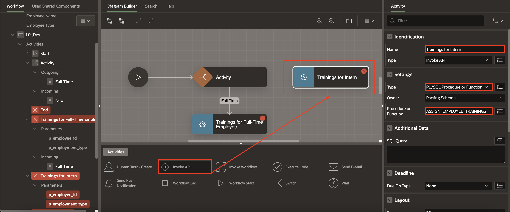

2. Click on the connection between Activity and Training for Intern, and enter/select the following in the property editor:

    - Indentification > Name: **Intern**

    - Under Condition:
        - Operator: **Is Equal To**
        - Value: **Intern**

   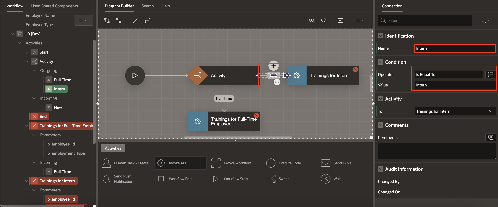

3. Under **Trainings for Intern** and select **p_employee_id** parameter. In the Property Editor, enter/select the following:

    - Value > Item : **EMPLOYEE_ID**

   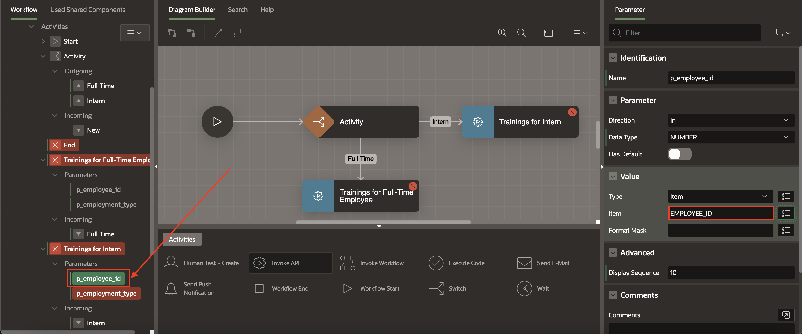

4. Similarly, select **p_employee_type** parameter.In the Property Editor, enter/select the following:

    - Value > Item : **EMPLOYEE_TYPE**

   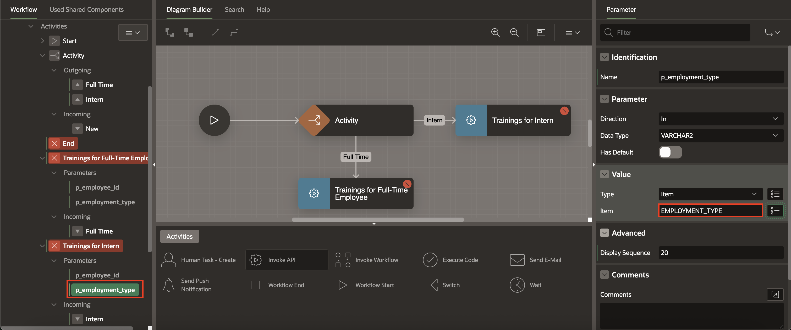

## Task 6: Create Activity to Assign Trainings

1. From the Activities palette, drag a **Human Task - Create** Activity into the Diagram Builder area and drop it below the **Trainings for Full-Time Employee** activity.

   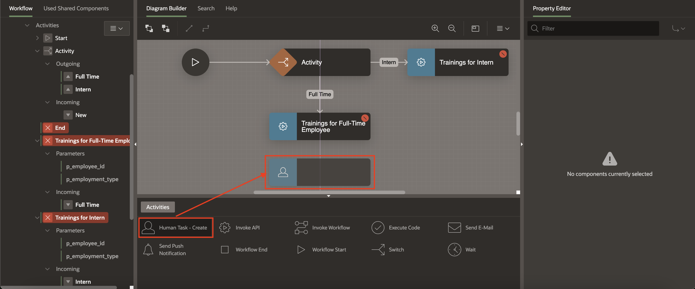

2. In the Property Editor, enter/select the following:

    - Identification > Name: **Assign Trainings**

    - Under Settings:
        - Definition: **Allocate Trainings**
        - Details Primary Key Item: **EMPLOYEE_ID**

   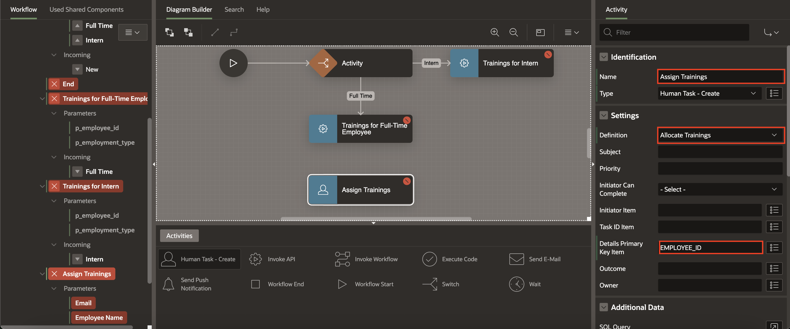

3. Under the parameters tab, select Email and select the following in the property editor:

    - Under Value:
        - Type: **Item**
        - Item: **EMAIL**

   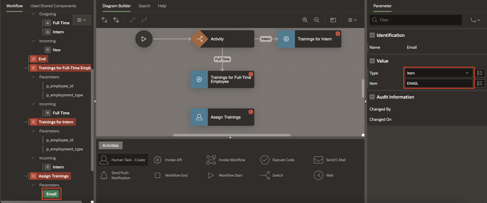

4. Similarly, select **Employee Name** and select the following in the property editor:

    - Under Value:
        - Type: **Item**
        - Item: **EMPLOYEE_NAME**

   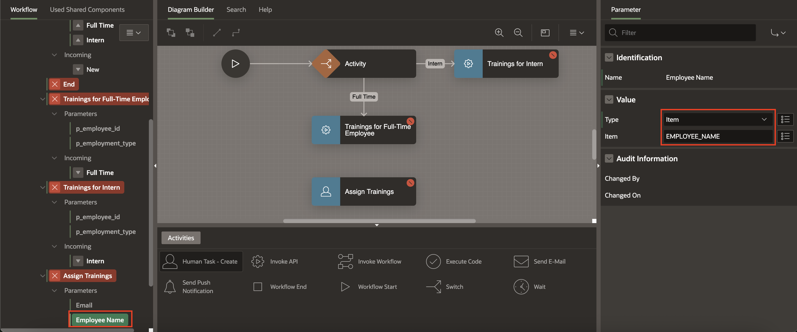

## Task 7: Create Activity to send Training Completion Email

1. From the Activities palette, drag a **Human Task - Create** Activity into the Diagram Builder area and drop it below the **Assign Trainings** activity.

   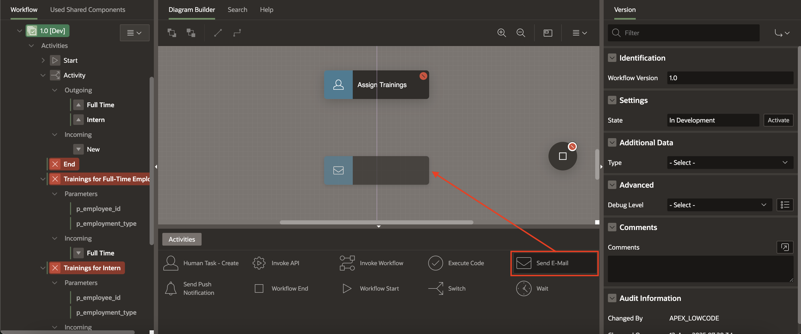

2. In the Property Editor, enter/select the following:

    - Identification > Name: **Training Completion Email**

    - Under Settings:
        - To: **&EMAIL.**
        - Subject: **You’ve Completed Your Trainings – You are All Set, &EMPLOYEE_NAME.!**
        - Body Plain Text: copy and paste the below text

            ```
             <copy>
             Hi &EMPLOYEE_NAME.,
             Congratulations! You have successfully completed all your required trainings as part of the employee onboarding workflow!

             We are excited to officially welcome you aboard and appreciate the time and effort you have put into learning our systems, policies, and culture. With your trainings now complete, you're all set to dive into your role with confidence.

             If you have any questions, need additional resources, or want to revisit any part of the training, don't hesitate to reach out. We're here to support your growth and success every step of the way.

             Welcome again! we are glad to have you on the team!

             Best regards,
             HR Team,
             ACME Corporation.
             <copy>
            ```

   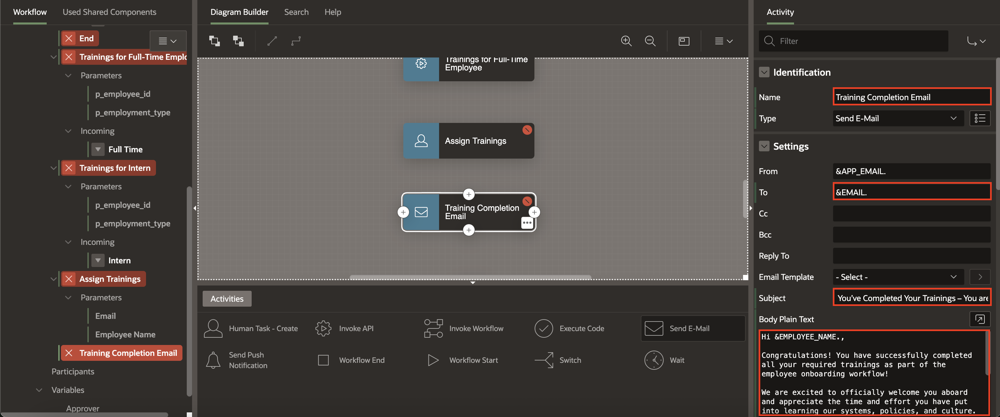

## Task 8: Draw connections between Activities

1. Draw Connections from **Trainings for Full-Time Employee** to **Assign Trainings** and **Trainings for Intern** to **Assign Trainings** activity.

   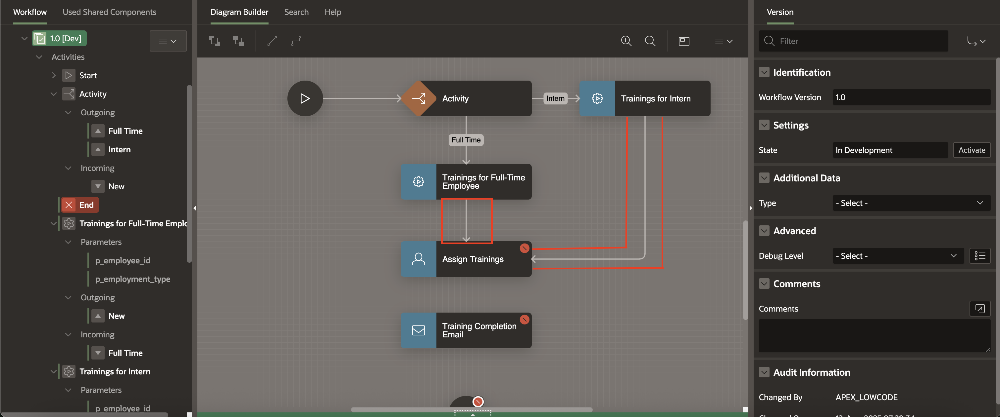

2. Similarly, draw connections from **Assign Trainings** to **Training Completion Email**.

   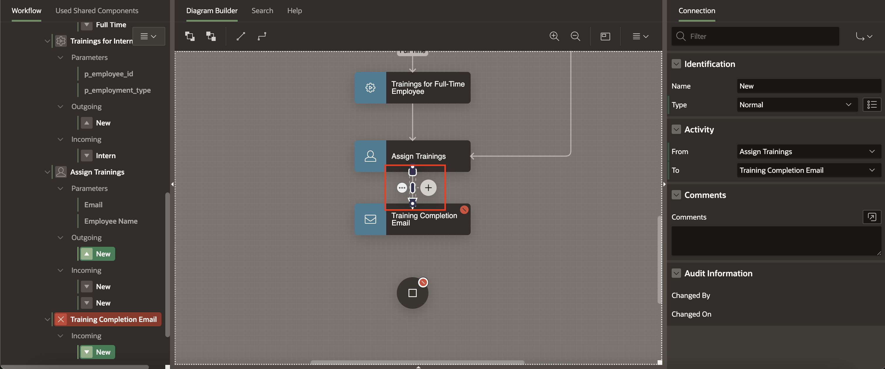

3. Finally, draw a connection from **Training Completion Email** to **End** activity to eliminate the Workflow Model's validation errors.

   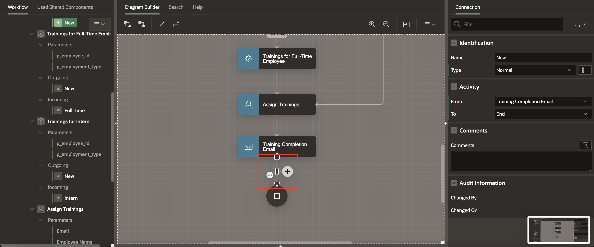

4. Click **Save**.

    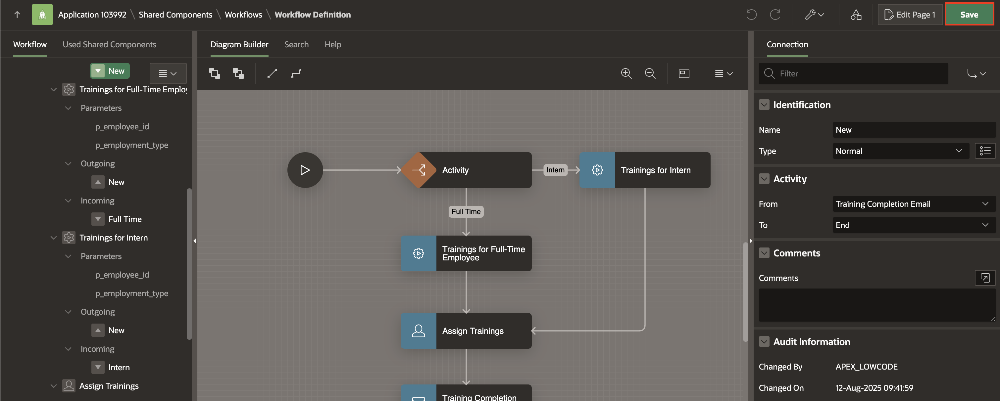

## Summary

In this lab, you created a workflow in Oracle APEX that assigns onboarding tasks based on the employee’s employment type (Full-Time or Intern). You defined workflow parameters and variables, added automated activities to assign trainings, and configured human tasks and notifications to guide the onboarding process.

## What's Next

In the next lab, you will learn how to create a Employee Onboarding Workflow using Oracle APEX.

You may now **proceed to the next lab**.

## Acknowledgements

- **Author** - Roopesh Thokala, Senior Product Manager; Sahaana Manavalan, Senior Product Manager, August 2025
- **Last Updated By/Date** - Sahaana Manavalan, Senior Product Manager, August 2025
