## Introduction

In this lab, you will create a **Calculate Fees** Workflow to manage fee calculations. You will then integrate it into the **Doctor Appointment** Workflow using the **Invoke Workflow** activity. Invoke Workflow activity allows you to call and execute one workflow from within a parent workflow, enabling seamless integration between workflows.

### Objectives

In this lab, you learn how to:

- Create a Calculate Fees Workflow.

- Modify the Calculate Fees Workflow details.

- Add Calculate Fees Workflow Variables

Estimated Time: 20 minutes

### Prerequisites

- All the previous Labs have been completed.

## Task 1: Create the Workflow

To create a Workflow:

1. Navigate to **Workflow**.

   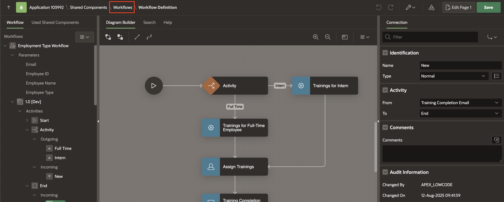

2. In the Workflows Page, click **Create**.

   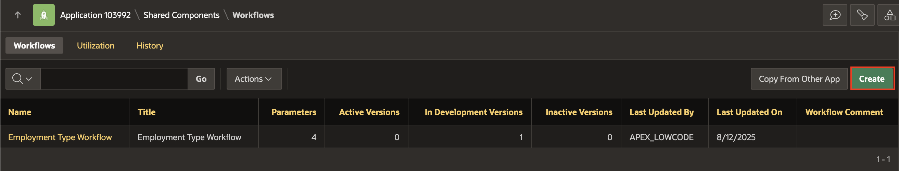

4. This will lead you to the Workflow Designer. A new workflow with a Start Activity, Execute Code Activity, and End Activity will be auto-created.

    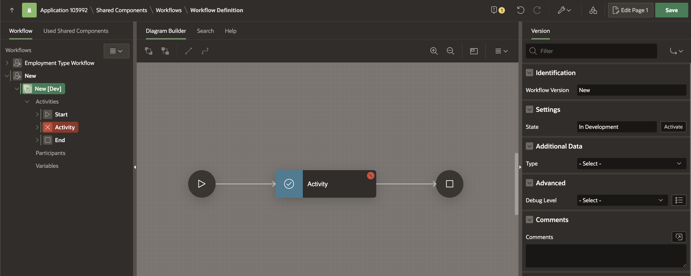

## Task 2: Modify Workflow Details

1. Select New in the Rendering tab, in the Property Editor, enter/select the following:

    - Under Identification:
        - Name: **Employee Onboarding**
        - Title: **Employee Onboarding**

    - Under Advanced:
        - Static ID: **EMPLOYEE_ONBOARDING**


    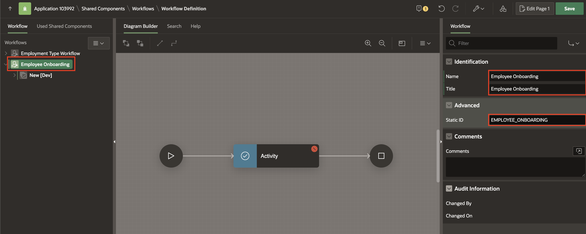

2. In the left pane, select **New[Dev]** and in the property editor, for Workflow Version enter **1.0**.

    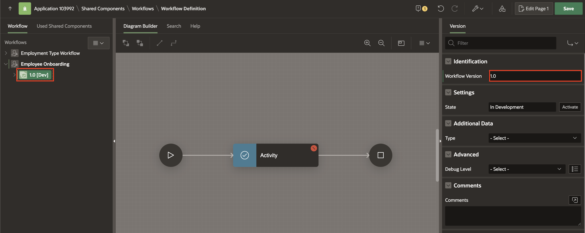

3. At this point, we will remove this activity since we plan to introduce new specific activities in subsequent sections of this lab. To do this, either right-click on the highlighted RED activity in the Workflow tree and select **Delete**, or click the three dots at the bottom right corner of the activity in the Diagram. This will open a menu, and choose **Delete** from the options provided.

   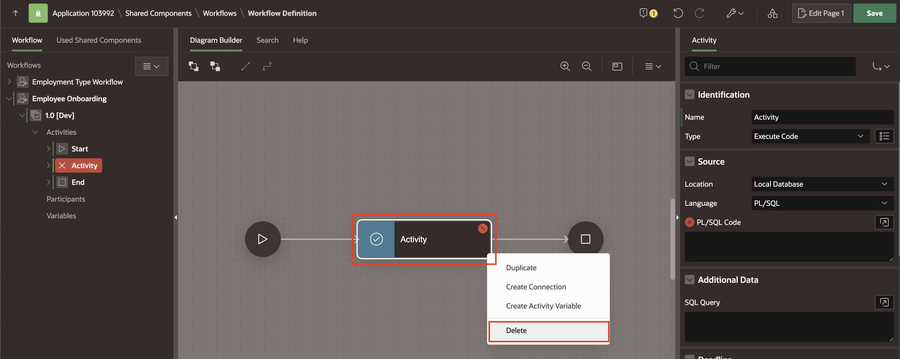

4. Navigate to **Start**. Under **Outgoing**, select **New** and select the following:

    - Activity > To: **End**

   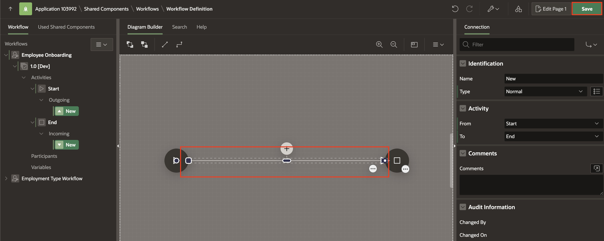

5. Click **Save**.

## Task 3: Add Inputs for Employment Type Workflow

In this lab, you explore various aspects of workflow data using the example of a doctor appointment application that you are building. You will focus on understanding parameters, variables, activity variables, and additional data.

Referring to the flow chart in Lab 1, illustrating the business logic, the appointment booking process initiates with the Hospital Staff submitting patient details to the system, marking the commencement of the workflow.

The inputs to the workflow will be the patient details. In workflow terminology, these are called **Workflow Parameters**.

You will define the following parameters for the Calculate fees Workflow:
   BOOKING\_ID,
   DNO,
   PATIENT\_NAME, PATIENT\_EMAIL, REQUEST\_DATE, STATUS

1. To create Workflow Parameters, right-click **Employee Onboarding** Workflow and select **Create Parameter**.

   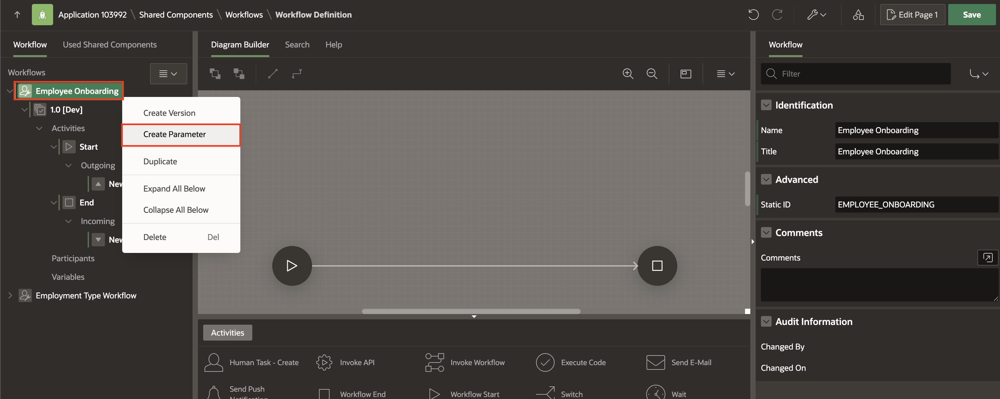

2. This adds a Parameter with a label "New" in the Workflow tree. In the Property Editor, enter/select the following:

    - Static ID: **EMAIL**

    - Label: **Email**

   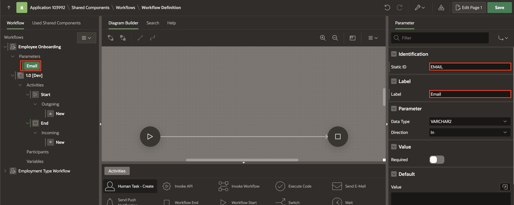

3. Similarly, add the following **Parameters** one after the other, given in the table below.

  |Static ID | Label | Data Type | Value Required| Direction |
  |----------|-------|------------|---|----------|
  | EMPLOYEE_ID | Employee ID | VARCHAR2 | No | In   |
  | EMPLOYEE_NAME | Employee Name | VARCHAR2 |  No  | In  |
  | EMPLOYMENT_TYPE | Employment Type | VARCHAR2 | No | In  |
  | DEPARTMENT | Department ID | NUMBER | No | In  |
  | INITIATED_BY | Department ID | NUMBER | Yes | In  |
  {: title="List of Parameters to be Created"}

    

## Task 4: Add Workflow Variables

The inputs provided to the Appointment Workflow are read-only in nature. This means that, once the workflow is submitted, their values will never be modified. The workflow needs to process and pass data from one activity to the next.

As an example, consider the following business scenario:

Before an appointment is confirmed, the workflow needs to compute the doctor's availability based on his/her current appointment schedule. So, availability of the doctor is a variable that will be determined based on this computation.

When an appointment is confirmed, the Booking ID for the appointment is carried forward to later activities which calculate and update the appointment fees.

Data such as Availability, Booking ID and Fee need to be updatable by the activities of the workflow as part of the execution. Such data is defined as **Workflow Variables**.

1. Right-click **1.0 [DEV]** (workflow version), select **Create Variable**.

    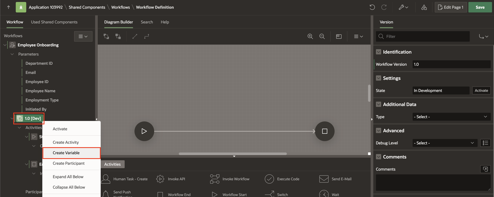

2. A new variable with Name **New** gets created in the tree. In the Property Editor, enter/select the following:

    - Identification > Static ID: **APPROVER**

    - Label > Label: **Approver**

   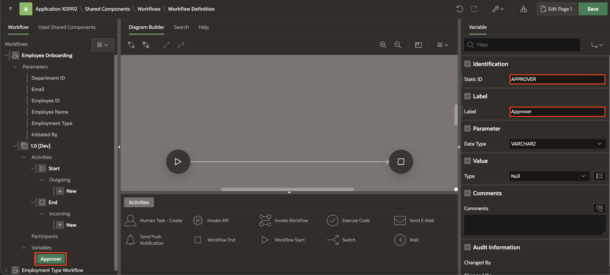

3. Similarly, create a variable **Task Outcome**. In the Property Editor, Enter/Select the following:

    - Identification > Static ID: **TASK_OUTCOME**

    - Label > Label: **TaskOutcome**

   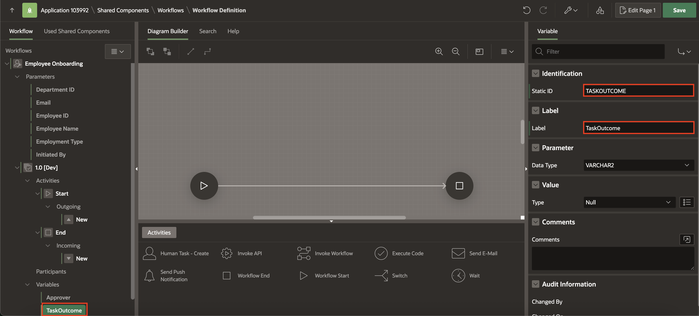

4. Similarly, create a variable **Task Outcome**. In the Property Editor, Enter/Select the following:

    - Identification > Static ID: **MANAGER_ID**

    - Label > Label: **Manager ID**

    - Under Value:
        - Type: **SQL Query (return single value)**
        - SQL Query: copy and paste the below code

            ```
             <copy>
             select M.EMPLOYEE_ID
             from EMPLOYEES e, EMPLOYEES m
             where m.EMPLOYEE_ID(+)=e.MANAGER_ID and e.EMPLOYEE_ID=:EMPLOYEE_ID;
             </copy>
            ```

   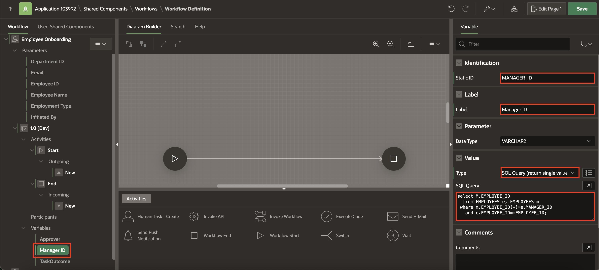

## Task 5: Add Workflow Activity for Employee Onboarding Email

1. From the Activities Palette, drag an **Send Email**activity into the Diagram Builder area and drop it on the connection joining the Start and End activities.

   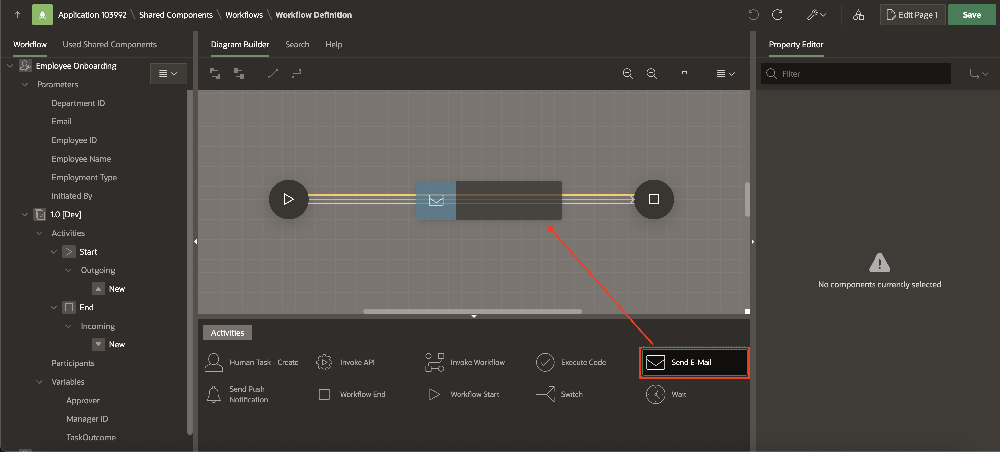

2. Click the newly added **Send Email** and in the Property Editor, enter/select the following:

    - Identification > Name: **Employee Onboarding Email**

    - Under Settings:
        - To: **&EMAIL.**
        - Email Template: **Onboarding Email**
        - Under Placeholders: Map the placeholders to the Item or Value fields

            - FIRST_NAME: **&EMPLOYEE_NAME.**
            - HR_NAME: **&INITIATED_BY.**

   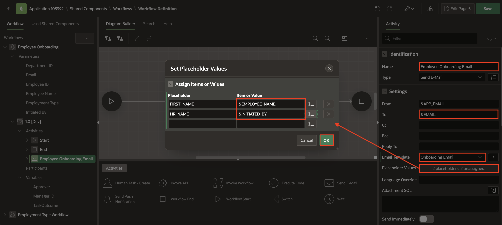

3. Now from the Activities Palette, drag a **Execute Code** Activity into the Diagram Builder area and drop it on the connection joining **Employee Onboarding Email** and End.

   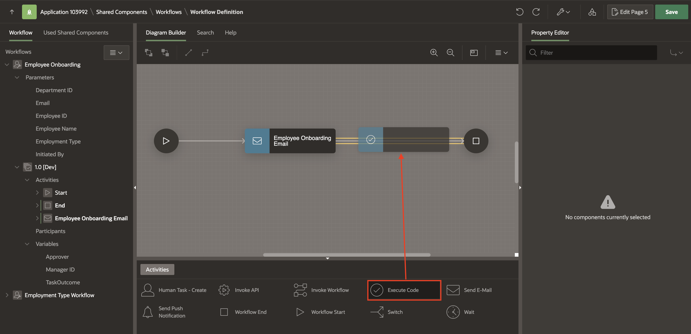

4. In the Property Editor, enter/select the following:

    - Identification > Name: **Create IT and HR Records**

    - Source > PL/SQL Code: copy and paste the below code

        ```
         <copy>
         declare
         l_req_id number;
         l_count number;
         begin
         select count(*) into l_count from IT_PROVISIONING where employee_id = :EMPLOYEE_ID;
         if l_count = 0 then
         Insert into IT_PROVISIONING (EMPLOYEE_ID, EMAIL_CREATED, LAPTOP_ALLOCATED,WORKFLOW_ID)
         Values (:EMPLOYEE_ID,'N','N',:APEX$WORKFLOW_ID );

         end if;
         end;
         </copy>
        ```

    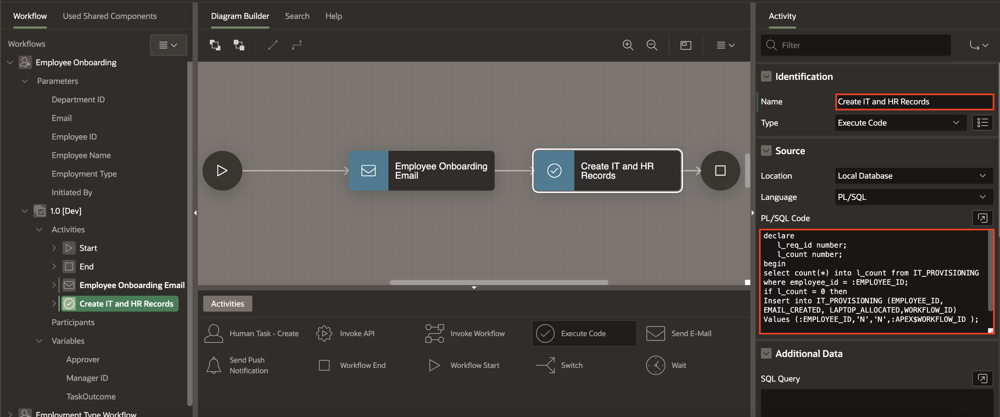

5. Now from the Activities Palette, drag a **Human Task - Create** Activity into the Diagram Builder area and drop it on the connection joining **Create IT and HR Records** and End.

   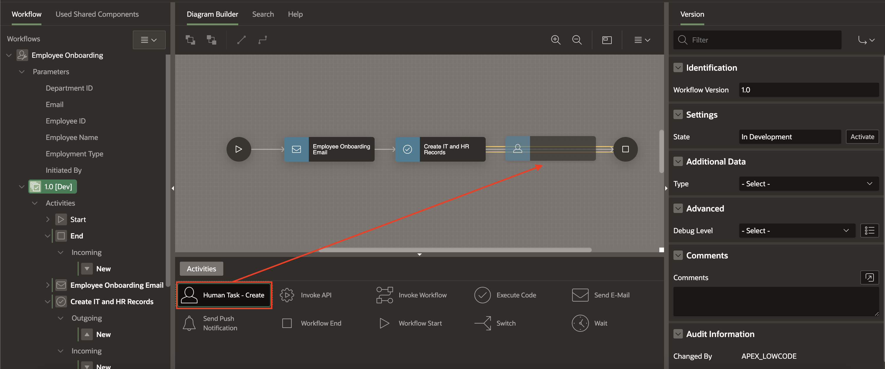

6. In the Property Editor, enter/select the following:

    - Identification > Name: **On boarding Tasks**

    - Under Settings:
        - Definition: **IT Setup**
        - Details Primary Key Item: **EMPLOYEE_ID**

    - Under Deadline:
        - Due On Type: **Interval**
        - Interval: **P2D**

   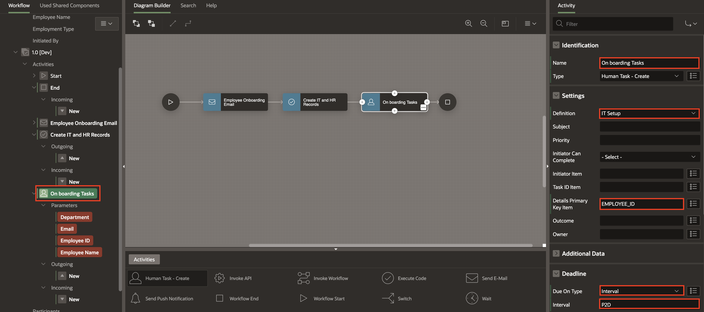

7. Under **On boarding Tasks** activity, in parameters tab, select **Department** and select the following in the property editor:

    - Under Value:
        - Type: **Item**
        - Item: **DEPARTMENT**

    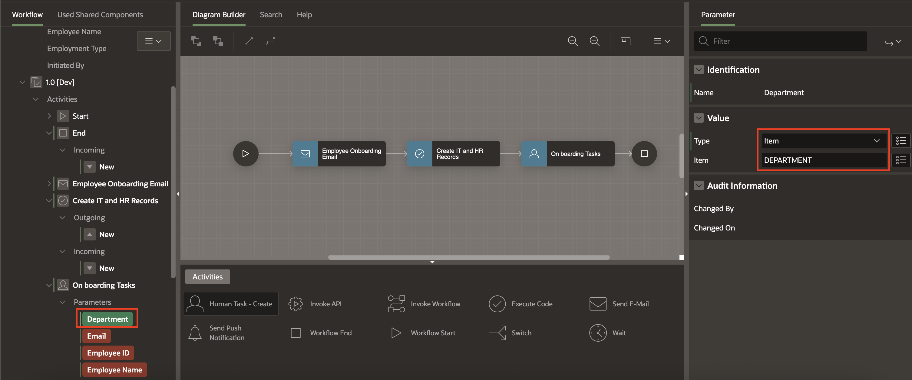

8. Similarly, select **Email** parameter.In the Property Editor, enter/select the following:

    - Under Value:
        - Type: **Item**
        - Item: **EMAIL**

    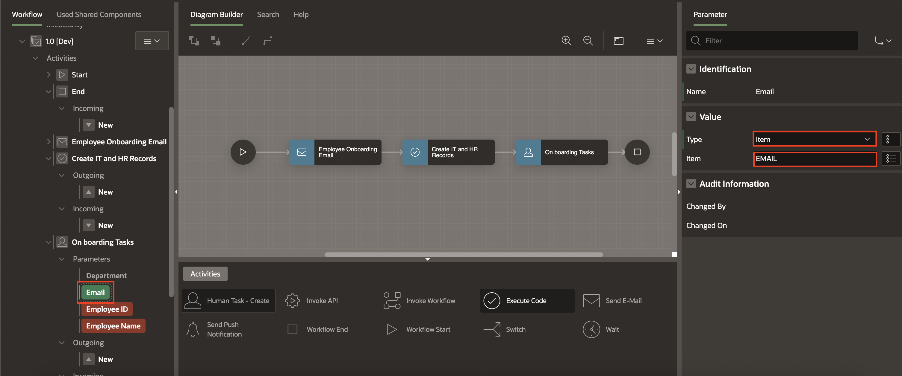

9. Similarly, select **Employee ID** parameter.In the Property Editor, enter/select the following:

    - Under Value:
        - Type: **Item**
        - Item: **EMPLOYEE_ID**

    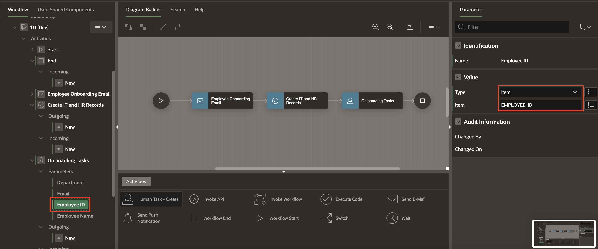

10. Similarly, select **Employee Name** parameter.In the Property Editor, enter/select the following:

    - Under Value:
        - Type: **Item**
        - Item: **EMPLOYEE_NAME**

    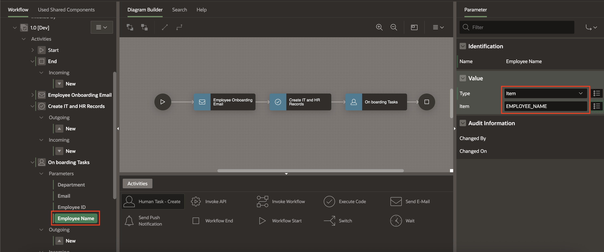

## Task 6: Create Activity to Invoke Child Workflow

1. Create another Activity to invoke the **Employment Type Workflow**. From the Activities palette, drag a **Invoke Workflow** Activity into the Diagram Builder area and drop it on the connection joining the Activity to end.

   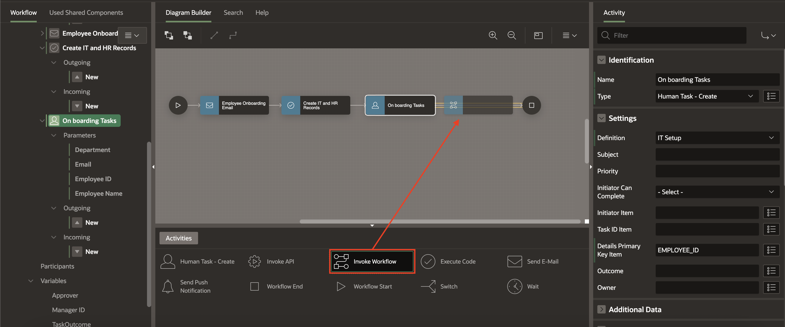

2. In the Property Editor, enter/select the following:

    - Identification > Name: **Tasks based on Employment Type**

    - Settings > Definition: **Employment Type Workflow**

    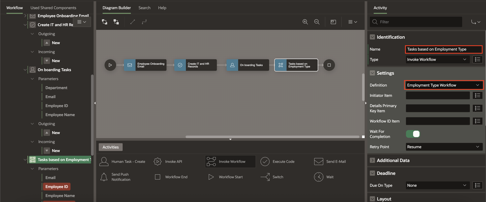

3. Under **Tasks based on Employment Type** and select **Employee ID** parameter. In the Property Editor, enter/select the following:

    - Value > Item : **EMPLOYEE_ID**

   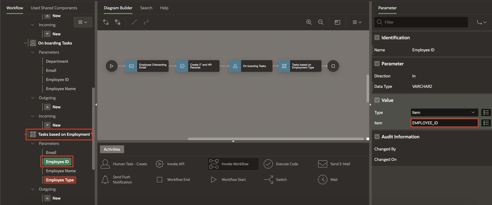

4. Similarly, select **Employee Type** parameter.In the Property Editor, enter/select the following:

    - Value > Item : **EMPLOYEE_TYPE**

   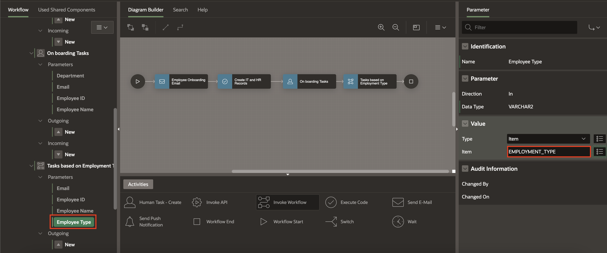

## Task 6: Create Activity to send Onboarding Completion Email

1. From the Activities palette, drag a **Send E-Mail Task - Create** Activity into the Diagram Builder area and drop it between the **Tasks based on Employment Type** activity and **End**.

   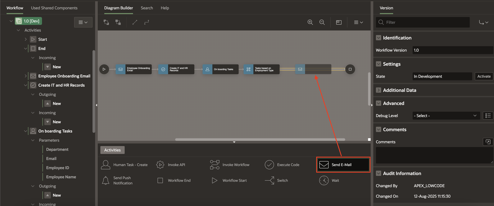

2. In the Property Editor, enter/select the following:

    - Identification > Name: **Onboarding Completion Email**

    - Under Settings:
        - To: **&EMAIL.**
        - Subject: **Congratulations on Completing Your Onboarding!**
        - Body Plain Text: copy and paste the below text

            ```
             <copy>
             Dear &EMPLOYEE_NAME.,

             Congratulations on successfully completing your onboarding process — and welcome officially to the team!

             We are excited to have you with us and look forward to the great work you'll do. Over the past few days, you have taken your first steps into our company culture, systems, and values, and we hope the experience has been informative and engaging.
             If you have any lingering questions or need further support, please don't hesitate to reach out to your manager or the HR team. Your growth and success are important to us, and we're here to support you every step of the way.

             Once again, welcome aboard — we are thrilled to have you with us!

             Warm regards,
             HR Team,
             ACME Corp.
             <copy>
            ```

    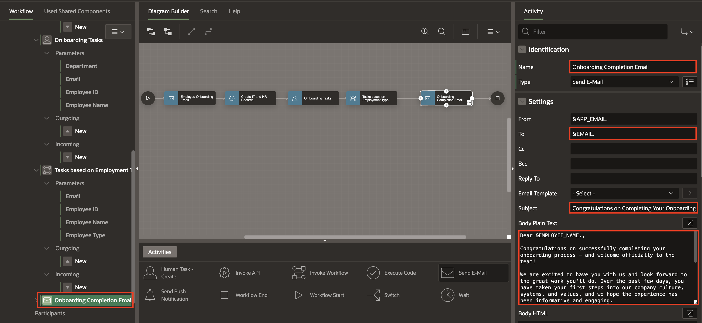

3. Click **Save**.

    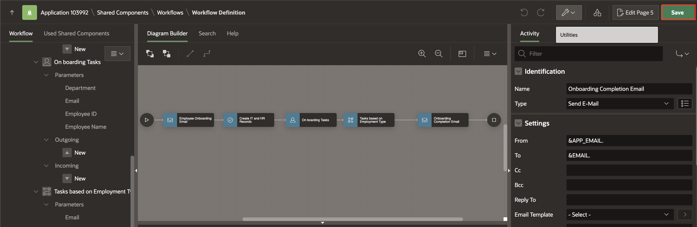

## Summary

In this lab, you learned the process of creating a Employee Onboarding Workflow using Oracle APEX.

## What's Next

In the next lab, you will create and customise the task pages.

You may now **proceed to the next lab**.

## Acknowledgements

- **Author** - Roopesh Thokala, Senior Product Manager; Sahaana Manavalan, Senior Product Manager, August 2025
- **Last Updated By/Date** - Sahaana Manavalan, Senior Product Manager, August 2025
