# Create Employee Onboarding Workflow

## Introduction

In this lab, you will create an Employee Onboarding workflow in Oracle APEX to automate the onboarding process for new employees. You will define workflow parameters and variables, and add activities such as sending emails and creating tasks. As part of this workflow, you will also invoke the Employment Type workflow created in Lab 5 as a child workflow. This allows the onboarding process to dynamically branch into employment-specific tasks, ensuring that each employee type follows the correct onboarding path.

### Objectives

In this lab, you learn how to:

- Create a new workflow and modify its details

- Define workflow parameters and variables

- Add activities such as Send Email, Execute Code, Human Task, and Invoke Workflow

- Link parameters and configure email templates and tasks

- Save and test the complete onboarding workflow

Estimated Time: 20 minutes

Watch the video below for a quick walk-through of the lab.
[Create an APEX App](videohub:1_xcfm63i5)

### Prerequisites

- All the previous Labs have been completed.

## Task 1: Create the Workflow

To create a Workflow:

1. In the Rendering Tree, right click on **Workflows** and select **Create Workflow**.

   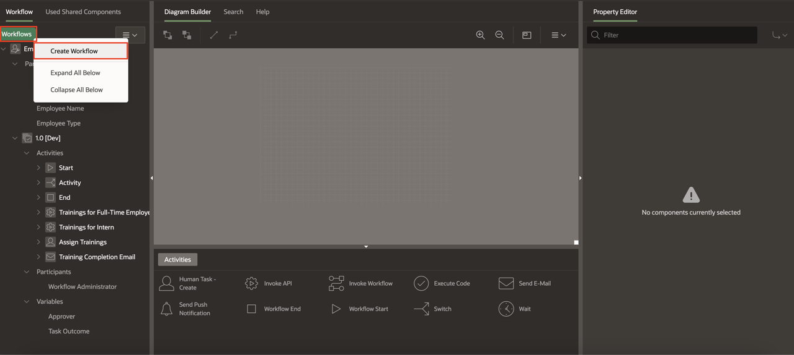

2. This will lead you to the Workflow Designer. A new workflow with a Start Activity, Execute Code Activity, and End Activity will be auto-created.

    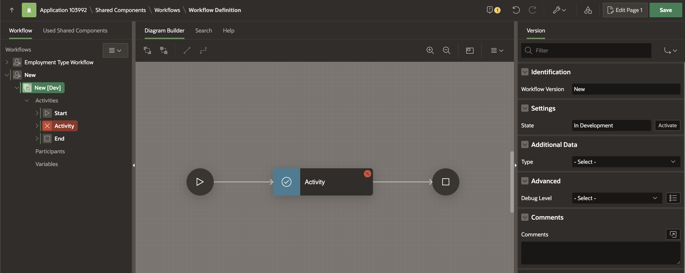

## Task 2: Modify Workflow Details

1. Select **New** in the Rendering tab, in the Property Editor enter/select the following:

    - Under Identification:
        - Name: **Employee Onboarding**
        - Title: **Employee Onboarding**

    - Under Advanced:
        - Static ID: **EMPLOYEE\_ONBOARDING**

    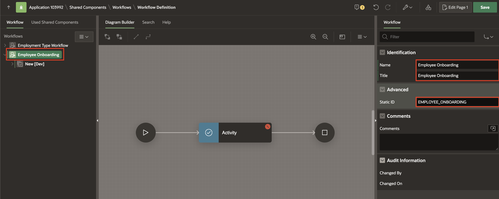

2. In the left pane, select **New[Dev]** and in the property editor, for Workflow Version enter **1.0**.

    

3. At this point, we will remove this activity since we plan to introduce new specific activities in subsequent sections of this lab. To do this, either right-click on the highlighted RED activity in the Workflow tree and select **Delete**, or click the three dots at the bottom right corner of the activity in the Diagram. This will open a menu, and choose **Delete** from the options provided.

   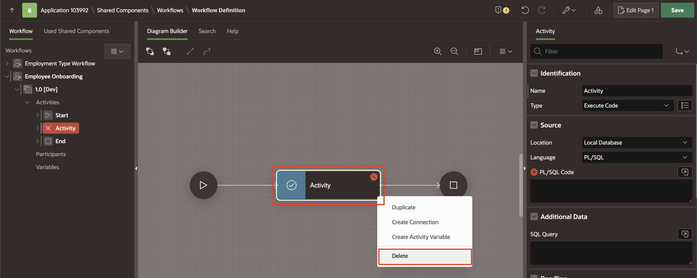

4. Navigate to **Start**. Under **Outgoing**, select **New** and select the following:

    - Activity > To: **End**

   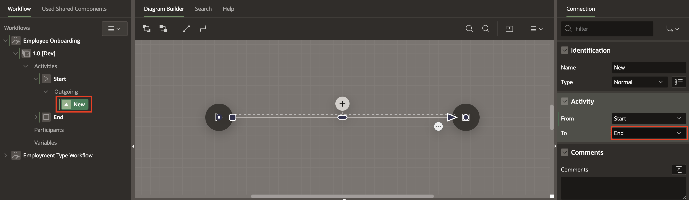

5. Click **Save**.

   

## Task 3: Add Inputs for Employee Type Workflow

In this lab, you explore various aspects of workflow data using the example of a Employee Onboarding application that you are building. You will focus on understanding parameters, variables, activity variables, and additional data.

Referring to the flow chart in Lab 1, illustrating the business logic, the employee onboarding process initiates with the HR Staff submitting New Hire details to the system, marking the commencement of the workflow.

1. To create Workflow Parameters, right-click **Employee Onboarding** Workflow and select **Create Parameter**.

   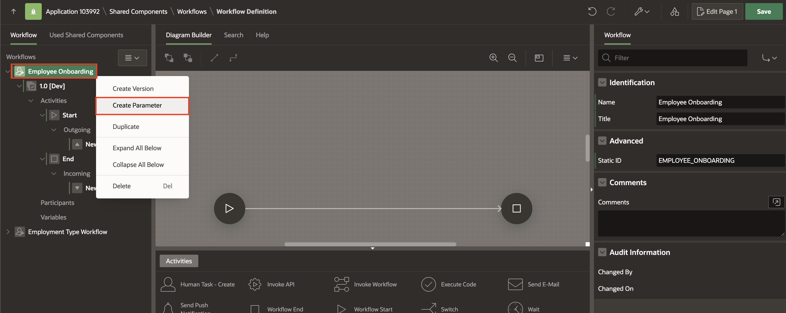

2. This adds a Parameter with a label "New" in the Workflow tree. In the Property Editor, enter/select the following:

    - Static ID: **EMAIL**

    - Label: **Email**

   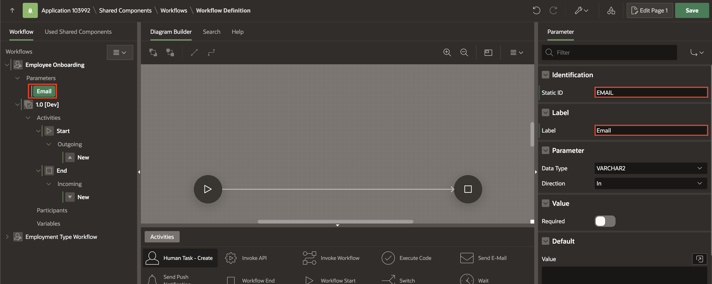

3. Similarly, add the following **Parameters** one after the other, given in the table below.

  |Static ID | Label | Data Type | Required|
  |----------|-------|------------|----------|
  | EMPLOYEE_ID | Employee ID | VARCHAR2    | No |
  | EMPLOYEE_NAME | Employee Name | VARCHAR2  | No  |
  | EMPLOYEE_TYPE | Employee Type | VARCHAR2   | No |
  | DEPARTMENT | Department ID | NUMBER   | No |
  | INITIATED_BY | Initiated By | VARCHAR2 |Yes |
  {: title="List of Parameters to be Created"}

    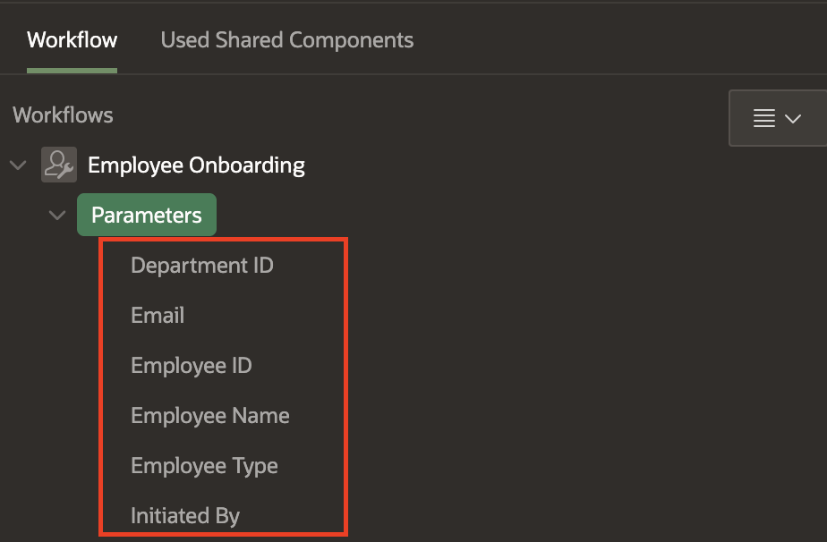

## Task 4: Add Workflow Variables

The inputs provided to the Employee Onboarding Workflow are read-only in nature. This means that, once the workflow is submitted, their values will never be modified. The workflow needs to process and pass data from one activity to the next.

1. Right-click **1.0 [Dev]** (workflow version), select **Create Variable**.

    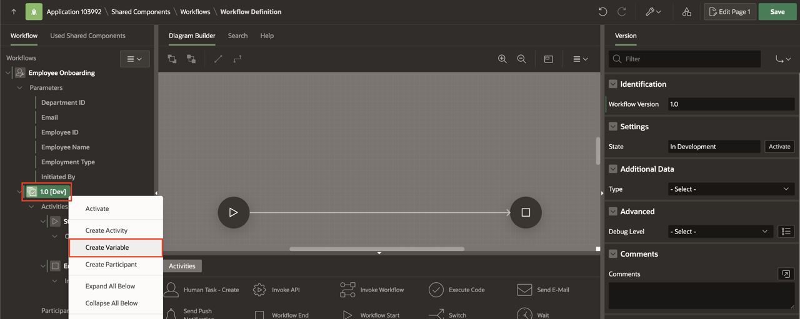

2. A new variable with Name **New** gets created in the tree. In the Property Editor, enter/select the following:

    - Identification > Static ID: **MANAGER\_ID**

    - Label > Label: **Manager ID**

    - Under Value:
        - Type: **SQL Query (return single value)**
        - SQL Query: copy and paste the below code

            ```
             <copy>
             select M.EMPLOYEE_ID
             from EMPLOYEES e, EMPLOYEES m
             where m.EMPLOYEE_ID(+)=e.MANAGER_ID and e.EMPLOYEE_ID=:EMPLOYEE_ID;
             </copy>
            ```

   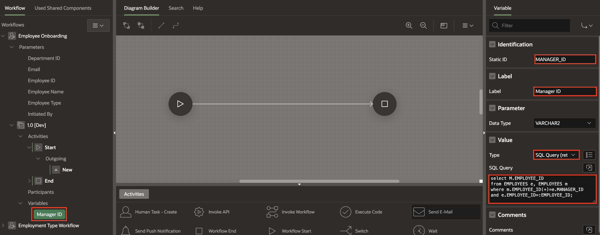

## Task 5: Add Workflow Activities for Employee Onboarding

1. From the Activities Palette, drag a **Send Email** activity into the Diagram Builder area and drop it on the connection joining the **Start** and **End** activities.

   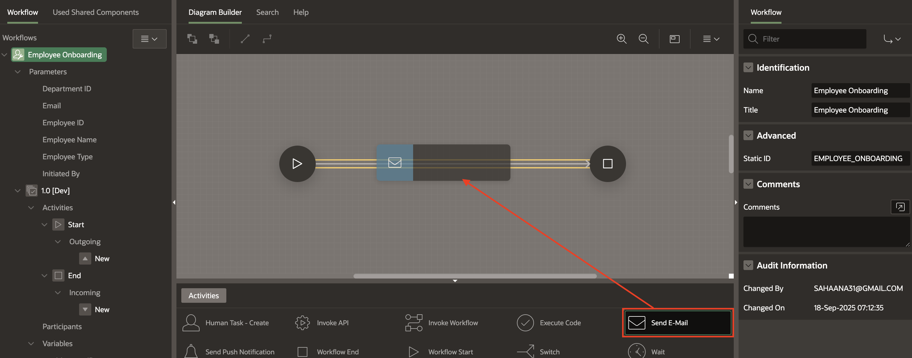

2. Click the newly added **Send Email** and in the property editor, enter/select the following:

    - Identification > Name: **Employee Onboarding Email**

    - Under Settings:
        - To: **&EMAIL.**
        - Email Template: **Onboarding Email**
        - Under Placeholders: Map the placeholders to the Item or Value fields

            - FIRST_NAME: **&EMPLOYEE\_NAME.**
            - HR_NAME: **&INITIATED\_BY.**

            Click **Ok**.

   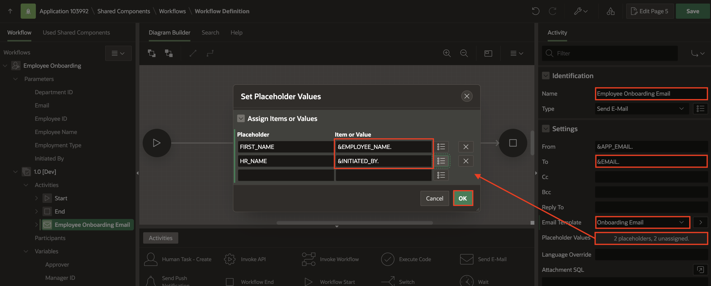

3. Now from the Activities Palette, drag a **Execute Code** Activity into the Diagram Builder area and drop it on the connection joining **Employee Onboarding Email** and End.

   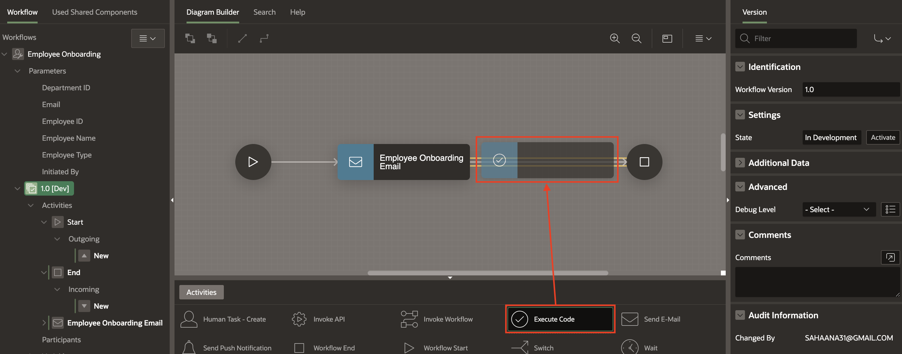

4. In the Property Editor, enter/select the following:

    - Identification > Name: **Create IT and HR Records**

    - Source > PL/SQL Code: copy and paste the below code

        ```
        <copy>
        declare
        l_req_id number;
        l_count number;
        begin
        select count(*) into l_count from IT_PROVISIONING where employee_id = :EMPLOYEE_ID;
        if l_count = 0 then
            Insert into IT_PROVISIONING (EMPLOYEE_ID, EMAIL_CREATED, LAPTOP_ALLOCATED, WORKFLOW_ID)
            Values (:EMPLOYEE_ID, 'N', 'N', :APEX$WORKFLOW_ID );
        end if;
        end;
        </copy>
        ```

    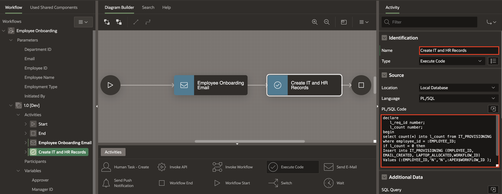

5. Now from the Activities Palette, drag a **Human Task - Create** Activity into the Diagram Builder area and drop it on the connection joining **Create IT and HR Records** and End.

   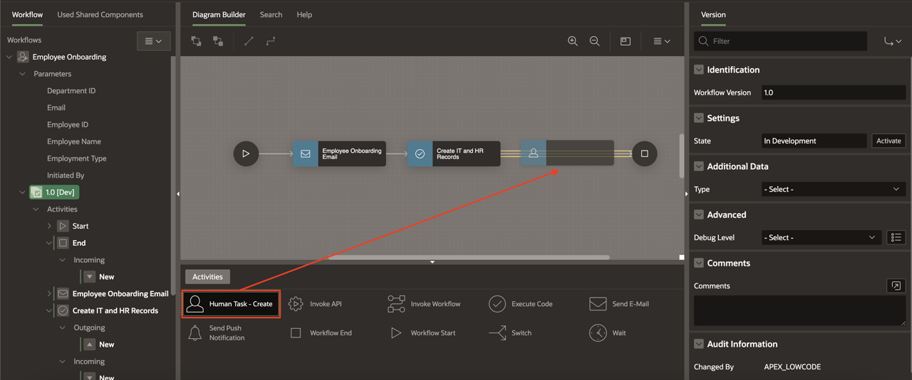

6. In the Property Editor, enter/select the following:

    - Identification > Name: **Onboarding Tasks**

    - Under Settings:

        - Definition: **IT Setup**
        - Details Primary Key Item: **EMPLOYEE_ID**

    - Under Deadline:

        - Due On Type: **Interval**
        - Interval: **P2D**

   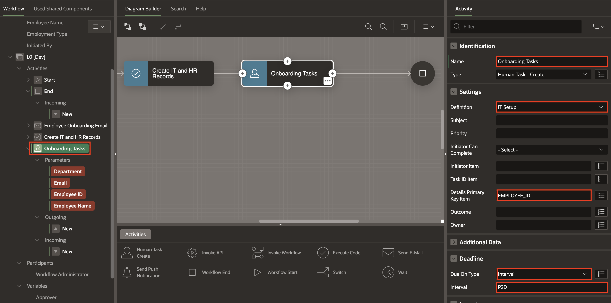

7. Under **Onboarding Tasks** activity, in parameters tab, select **Department** and select the following in the property editor:

    - Under Value:

        - Type: **Item**
        - Item: **DEPARTMENT**

    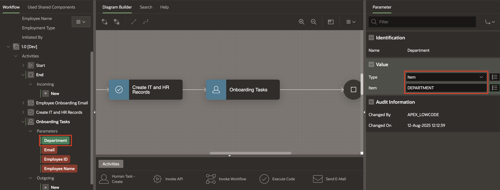

8. Similarly, select **Email** parameter.In the Property Editor, enter/select the following:

    - Under Value:

        - Type: **Item**
        - Item: **EMAIL**

    

9. Similarly, select **Employee ID** parameter.In the Property Editor, enter/select the following:

    - Under Value:

        - Type: **Item**
        - Item: **EMPLOYEE\_ID**

    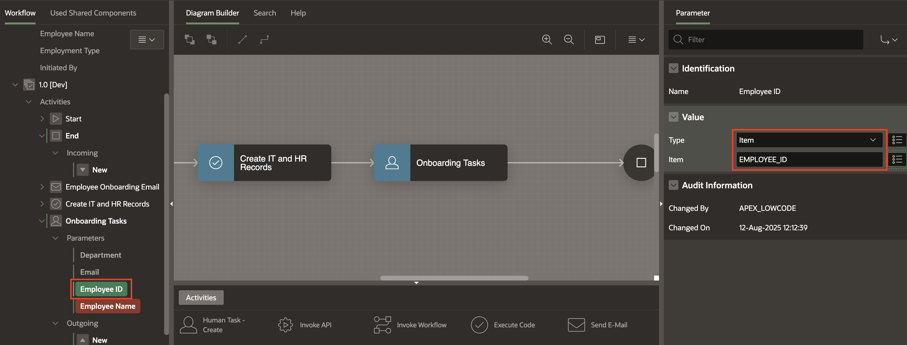

10. Similarly, select **Employee Name** parameter.In the Property Editor, enter/select the following:

    - Under Value:

        - Type: **Item**
        - Item: **EMPLOYEE\_NAME**

    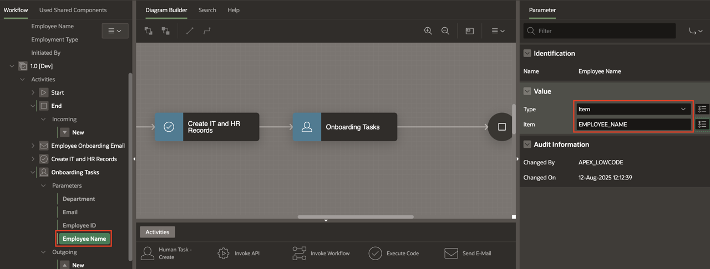

## Task 6: Create Activity to Invoke Child Workflow

1. Create another Activity to invoke the **Employment Type Workflow**. From the Activities palette, drag a **Invoke Workflow** Activity into the Diagram Builder area and drop it on the connection joining the Activity to end.

   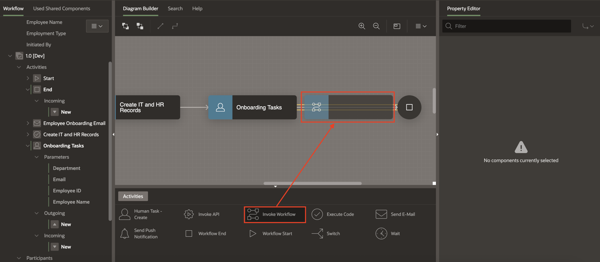

2. In the Property Editor, enter/select the following:

    - Identification > Name: **Tasks based on Employment Type**

    - Settings > Definition: **Employment Type Workflow**

    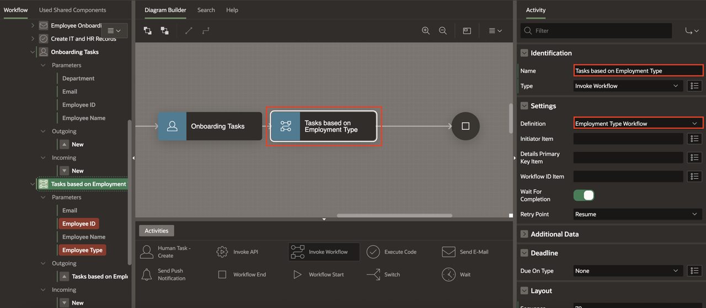

3. Under **Tasks based on Employment Type** and select **Email** parameter. In the Property Editor, enter/select the following:

    - Under Value:

        - Type: **SQL Query (return single value)**
        - SQL Query: copy and paste the below code

            ```
            <copy>
            select Email from EMPLOYEES where EMPLOYEE_ID = :EMPLOYEE_ID;
            </copy>
            ```

   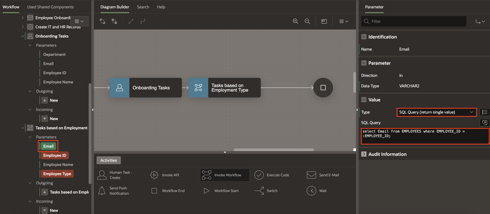

4. Similarly, select **Employee ID** parameter. In the Property Editor, enter/select the following:

    - Under Value:

        - Type: **Item**
        - Item : **EMPLOYEE\_ID**

   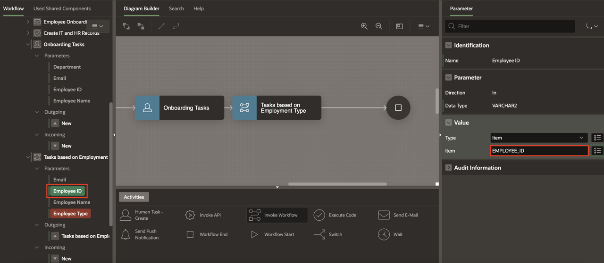

5. Similarly, select **Employee Name** parameter. In the Property Editor, enter/select the following:

    - Under Value:

        - Type: **Item**
        - Item : **EMPLOYEE\_NAME**

   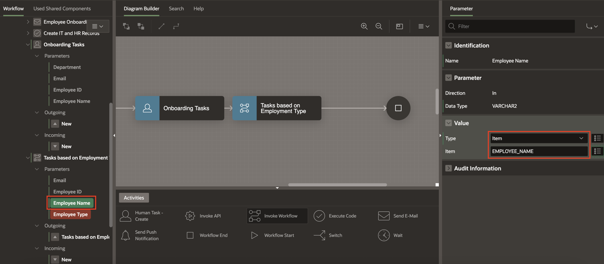

6. Similarly, select **Employee Type** parameter. In the Property Editor, enter/select the following:

    - Under Value:

        - Type: **Item**
        - Item : **EMPLOYEE\_TYPE**

   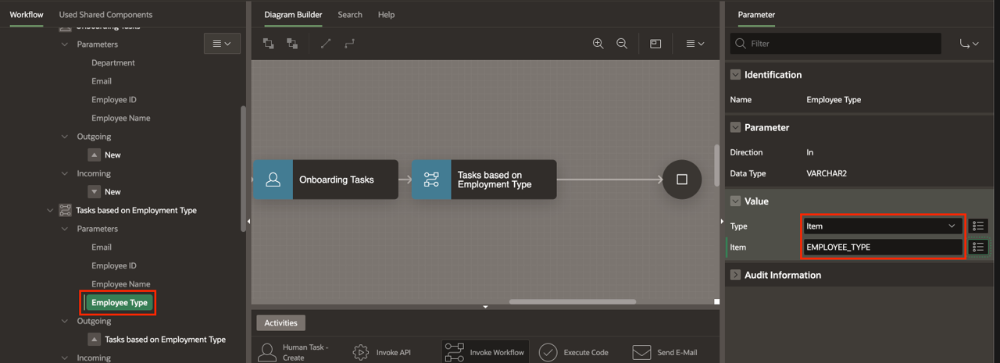

## Task 7: Create Activity to send Onboarding Completion Email

1. From the Activities palette, drag a **Send Email** Activity into the Diagram Builder area and drop it between the **Tasks based on Employment Type** activity and **End**.

   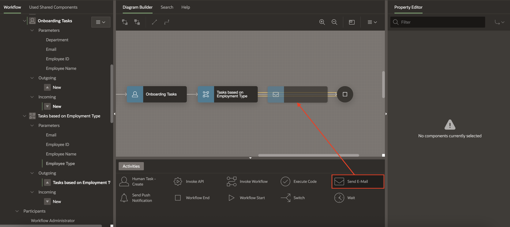

2. In the Rendering Tree, right click on the **New** Activity and click **Create Activity Variable**.

   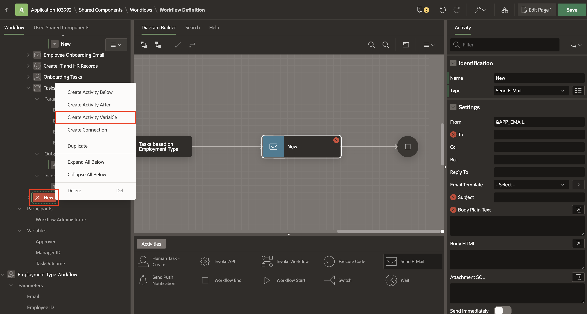

3. In the Property Editor, enter/select the following:

    - Identification > Static ID: **CORP_EMAIL**

    - Label > Label: **CORP_EMAIL**

    - Under Value:

        - Type: **SQL Query (return single value)**
        - SQL Query: copy and paste the below query

            ```sql
             <copy>
             select Email from EMPLOYEES
             where EMPLOYEE_ID = :EMPLOYEE_ID;
             </copy>
            ```

   

4. In the Rendering Tree, click the **New Activity** and in the Property Editor, enter/select the following:

    - Identification > Name: **Onboarding Completion Email**

    - Under Settings:

        - To: **&CORP_EMAIL.**
        - Subject: **Congratulations on Completing Your Onboarding!**
        - Body Plain Text: copy and paste the below text

            ```
             <copy>
             Dear &EMPLOYEE_NAME.,

             Congratulations on successfully completing your onboarding process and welcome officially to the team!

             We are excited to have you with us and look forward to the great work you'll do. Over the past few days, you have taken your first steps into our company culture, systems, and values, and we hope the experience has been informative and engaging.
             If you have any lingering questions or need further support, please don't hesitate to reach out to your manager or the HR team. Your growth and success are important to us, and we're here to support you every step of the way.

             Once again, welcome aboard — we are thrilled to have you with us!

             Warm regards,
             HR Team,
             ACME Corp.
             <copy>
            ```

    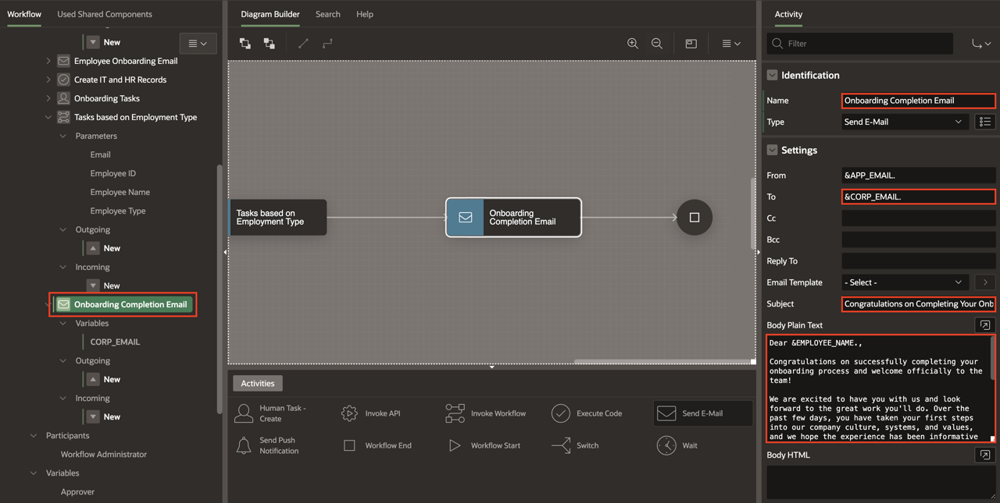

5. Click **Save**.

    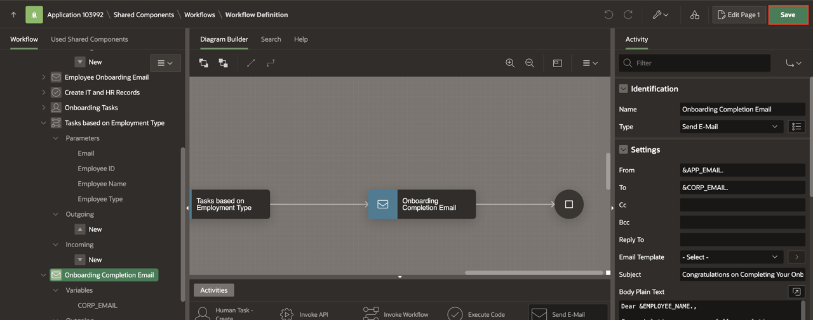

## Summary

In this lab, you learned how to create an Employee Onboarding Workflow by setting up parameters, variables, and activities. You practiced configuring workflow details, invoking child workflows, and sending automated emails to streamline the onboarding process.

## What's Next

In the next lab, you will create and customise the task and workflow pages.

You may now **proceed to the next lab**.

## Acknowledgements

- **Author** - Sahaana Manavalan, Senior Product Manager; Roopesh Thokala, Senior Product Manager, August 2025
- **Last Updated By/Date** - Sahaana Manavalan, Senior Product Manager, August 2025
