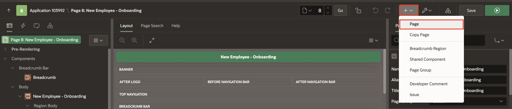

# Create Pages in the Application

## Introduction

In this hands-on lab, you will create a page for collecting new appointment requests. You will create pages for managing doctor appointments, incorporating workflows, task lists, and feedback.

### Objectives

In this lab, you will learn how to:

- Create the New Appointments page
- Create the Patient Tasks page
- Create the Doctors Task page
- Modify the Task Details page
- Create the Feedback page and View appointment workflows page

Estimated Time: 20 minutes

### Prerequisites

- All the previous Labs have been completed.

## Task 1: Create the New Appointments Page

Now that the Workflow is created, let us create the page that the hospital staff will use to create a new appointment.

1. Navigate to **Application ID <number>**.

    

2. Click **Create Page**.

    

3. Select **Form**.

    

4. For Page Attributes, enter/select the following:

    - Page Definition > Name: **New Employee - Onboarding**

    - Data Source > Table/View Name: **EMPLOYEES**

    - Navigation > Breadcrumb Parent Entry: **Home (Page 1)**

     Click **Next**.

    

5. Select Primary key column 1 : **EMPLOYEE_ID (Number)**.
    Click **Create Page**.

    

6. In the Page Designer, in the rendering tree, select **New Employee - Onboarding** region and in the property editor, make the following changes:

    - Under Appearance:
        - Template Options: In the pop-up box
            - Header: **Hidden**

            Click **Ok**.

    

7. In the rendering tree, under **New Employee - Onboarding** region and select **Last Name**.

     

8. In the property editor, under Layout > Start New Row : **Toggle OFF**.

     

9. Similarly do the same for following 4 Page Items:
    - **P8\_PHONE**
    - **P8\_DEPARTMENT\_ID**
    - **P8\_MANAGER\_ID**
    - **P8\_LOCATION**

     

10. Select **P8\_STATUS**, **P8\_LAPTOP\_INFO** , **P8\_SEAT\_INFO** and **P8\_VPN\_DETAILS**, in the property editor, select the following:

    - Identification > Type: **Hidden**

    

11. Click **Save**.

    

## Task 2: Create and Configure Page Process

1. Navigate to the **Processing** tab.

2. Under **Processing** tab, right-click **Processing** and select **Create Process**.

    

3. In the property editor, enter/select the following:

      - Under Identification:

          - Name: **Initiate Employee Onboarding Workflow**

          - Type: **Workflow**

      - Under Settings:

          - Definition: **Employee Onboarding**

          - Details Primary Key Item: **P8\_EMPLOYEE\_ID**

      - Success message: **Employee Onboarding Initiated**

     

4. Now, configure Parameters for the Workflow Page Process. Update the following **Parameters** one after the other:

    | Parameter |  Type  | Item |
    | --- |  --- | ---- |
    | Department ID | Item | P8\_DEPARTMENT\_ID |
    | Email | Item | P8\_EMAIL |
    | Employee ID | Item | P8\_EMPLOYEE\_ID |
    | Employee Name | Item | P8\_FIRST\_NAME |
    | Employment Type | Item | P8\_EMPLOYMENT\_TYPE |
    | Initiated By | Expression |    :APP_USER      |

    

5. Click **Save**.

    

## Task 3: Create Tasks Page

Our application has two entry points for Patients: First, to confirm an invoice request and second, to provide feedback. For this, we need to create a Unified Task List for Patients' tasks.

1. Click **+ (Plus) Icon** on the top-right corner of the page designer. Select **Page** from the drop-down.

    

2. Select **Unified Task List**.

   

3. Specify the following page attributes:

    - Page Number: **6**

    - Name: **Patient Tasks**

    - Report Context: **My Tasks**

    - Breadcrumb Parent Entry: **Home (Page 1)**

    Click **Create Page**.

    

4. Our application has 1 entry point for Doctors. Doctors need to log in to approve or reject appointment requests. For this, you will create a Doctor Tasks page. This will also be a Unified Task List page for Doctors to act on the tasks assigned to them.

5. To create another Unified Task list page, click **+ (Plus) Icon** on the top-right corner of the page designer toolbar. Select **Page** from the drop-down.

    

6. Select **Unified Task List**.

    

7. Specify the following page attributes:

    - Page Number: **7**

    - Name: **Doctor Tasks**

    - Report Context: **My Tasks**

    Click **Create Page**.

  

## Task 4: Modify the Task Details Pages

Our Application has three Task Definitions -  Appointment Request, Invoice Request, and Feedback Request. For each of them, we have created a Task Details page. In this task, we will rename the Pages so that they appear more meaningful in the Application.

1. In the **Doctors Appointment Made Easy!** application, navigate to **Shared Components** and select **Task Definitions**.

    

2. In the Task Definitions page, click **Appointment Request**.

    

3. In the Task Definition Editor, note the page number in the **Task Details URL** (f?p=&APP\_ID.:2:&SESSION.::&DEBUG.:RP,2:P2\_TASK\_ID:&TASK\_ID.). This points to Page 2.

    

4. Navigate to your application home page and click **Page 2**.

    

5. Now, update the following in the Property Editor:

    - Name: **Appointment Request Details**

    - Title: **Appointment Request Details**

    

6. Click **Save**.

7. You now need to change the Invoice Request Details Page.

    Navigate to **Shared Components > Task Definition > Invoice Request** and similarly check the page number for the Task Details. The **Invoice Request** Task Definition points to Page 3.

8. Navigate to your application home page and click **Page 3**.

9. Now, update the following in the Property Editor:

    - Name: **Invoice Details**

    - Title: **Invoice Details**

    

10. Under **Rendering** tab, navigate to **Invoice Details > Components > Content Body > Developer Information**. Right-click **Developer Information** region and click **Delete**.

    

11. Under **Rendering** tab, select **Details** region. In the Property editor, edit the Title to **View Invoice**.

    

    > **Note:** _Developer Information region is autogenerated for Action Tasks (non-approval). This can be removed/customized depending on the application use-case._

12. Click **Save**.

13. Navigate to **Shared Components > Task Definition > Feedback Request** and similarly check the page number for the Task Details. The **Feedback Request** Task Definition points to Page 4.

14. Navigate to your application home page and click **Page 4**.
    Now, update the following in the Property Editor:

    - Name: **Feedback Details**

    - Title: **Feedback Details**

    

15. Under **Rendering** tab, navigate to **Feedback Details > Components > Content Body > Developer Information**. Right-click **Developer Information** region and click **Delete**.

    

16. Under **Rendering** tab, click **Details** region. In the Property Editor, for Title: Enter **View Appointment Details**.

    

17. In the Details Page, the patient should be able to fill out a Feedback form and submit it. On submission, it will create an entry in the **PATIENT_FEEDBACK** table for the particular doctor. We will customize the Feedback Details Page as follows:

    - Right-click  **View Appointment Details** and select **Create Region Below**.

    

18. Select the newly created region and in the Property Editor, enter/select the following:

    - Under Identification:

        - Name: **Your Feedback**

        - Type: **Form**

    - Under Source:

        - Table: **APPOINTMENT**

        - Where:
          ```
          <copy>
          booking_id = :P4_BOOKING_ID
          </copy>
          ```

    

19. Select the Page Items **P4\_FEE** and **P4\_WORKFLOW\_ID**. In the Property Editor, for Identification > Type, select **Hidden**.

    

20. Select **P4_SCHEDULE** and then in the property editor, for Appearance > Format Mask, select **DD-MON-YYYY HH24:MI:SS**.

    

21. Now, create two new page items under the **Your Feedback** region.

    In the Rendering tree, right-click **Region Body** and select **Create Page Item**.

    

22. Select the newly created page item and in the Property Editor, enter/select the following:

    - Under Identification:

        - Name: **P4_RATING**

        - Type: **Radio Group**

    - Under List of Values:

        - Type: **Static Values**

        - Static Values: **Display1,Display2**

        - Enter the following under Display and Return:

        | Display Value |  Return Value  |
        | --- |  --- |
        | Excellent | 1 |
        | Good | 2 |
        | Satisfactory | 3 |
        | Unsatisfactory | 4 |
        {: title="Display and Return Values for List of Values}

    Click **OK**.

    

23. Similarly, create a new item **P4_FEEDBACK** and set the Type as **Rich Text Editor**.

    

24. Click **Save**.

25. Under **Pre-Rendering**, create a new **Process** above the **Initialize Form Feedback Details** process.

    

26. In the Property Editor, enter/select the following:

    - Identification > Name: **Populate Booking Details in Feedback Form**

    - PL/SQL Code: Enter the following code:

    ```
    <copy>
    begin

    select booking_id into :P4_BOOKING_ID
    from appointment where booking_id = (select
         param_value
    from apex_task_parameters
    where task_id = :P4_TASK_ID and param_static_id = 'BOOKING_ID');

    end;
    </copy>
    ```

    

27. Navigate to the **Processing Tab**.

28. Right-click **Processing**, select **Create Process** and add it after the **Claim** process.

    

29. In the Property editor, enter/select the following:

    - Identification > Name: **Save Feedback**

    - Type: **Execute Code**

    - PL/SQL code: enter the following code snippet:

        ```
        <copy>
        begin
            insert into patient_feedback (
            patient_name,
            doctor_no,
            appointment,
            feedback,
            rating,
            created_at,
            updated_at)
        values
            (:P4_PATIENT_USERNAME,
            :P4_DOCTOR_NO,
            to_timestamp_tz(:P4_SCHEDULE,'DD-MON-YYYY HH24:MI:SS'),
            :P4_FEEDBACK,
            :P4_RATING,
            systimestamp,
            systimestamp);
        end;
        </copy>
        ```

    

30. For Server Side Condition > When Button Pressed, select **COMPLETE**.

    

31. Click **Save**.

## Task 5: Create the Patient Appointments And Feedbacks Page

Now, you need to create a View Only page where patients can log in to view their appointments and the feedback they have left so far.

1. Click **+ (Plus) Icon** on the right-above corner of the page designer. Then, select **Page** from the drop-down.

    

2. Select **Blank Page**.

   

3. Specify the following page attributes:

    - Page Number: **8**

    - Name: **Patient Appointments And Feedbacks**

    - Breadcrumb Parent Entry: **Home (Page 1)**

    Click **Create Page**. A Blank page is created.

    

4. Right-click **Body** and select **Create Region**.

    

5. In the Property Editor and enter/select the following:

    - Under Identification:

        - Title: **Appointments**

        - Type: **Comments**

    - Under Source:

        - Table Name: **APPOINTMENT**

        - **Where Clause**: Enter the below code:
          ```
          <copy>
          patient_username=:APP_USER
          </copy>
          ```

    - Appearance > Template: **Collapsible**

    

6. Select **Appointments** region, and in the Property editor, under **Attributes** tab and enter/select the following:

    - Under Settings:

        - Comment Text: **STATUS**

        - User Name: **DOCTOR\_EMAIL**

        - Date: **SCHEDULE**

    

7. Right-click **Appointments** Region, and select **Create Region Below**.

    

8. In the Property Editor, enter/select the following:

    - Under Identification:

        - Title: **Feedbacks**

        - Type: **Comments**

    - Under Source:

        - Type: **SQL Query**

        - SQL Query: copy and paste the below SQL.

            ```
            <copy>
            SELECT 
            ID,
            PATIENT_NAME,
            'DR.' || DNAME AS DNAME,
            APPOINTMENT,
            FEEDBACK,
            RATING,
            CREATED_AT,
            UPDATED_AT
            FROM 
            PATIENT_FEEDBACK, 
            DOCTOR
            WHERE 
            PATIENT_NAME = :APP_USER
            AND DOCTOR_NO = DNO;
            </copy>
            ```

    

9. Select **Feedbacks** region. In the Property editor, under **Attributes** tab, enter/select the following:

    - Under Settings:

        - Comment Text: **FEEDBACK**

        - User Name: **DNAME**

        - Date: **APPOINTMENT**

    

10. Click **Save**.

## Task 6: Create the View Appointment Workflows Page

Finally, we need the page that the Hospital Management Staff will use to monitor the appointment workflow.

We use the Workflow Console and Details pages with **Initiated By Me** report context, which allows a logged-in user to view all Workflows Initiated by him or her.

> **Note:** The Workflow Console allows workspace users to view and manage their workflow instances, including My Workflows for workflow owners, Admin Workflows for workflow administrators, and Initiated by Me for workflow initiators. When configuring the Workflow Console, you have different Report Contexts to choose from. You will learn about these in subsequent blogs.

1. To create the Workflow Console and Details pages, on the Application home page, select **Create Page**.

2. Select **Workflow Console**.

    

3. In the Create Workflow Console wizard, enter/select the following:

    - Under Page Definition:

        - Name: **Monitor Appointment Workflows**

        - Report Context: **Initiated By Me**

        - Include Dashboard Page: **Toggle On**

        - Dashboard Page Name: **Dashboard**

        - Form Page Name: **Form on Appointment**. This is used for the Workflow Details page.

    Click **Create Page**.

    

4. Run the application and navigate through different pages to demonstrate the workflow, tasks, and feedback functionalities.

## Task 7: Improve Navigation Menu

1. Navigate to **Doctor Appointments Made Easy!** applications and select **Shared Components**.

2. Under **Navigation and Search**, select **Navigation Menu**.

    

3. Select **Navigation Menu**.

    

4. Under **List Entries**, select **Home**.

    

5. Enter/select the following:

    - Entry > List Entry Label: **DASHBOARD**

    - Target > Page: **11**

    Click **Apply Changes**.

    

6. Under **List Entries**, select **New Appointment** and update Image/Class to **fa-desktop**. Click **Apply Changes**.

    

    

7. Navigate to Sequence 70 - Dashboard and click **Delete** and confirm **OK**.

    

    

    

8. Now, select **Patient Appointments AND Feedbacks** , **Monitor Appointment Workflows** and update Parent List Entry to **Dashboard**. Click **Apply Changes**.

    

    

## Summary

You have successfully created a comprehensive Oracle APEX application for managing doctor appointments with workflows, task lists, and feedback features.

## What's Next

In the next lab, you will understand the behavior of the **Doctor Appointments Made Easy!** application through hands-on activities. You will also perform various tasks to understand the workflow and automation implemented in the application.

## Acknowledgements

- **Author(s)** - Roopesh Thokala, Senior Product Manager & Ananya Chatterjee, Consulting Member of Technical Staff.
- **Last Updated By/Date** - Ankita Beri, Product Manager, December 2024
