# Create Pages in the Application

## Introduction

In this hands-on lab, you will create a page for collecting new appointment requests. You will create pages for managing doctor appointments, incorporating workflows, task lists, and feedback.

### Objectives

In this lab, you will learn how to:

- Create the New Appointments page
- Create the Patient Tasks page
- Create the Doctors Task page
- Modify the Task Details page
- Create the Feedback page and View appointment workflows page

Estimated Time: 20 minutes

### Prerequisites

- All the previous Labs have been completed.

## Task 1: Create the New Appointments Page

Now that the Workflow is created, let us create the page that the hospital staff will use to create a new appointment.

1. Navigate to **SQL Workshop** > **SQL Scripts**.

    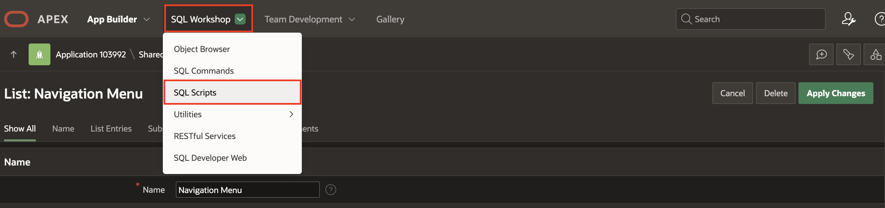

2. Click **Create Script**.

    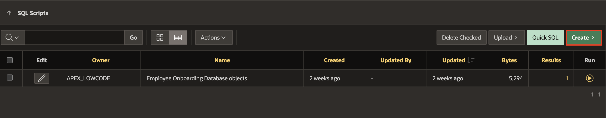

3. Enter Script Name : **Archived Tasks** and copy paste the below code :

    ```
     <copy>
     CREATE TABLE ARCHIVED_TASKS
            AS
                SELECT
                    *
                FROM
                    APEX_PURGEABLE_TASKS;

        CREATE TABLE ARCHIVED_TASK_COMMENTS
            AS
                SELECT
                    *
                FROM
                    APEX_PURGEABLE_TASK_COMMENTS;

        CREATE TABLE ARCHIVED_TASK_HISTORY
            AS
                SELECT
                    *
                FROM
                    APEX_PURGEABLE_TASK_HISTORY;

        CREATE TABLE ARCHIVED_TASK_PARAMETERS
            AS
                SELECT
                    *
                FROM
                    APEX_PURGEABLE_TASK_PARAMETERS;

        CREATE TABLE ARCHIVED_WORKFLOWS
            AS
                SELECT
                    *
                FROM
                    APEX_PURGEABLE_WORKFLOWS;

        CREATE TABLE ARCHIVED_WF_ACTIVITIES
            AS
                SELECT
                    *
                FROM
                    APEX_PURGEABLE_WF_ACTIVITIES;

        CREATE TABLE ARCHIVED_WF_PARTICIPANT
            AS
                SELECT
                    *
                FROM
                    APEX_PURGEABLE_WF_PARTICIPANT;

        CREATE TABLE ARCHIVED_WF_VARIABLES
            AS
                SELECT
                    *
                FROM
                    APEX_PURGEABLE_WF_VARIABLES;

        CREATE TABLE ARCHIVED_WF_AUDIT
            AS
                SELECT
                    *
                FROM
                    APEX_PURGEABLE_WF_AUDIT;

        /

        create or replace package "TASKS_ARCHIVER" as

        procedure archive_tasks;
        procedure archive_comments;
        procedure archive_history;
        procedure archive_params;

        end "TASKS_ARCHIVER";
        /

        create or replace package body "TASKS_ARCHIVER" as

        procedure archive_tasks is
        begin
        merge
        into archived_tasks   at
        using apex_purgeable_tasks t
        on (at.task_id = t.task_id)
        when not matched then insert
        (at.task_id,
        at.workspace_id,
        at.workspace,
        at.application_id,
        at.application_name,
        at.task_def_name,
        at.task_def_static_id,
        at.task_def_id,
        at.state,
        at.subject,
        at.task_type_code,
        at.state_code,
        at.initiator,
        at.detail_pk,
        at.outcome_code,
        at.due_on,
        at.priority,
        at.created_on)
        values (
        t.task_id,
        t.workspace_id,
        t.workspace,
        t.application_id,
        t.application_name,
        t.task_def_name,
        t.task_def_static_id,
        t.task_def_id,
        t.state,
        t.subject,
        t.task_type_code,
        t.state_code,
        t.initiator,
        t.detail_pk,
        t.outcome_code,
        t.due_on,
        t.priority,
        t.created_on);

        end archive_tasks;

        procedure archive_comments is
        begin
        merge
        into archived_task_comments   at
        using apex_purgeable_task_comments t
        on (at.task_id = t.task_id)
        when not matched then insert
        (at.task_id,
        at.workspace_display_name,
        at.workspace,
        at.application_id,
        at.application_name,
        at.text,
        at.created_by,
        at.created_on)
        values (
        t.task_id,
        t.workspace_display_name,
        t.workspace,
        t.application_id,
        t.application_name,
        t.text,
        t.created_by,
        t.created_on);
        end archive_comments;

        procedure archive_history is
        begin
        merge
        into archived_task_history  at
        using apex_purgeable_task_history t
        on (at.task_id = t.task_id)
        when not matched then insert
        (at.task_id,
        at.workspace_display_name,
        at.workspace,
        at.application_id,
        at.application_name,
        at.event_type_code,
        at.event_type,
        at.event_creator,
        at.event_timestamp,
        at.old_state_code,
        at.new_state_code,
        at.old_actual_owner,
        at.new_actual_owner,
        at.old_priority,
        at.new_priority,
        at.old_due_on,
        at.new_due_on,
        at.action_name,
        at.action_status,
        at.action_timestamp,
        at.success_msg,
        at.failure_msg,
        at.alternate_participants,
        at.participant_changed_reason,
        at.outcome,
        at.display_msg)
        values (
        t.task_id,
        t.workspace_display_name,
        t.workspace,
        t.application_id,
        t.application_name,
        t.event_type_code,
        t.event_type,
        t.event_creator,
        t.event_timestamp,
        t.old_state_code,
        t.new_state_code,
        t.old_actual_owner,
        t.new_actual_owner,
        t.old_priority,
        t.new_priority,
        t.old_due_on,
        t.new_due_on,
        t.action_name,
        t.action_status,
        t.action_timestamp,
        t.success_msg,
        t.failure_msg,
        t.alternate_participants,
        t.participant_changed_reason,
        t.outcome,
        t.display_msg);
        end archive_history;

        procedure archive_params is
        begin
        merge
        into archived_task_parameters   at
        using apex_purgeable_task_parameters t
        on (at.task_id = t.task_id)
        when not matched then insert
        (at.task_id,
        at.task_def_param_id,
        at.workspace_display_name,
        at.workspace,
        at.application_id,
        at.application_name,
        at.param_label,
        at.param_static_id,
        at.is_required,
        at.is_visible,
        at.is_updatable,
        at.param_value)
        values (
        t.task_id,
        t.task_def_param_id,
        t.workspace_display_name,
        t.workspace,
        t.application_id,
        t.application_name,
        t.param_label,
        t.param_static_id,
        t.is_required,
        t.is_visible,
        t.is_updatable,
        t.param_value);
        end archive_params;

        end "TASKS_ARCHIVER";

        /

        create or replace package "WORKFLOWS_ARCHIVER" as

        procedure archive_workflow;
        procedure archive_activities;
        procedure archive_variables;
        procedure archive_participants;
        procedure archive_audit;

        end "WORKFLOWS_ARCHIVER";

        /

        create or replace package body "WORKFLOWS_ARCHIVER" as

        procedure archive_workflow is
        begin
        merge
        into archived_workflows   aw
        using apex_purgeable_workflows w
        on (aw.workflow_id = w.workflow_id)
        when not matched then insert
        (aw.workflow_id,
        aw.workspace_id,
        aw.workspace,
        aw.application_id,
        aw.application_name,
        aw.workflow_def_id,
        aw.workflow_def_name,
        aw.workflow_def_static_id,
        aw.workflow_version_id,
        aw.workflow_version,
        aw.workflow_version_state,
        aw.title,
        aw.state_code,
        aw.state,
        aw.initiator,
        aw.detail_pk,
        aw.is_dev_mode,
        aw.start_time,
        aw.end_time)
        values (
        w.workflow_id,
        w.workspace_id,
        w.workspace,
        w.application_id,
        w.application_name,
        w.workflow_def_id,
        w.workflow_def_name,
        w.workflow_def_static_id,
        w.workflow_version_id ,
        w.workflow_version,
        w.workflow_version_state,
        w.title,
        w.state_code,
        w.state,
        w.initiator,
        w.detail_pk,
        w.is_dev_mode,
        w.start_time,
        w.end_time);
        end archive_workflow;

        procedure archive_activities is
        begin
        merge
        into archived_wf_activities aw
        using apex_purgeable_wf_activities w
        on (aw.workflow_id = w.workflow_id)
        when not matched then insert
        (aw.workflow_id,
        aw.workspace_id,
        aw.workspace,
        aw.application_id,
        aw.application_name,
        aw.workflow_def_id,
        aw.workflow_def_name,
        aw.workflow_def_static_id,
        aw.workflow_version_id,
        aw.workflow_version,
        aw.workflow_version_state,
        aw.workflow_state,
        aw.name,
        aw.static_id,
        aw.label,
        aw.type_code,
        aw.activity_id,
        aw.state,
        aw.due_on,
        aw.error_message,
        aw.retry_count,
        aw.start_time,
        aw.end_time,
        aw.previous_id)
        values (
        w.workflow_id,
        w.workspace_id,
        w.workspace,
        w.application_id,
        w.application_name,
        w.workflow_def_id,
        w.workflow_def_name,
        w.workflow_def_static_id,
        w.workflow_version_id ,
        w.workflow_version,
        w.workflow_version_state,
        w.workflow_state,
        w.name,
        w.static_id,
        w.label,
        w.type_code,
        w.activity_id,
        w.state,
        w.due_on,
        w.error_message,
        w.retry_count,
        w.start_time,
        w.end_time,
        w.previous_id);
            END ARCHIVE_ACTIVITIES;

            PROCEDURE ARCHIVE_VARIABLES IS
            BEGIN
                MERGE INTO ARCHIVED_WF_VARIABLES AW
                USING APEX_PURGEABLE_WF_VARIABLES W ON ( AW.WORKFLOW_ID = W.WORKFLOW_ID )
                WHEN NOT MATCHED THEN
                INSERT (
                    AW.WORKFLOW_ID,
                    AW.WORKSPACE_ID,
                    AW.WORKSPACE,
                    AW.APPLICATION_ID,
                    AW.APPLICATION_NAME,
                    AW.WORKFLOW_DEF_ID,
                    AW.WORKFLOW_DEF_NAME,
                    AW.WORKFLOW_DEF_STATIC_ID,
                    AW.WORKFLOW_VERSION_ID,
                    AW.WORKFLOW_VERSION,
                    AW.WORKFLOW_VERSION_STATE,
                    AW.WORKFLOW_STATE,
                    AW.STATIC_ID,
                    AW.LABEL,
                    AW.DATA_TYPE_CODE,
                    AW.IS_REQUIRED,
                    AW.VARIABLE_TYPE,
                    AW.VARIABLE_ID,
                    AW.DIRECTION,
                    AW.ACTIVITY_ID,
                    AW.DISPLAY_VALUE,
                    AW.STRING_VALUE,
                    AW.NUMBER_VALUE,
                    AW.BOOLEAN_VALUE,
                    AW.TIMESTAMP_VALUE,
                    AW.TIMESTAMP_TZ_VALUE,
                    AW.TIMESTAMP_LTZ_VALUE )
                VALUES
                    ( W.WORKFLOW_ID,
                    W.WORKSPACE_ID,
                    W.WORKSPACE,
                    W.APPLICATION_ID,
                    W.APPLICATION_NAME,
                    W.WORKFLOW_DEF_ID,
                    W.WORKFLOW_DEF_NAME,
                    W.WORKFLOW_DEF_STATIC_ID,
                    W.WORKFLOW_VERSION_ID,
                    W.WORKFLOW_VERSION,
                    W.WORKFLOW_VERSION_STATE,
                    W.WORKFLOW_STATE,
                    W.STATIC_ID,
                    W.LABEL,
                    W.DATA_TYPE_CODE,
                    W.IS_REQUIRED,
                    W.VARIABLE_TYPE,
                    W.VARIABLE_ID,
                    W.DIRECTION,
                    W.ACTIVITY_ID,
                    W.DISPLAY_VALUE,
                    W.STRING_VALUE,
                    W.NUMBER_VALUE,
                    W.BOOLEAN_VALUE,
                    W.TIMESTAMP_VALUE,
                    W.TIMESTAMP_TZ_VALUE,
                    W.TIMESTAMP_LTZ_VALUE );

            END ARCHIVE_VARIABLES;

            PROCEDURE ARCHIVE_PARTICIPANTS IS
            BEGIN
                MERGE INTO ARCHIVED_WF_PARTICIPANT AW
                USING APEX_PURGEABLE_WF_PARTICIPANT W ON ( AW.WORKFLOW_ID = W.WORKFLOW_ID )
                WHEN NOT MATCHED THEN
                INSERT (
                    AW.WORKFLOW_ID,
                    AW.WORKSPACE_ID,
                    AW.WORKSPACE,
                    AW.APPLICATION_ID,
                    AW.APPLICATION_NAME,
                    AW.WORKFLOW_VERSION_ID,
                    AW.PARTICIPANT,
                    AW.PARTICIPANT_TYPE_CODE,
                    AW.LAST_UPDATED_BY,
                    AW.LAST_UPDATED_ON )
                VALUES
                    ( W.WORKFLOW_ID,
                    W.WORKSPACE_ID,
                    W.WORKSPACE,
                    W.APPLICATION_ID,
                    W.APPLICATION_NAME,
                    W.WORKFLOW_VERSION_ID,
                    W.PARTICIPANT,
                    W.PARTICIPANT_TYPE_CODE,
                    W.LAST_UPDATED_BY,
                    W.LAST_UPDATED_ON );

            END ARCHIVE_PARTICIPANTS;

            PROCEDURE ARCHIVE_AUDIT IS
            BEGIN
                MERGE INTO ARCHIVED_WF_AUDIT AW
                USING APEX_PURGEABLE_WF_AUDIT W ON ( AW.WORKFLOW_ID = W.WORKFLOW_ID )
                WHEN NOT MATCHED THEN
                INSERT (
                    AW.AUDIT_ID,
                    AW.WORKFLOW_ID,
                    AW.WORKSPACE_ID,
                    AW.WORKSPACE,
                    AW.APPLICATION_ID,
                    AW.APPLICATION_NAME,
                    AW.WORKFLOW_DEF_ID,
                    AW.WORKFLOW_DEF_NAME,
                    AW.WORKFLOW_DEF_STATIC_ID,
                    AW.WORKFLOW_VERSION_ID,
                    AW.WORKFLOW_VERSION,
                    AW.WORKFLOW_VERSION_STATE,
                    AW.STATE_CODE,
                    AW.STATE,
                    AW.ACTION_CODE,
                    AW.ACTION,
                    AW.IS_DEV_MODE,
                    AW.INITIATOR,
                    AW.CURRENT_ACTIVITY_ID,
                    AW.CURRENT_ACTIVITY_STATE,
                    AW.CHANGED_VARIABLE_ID,
                    AW.OLD_VARIABLE_VALUE,
                    AW.NEW_VARIABLE_VALUE,
                    AW.DISPLAY_MSG,
                    AW.CREATED_ON,
                    AW.CREATED_BY )
                VALUES
                    ( W.AUDIT_ID,
                    W.WORKFLOW_ID,
                    W.WORKSPACE_ID,
                    W.WORKSPACE,
                    W.APPLICATION_ID,
                    W.APPLICATION_NAME,
                    W.WORKFLOW_DEF_ID,
                    W.WORKFLOW_DEF_NAME,
                    W.WORKFLOW_DEF_STATIC_ID,
                    W.WORKFLOW_VERSION_ID,
                    W.WORKFLOW_VERSION,
                    W.WORKFLOW_VERSION_STATE,
                    W.STATE_CODE,
                    W.STATE,
                    W.ACTION_CODE,
                    W.ACTION,
                    W.IS_DEV_MODE,
                    W.INITIATOR,
                    W.CURRENT_ACTIVITY_ID,
                    W.CURRENT_ACTIVITY_STATE,
                    W.CHANGED_VARIABLE_ID,
                    W.OLD_VARIABLE_VALUE,
                    W.NEW_VARIABLE_VALUE,
                    W.DISPLAY_MSG,
                    W.CREATED_ON,
                    W.CREATED_BY );

            END ARCHIVE_AUDIT;

        END "WORKFLOWS_ARCHIVER";
        /
        </copy>
      ```

    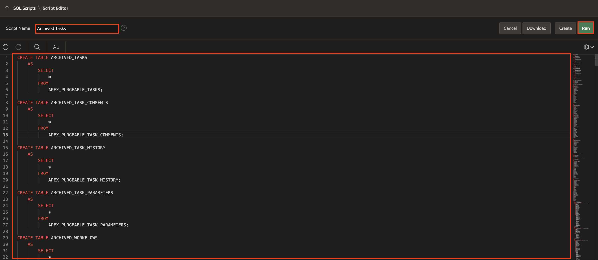

4. Click **Run Now**.

    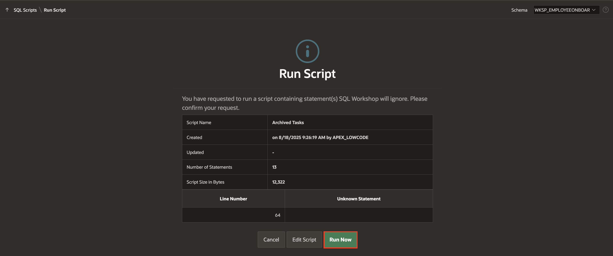

    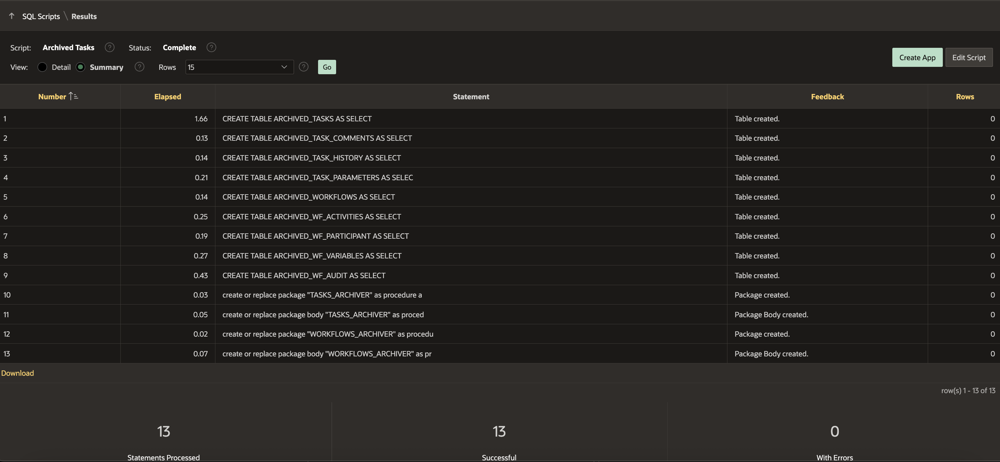

5. Now, go to **Employee Onboarding** application and navigate to **Shared Components**, under **Workflow and Automations**, select **Automations**.

    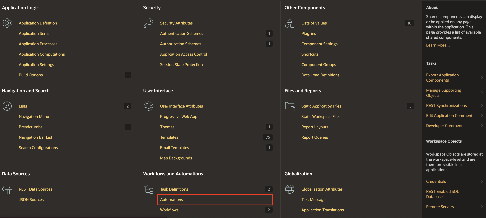

6. Select **Create Automation**.

    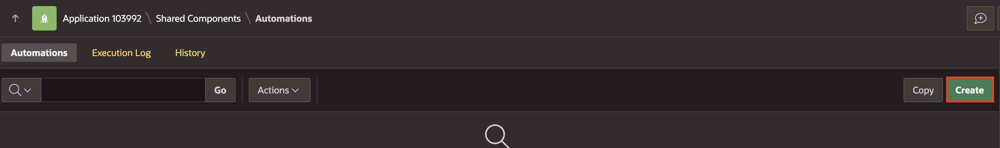

7. Enter/select the following:

    - Name: **Workflow Archiver**
    - Actions initiated on: **Query**
    - Execution Schedule: **Daily at Midnight**

    and click **Next**.

    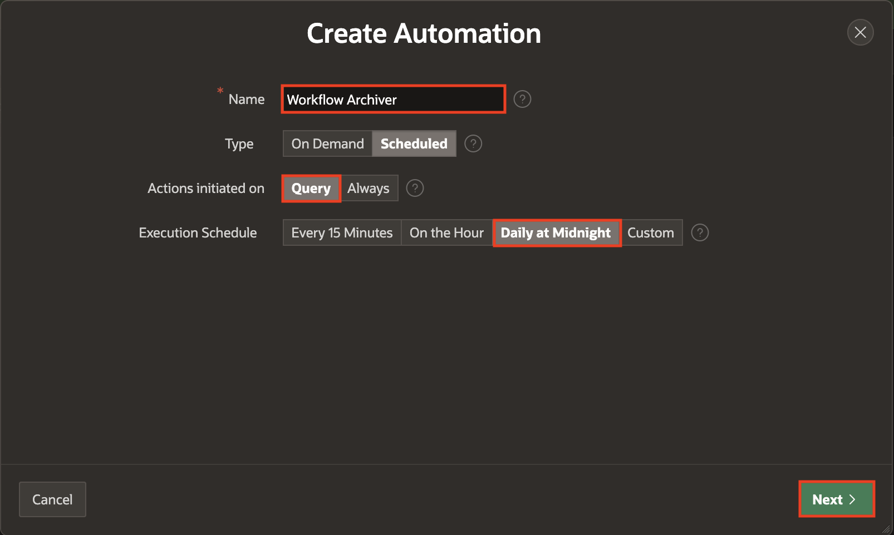

8. Enter/select the following:

    - Source: **SQL Query**
    - Enter a SQL SELECT Statement: copy and paste the following:

        ```
         <copy>
         select * from apex_purgeable_workflows;
         </copy>
        ```

        and click **create.

    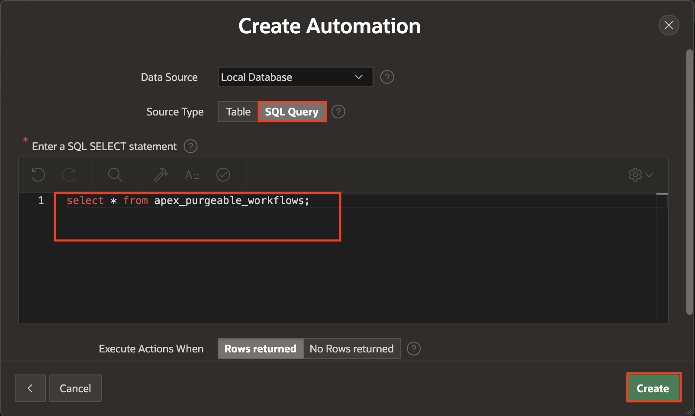

9. Navigate to the **Settings** tab and set the Schedule Status as **Active**.

    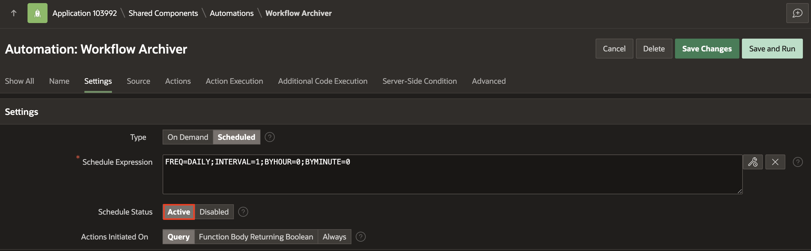

10. Navigate to the **Actions** tab and click on the **pencil icon** to edit the action.

    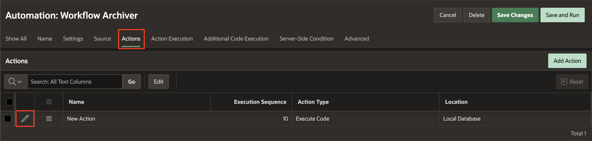

11. In the Edit Action page, enter the following:

    - Action > Name: **Archive Workflows**
    - Code > Code: copy and paste the below code

        ```
         <copy>
         begin
            workflows_archiver.archive_workflow;
            workflows_archiver.archive_activities;
            workflows_archiver.archive_variables;
            workflows_archiver.archive_participants;
            workflows_archiver.archive_audit;
         end;
         </copy>
        ````

    and click **Apply Chamges**.

    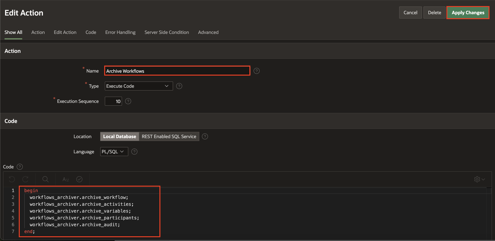

12. Click on **Save and Run**.

    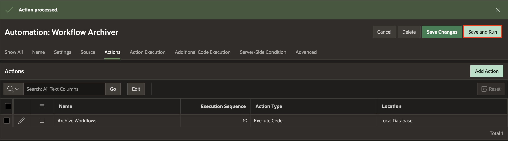

13. Similarly, create another **Automation** with the following property:

    - Name: **Tasks Archiver**

    - Execution Schedule: **Daily at Midnight**

    and click **Next**.

    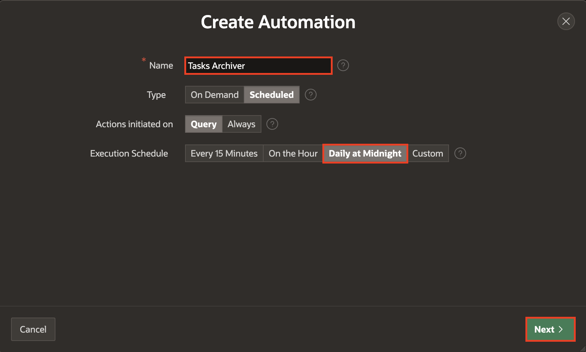

14. Enter/select the following:

    - Source: **SQL Query**
    - Enter a SQL SELECT Statement: copy and paste the following:

        ```
         <copy>
         select * from apex_purgeable_workflows;
         </copy>
        ```

        and click **create.

    

15. Navigate to the **Settings** tab and set the Schedule Status as **Active**.

    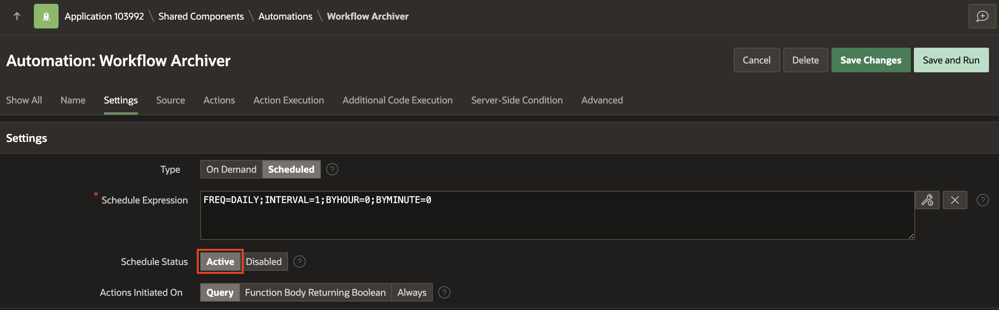

16. Navigate to the **Actions** tab and click on the **pencil icon** to edit the action.

    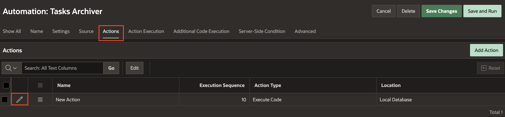

17. In the Edit Action page, enter the following:

    - Action > Name: **Archive Tasks**
    - Code > Code: copy and paste the below code

        ```
         <copy>
         begin
            tasks_archiver.archive_tasks;
            tasks_archiver.archive_params;
            tasks_archiver.archive_comments;
            tasks_archiver.archive_history;
         end;
         </copy>
        ````

    and click **Apply Chamges**.

    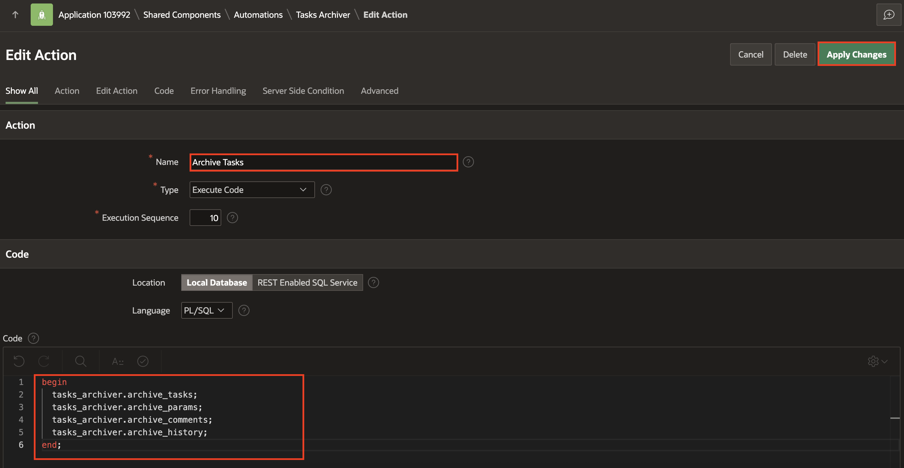

18. Click on **Save and Run**.

    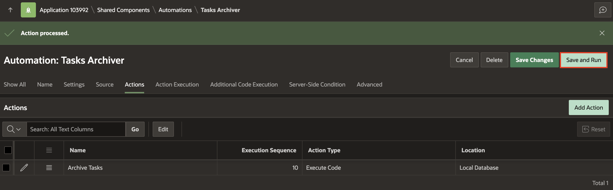

## Task 2: Create Archived Tasks Page

1. Navigate to the Application Home Page by clicking on the **Application ID**

    

2. Click **Create Page**.

    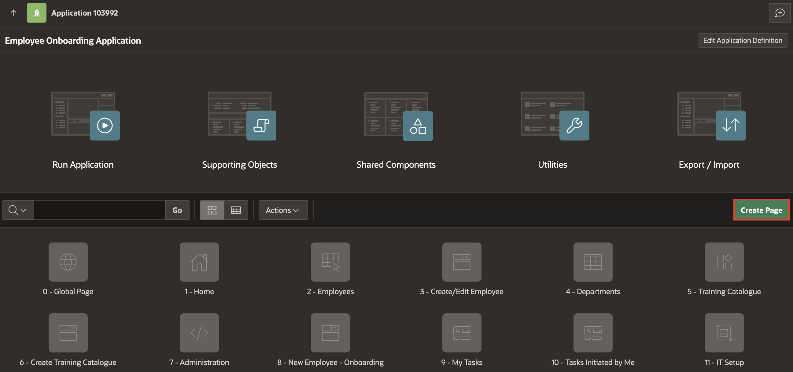

3. Select **Blank Page**.

    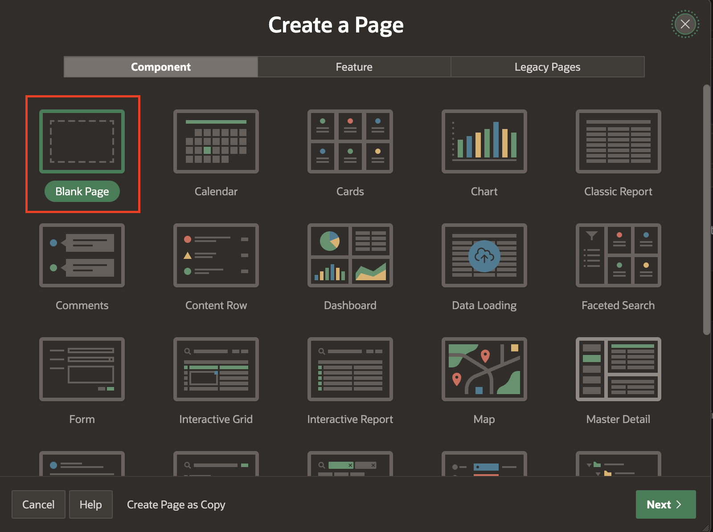

4. In the create page wizard, enter/select the following:

    - Page Definition: Name: **Archived Tasks and Workflows**
    - Navigation:
        - Breadcrumb: **Toggle OFF**
        - Icon: **fa-archive**

    Click **Create Page**.

    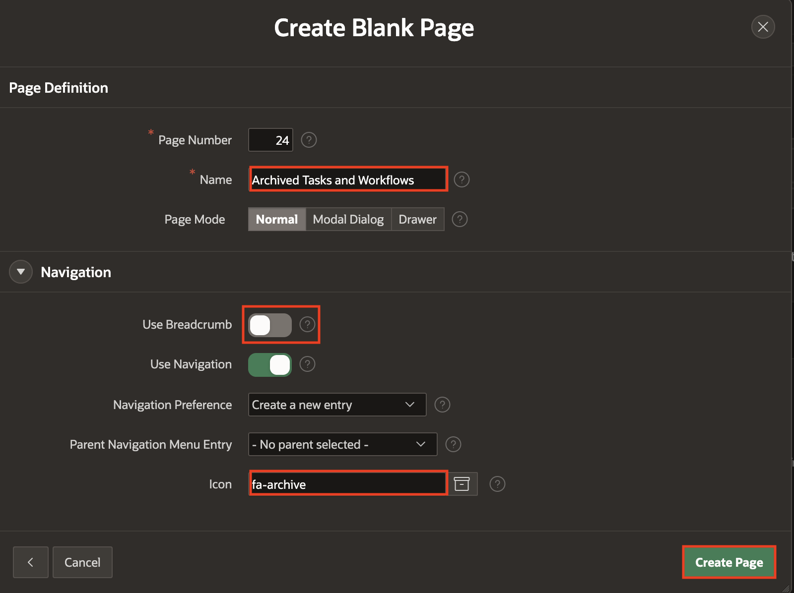

5. In the rendering tree, right click on **Body** and select **Create Region**.

    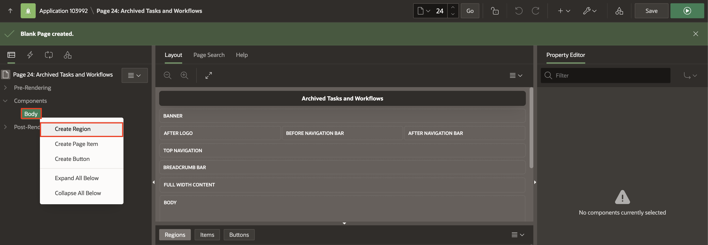

6.  In the property editor, enter/select following:

    - Identification > Name: **Show All**

    - Under Appearance:
        - Template: **Tabs Container**
        - Template Options:

            - Remember Active Tab: **Check**
            - Layout: **Fill Tab Labels**

            Click **Ok**

    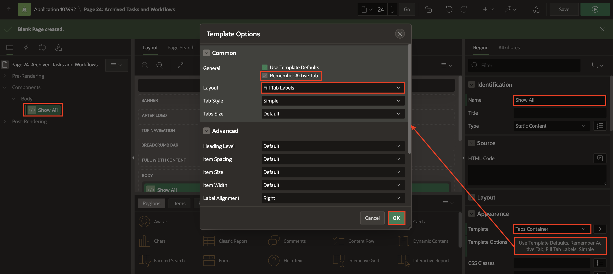

7. In the property editor, right click on the **Show All** region and select **Create Sub Region**.

     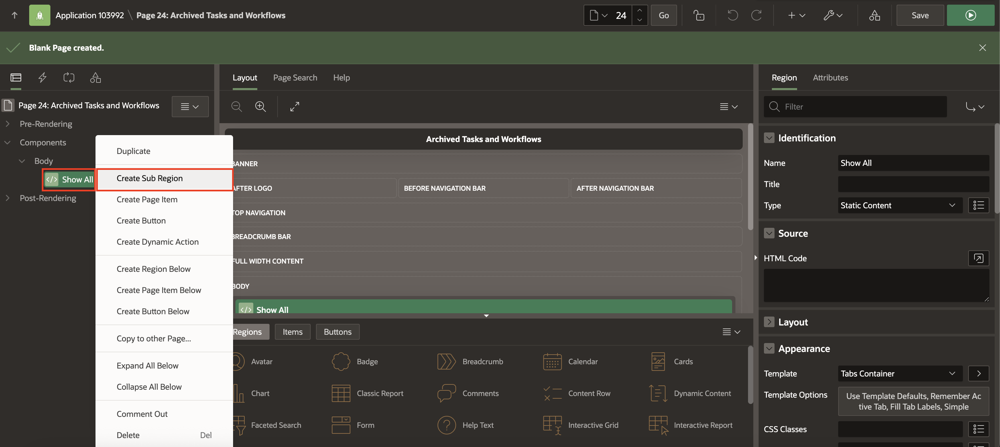

8. In the property editor, enter/select the following:

    - Under Identification:

        - Name: **Archived Tasks**

        - Type: **Interactive Report**

    - Source > Table Name: **ARCHIVED_TASKS**


     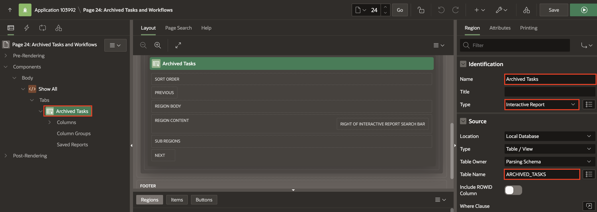

9. Similary create another sub region to view Archived Tasks History, with the following attributes:

    - Under Identification:

        - Name: **Archived Tasks History**

        - Type: **Interactive Report**

    - Source > Table Name: **ARCHIVED_TASK_HISTORY**


     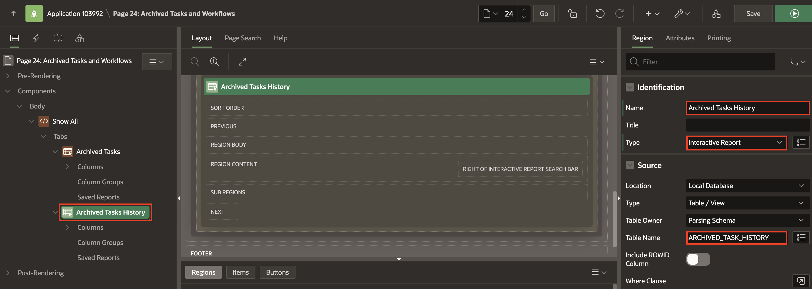

10. Similary create another sub region for Archived Wrorkflows, with the following attributes:

    - Under Identification:

        - Name: **Archived Workflows**

        - Type: **Interactive Report**

    - Source > Table Name: **ARCHIVED_TASK_HISTORY**


     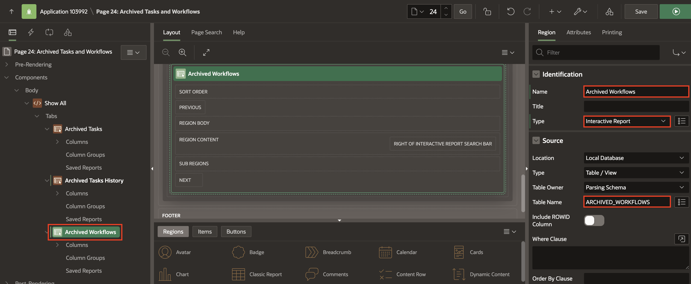

11. Click **Save**.

    

## Summary

You have successfully created a comprehensive Oracle APEX application for managing doctor appointments with workflows, task lists, and feedback features.

## What's Next

In the next lab, you will understand the behavior of the **Doctor Appointments Made Easy!** application through hands-on activities. You will also perform various tasks to understand the workflow and automation implemented in the application.

## Acknowledgements

- **Author** - Roopesh Thokala, Senior Product Manager; Sahaana Manavalan, Senior Product Manager, August 2025
- **Last Updated By/Date** - Sahaana Manavalan, Senior Product Manager, August 2025
