# Create Task and Workflow Pages in the Application

## Introduction

In this lab, you will extend the Employee Onboarding application by creating and configuring multiple pages that support the onboarding process. The workflow you built earlier will now be tied to user-facing pages, enabling HR, IT teams, and New Hires to initiate and act upon employee related tasks.
This exercise demonstrates how to create form pages, configure workflow processes, manage IT setup, schedule trainings and track tasks, resulting in a fully functional onboarding solution.

### Objectives

In this lab, you will learn how to:

- Create the New Employee Page to capture employee details for onboarding.

- Configure Workflow Processes to automatically trigger onboarding workflows.

- Build IT Tasks Page to handle email setup and laptop allocation.

- Develop Unified Task List Pages to view and act on tasks.

- Customize Task Details Pages.

- Create Workflow Console Pages for employees to monitor workflows they initiated or own.

Estimated Time: 40 minutes

### Prerequisites

- All the previous Labs have been completed.

## Task 1: Create a New Employee Onboarding Page

Now that the Workflow is created, let us create a page that HR will use to Onboard a New Employee.

1. Navigate to **Application ID <-number->**.

    

2. Click **Create Page**.

    

3. Select **Form**.

    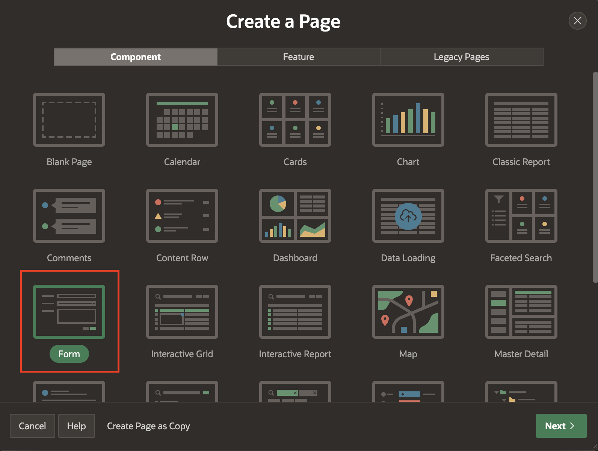

4. For Page Attributes, enter/select the following:

    - Page Definition > Name: **New Employee - Onboarding**

    - Data Source > Table/View Name: **EMPLOYEES**

    - Navigation > Breadcrumb Parent Entry: **Home (Page 1)**

     Click **Next**.

    

5. Select Primary Key Column 1 : **EMPLOYEE_ID (Number)**.
    Click **Create Page**.

    

6. In the Page Designer, in the rendering tree, select **New Employee - Onboarding** region and in the property editor, make the following changes:

    - Under Appearance:

        - Template Options: In the pop-up box
            - Header: **Hidden**

            Click **Ok**.

    

7. In the rendering tree, under **New Employee - Onboarding** region and select **P8\_LAST\_NAME**.

     

8. In the property editor, under Layout > Start New Row : **Toggle OFF**.

     

9. Similarly, do the same for following 4 Page Items:
    - **P8\_PHONE**
    - **P8\_DEPARTMENT\_ID**
    - **P8\_MANAGER\_ID**
    - **P8\_LOCATION**

     

10. Select **P8\_STATUS**, **P8\_LAPTOP\_INFO** , **P8\_SEAT\_INFO** and **P8\_VPN\_DETAILS**, and in the property editor, set Identification > Type: **Hidden**

    

11. Select **P8\_EMPLOYEE\_TYPE**, in the property editor, enter/select the following:

      - Identification > Type: **Select One**

      - Apperance > Template: **Required - Floating**

      - Validation > Value Required - **Toggle ON**

      - Under List of Values:

        - Type: **Static Values**
        - Static Values: enter the following

            |Display Value | Return Value |
            |----------|-------|
            | Full-Time | Full Time  |
            | Intern | Intern |
            {: title="List of Static Values to be Created"}

            Click **OK**.

        

12. In the rendering tree, select **P8\_EMAIL** item and in the property editor, set the Label > Label as **Personal Email**.

    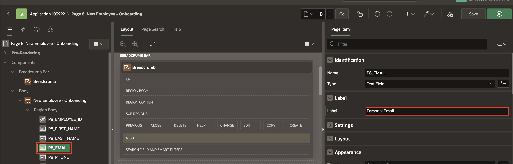

13. Select **P8\_FIRST\_NAME**, **P8\_EMAIL** , **P8\_DEPARTMENT\_ID**, and **P8\_MANAGER\_ID** and **P8\_JOINING\_DATE**, in the property editor, select the following:

    - Apperance > Template: **Required - Floating**

    - Validation > Value Required - **Toggle ON**

    

14. Select **P8\_DEPARTMENT\_ID** and in the property editor, set Label > Label: **Department**

    

15. Similarly, select **P8\_MANAGER\_ID** and in the property editor, set Label > Label: **Manager**

    

16. Click **Save**.

    

## Task 2: Create and Configure Page Process

1. Navigate to the **Processing** tab.

2. Under **Processing** tab, right-click **Processing** and select **Create Process**.

    

3. In the property editor, enter/select the following:

      - Under Identification:

          - Name: **Initiate Employee Onboarding Workflow**

          - Type: **Workflow**

      - Under Settings:

          - Definition: **Employee Onboarding**

          - Details Primary Key Item: **P8\_EMPLOYEE\_ID**

      - Success message: **Employee Onboarding Initiated**

     

4. Now, configure Parameters for the Workflow Page Process. Update the following **Parameters** one after the other:

    | Parameter |  Type  | Item |
    | --- |  --- | ---- |
    | Department ID | Item | P8\_DEPARTMENT\_ID |
    | Email | Item | P8\_EMAIL |
    | Employee ID | Item | P8\_EMPLOYEE\_ID |
    | Employee Name | Item | P8\_FIRST\_NAME |
    | Employment Type | Item | P8\_EMPLOYMENT\_TYPE |
    | Initiated By | Expression |    :APP_USER      |
    {: title="List of Parameters to be linked"}

    

    *Note: Your Page Number may vary.*

5. Click **Save**.

    

## Task 3: Create Page for IT Tasks

In this task you will create a page to create an email id and allocate laptop to the employee.

1. Click **+ (Plus) Icon** on the top-right corner of the page designer. Select **Page** from the drop-down.

    

2. Select **Blank Page**.

   

3. Specify the following page attributes:

    - Name: **IT Setup**

    - Page Mode Context: **Modal Dialog**

    Click **Create Page**.

    

4. In the rendering tree, right click on **Components** and select **Create Region**.

    

5. In the property editor, enter Identification > Name: **IT Setup**.

    

6. Right click on the **IT Setup** region and select **Create Page Item**.

   

7. In the property editor, enter/select the following:

    - Under Identification:

        - Name: **P11\_SETUP\_INFO**
        - Type: **Hidden**

   

8. Similarly, create another **Page Item** with the following property:

    - Under Identification:

        - Name: **P11\_EMPLOYEE\_ID**
        - Type: **Display Only**

    - Label > Label: **Employee ID**

    

9. Similarly, create another **Page Item** with the following properties:

    - Under Identification:

        - Name: **P11\_FIRST\_NAME**
        - Type: **Display Only**

    - Label > Label: **First Name**

    - Default:

        - Type: **SQL Query (return single value)**
        - SQL Query: copy and paste the below code

            ```
             <copy>
             SELECT FIRST_NAME FROM EMPLOYEES WHERE EMPLOYEE_ID = :P11_EMPLOYEE_ID;
             </copy>
            ```

    

10. Now, right click on the **IT Setup** region and select **Create Sub Region**.

    

11. In the property editor, enter/select the following:

    - Identification > Name: **Create Email**

    - Appearance > Template: **Blank with Attributes (No Grid)**

    - Under Server-side Condition:

        - Type: **Item = Value**
        - Item: **P11\_SETUP\_INFO**
        - Value: **Create Email**

    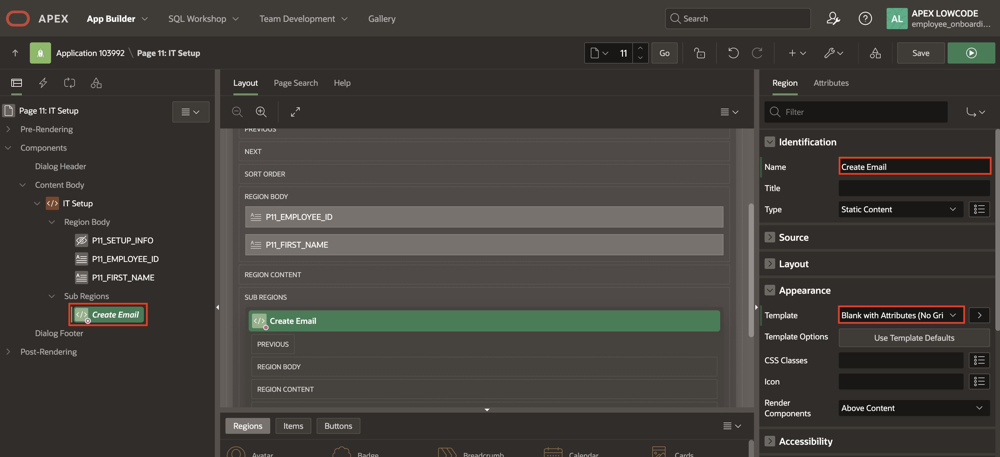

    

12. Right click on the **Create Email** region and select **Create Page Item**.

    

13. In the property editor, enter/select the following:

    - Identification > Name: **P11\_EMAIL\_ID**

    - Label > Label: **New Email ID**

    - Appearance > Template: **Required - Floating**

    - Validation > Value Required: **Toggle ON**

    

    

14. Similarly, create another sub region under **IT Setup** region and select **Create Region**.

    

15. In the property editor, enter/select the following:

    - Identification > Name: **Allocate Laptop**

    - Appearance > Template: **Blank with Attributes (No Grid)**

    - Under Server-side Condition:

        - Type: **Item = Value**
        - Item: **P11\_SETUP\_INFO**
        - Value: **Allocate Laptop**

    

16. Right click on the **Allocate Laptop** region and select **Create Page Item**.

    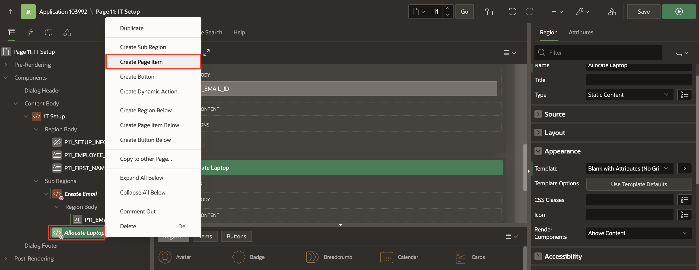

17. In the property editor, enter/select the following:

    - Under Identification:

        - Name: **P11\_LAPTOP\_INFO**
        - Type: **Rich Text Editor**

    - Label > Label: **Laptop Info**

    - Appearance > Template: **Required - Floating**

    - Validation > Value Required: **Toggle ON**

    - Under Default:

        - Type: **Static**
        - Static Value: copy and past the below text

            ```
             <copy>
             ### Laptop Allocation Information:

             - **Laptop Model**:
             - **Asset Tag / Serial Number**:
             - **Pickup/Delivery Details**: [e.g., Pick up from IT desk, courier tracking info]
             - **Setup Instructions**: [Link or brief steps]
             </copy>
            ```

    

    

    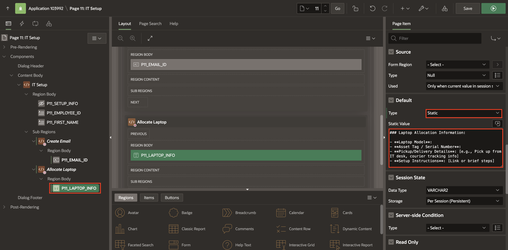

18. In the **rendering tree**, right click on the **Dialog Footer** region and select **Create Region**.

    

19. In the property editor, enter/select the following:

    - Identification > Name: **Buttons Container**

    - Appearance > Template: **Buttons Container**

    

20. In the rendering tree, click on the **Buttons Container** region and select **Create Button**.

    

21. In the property editor, enter/select the following:

    - Under Identification:

        - Button Name: **Submit**
        - Label: **&P11\_SETUP\_INFO.**

    - Appearance > Hot: **Toggle ON**

    

22. Now, navigate to the **Processing** tab and right click on **Processing**, select **Create Process**.

    

23. In the Property editor, enter/select the following:

    - Identification > Name: **Update Email Address**

    - Source > PL/SQL code: enter the following code snippet

        ```
        <copy>
         UPDATE EMPLOYEES SET EMAIL = :P11_EMAIL_ID WHERE EMPLOYEE_ID = :P11_EMPLOYEE_ID;
         UPDATE IT_PROVISIONING SET EMAIL_CREATED = 'Y' WHERE EMPLOYEE_ID = :P11_EMPLOYEE_ID;
        </copy>
        ```

    *Note: Your page item may vary.*

    - Under Server-side Condition:

        - Type: **Item = Value**
        - Item: **P11\_SETUP\_INFO**
        - Value: **Create Email**

    

    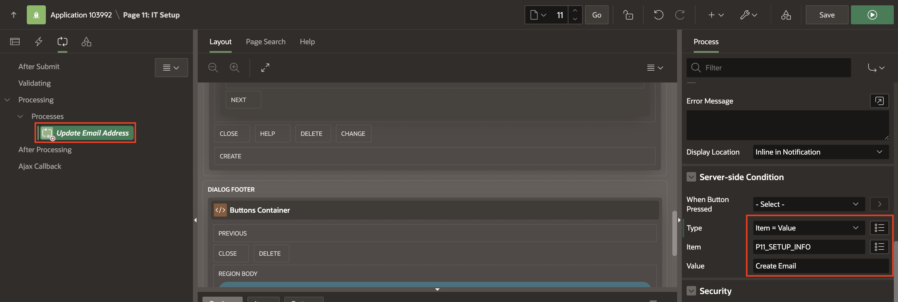

24. Similarly, create another process with the following property:

    - Identification > Name: **Update Laptop Details**

    - PL/SQL code: enter the following code snippet:

        ```
        <copy>
         UPDATE EMPLOYEES SET LAPTOP_INFO = :P11_LAPTOP_INFO WHERE EMPLOYEE_ID = :P11_EMPLOYEE_ID;
         UPDATE IT_PROVISIONING SET LAPTOP_ALLOCATED = 'Y' WHERE EMPLOYEE_ID = :P11_EMPLOYEE_ID;
        </copy>
        ```

    - Under Server-side Condition:

        - Type: **Item = Value**
        - Item: **P11\_SETUP\_INFO**
        - Value: **Allocate Laptop**

    

    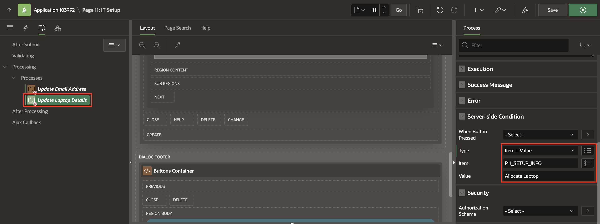

25. Similarly, create another process with the following property:

    - Under Identification:

        - Name: **Close Dialog**
        - Type: **Close Dialog**

    

26. Click **Save**.

    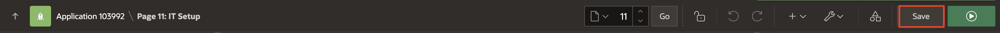

## Task 4: Create Tasks Page

1. Click **+ (Plus) Icon** on the top-right corner of the page designer. Select **Page** from the drop-down.

    

2. Select **Unified Task List**.

   

3. Specify the following page attributes:

    - Name: **My Tasks**

    - Report Context: **My Tasks**

    Click **Create Page**.

    

4. Our application has 1 entry point for IT teams. IT need to log in to create an email and allocate a laptop for the new hire. For this, you will create a IT Tasks page. This will also be a Unified Task List page for IT team to act on the tasks assigned to them.

5. To create another Unified Task list page, click **+ (Plus) Icon** on the top-right corner of the page designer toolbar. Select **Page** from the drop-down.

    

6. Select **Unified Task List**.

    

7. Specify the following page attributes:

    - Name: **Tasks Initiated by Me**

    - Report Context: **Initiated by Me**

    Click **Create Page**.

    

## Task 5: Modify the Task Details Pages

Our Application has two Task Definitions -  IT Setup and Allocate Trainings. For each of them, we have created a Task Details page. In this task, we will rename the Pages so that they appear more meaningful in the Application.

 *Note: Your Task Definition page numbers may be different. Ensure that you update the provided SQL queries in the lab to reference the correct page item numbers in your application.*

1. Click on the **Shared Components icon**.

    

2. Select **Task Definitions**.

    

3. In the Task Definitions page, click **IT Setup**.

    

4. In the Task Definition Editor, under **Settings** note the page number in the **Task Details URL** (f?p=&APP\_ID.:35:&SESSION.::&DEBUG.:RP,35:P35\_TASK\_ID:&TASK\_ID.). This points to Page 35.

    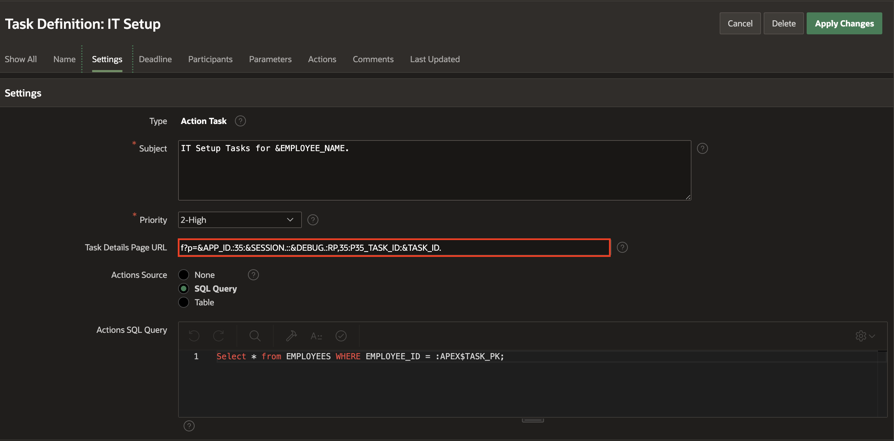

5. Navigate to your application home page and click **Page 35**.

    

6. Now, update the following in the Property Editor:

    - Name: **IT Setup Task Details**

    - Title: **IT Setup Task Details**

    

7. In the rendering tree, right click on **Content Body** and select **Create Region**.

    

8. In the Property editor, enter/select the following: (*Note: Your Task Definition page numbers may be different. Ensure that you update the below SQL query to reference the correct page item numbers in your application.*)

    - Under Identification:

        - Name: **IT Task - Status**
        - Type: **Content Row**

    - Under Source:

        - Type: **SQL Query**
        - SQL Query: copy and paste the below code
            ```
             <copy>
             SELECT
             ip.employee_id,
             ip.task_name,
             CASE
                WHEN ip.status = 'Y' THEN 'Completed'
                ELSE 'Pending'
             END AS task_status,
             CASE
                WHEN ip.status = 'Y' THEN 'success'
                ELSE 'danger'
             END AS response_color
             FROM (
                SELECT
                    employee_id,
                    email_created AS status,
                    'Create Email' AS task_name
                FROM it_provisioning
                UNION ALL
                SELECT
                    employee_id,
                    laptop_allocated AS status,
                    'Allocate Laptop' AS task_name
                FROM it_provisioning
             ) ip
             WHERE ip.employee_id IN (
                SELECT TO_NUMBER(param_value)
                FROM apex_task_parameters
                WHERE task_id = NVL(:P35_TASK_ID, 0)  -- Replace P35 with your Task Detail page number
                AND is_visible = 'Y'
                AND param_label = 'Employee ID'
                AND REGEXP_LIKE(param_value, '^\d+$')
             )
             </copy>
            ```

        - Page Items to Submit: **P35\_TASK\_ID**

    - Layout > Sequence: **45**

    - Appearance > Template: **Standard**

    - Under Server-side Condition:

        - Type: **Expression**
        - PL/SQL Expression: copy and paste the below code

            ```
             <copy>
             apex_human_task.is_allowed (
                p_task_id   => :P35_TASK_ID,
                p_operation => apex_human_task.c_task_op_complete ) ----Replace P35 with your Task Detail page number
             </copy>
            ```

    

    

    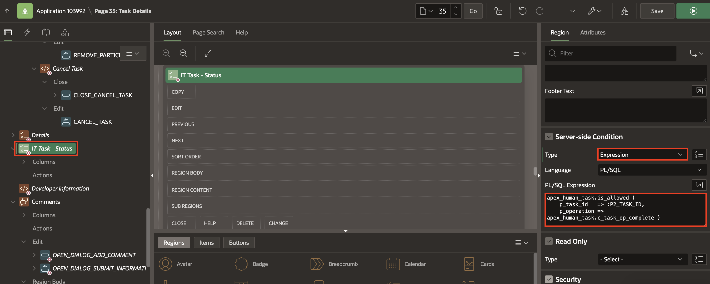

9. Click on the **Attributes** tab of IT Task - Status region, and enter/select the following:

    - Under Settings:

        - Overline: **Employee ID: &EMPLOYEE_ID.**
        - Title: **Task Name: &TASK_NAME.**
        - Display Badge: **Toggle ON**

    - Under Badge:

        - Label: **&TASK_STATUS.**
        - Value: **TASK_STATUS**
        - State: **RESPONSE_COLOR**

    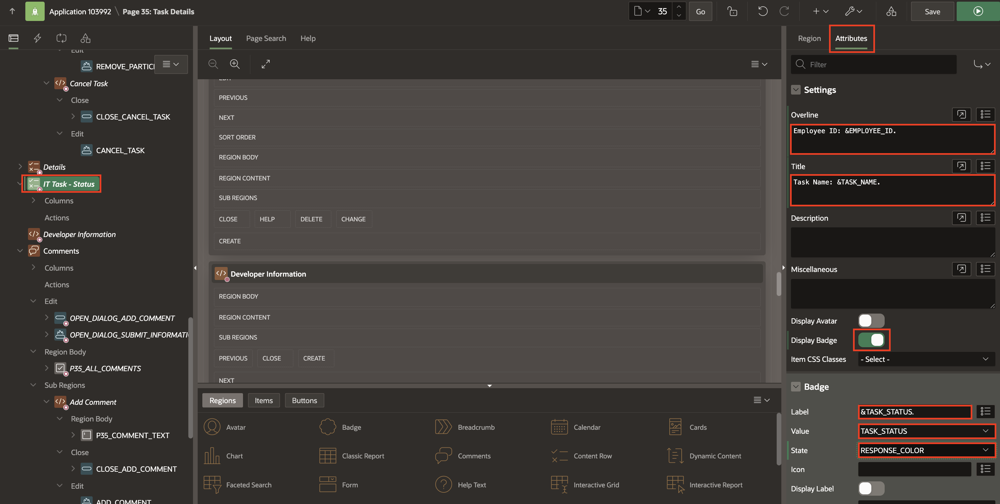

10. In the rendering tree, under **IT Task- Status**, right click on **Actions** and select **Create Action**.

    

11. In the property editor, enter/select the following:

    - Under Identification:

        - Position: **Primary Actions**
        - Template: **Button**
        - Label: **&TASK\_NAME.**

    - Under Link:

        - Target:
            - Page: **11**

              *Note: This should link to the IT Setup page. Your page numbers may vary.*

            - Set Items:

                |  Name     |   Value    |
                |--------------------|------------|
                | P11\_EMPLOYEE\_ID   | &EMPLOYEE_ID. |
                | P11\_SETUP\_INFO       | &TASK_NAME. |
                {: title="List of Parameters to be added for Link Builder Target - Set Items"}

                Click **Ok**.

    

12. Under **Rendering** tab, navigate to **IT Setup Task Details > Components > Content Body > Developer Information**. Right-click **Developer Information** region and click **Delete**.

    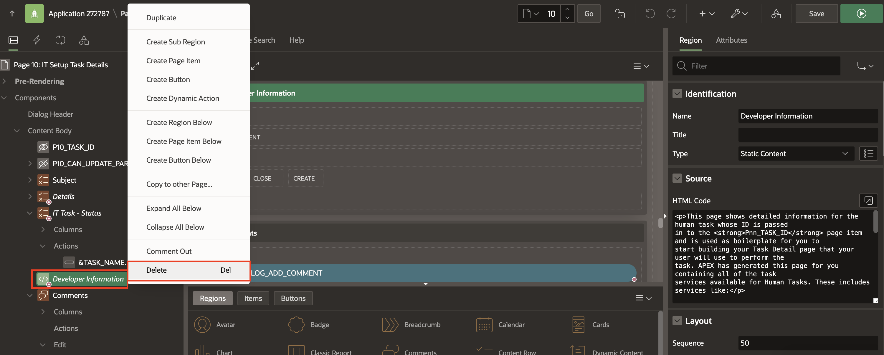

13. Save the Page.

    

14. You now need to change the Allocate Trainings Details Page.

    Navigate to **Shared Components > Task Definition > Allocate Trainings** and similarly check the page number for the Task Details. The **Allocate Trainings** Task Definition points to Page 36.

    *Note: Your Task Definition page number may be different.*

15. Navigate to your application home page and click **Page 36**.

16. Now, update the following in the Property Editor:

    - Name: **Allocate Trainings Task Details**

    - Title: **Allocate Trainings Task Details**

    

17. Under **Rendering** tab, navigate to **Allocate Trainings > Components > Content Body > Developer Information**. Right-click **Developer Information** region and click **Delete**.

    

18. In the Task details Page, the New Employee should be able to view all the trainings assigned to them and mark it as Complete. We will customize the Allocate Trainings Details Page as follows:

    - Right-click  **Subject** and select **Create Region Below**.

    

19. Select the newly created region and in the Property Editor, enter/select the following:

    - Under Identification:

        - Name: **Training Details**
        - Type: **Content Row**

    - Under Source:

        - Type: **SQL Query**
        - SQL Query: copy and paste the below code

            ```
             <copy>
             SELECT et.training_id,
             e.FIRST_NAME AS EMPLOYEE_NAME,
             tc.TRAINING_NAME,
             et.STATUS,
             et.Employee_ID,
             CASE
                WHEN et.STATUS = 'Completed' THEN 'success'
                WHEN et.STATUS = 'Not Started' THEN 'warning'
                ELSE 'danger'
             END AS response_color
             FROM EMPLOYEE_TRAININGS et
             JOIN EMPLOYEES e
             ON e.EMPLOYEE_ID = et.EMPLOYEE_ID
             JOIN TRAINING_CATALOG tc
             ON tc.CATALOG_ID = et.CATALOG_ID
             WHERE e.EMAIL = (
                SELECT param_value
                FROM apex_task_parameters
                WHERE task_id = :P36_TASK_ID -- Replace P36 with your Task Detail page number
                AND is_visible = 'Y'
                AND param_label = 'Email'
             );
             </copy>
            ```

            - Page Items to submit: **P36\_TASK\_ID**

    

    *Note: Your Task Definition page numbers may be different. Ensure that you update the provided SQL query to reference the correct page item numbers in your application.*

20. In the **Attributes** tab, enter/select the following:

    - Under Settings:

        - Title: **&TRAINING_NAME.**
        - Description:

            ```
             <copy>
             Employee Name: &EMPLOYEE_NAME. <br>
             Training Status: &STATUS.
             </copy>
            ```

        - Display Badge: Toggle **ON**

    - Under Badge:

        - Label: **&STATUS.**
        - Value: **Status**
        - State: **RESPONSE_COLOR**

    

    

21. In the rendering tree, under **Training Details**, right click on **Actions** and select **Create Action**.

    

22. In the property editor, enter/select the following:

    - Under Identification:

        - Position: **Primary Actions**
        - Template: **Button**
        - Label: **Mark Complete**

    - Under Link:

        - Type: **Redirect to URL**
        - Target: **javascript:apex.event.trigger(document,'mark\_complete',&TRAINING\_ID.)**

    

23. In the rendering tree, right click on **Content Body** and select **Create Page Item**.

    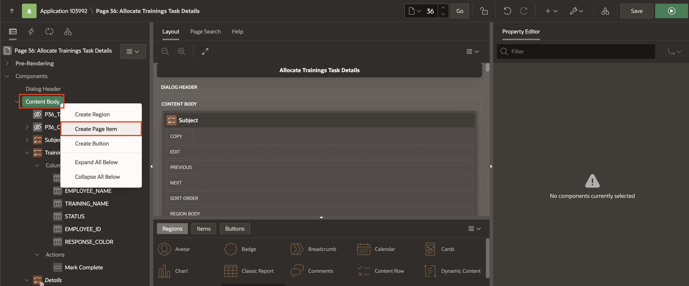

24. In the property editor, enter/select the following:

    - Under Identification:

        - Name: **P36\_TRAINING\_ID**
        - Type: **Hidden**

    - Settings > Value Protected: **Toggle OFF**

    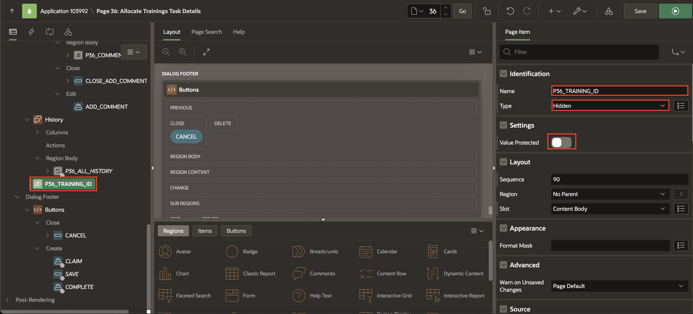

25. Navigate to **Dynamic Actions** tab, right click on  **Events** and select **Create Dynamic Action**.

    

26. In the property editor, enter/select the following:

    - Identification: Name > **Update Employee Trainings**

    - Under When:

        - Event: **Custom**
        - Custom Event: **mark_complete**
        - Selection Type: **JavaScript Expression**
        - JavaScript Expression: **document**

        

27. Under **True** action, select **Show** and enter/select the following in the property editor:

    - Identification: Action > **Set Value**

    - Under Settings:

        - Set Type: **JavaScript Expression**
        - JavaScript Expression: **this.data**

    - Affected Elements:

        - Selection Type: **Item(s)**
        - Item(s): **P36\_TRAINING\_ID**

       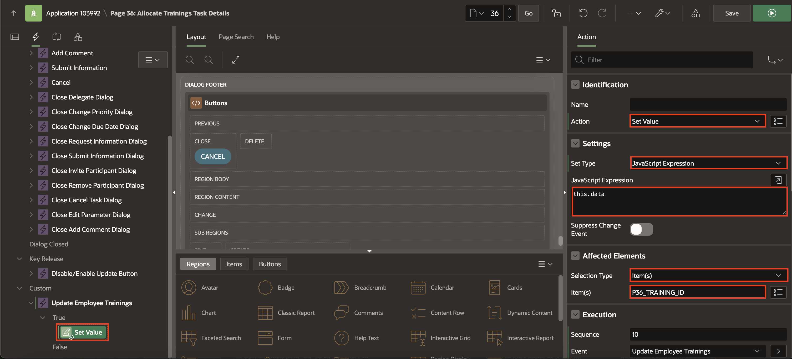

28. In the rendering tree, right click on **True** and click **Create TRUE Action**.

       

29. In the property editor, enter/select the following:

     - Identification: Action > **Execute Server-side Code**

     - Under Settings:

        -  PL/SQL: copy and paste the below code

            ```
             <copy>
             UPDATE EMPLOYEE_TRAININGS SET STATUS = 'Completed' where training_id=:P36_TRAINING_ID; -- Replace P36 with your Task Detail page number
             </copy>
            ```

        - Items to Submit: **P36\_TRAINING\_ID**

       

    *Note: Your Task Definition page numbers may be different. Ensure that you update the provided SQL query to reference the correct page item numbers in your application.*

30. Similary, create another **TRUE** action, with the following properties:

     - Identification: Action > **Refresh**

     - Under Affected Items:

        - Selection Type: **Region**
        - Region: **Training Details**

       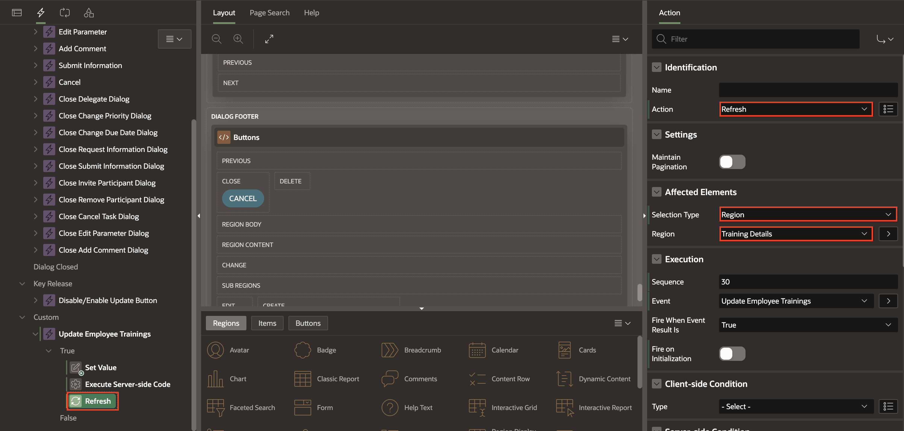

31. Click **Save**.

       

## Task 6: Create Initiated By Me Workflow Page

Finally, we need the page that the HR will use to monitor the employee onboarding workflow.

We use the Workflow Console and Details pages with **Initiated By Me** report context, which allows a logged-in user to view all Workflows Initiated by him or her.

> **Note:** The Workflow Console allows workspace users to view and manage their workflow instances, including My Workflows for workflow owners, Admin Workflows for workflow administrators, and Initiated by Me for workflow initiators. When configuring the Workflow Console, you have different Report Contexts to choose from.

1. To create the Workflow Console and Details pages, click **+ (Plus) Icon** on the right-above corner of the page designer. Then, select **Page** from the drop-down, select **Create Page**.

2. Select **Workflow Console**.

    

3. In the Create Workflow Console wizard, enter/select the following:

    - Under Page Definition:

        - Name: **Workflows Initiated By Me**

        - Report Context: **Initiated By Me**

        - Include Dashboard Page: **Toggle On**

        - Dashboard Page Name: **Workflow Dashboard**

        - Form Page Name: **Initiated By Me Form**. ( This is used for the Workflow Details page.)

    Click **Create Page**.

    

## Task 7: Create My Workflows Page

1. To create the Workflow Console and Details pages, click **+ (Plus) Icon** on the right-above corner of the page designer. Then, select **Page** from the drop-down., select **Create Page**.

    

2. Select **Workflow Console**.

    

3. In the Create Workflow Console wizard, enter/select the following:

    - Under Page Definition:

        - Name: **My Workflows**

        - Report Context: **My Workflows**

        - Form Page Name: **My Workflows Form**. This is used for the Workflow Details page.

    Click **Create Page**.

    

4. Click **Save and Run** and navigate through different pages to demonstrate the workflow, tasks, and feedback functionalities.

    

## Summary

You have successfully created a comprehensive Oracle APEX application for Onboarding New Employees with workflows and task lists.

## Acknowledgements

- **Author** - Sahaana Manavalan, Senior Product Manager; Roopesh Thokala, Senior Product Manager, August 2025
- **Last Updated By/Date** - Sahaana Manavalan, Senior Product Manager, August 2025
