# Archiving Tasks and Workflows in Oracle APEX

## Introduction

In any workflow-based application, retaining historical records is crucial for auditing, compliance, and process tracking. Oracle APEX provides purgeable views for tasks and workflows, but without proper archiving, important data might be lost once purged. To address this, we can create SQL scripts, packages, and automations that safely archive tasks and workflows into dedicated tables.

This lab guides you through building a complete archiving solution. You will create SQL scripts to define archive tables and PL/SQL packages, set up automations to execute the archiving process daily, and design a page to view archived tasks and workflows.

### Objectives

In this lab, you will learn how to:

- Create a SQL Script to build archive tables and PL/SQL packages (TASKS\_ARCHIVER and WORKFLOWS\_ARCHIVER).

- Set up Oracle APEX Automations that run daily to archive workflows and tasks.

- Build an APEX page with interactive reports to view archived tasks, workflows, and their history.

By the end of this lab, you’ll have an automated archiving system that keeps your workflow data safe and accessible for long-term reference.

Estimated Time: 10 minutes

Watch the video below for a quick walk-through of the lab.
[Create an APEX App](videohub:1_j2wat4sw)

Watch the video below for a quick walk-through of the lab.
[Create an APEX App](videohub:1_j2wat4sw)

Watch the video below for a quick walk-through of the lab.
[Create an APEX App](videohub:1_j2wat4sw)

### Prerequisites

- All the previous Labs have been completed.

## Task 1: Create a SQL Script Page

Now that the Workflow is created, let us create a SQL script that archives workflows and tasks.

1. Navigate to **SQL Workshop** > **SQL Scripts**.

    

2. Click **Create Script**.

    

3. Enter Script Name : **Archived Tasks** and copy paste the below code :

    ```
     <copy>
     CREATE TABLE ARCHIVED_TASKS
            AS
                SELECT
                    *
                FROM
                    APEX_PURGEABLE_TASKS;

        CREATE TABLE ARCHIVED_TASK_COMMENTS
            AS
                SELECT
                    *
                FROM
                    APEX_PURGEABLE_TASK_COMMENTS;

        CREATE TABLE ARCHIVED_TASK_HISTORY
            AS
                SELECT
                    *
                FROM
                    APEX_PURGEABLE_TASK_HISTORY;

        CREATE TABLE ARCHIVED_TASK_PARAMETERS
            AS
                SELECT
                    *
                FROM
                    APEX_PURGEABLE_TASK_PARAMETERS;

        CREATE TABLE ARCHIVED_WORKFLOWS
            AS
                SELECT
                    *
                FROM
                    APEX_PURGEABLE_WORKFLOWS;

        CREATE TABLE ARCHIVED_WF_ACTIVITIES
            AS
                SELECT
                    *
                FROM
                    APEX_PURGEABLE_WF_ACTIVITIES;

        CREATE TABLE ARCHIVED_WF_PARTICIPANT
            AS
                SELECT
                    *
                FROM
                    APEX_PURGEABLE_WF_PARTICIPANT;

        CREATE TABLE ARCHIVED_WF_VARIABLES
            AS
                SELECT
                    *
                FROM
                    APEX_PURGEABLE_WF_VARIABLES;

        CREATE TABLE ARCHIVED_WF_AUDIT
            AS
                SELECT
                    *
                FROM
                    APEX_PURGEABLE_WF_AUDIT;

        /

        create or replace package "TASKS_ARCHIVER" as

        procedure archive_tasks;
        procedure archive_comments;
        procedure archive_history;
        procedure archive_params;

        end "TASKS_ARCHIVER";
        /

        create or replace package body "TASKS_ARCHIVER" as

        procedure archive_tasks is
        begin
        merge
        into archived_tasks   at
        using apex_purgeable_tasks t
        on (at.task_id = t.task_id)
        when not matched then insert
        (at.task_id,
        at.workspace_id,
        at.workspace,
        at.application_id,
        at.application_name,
        at.task_def_name,
        at.task_def_static_id,
        at.task_def_id,
        at.state,
        at.subject,
        at.task_type_code,
        at.state_code,
        at.initiator,
        at.detail_pk,
        at.outcome_code,
        at.due_on,
        at.priority,
        at.created_on)
        values (
        t.task_id,
        t.workspace_id,
        t.workspace,
        t.application_id,
        t.application_name,
        t.task_def_name,
        t.task_def_static_id,
        t.task_def_id,
        t.state,
        t.subject,
        t.task_type_code,
        t.state_code,
        t.initiator,
        t.detail_pk,
        t.outcome_code,
        t.due_on,
        t.priority,
        t.created_on);

        end archive_tasks;

        procedure archive_comments is
        begin
        merge
        into archived_task_comments   at
        using apex_purgeable_task_comments t
        on (at.task_id = t.task_id)
        when not matched then insert
        (at.task_id,
        at.workspace_display_name,
        at.workspace,
        at.application_id,
        at.application_name,
        at.text,
        at.created_by,
        at.created_on)
        values (
        t.task_id,
        t.workspace_display_name,
        t.workspace,
        t.application_id,
        t.application_name,
        t.text,
        t.created_by,
        t.created_on);
        end archive_comments;

        procedure archive_history is
        begin
        merge
        into archived_task_history  at
        using apex_purgeable_task_history t
        on (at.task_id = t.task_id)
        when not matched then insert
        (at.task_id,
        at.workspace_display_name,
        at.workspace,
        at.application_id,
        at.application_name,
        at.event_type_code,
        at.event_type,
        at.event_creator,
        at.event_timestamp,
        at.old_state_code,
        at.new_state_code,
        at.old_actual_owner,
        at.new_actual_owner,
        at.old_priority,
        at.new_priority,
        at.old_due_on,
        at.new_due_on,
        at.action_name,
        at.action_status,
        at.action_timestamp,
        at.success_msg,
        at.failure_msg,
        at.alternate_participants,
        at.participant_changed_reason,
        at.outcome,
        at.display_msg)
        values (
        t.task_id,
        t.workspace_display_name,
        t.workspace,
        t.application_id,
        t.application_name,
        t.event_type_code,
        t.event_type,
        t.event_creator,
        t.event_timestamp,
        t.old_state_code,
        t.new_state_code,
        t.old_actual_owner,
        t.new_actual_owner,
        t.old_priority,
        t.new_priority,
        t.old_due_on,
        t.new_due_on,
        t.action_name,
        t.action_status,
        t.action_timestamp,
        t.success_msg,
        t.failure_msg,
        t.alternate_participants,
        t.participant_changed_reason,
        t.outcome,
        t.display_msg);
        end archive_history;

        procedure archive_params is
        begin
        merge
        into archived_task_parameters   at
        using apex_purgeable_task_parameters t
        on (at.task_id = t.task_id)
        when not matched then insert
        (at.task_id,
        at.task_def_param_id,
        at.workspace_display_name,
        at.workspace,
        at.application_id,
        at.application_name,
        at.param_label,
        at.param_static_id,
        at.is_required,
        at.is_visible,
        at.is_updatable,
        at.param_value)
        values (
        t.task_id,
        t.task_def_param_id,
        t.workspace_display_name,
        t.workspace,
        t.application_id,
        t.application_name,
        t.param_label,
        t.param_static_id,
        t.is_required,
        t.is_visible,
        t.is_updatable,
        t.param_value);
        end archive_params;

        end "TASKS_ARCHIVER";

        /

        create or replace package "WORKFLOWS_ARCHIVER" as

        procedure archive_workflow;
        procedure archive_activities;
        procedure archive_variables;
        procedure archive_participants;
        procedure archive_audit;

        end "WORKFLOWS_ARCHIVER";

        /

        create or replace package body "WORKFLOWS_ARCHIVER" as

        procedure archive_workflow is
        begin
        merge
        into archived_workflows   aw
        using apex_purgeable_workflows w
        on (aw.workflow_id = w.workflow_id)
        when not matched then insert
        (aw.workflow_id,
        aw.workspace_id,
        aw.workspace,
        aw.application_id,
        aw.application_name,
        aw.workflow_def_id,
        aw.workflow_def_name,
        aw.workflow_def_static_id,
        aw.workflow_version_id,
        aw.workflow_version,
        aw.workflow_version_state,
        aw.title,
        aw.state_code,
        aw.state,
        aw.initiator,
        aw.detail_pk,
        aw.is_dev_mode,
        aw.start_time,
        aw.end_time)
        values (
        w.workflow_id,
        w.workspace_id,
        w.workspace,
        w.application_id,
        w.application_name,
        w.workflow_def_id,
        w.workflow_def_name,
        w.workflow_def_static_id,
        w.workflow_version_id ,
        w.workflow_version,
        w.workflow_version_state,
        w.title,
        w.state_code,
        w.state,
        w.initiator,
        w.detail_pk,
        w.is_dev_mode,
        w.start_time,
        w.end_time);
        end archive_workflow;

        procedure archive_activities is
        begin
        merge
        into archived_wf_activities aw
        using apex_purgeable_wf_activities w
        on (aw.workflow_id = w.workflow_id)
        when not matched then insert
        (aw.workflow_id,
        aw.workspace_id,
        aw.workspace,
        aw.application_id,
        aw.application_name,
        aw.workflow_def_id,
        aw.workflow_def_name,
        aw.workflow_def_static_id,
        aw.workflow_version_id,
        aw.workflow_version,
        aw.workflow_version_state,
        aw.workflow_state,
        aw.name,
        aw.static_id,
        aw.label,
        aw.type_code,
        aw.activity_id,
        aw.state,
        aw.due_on,
        aw.error_message,
        aw.retry_count,
        aw.start_time,
        aw.end_time,
        aw.previous_id)
        values (
        w.workflow_id,
        w.workspace_id,
        w.workspace,
        w.application_id,
        w.application_name,
        w.workflow_def_id,
        w.workflow_def_name,
        w.workflow_def_static_id,
        w.workflow_version_id ,
        w.workflow_version,
        w.workflow_version_state,
        w.workflow_state,
        w.name,
        w.static_id,
        w.label,
        w.type_code,
        w.activity_id,
        w.state,
        w.due_on,
        w.error_message,
        w.retry_count,
        w.start_time,
        w.end_time,
        w.previous_id);
            END ARCHIVE_ACTIVITIES;

            PROCEDURE ARCHIVE_VARIABLES IS
            BEGIN
                MERGE INTO ARCHIVED_WF_VARIABLES AW
                USING APEX_PURGEABLE_WF_VARIABLES W ON ( AW.WORKFLOW_ID = W.WORKFLOW_ID )
                WHEN NOT MATCHED THEN
                INSERT (
                    AW.WORKFLOW_ID,
                    AW.WORKSPACE_ID,
                    AW.WORKSPACE,
                    AW.APPLICATION_ID,
                    AW.APPLICATION_NAME,
                    AW.WORKFLOW_DEF_ID,
                    AW.WORKFLOW_DEF_NAME,
                    AW.WORKFLOW_DEF_STATIC_ID,
                    AW.WORKFLOW_VERSION_ID,
                    AW.WORKFLOW_VERSION,
                    AW.WORKFLOW_VERSION_STATE,
                    AW.WORKFLOW_STATE,
                    AW.STATIC_ID,
                    AW.LABEL,
                    AW.DATA_TYPE_CODE,
                    AW.IS_REQUIRED,
                    AW.VARIABLE_TYPE,
                    AW.VARIABLE_ID,
                    AW.DIRECTION,
                    AW.ACTIVITY_ID,
                    AW.DISPLAY_VALUE,
                    AW.STRING_VALUE,
                    AW.NUMBER_VALUE,
                    AW.BOOLEAN_VALUE,
                    AW.TIMESTAMP_VALUE,
                    AW.TIMESTAMP_TZ_VALUE,
                    AW.TIMESTAMP_LTZ_VALUE )
                VALUES
                    ( W.WORKFLOW_ID,
                    W.WORKSPACE_ID,
                    W.WORKSPACE,
                    W.APPLICATION_ID,
                    W.APPLICATION_NAME,
                    W.WORKFLOW_DEF_ID,
                    W.WORKFLOW_DEF_NAME,
                    W.WORKFLOW_DEF_STATIC_ID,
                    W.WORKFLOW_VERSION_ID,
                    W.WORKFLOW_VERSION,
                    W.WORKFLOW_VERSION_STATE,
                    W.WORKFLOW_STATE,
                    W.STATIC_ID,
                    W.LABEL,
                    W.DATA_TYPE_CODE,
                    W.IS_REQUIRED,
                    W.VARIABLE_TYPE,
                    W.VARIABLE_ID,
                    W.DIRECTION,
                    W.ACTIVITY_ID,
                    W.DISPLAY_VALUE,
                    W.STRING_VALUE,
                    W.NUMBER_VALUE,
                    W.BOOLEAN_VALUE,
                    W.TIMESTAMP_VALUE,
                    W.TIMESTAMP_TZ_VALUE,
                    W.TIMESTAMP_LTZ_VALUE );

            END ARCHIVE_VARIABLES;

            PROCEDURE ARCHIVE_PARTICIPANTS IS
            BEGIN
                MERGE INTO ARCHIVED_WF_PARTICIPANT AW
                USING APEX_PURGEABLE_WF_PARTICIPANT W ON ( AW.WORKFLOW_ID = W.WORKFLOW_ID )
                WHEN NOT MATCHED THEN
                INSERT (
                    AW.WORKFLOW_ID,
                    AW.WORKSPACE_ID,
                    AW.WORKSPACE,
                    AW.APPLICATION_ID,
                    AW.APPLICATION_NAME,
                    AW.WORKFLOW_VERSION_ID,
                    AW.PARTICIPANT,
                    AW.PARTICIPANT_TYPE_CODE,
                    AW.LAST_UPDATED_BY,
                    AW.LAST_UPDATED_ON )
                VALUES
                    ( W.WORKFLOW_ID,
                    W.WORKSPACE_ID,
                    W.WORKSPACE,
                    W.APPLICATION_ID,
                    W.APPLICATION_NAME,
                    W.WORKFLOW_VERSION_ID,
                    W.PARTICIPANT,
                    W.PARTICIPANT_TYPE_CODE,
                    W.LAST_UPDATED_BY,
                    W.LAST_UPDATED_ON );

            END ARCHIVE_PARTICIPANTS;

            PROCEDURE ARCHIVE_AUDIT IS
            BEGIN
                MERGE INTO ARCHIVED_WF_AUDIT AW
                USING APEX_PURGEABLE_WF_AUDIT W ON ( AW.WORKFLOW_ID = W.WORKFLOW_ID )
                WHEN NOT MATCHED THEN
                INSERT (
                    AW.AUDIT_ID,
                    AW.WORKFLOW_ID,
                    AW.WORKSPACE_ID,
                    AW.WORKSPACE,
                    AW.APPLICATION_ID,
                    AW.APPLICATION_NAME,
                    AW.WORKFLOW_DEF_ID,
                    AW.WORKFLOW_DEF_NAME,
                    AW.WORKFLOW_DEF_STATIC_ID,
                    AW.WORKFLOW_VERSION_ID,
                    AW.WORKFLOW_VERSION,
                    AW.WORKFLOW_VERSION_STATE,
                    AW.STATE_CODE,
                    AW.STATE,
                    AW.ACTION_CODE,
                    AW.ACTION,
                    AW.IS_DEV_MODE,
                    AW.INITIATOR,
                    AW.CURRENT_ACTIVITY_ID,
                    AW.CURRENT_ACTIVITY_STATE,
                    AW.CHANGED_VARIABLE_ID,
                    AW.OLD_VARIABLE_VALUE,
                    AW.NEW_VARIABLE_VALUE,
                    AW.DISPLAY_MSG,
                    AW.CREATED_ON,
                    AW.CREATED_BY )
                VALUES
                    ( W.AUDIT_ID,
                    W.WORKFLOW_ID,
                    W.WORKSPACE_ID,
                    W.WORKSPACE,
                    W.APPLICATION_ID,
                    W.APPLICATION_NAME,
                    W.WORKFLOW_DEF_ID,
                    W.WORKFLOW_DEF_NAME,
                    W.WORKFLOW_DEF_STATIC_ID,
                    W.WORKFLOW_VERSION_ID,
                    W.WORKFLOW_VERSION,
                    W.WORKFLOW_VERSION_STATE,
                    W.STATE_CODE,
                    W.STATE,
                    W.ACTION_CODE,
                    W.ACTION,
                    W.IS_DEV_MODE,
                    W.INITIATOR,
                    W.CURRENT_ACTIVITY_ID,
                    W.CURRENT_ACTIVITY_STATE,
                    W.CHANGED_VARIABLE_ID,
                    W.OLD_VARIABLE_VALUE,
                    W.NEW_VARIABLE_VALUE,
                    W.DISPLAY_MSG,
                    W.CREATED_ON,
                    W.CREATED_BY );

            END ARCHIVE_AUDIT;

        END "WORKFLOWS_ARCHIVER";
        /
        </copy>
      ```

    Click **Run**.

    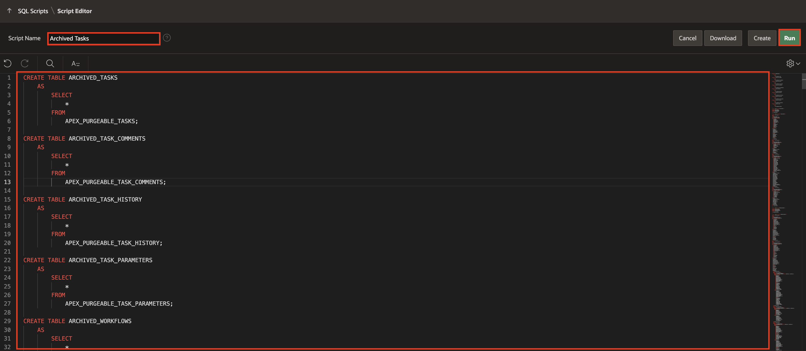

4. Click **Run Now**.

    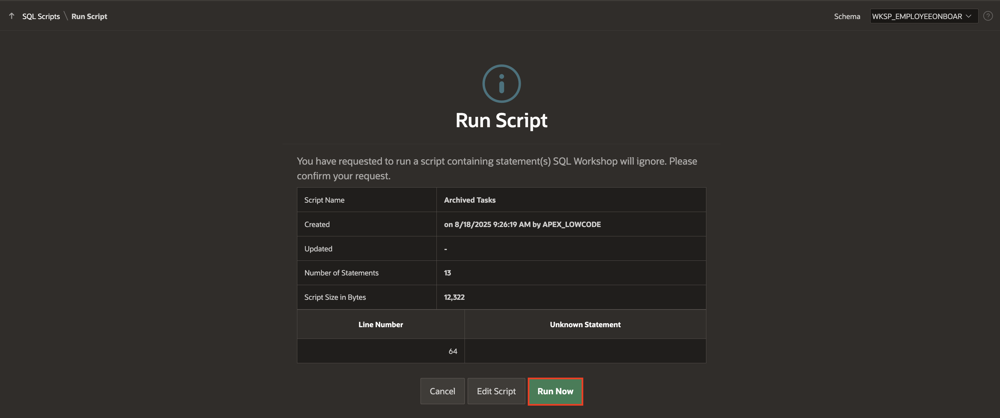

    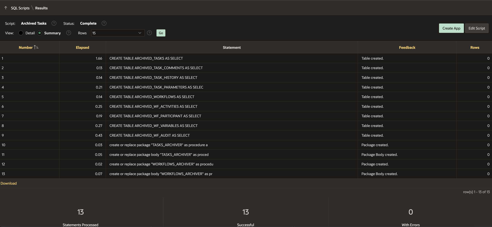

5. Now, go to **Employee Onboarding** application and navigate to **Shared Components**, under **Workflow and Automations**, select **Automations**.

    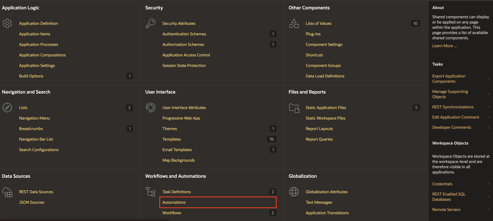

6. Select **Create Automation**.

    

7. Enter/select the following:

    - Name: **Workflow Archiver**
    - Actions initiated on: **Query**
    - Execution Schedule: **Daily at Midnight**

    Click **Next**.

    

8. Enter/select the following:

    - Source Type: **SQL Query**
    - Enter a SQL SELECT Statement: copy and paste the following:

        ```
         <copy>
         select * from apex_purgeable_workflows;
         </copy>
        ```

        Click **Create**

    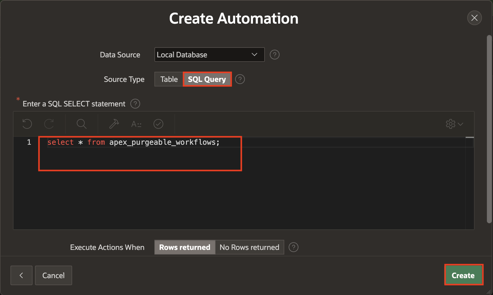

9. Navigate to the **Settings** tab and set the Schedule Status as **Active**.

    

10. Navigate to the **Actions** tab and click on the **pencil icon** to edit the action.

    

11. In the Edit Action page, enter the following:

    - Action > Name: **Archive Workflows**

    - Code > Code: copy and paste the below code

        ```
         <copy>
         begin
            workflows_archiver.archive_workflow;
            workflows_archiver.archive_activities;
            workflows_archiver.archive_variables;
            workflows_archiver.archive_participants;
            workflows_archiver.archive_audit;
         end;
         </copy>
        ````

    Click **Apply Changes**.

    

12. Click **Save and Run**.

    

13. Similarly, create another **Automation** with the following property:

    - Name: **Tasks Archiver**

    - Execution Schedule: **Daily at Midnight**

    Click **Next**.

    

14. Enter/select the following:

    - Source: **SQL Query**
    - Enter a SQL SELECT Statement: copy and paste the following:

        ```
         <copy>
         select * from apex_purgeable_tasks;
         </copy>
        ```

        Click **Create**.

    

15. Navigate to the **Settings** tab and set the Schedule Status as **Active**.

    

16. Navigate to the **Actions** tab and click on the **pencil icon** to edit the action.

    

17. In the Edit Action page, enter the following:

    - Action > Name: **Archive Tasks**

    - Code > Code: copy and paste the below code

        ```
         <copy>
         begin
            tasks_archiver.archive_tasks;
            tasks_archiver.archive_params;
            tasks_archiver.archive_comments;
            tasks_archiver.archive_history;
         end;
         </copy>
        ````

    Click **Apply Changes**.

    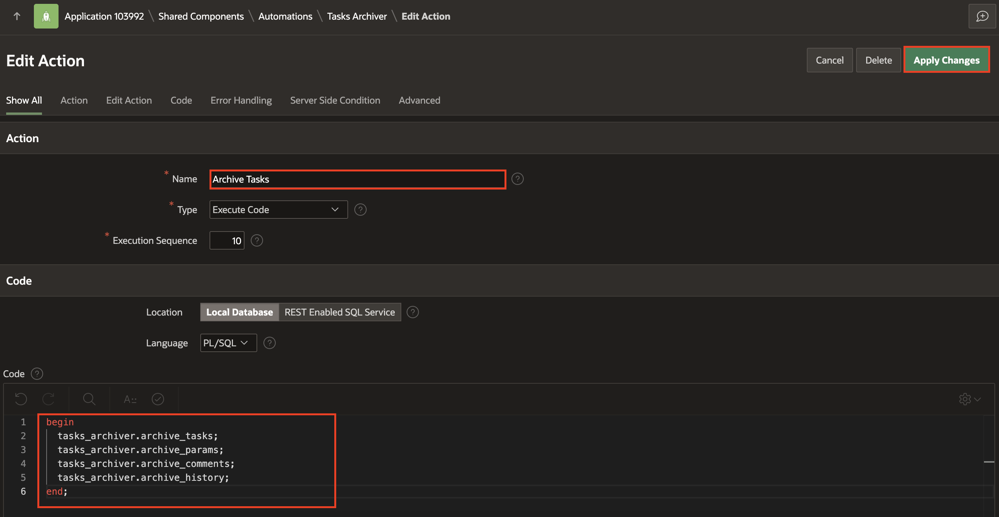

18. Click **Save and Run**.

    

## Task 2: Create Archived Tasks Page

1. Navigate to the Application Home Page by clicking on the **Application ID**

    

2. Click **Create Page**.

    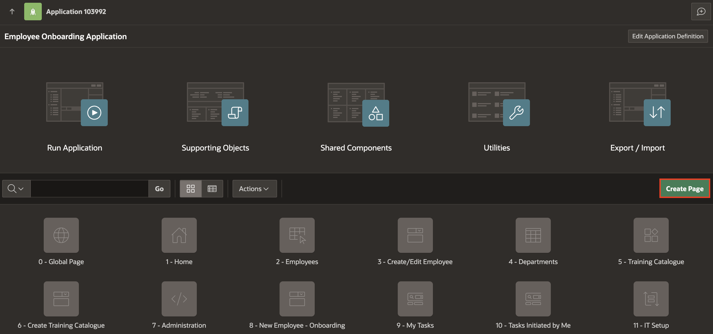

3. Select **Blank Page**.

    

4. In the create page wizard, enter/select the following:

    - Page Definition: Name: **Archived Tasks and Workflows**

    - Navigation:

        - Breadcrumb: **Toggle OFF**
        - Icon: **fa-archive**

     Click **Create Page**.

    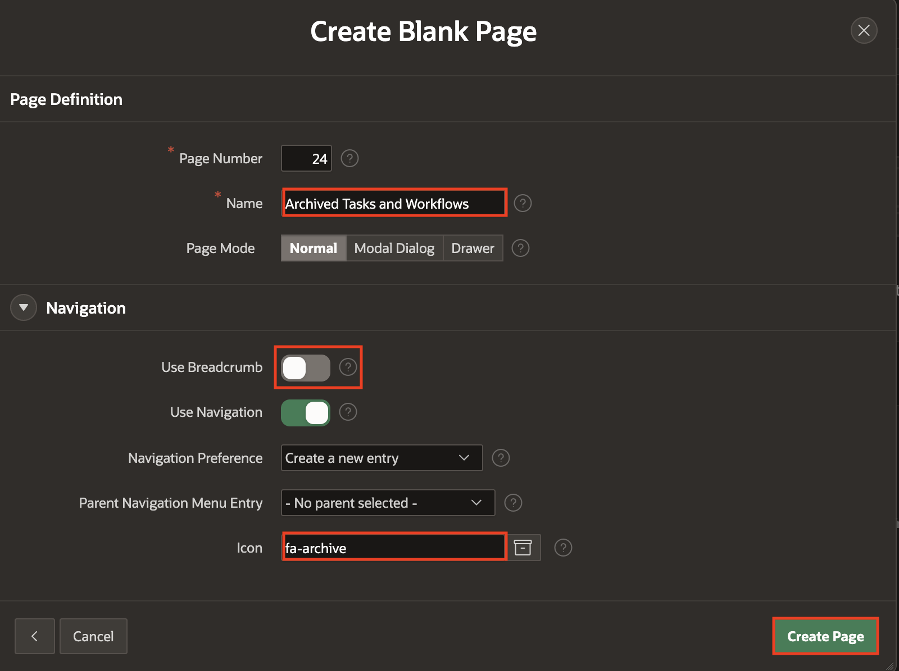

5. In the rendering tree, right click on **Body** and select **Create Region**.

    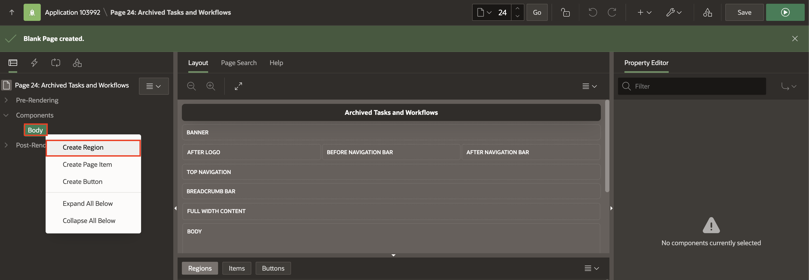

6. In the property editor, enter/select following:

    - Identification > Name: **Show All**

    - Under Appearance:

        - Template: **Tabs Container**
        - Template Options:

            - Remember Active Tab: **Check**
            - Layout: **Fill Tab Labels**

            Click **OK**.

    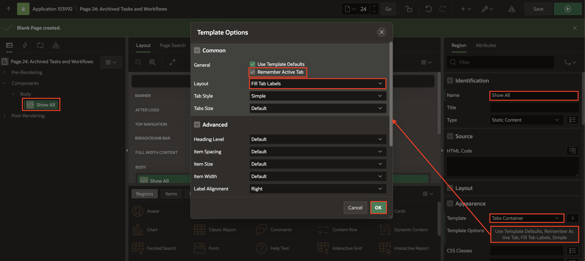

7. In the property editor, right click on the **Show All** region and select **Create Sub Region**.

     

8. In the property editor, enter/select the following:

    - Under Identification:

        - Name: **Archived Tasks**

        - Type: **Interactive Report**

    - Source > Table Name: **ARCHIVED_TASKS**


     

9. Similary, create another sub region to view Archived Tasks History, with the following attributes:

    - Under Identification:

        - Name: **Archived Tasks History**

        - Type: **Interactive Report**

    - Source > Table Name: **ARCHIVED\_TASK\_HISTORY**

     

10. Similary create another sub region for Archived Wrorkflows, with the following attributes:

    - Under Identification:

        - Name: **Archived Workflows**

        - Type: **Interactive Report**

    - Source > Table Name: **ARCHIVED\_WORKFLOWS**

     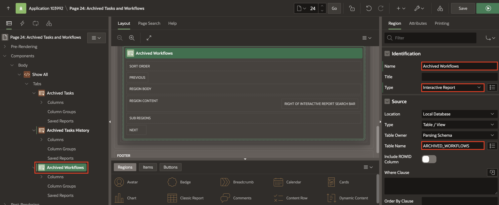

11. Click **Save**.

    

## Summary

In this lab, you created a SQL Script Page to define archive tables and packages, and configured two daily Automations : one for workflows and another for tasks, to execute archiving procedures. You also developed a new Archived Tasks and Workflows Page with interactive reports for easy access to archived data.

This approach ensures that workflow information is retained securely, supporting auditability and historical analysis without impacting live workflow performance.

## What's Next

In the next lab, you will understand the behavior of the **Employee Onboarding** application through hands on activities. You will also perform various tasks to understand the workflow and automation implemented in the application.

## Acknowledgements

- **Author** - Sahaana Manavalan, Senior Product Manager; Roopesh Thokala, Senior Product Manager, August 2025
- **Last Updated By/Date** - Sahaana Manavalan, Senior Product Manager, August 2025
