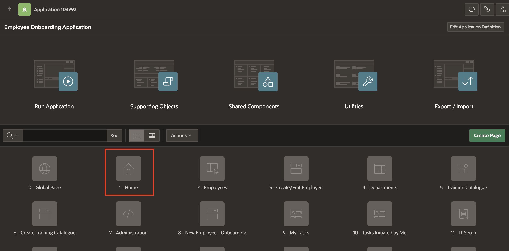
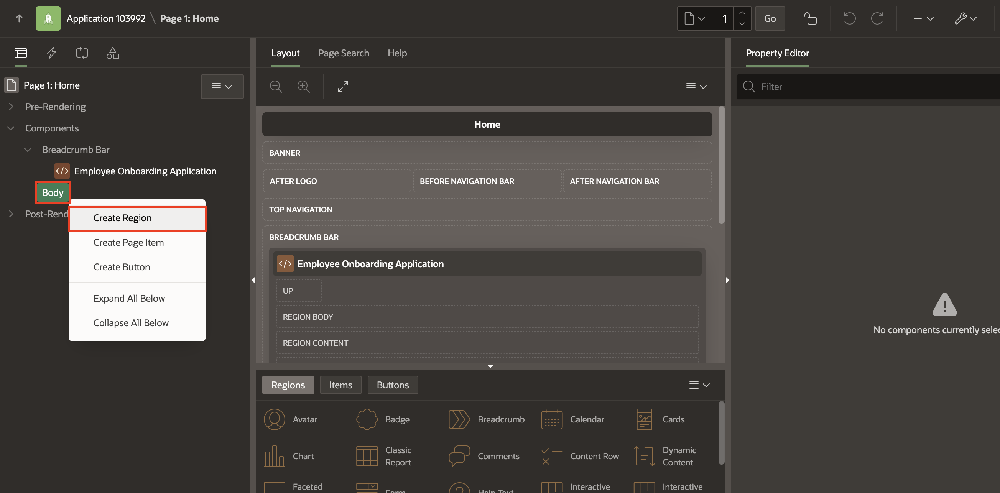

# Improve UI & Navigation

## Introduction

In this lab, you will enhance the Employee Onboarding application by improving its User Interface (UI) and navigation menu. Earlier labs focused on building workflows and functional pages. This exercise focuses on creating a more intuitive and user-friendly experience for end users.

You will organize pages into meaningful navigation categories, configure the navigation menu for easier access, and apply a modern look and feel using the Theme Roller. These improvements will help HR, IT teams, and new hires quickly find the right tasks and workflows, resulting in a more streamlined onboarding solution.

### Objectives

In this lab, you will learn how to:

- Improve the navigation menu by grouping related pages under categories.

- Create a navigation region on the Home page for quick access to tasks and workflows.

- Enhance the application’s visual theme using the Theme Roller.

Estimated Time: 10 minutes

### Prerequisites

- All the previous Labs have been completed.

## Task 1: Improve Navigation Menu

1. On the top right, select the **Shared Components icon**.

    

2. Under **Navigation and Search**, select **Navigation Menu**.

    

3. Select **Navigation Menu**.

    

4. Under **List Entries**, select **Create List Entry**.

    

5. Enter/select the following:

    - Under Entry:

        - Image/Class: **fa-tasks-alt**
        - List Entry Label: **Task Pages**

    - Target > Page: **9**

    *Note: Link it to your **My Tasks** Page.*

    Click **Create List Entry**.

    

6. Similarly, create another entry with the following properties:

    - Under Entry:

        - Image/Class: **fa-workflow**
        - List Entry Label: **Workflow Pages**

    - Target > Page: **16**

    *Note: Link it to your **Workflow Dashboard** Page.*

    Click **Create List Entry**.

    

7. Now, select **Tasks Initiated by Me**, **My Tasks** and update Parent List Entry to **Tasks Pages**. Click **Apply Changes**.

    

    

8. Similarly, select  **Workflows Initiated by Me**, **Workflow Dashboard**, **My Workflows** and update Parent List Entry to **Workflow Pages**. Click **Apply Changes**.

    

    

9. Now, select **Administration** list entry and enter/select the following:

    - Entry > Sequence: **150**

    - Under Target:

        - Target type: **Page in this Application**
        - Page: **2**

    Click **Apply Changes**.

    

10. Similarly, select **Archived Tasks and Workflows** list entry and set the Sequence: **145** and select **Apply Changes**.

    

## Task 2: Improve UI

1. Navigate to the **Application Home page**.

2. Select **Home**.

    

3. In the rendering tree, right click on **Body** and select **Create Region**.

    

4. In the property editor, enter/select the following:

    - Under Identification:

        - Name: **Navigation Menu List**

        - Type: **List**

    - Source > List: **Navigation Menu**

    - Appearance > Template: **Blank with Attributes (No Grid)**

    

5. Under **Attributes**, select the following:

    - Under Apperance:

        - List Template: **Cards**

        - Template Options: select the following in the pop-up box:

            - General: Apply Theme Colors **Check**
            - Style: **Block**
            - Icons: **Display Icons**
            - Body Text: **Hidden**

            Click **OK**.

    

6. Click **Save and Run**.

    

7. Login to the application

    

8. In the **Developer Tool Bar**, select **Customize** and click **Theme Roller**.

    

9. In the Theme Roller, select the following:

    - Theme > Select Theme: **Redwood Light**

    - Under Redwood Options:
        - Pillar: **Ocean**
        - Layout: **Floating**

    - Under Appearance:
        - Header: **Pillar**
        - Navigation: **Pillar**
        - Body Header: **Dark**
        - Body Background: **Dark**

        Click **Save**.

    

10. Click **Save**.

    

## Summary

You have improved the Employee Onboarding application by updating the navigation menu, adding a navigation region on the Home page, and applying a new theme. These changes make the application easier to use and give it a more polished look.

## Acknowledgements

- **Author** - Sahaana Manavalan, Senior Product Manager; Roopesh Thokala, Senior Product Manager, August 2025
- **Last Updated By/Date** - Sahaana Manavalan, Senior Product Manager, August 2025
