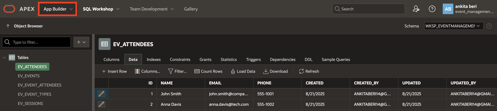
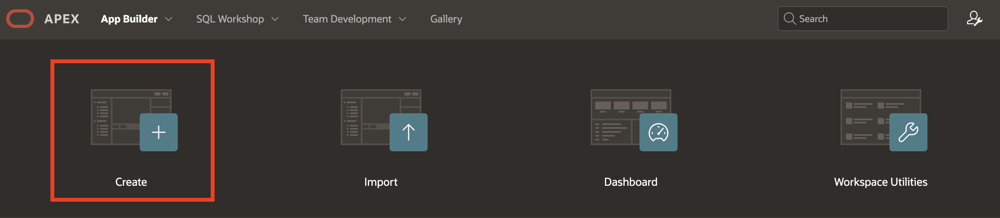
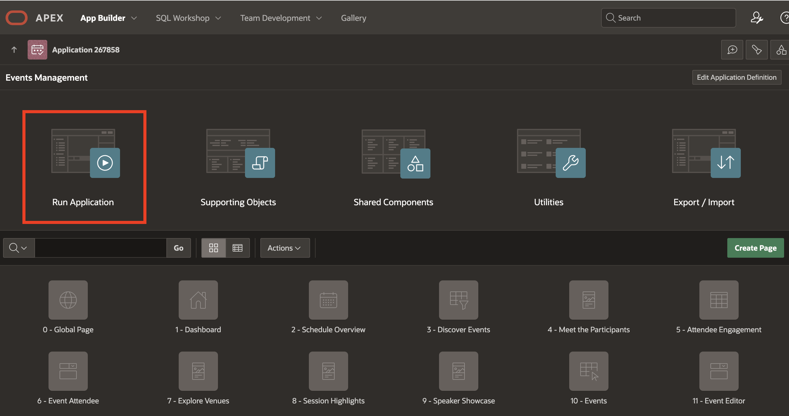
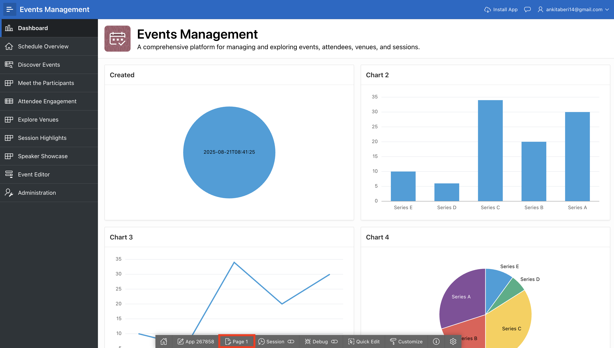

# Use the Create Application Wizard

## Introduction

In this lab, you will create an interactive Event Management application using Create Application using Generative AI. The application will be built using the Sample Dataset you generated in the previous lab, providing a practical foundation for your project.

Estimated Time: 5 minutes

### Objectives

- Create an application using the AI-driven Create Application wizard with the Data Model created in the previous lab

### What You will Need

- An Oracle Cloud paid account, or free trial.

- Events Data model created using Generative AI.

>**Note:** You do NOT want to click Create Application, as you will use Generative AI to create an application later.

## Task 1: Create the Application using Generative AI

1. From your APEX workspace homepage, click **App Builder**.

    

2. Click **Create**.

    

3. In the Create an Application Page, select **Create APP Using Generative AI**

    

4. In the APEX Assistant Wizard, if you see a warning that says "It looks like there are some changes to tables in your workspace. Please refresh the data dictionary cache to work with the latest tables". Click on **Accept** and then click **Refresh Cache**.

    

    *Note: If the AI Assistant does not detect the tables created using AI, refresh the Data Dictionary Cache to ensure the latest tables are available. [Refer to the documentation for steps.](https://docs.oracle.com/en/database/oracle/apex/24.2/aeadm/accessing-data-dictionary-cache-from-administration-services.html#GUID-E398AC8D-2054-4B10-A49C-E6AD49DCF78F)*

5. Use the APEX Assistant Wizard to create an Application, to create a Project Management Application, enter the prompt mentioned below and hit **Enter**.

    >Prompt 1:
    >Create an Event Management App. This app should have a calendar page and a Search page for events.

    

    > Note: The prompt may not always generate all pages or include every table. This behavior can vary depending on the AI service provider. If some pages are missing, you can ask the AI service to update your blueprint by specifying the additional pages you need.

6. Now, we need to add a form page to edit events. Enter the prompt mentioned below and hit **Enter**.

    >Prompt 2:
    >Add a form page to edit events

    

7. Similarly, you need to enable **Feedback** feature. Enter the prompt mentioned below and hit **Enter**.

    >Prompt 3:
    >Enable Feedback feature.

    

8. Finally, click **Create Application**.

    

    *Note:The pages might differ based on the prompt. Make sure that you have **Events Dashboard page**, **Event page created as Faceted Search page** by giving appropriate prompts.*

9. On the Create an Application page, navigate to **Dashboard** page and click **Edit**.

    

10. On the **Add Dashboard Page**, update the the Page Name to **Dashboard**. Click **Set Icon** and search for **chart**, select an icon of your wish.

11. Under **Advanced**, enable **Set as Home Page** and click **Save Changes**.

    

12. Update the application name to **Events Management** and **click** on the app icon to change it.

    

13. Download the icon from **[here](https://c4u04.objectstorage.us-ashburn-1.oci.customer-oci.com/p/EcTjWk2IuZPZeNnD_fYMcgUhdNDIDA6rt9gaFj_WZMiL7VvxPBNMY60837hu5hga/n/c4u04/b/livelabsfiles/o/labfiles%2FAICAMP.png)**.
Click **Upload your own icon**, choose the image and click **Save Icon**.

    

14. Make sure that the **Progressive Web App** and **Feedback** features are enabled. Then, click **Create Application**.

    

## Task 2: Run the Application

1. Your new application will be displayed in Page Designer. Click **Run Application**.

    

2. In the runtime environment, the login page will be displayed.

    Enter your **Username** and **Password**. Click **Sign In**.

    The new application will be displayed.

    

3. Play around with the application and explore the different pages.

    Records are displayed in all of the reports which makes page review significantly easier, especially for reports. The fact that the data may not be exactly correct for the columns is not critical, as you can very easily update the data to make it more realistic.

    

## Summary

You now know how to utilize Generative AI to create the first cut of your application.

## Acknowledgments

- **Author** - Ankita Beri, Product Manager
- **Last Updated By/Date** - Ankita Beri, Product Manager, August 2025
