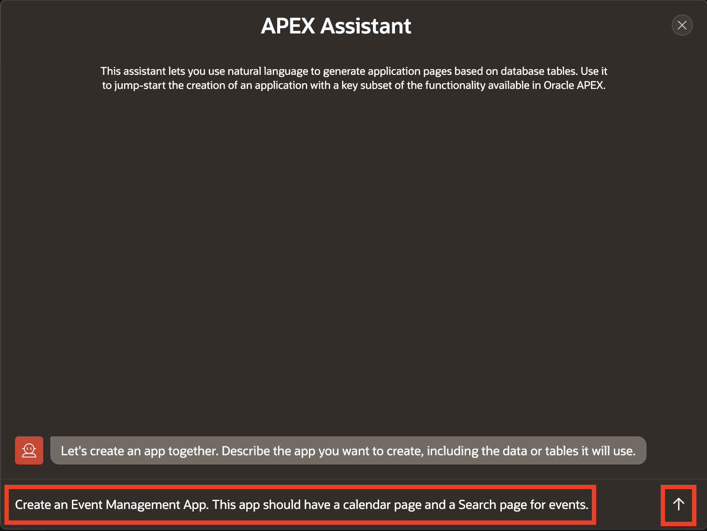
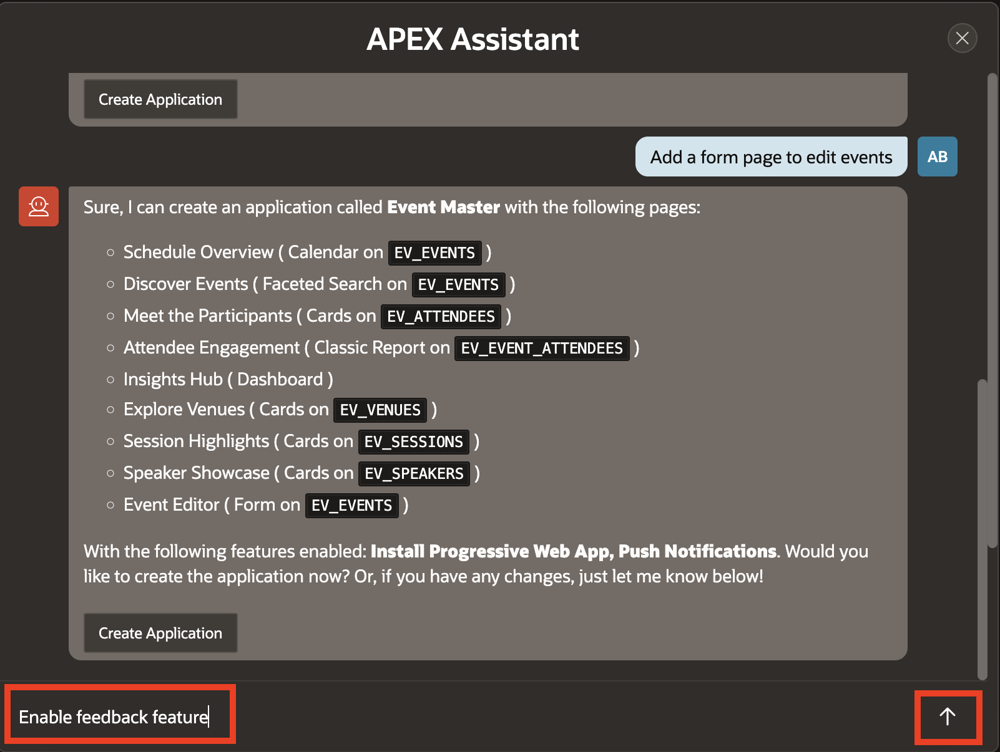
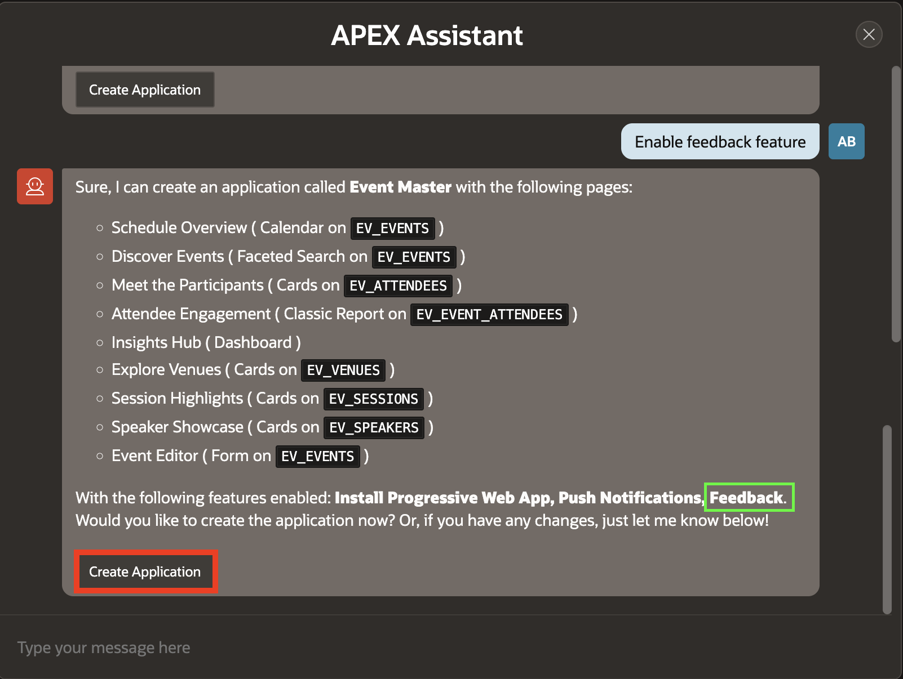
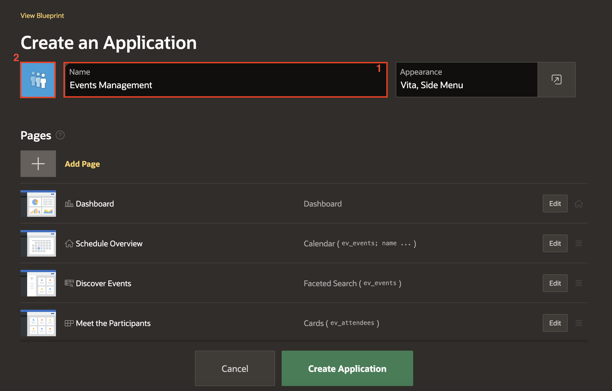

# Create the Application using Generative AI

## Introduction

In this lab, you will create an interactive Event Management application using **Create Application using Generative AI** feature in Oracle APEX. The application will be built using the custom data model you generated in the previous lab, providing a practical foundation for your event management.

Estimated Time: 10 minutes

### Objectives

- Create an application using the AI-driven Create Application wizard based on the Data Model created in the previous lab.

### Prerequisites

- All previous labs are completed.

## Task 1: Refresh Data Dictionary

When we generate a data model, the database updates instantly but APEX’s schema metadata doesn’t. Refreshing the Data Dictionary ensures APEX reads the latest tables and makes them available in wizards and builders.In this task, we will refresh the Data Dictionary to synchronize APEX with the updated schema.

1. To refresh database objects, navigate to APEX Administration beside your user profile. Select **Manage Service > Manage Service**.

    

2. On the right hand side, under **Manage Meta Data**, select **Data Dictionary Cache**.

    

3. To refresh the cache manually click **Refresh Cache Only**.

    

4. Now you will view refreshed cache for tables.

    

## Task 2: Create the Application using Generative AI

In this task, you will create an application using Generative AI and enter natural language.

1. From your APEX workspace top navigation bar, click **App Builder**.

    

2. Click **Create**.

    

3. In the Create an Application page, select **Create APP Using Generative AI**.

    

    *Note*: If the AI Assistant does not detect the tables created using AI, refresh the Data Dictionary Cache to ensure the latest tables are available. [Refer to the documentation for steps.](https://docs.oracle.com/en/database/oracle/apex/24.2/aeadm/accessing-data-dictionary-cache-from-administration-services.html#GUID-E398AC8D-2054-4B10-A49C-E6AD49DCF78F)

4. To create a Event Management application, you will use the APEX Assistant wizard. Enter the prompts mentioned below and hit **Enter**.

    Prompt 1:

    ```
    <copy>
    Create an Event Management App. This app should have a calendar page and a Search page for events.
    </copy>
    ```

    

    *Important Note:* The prompt may not always generate all pages or include every table. This behavior can vary depending on the AI service provider. If some pages are missing, you can ask the AI service to update your blueprint by specifying the additional pages you need.

5. Now, you need a Form page to edit events. Enter the prompt mentioned below and hit **Enter**.

    Prompt 2:
    ```
    <copy>
    Add a form page to edit events.
    </copy>
    ```

    

6. Additionally, you want to enable the **Feedback** feature.

    Prompt 3:
    ```
    <copy>
    Enable Feedback feature.
    </copy>
    ```

    

7. Once you are satisfied with the AI generated application blueprint, click **Create Application**.

    

    *Important Note:The pages might differ based on the prompt. Make sure that you have **Events Dashboard page** and **Event page created as Faceted Search page** by giving appropriate prompts.*

8. On the Create an Application page, locate the **Dashboard** page (in this case, **Insights Hub**) and click **Edit**.

    

9. In the **Add Dashboard Page** dialog, update the the Page Name to **Dashboard**. Click **Set Icon** and search for **chart**, select an icon of your choice.

10. Under **Advanced**, enable **Set as Home Page** and click **Save Changes**.

    

11. Update the application name to **Events Management** and click on the app icon to upload a custom icon.

    

12. Download the icon from **[here](https://c4u04.objectstorage.us-ashburn-1.oci.customer-oci.com/p/EcTjWk2IuZPZeNnD_fYMcgUhdNDIDA6rt9gaFj_WZMiL7VvxPBNMY60837hu5hga/n/c4u04/b/livelabsfiles/o/labfiles%2FAICAMP.png)**.
Click **Upload your own icon**, choose the image and click **Save Icon**.

    

13. Make sure that the **Progressive Web App** and **Feedback** features are enabled. Then, click **Create Application**.

    

    

## Task 3: Run the Application

1. It is now time to see how the AI generated APEX app looks! Click **Run Application**.

    

2. The login page will be displayed.

    Enter your **Username** and **Password**. Click **Sign In**.

    The new application will be displayed.

    

3. Play around with the application and explore the different pages.

    Records are displayed in all of the reports which makes page review significantly easier, especially for reports. The fact that the data may not be exactly correct for the columns is not critical, as you can very easily update the data to make it more realistic.

    

## Summary

You now know how to utilize Generative AI to create the first cut of your application.

## Acknowledgments

- **Author** - Ankita Beri, Senior Product Manager
- **Last Updated By/Date** - Ankita Beri, Senior Product Manager, November 2025
