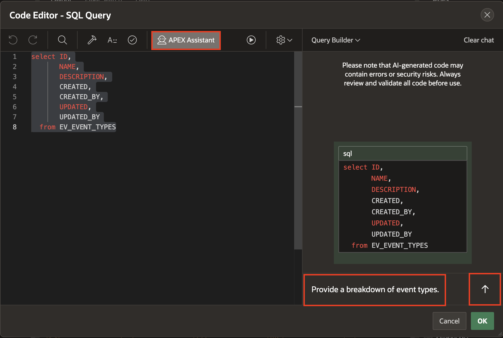
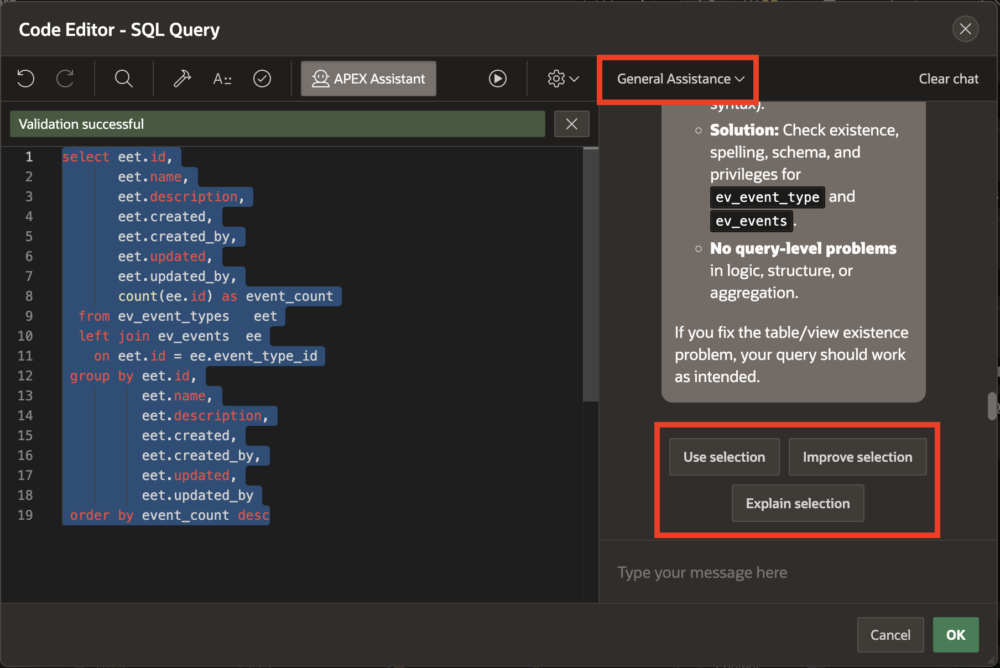
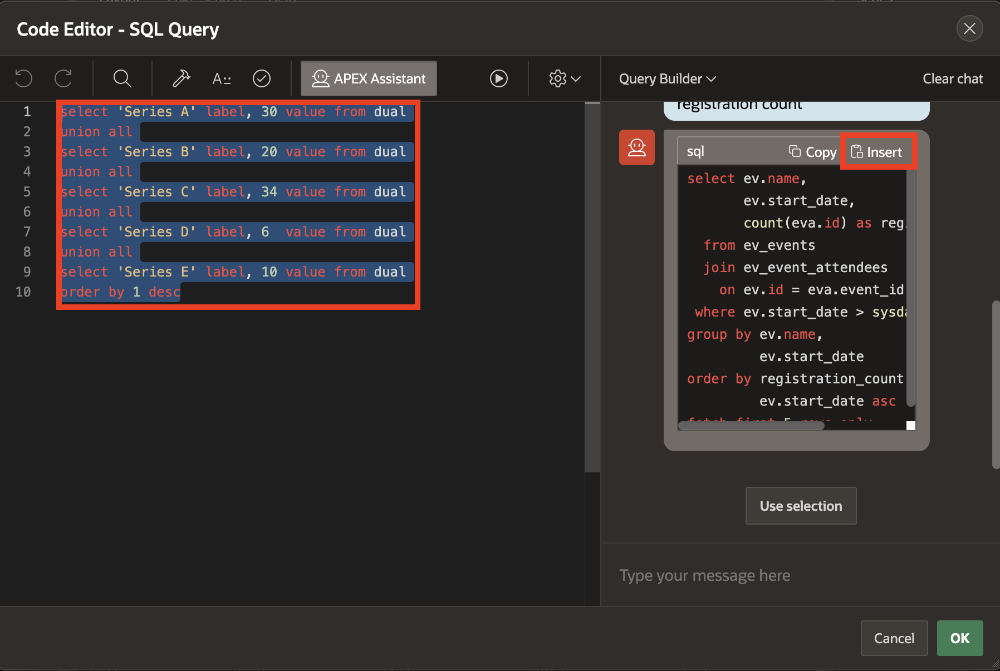
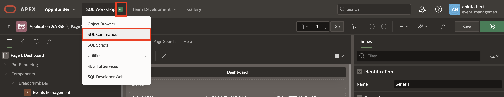

# Enhance Charts and Database Objects with APEX Assistant

## Introduction

In this lab, you will learn how to enhance charts in Oracle APEX using APEX Assistant. Instead of manually writing queries, we will use natural language prompts to ask the APEX Assistant to generate the required SQL. This approach speeds up development and shows how AI-powered assistance can simplify complex tasks such as data visualization.

In addition to enhancing charts, you will also create database objects such as tables and PL/SQL packages—directly from the SQL Commands interface using APEX Assistant.

Estimated Time: 5 minutes

### Objectives

- Enhance charts by using APEX Assistant to generate SQL queries through natural language.

- Create PL/SQL packages using APEX Assistant in SQL Commands.

## Task 1: Enhance Charts with APEX Assistant

1. From the runtime environment, navigate to the developer toolbar and click **Page 1**.

    

2. In the page designer, select **Created** region. In the property editor, update **Identification > Name** to **Event Types**.

    

3. Under **Event Types**, select **Series 1** and change **Source > Type** to **SQL Query**. **Open** the code editor of the **SQL Query**.

    

4. Navigate to **APEX Assistant**. Select your query. From the menu, select **Query Builder** (if not already selected). In the APEX Assistant box, enter the following prompt and press enter:

    >Prompt 1:
    >Provide a breakdown of event types.

    

    >Note: APEX Assistant responds with a query as shown in the above screenshot.

5. Next, let’s adjust the query so that the highest count appears at the top. Enter the following prompt and press Enter.

    >Prompt 2:
    >Show highest count at the top.

    

6. Click **Copy** or **Insert** to copy or insert the response into the Code Editor.

    

7. While **Validating**, if your query throws an error, APEX Assistant can help troubleshoot the problem.

    For example, suppose you run a query and inadvertently leave off the 's'. at the end of the table name.

    APEX Assistant switches to General Assistance mode. Click **Help me fix this**.

    APEX Assistant reviews the code and error, and suggests the table name may not be spelled correctly.

    

8. You can also use **General Assistance** for general conversation, technical questions such as "Explain this" or "Improve this code."  APEX Assistant provides default options such as **Use Selection, Improve Selection, and Explain Selection**.

    

9. Next, we’ll map the columns for the Event Types chart. In the Property Editor, enter/select the following:

    - Under Column Mapping:

        - Series Name: **EVENT_NAME**

        - Value: **EVENT_COUNT**

    

10. For the second chart, we’ll display **Total Events By Month/Year**. Navigate to Chart 2 and update the following:

    - Identification > Name: **Total Events By Month/Year**.

    

11. Under **Total Events By Month/Year** region, click **Series** and open the code editor of **SQL Query**.

    

12. Navigate to **APEX Assistant** and enter the following prompt:

    >Prompt 1:
    >Top 5 upcoming events by registration count

    

13. Select your query and click **Insert**.

    

14. After validating, click **OK**.

    

15. Let's map the columns for the Event Types chart. In the Property Editor, enter/select the following:

    - Under Column Mapping:

        - Label: **EVENT_NAME**

        - Value: **REGISTRATION_COUNT**

    

16. Click **Save and Run** and view the updated charts on the Dashboard page.

    

## Task 2: Create a PL/SQL Package with APEX Assistant

1. Navigate to **SQL Workshop** and select **SQL Commands**.

    

2. Copy and paste the following *CREATE TABLE* statement in the code editor. You will then use APEX Assistant to generate a package that handles insert, update, and delete operations for the events table. Also CREATE TABLE DDL command can be obtained from the Object Browser.

    ```
    <copy>
    CREATE TABLE "EV_EVENTS"
    (	"ID" NUMBER GENERATED BY DEFAULT ON NULL AS IDENTITY MINVALUE 1 MAXVALUE 9999999999999999999999999999 INCREMENT BY 1 START WITH 1 CACHE 20 NOORDER  NOCYCLE  NOKEEP  NOSCALE  NOT NULL ENABLE,
	"VENUE_ID" NUMBER NOT NULL ENABLE,
	"EVENT_TYPE_ID" NUMBER NOT NULL ENABLE,
	"NAME" VARCHAR2(255 CHAR) NOT NULL ENABLE,
	"DESCRIPTION" VARCHAR2(4000 CHAR),
	"START_DATE" DATE NOT NULL ENABLE,
	"END_DATE" DATE NOT NULL ENABLE,
	"CREATED" DATE NOT NULL ENABLE,
	"CREATED_BY" VARCHAR2(255 CHAR) NOT NULL ENABLE,
	"UPDATED" DATE NOT NULL ENABLE,
	"UPDATED_BY" VARCHAR2(255 CHAR) NOT NULL ENABLE,
	CONSTRAINT "EV_EVENTS_ID_PK" PRIMARY KEY ("ID")
    USING INDEX  ENABLE
    ) ;
    ```
    </copy>

    

3. Click **APEX Assistant** and enter the following prompt:

    >Prompt 1:
    >Generate a PL/SQL package to insert, update, and delete events.

    

4. Select your create table statement from the code editor, click **Insert** or **Copy** and then replace the contents in your Code Editor and run it to create the package.

    

5. First, select the Package Specification and click **Run**.

    

6. Next, select the Package Body and click **Run**.

    

7. Finally, navigate to **SQL Workshop > Object Browser** to view the newly created package.

    

8. Under **Packages**, you can see that the package has been created.

    

## Summary

In this lab, you learned how to use the integrated AI Chat capability (APEX Assistant) in code editors within App Builder and SQL Workshop.

## Acknowledgments

- **Author** - Ankita Beri, Senior Product Manager
- **Last Updated By/Date** - Ankita Beri, Senior Product Manager, October 2025