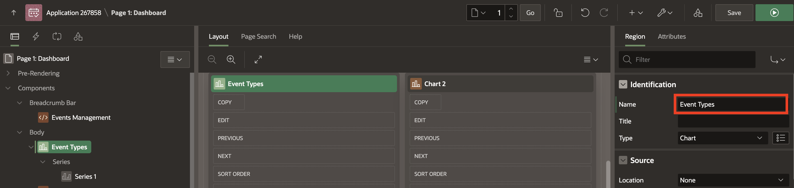
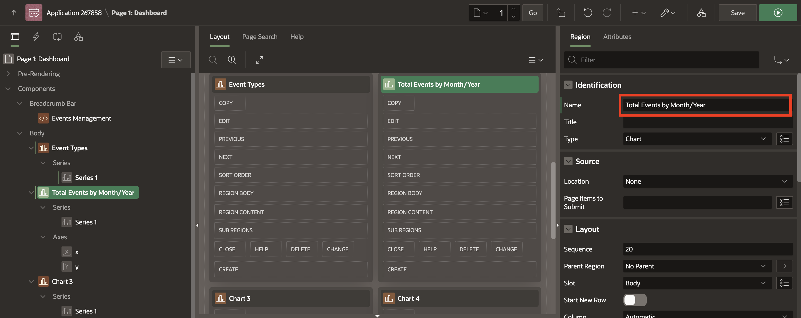
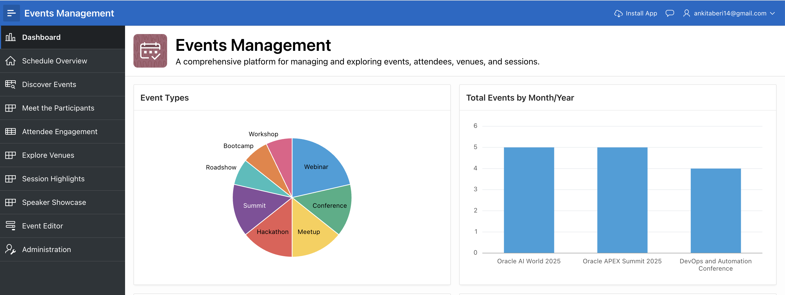

# Enhance Dashboard using APEX Assistant

## Introduction

In this lab, we will learn how to enhance charts in Oracle APEX by leveraging the APEX Assistant. Instead of manually writing queries, we will use natural language prompts to ask the APEX Assistant to generate the required SQL. This approach not only speeds up development but also demonstrates how AI-powered assistance can simplify complex tasks like data visualization.

### Objectives

- Enhance charts by using APEX Assistant to generate SQL queries through natural language.

## Task 1: Enhance charts using Generative AI

1. From the runtime environment, navigate to developer toolbar and click **Page 1**.

    

2. In the page designer, select **Chart 1**. In the property editor, update **Identification > Name** to **Event Types**.

    

3. Under **Event Types**, select **Series 1** and change **Source > Type** to **SQL Query**. **Open** the code editor of the **SQL Query**.

    

4. Navigate to **APEX Assistant**. Select your query. From the menu, select **Query Builder** (if not already selected). In the APEX Assistant box, enter the following prompt and press enter:

    >Prompt 1:
    >Provide a breakdown of event types.

    

    >Note: APEX Assistant responds with a query as shown in the above screenshot.

5. Now, we need the highest count at the top. Enter the below prompt and press enter:

    >Prompt 2:
    >Show highest count at the top.

    

6. Click **Copy** or **Insert** to copy or insert the response into the Code Editor.

    

7. While **Validating**, if your query throws an error, APEX Assistant can help troubleshoot the problem.

    For example, suppose you have the following query and have inadvertently left off the "s" at the end the table name.

    APEX Assistant switches to General Assistance mode. Click **Help me fix this**.

    APEX Assistant reviews the code and error and suggests the table name may not be spelled correctly.

    

8. You can also use **General Assistance** for general conversation, technical questions such as "Explain this" or "Improve this code."  APEX Assistant prompts you with default options such as **Use Selection, Improve Selection, and Explain Selection**.

    

9. Now, let's map the columns for the Event Types chart. In the Property Editor, enter/select the following:

    - Under Column Mapping:

        - Series Name: **EVENT_NAME**

        - Value: **EVENT_COUNT**

    

10. Let's say, for second chart we want to display **Total Events By Month/Year**. Navigate to Chart 2 and update the following:

    - Identification > Name: **Total Events By Month/Year**.

    

11. Under **Total Events By Month/Year** region, click **Series** and open the code editor of **SQL Query**.

    

12. Navigate to **APEX Assistant** and enter the following prompt:

    >Prompt 1:
    >Top 5 upcoming events by registration count

    

13. Select your query and click **Insert**.

    

14. After validating, click **OK**.

    

15. Click **Save and Run** and view the updated charts on the Dashboard page.

    

## **Summary**

You now know how to use integrated AI Chat capability (called APEX Assistant) in Code Editors within App Builder.

## **Acknowledgments**

- **Author** - Ankita Beri, Product Manager
- **Last Updated By/Date** - Ankita Beri, Product Manager, August 2025
