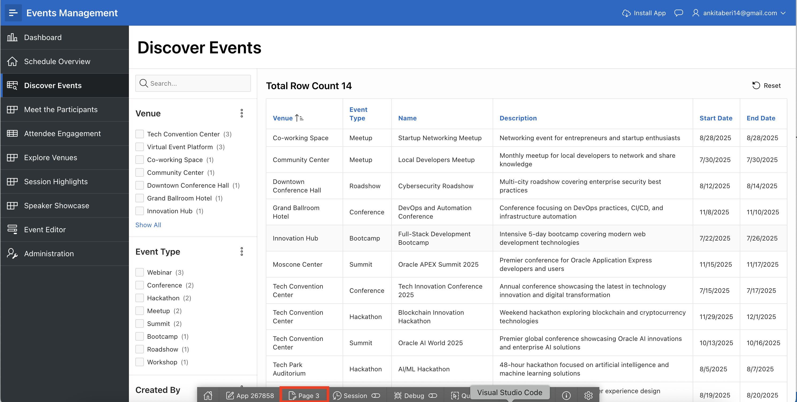
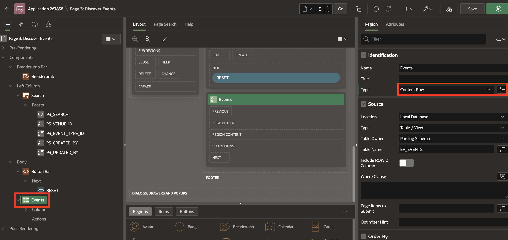
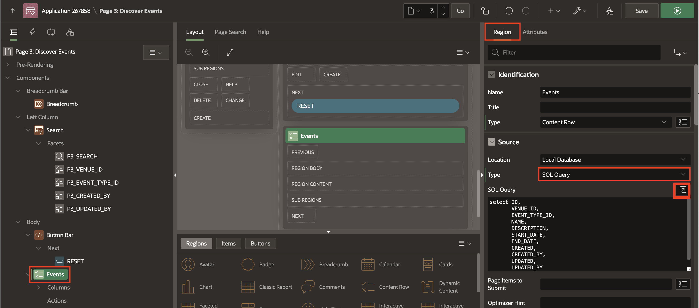
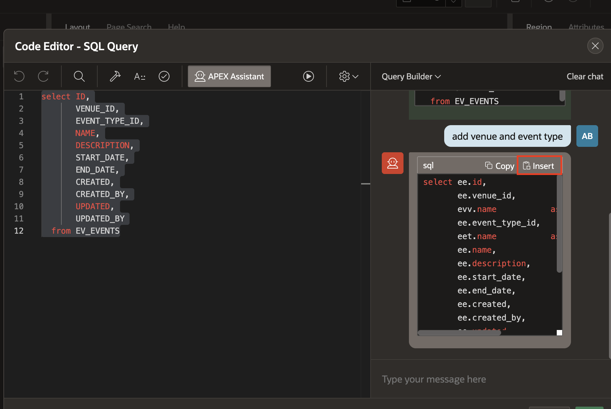
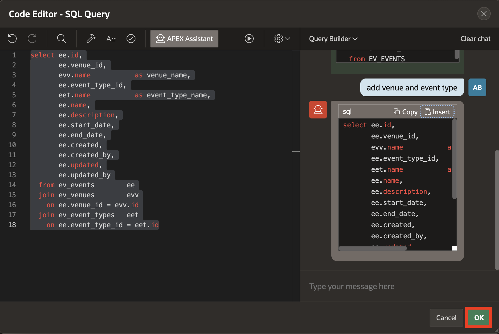
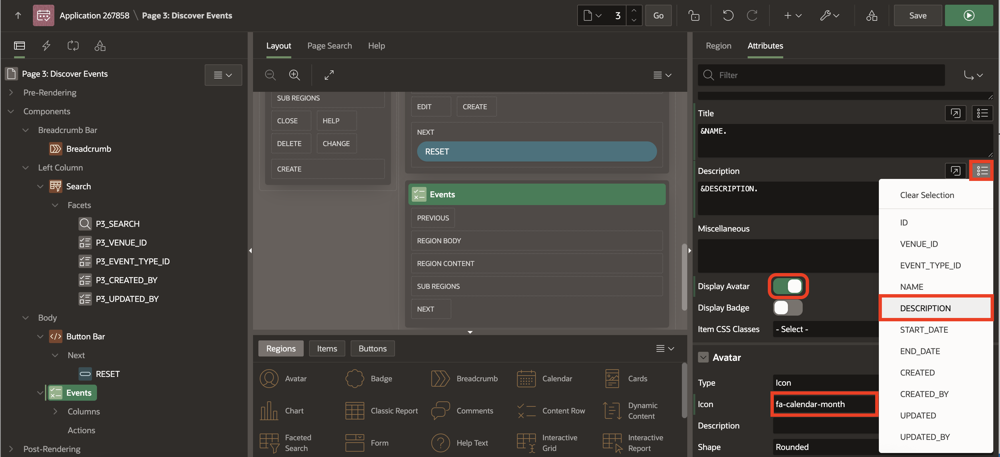
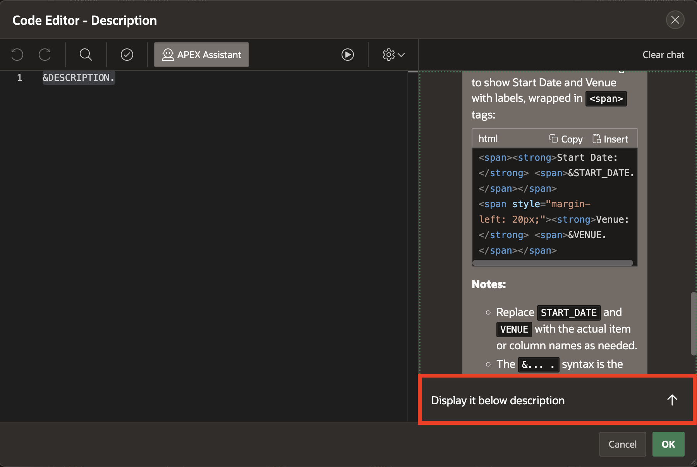
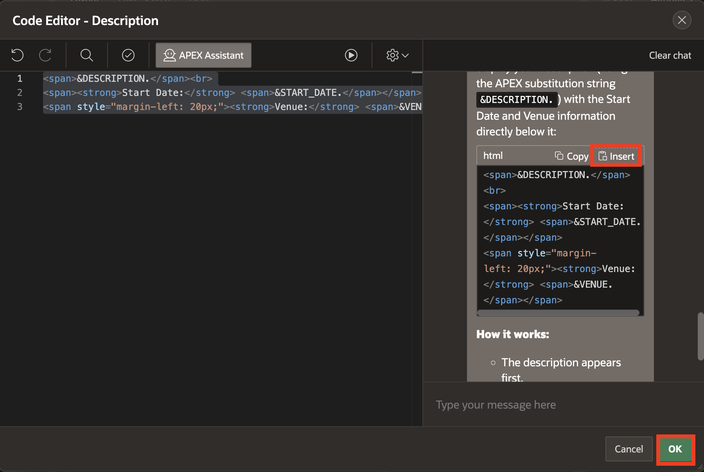
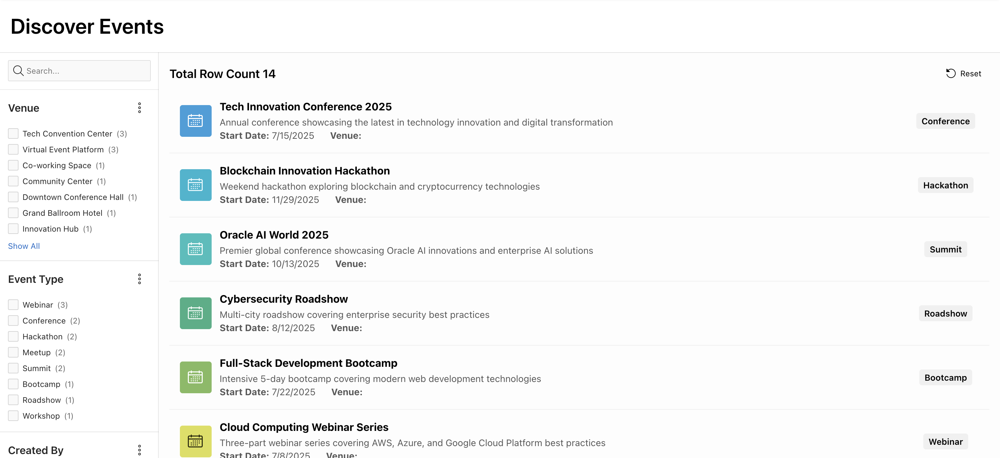

# Enhance UI with AI

## Introduction

In this lab, you will learn how to modernize a classic report in Oracle APEX by converting it into a content row layout. You will also explore how to enhance the report presentation with features like avatars, badges, and title links. Additionally, you will use the AI-powered APEX Assistant to modify SQL queries and generate dynamic HTML for improved descriptions. These enhancements demonstrate how APEX makes it easy to combine low-code development with AI-assisted productivity tools, resulting in a richer and more engaging user experience.

Estimated Time: 10 minutes

### Objectives

By the end of this lab, you will be able to:

- Convert a classic report into a content row layout to improve readability and design.

- Use AI-powered APEX Assistant in the code editor to extend SQL queries and generate HTML.

- Enhance the report with avatars, badges, and hyperlinks for better interactivity.

## Task 1: Convert a Classic Report into a Content Row

1. From the browser tab where the app is running, navigate to your faceted search page. In this lab, the page is called *Discover Events*. The name might differ because the app was generated using AI.

    

    >Note: Since the page name is AI-generated, it may differ. This is the Faceted Search page created on the *EV_EVENTS* table.

2. From the Developer Toolbar, click **Page 3**.

    

    >Note: Page number may vary depending on your application.

3. From the left pane, select **Events** region. In the Property Editor, select the following:

    - Identification > Type: **Content Row**

    

4. Update **Source > Type** to **SQL Query** and open the code editor of SQL Query.

    

5. Select your SQL Query. Click **APEX Assistant** and add the following prompt:

    **Prompt 1:**
    ```
    <copy>
    Add venue and event type.
    </copy>
    ```

    

6. Click **Insert**, or replace the existing SQL query with the one provided below to generate the same output for this workshop:

    *Note: By replacing it with the provided code, we ensure that your application behaves consistently and matches the expected outcome.*

    ```
    <copy>
    select ee.id,
       ee.venue_id,
       evv.name           as venue_name,
       ee.event_type_id,
       eet.name           as event_type_name,
       ee.name,
       ee.description,
       ee.start_date,
       ee.end_date,
       ee.created,
       ee.created_by,
       ee.updated,
       ee.updated_by
    from ev_events        ee
    join ev_venues        evv
    on ee.venue_id = evv.id
    join ev_event_types   eet
    on ee.event_type_id = eet.id
    </copy>
    ```

    

7. Click **OK** to close the dialog.

    

8. In the Property Editor, navigate to **Attributes** tab and enter/select the following:

    - Under Settings:

        - Title: **&NAME.**

        - Display Avatar: Toggle **On**

    - Avatar > Icon: **fa-calendar-month**

    

    

9. Under **Settings**, open the code editor of **Description**.

    

10. Click **APEX Assistant**. Now add the following prompts:

    **Prompt 1:**
     ```
    <copy>
    Generate some HTML to display start date and end date as a labelled information using span tag.
    </copy>
    ```

    

    **Prompt 2:**
     ```
    <copy>
    Use APEX substitution strings.
    </copy>
    ```

    

    **Prompt 3:**
     ```
    <copy>
    Display it below description.
    </copy>
    ```

    

11. Click **Insert** and then **OK**, or replace the existing content with the HTML provided below to achieve the expected output:

    ```
    <copy>
    <span>&DESCRIPTION.</span><br>
    <span><strong>Start Date:</strong> <span>&START_DATE.</span></span>
    <span style="margin-left: 20px;"><strong>End Date:</strong> <span>&END_DATE.</span></span>
    </copy>
    ```

    

12. Click **Save and Run**.

    

13. Now, view the updated content row report.

    

14. Next, let's add a badge to the content row. Switch to the Page Designer tab. Navigate to **Attributes** tab and enter/select the following:

    - Settings > Display Badge: Toggle **On**

    - Under Badge:

        - Label: **&EVENT\_TYPE\_ID.**

        - Value: **EVENT\_TYPE\_NAME**

        - Position: **End**

        - Alignment: **Center**

    

15. Click **Save and Run** and view the changes.

    

16. Next, let's add a hyperlink to the title to open a form page. Switch to the Page Designer tab. In the left pane, under **Events** region, right-click **Actions** and click **Create Action**.

    

17. In the Property Editor, enter/select the following:

    - Identification > Position: **Title Link**

    - Link > Target: Click **No Link Defined**

        - Target > Page: **11**

        - Set Items:

            | Name | Value |
            | ----- | ---- |
            | P11_ID | &ID.|
            {: title="Set Items"}

        - Clear Cache: **11**

        Click **OK**.

    >Note: Page number may vary depending on your application.

    

18. Click **Save and Run** and view the changes.

    

    

## Task 2: Enhance appearance of an app

In this task, you will use Theme Roller to quickly transform the appearance of an application without editing any code.

1. When you run an application from App Builder and view a page, the Runtime Developer toolbar displays at the bottom of any editable running page.

    On the Runtime Developer Toolbar, click **Customize**.

    

2. To access the Theme Roller dialog, click **Theme Roller** from the Customize menu.

    

3. In the **Theme Roller** dialog box, update **Select Theme** to **Redwood Light**.

    

4. Under **Redwood Options**, select the following:

    - Pillar: **Rose**

    - Layout: **Floating**

    

5. Under **Appearance**, select the following:

    - Header: **Pillar**

    - Navigation: **Pillar**

    - Body Header: **Dark**

    - Body Background: **Dark**

6. Click **Save** to save the theme.

    

7. In **Save As** dialog box, for **Style Name** enter **Event Management Theme** and click **Save**.

    

## Summary

In this lab, you transformed a classic report into a content row layout, improving the overall presentation of data. You learned how to enhance the report with avatars, badges, and title links, making it more interactive and visually appealing. You also used APEX Assistant to modify SQL queries and generate custom HTML within the description, showcasing how AI integration within APEX accelerates development and improves application design.

## Acknowledgments

- **Author** - Ankita Beri, Senior Product Manager
- **Last Updated By/Date** - Ankita Beri, Senior Product Manager, November 2025
