# Create an Event Chat Assistant

## Introduction

In this lab, you will learn how to enhance an Oracle APEX application by creating an Event Chat Assistant. Using the Show AI Assistant trigger action, you will build a chatbot that can respond to user queries about event details. You will first configure the chatbot without a augmented system prompt tool to see how it works with generic responses, and then enhance it by creating an AI Agent and a tool so the chatbot fetches information directly from your event data. This approach demonstrates how to combine low-code development with AI-driven capabilities to deliver smarter, data-aware user experiences.

Estimated Time: 5 minutes

### Objectives

By the end of this lab, you will be able to:

- Create an Event Assistant button in your APEX application.

- Configure a Show AI Assistant trigger action without using a tool.

- Create an AI Agent and define a tool to query event data.

- Connect the AI Agent to the Show AI Assistant trigger action so the chatbot fetches results exclusively from your event data source.

## Task 1: Create an Event Chat Assistant button

1. Close the dialog box. From the runtime developer toolbar, navigate to **Page 3**.

    >Note: Page number may vary depending on your application.

    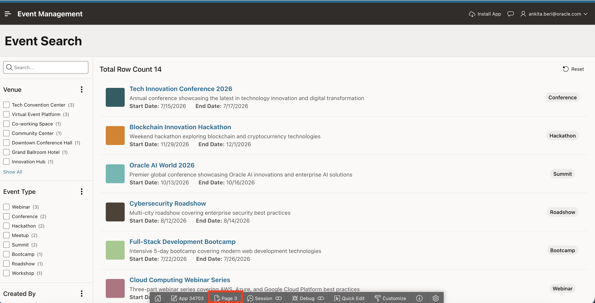

2. In the left pane, right-click **Breadcrumb** and click **Create Button**.

    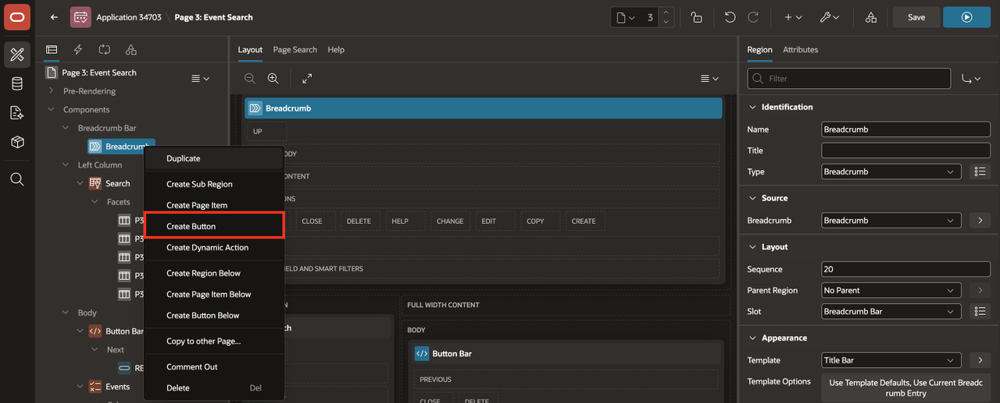

3. In the Property Editor, enter/select the following:

    - Under Identification:

        - Button Name: **EVENT_ASSISTANT**

        - Label: **Event Assistant**

    - Layout > Slot: **Next**

    - Under Appearance:

        - Button Template: **Text with Icon**

        - Hot: Toggle **On**

        - Icon: **fa-chatbot**

    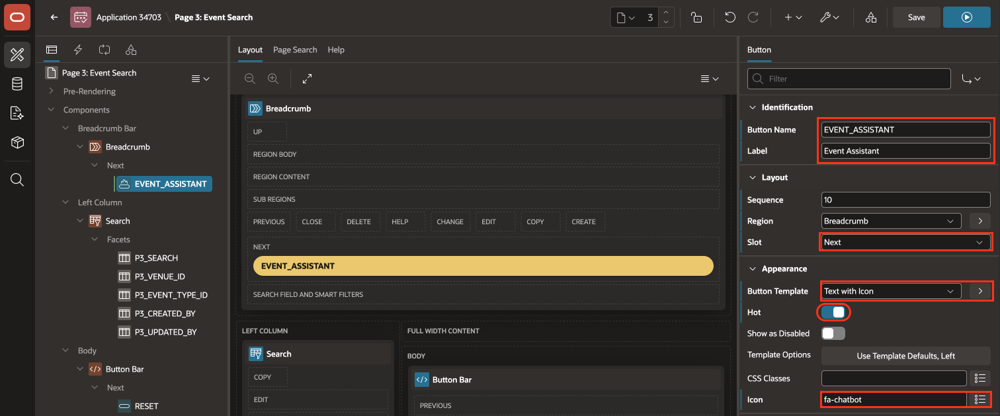

4. In the left pane, right-click **EVENT_ASSISTANT** button and click **Create Trigger Action**.

    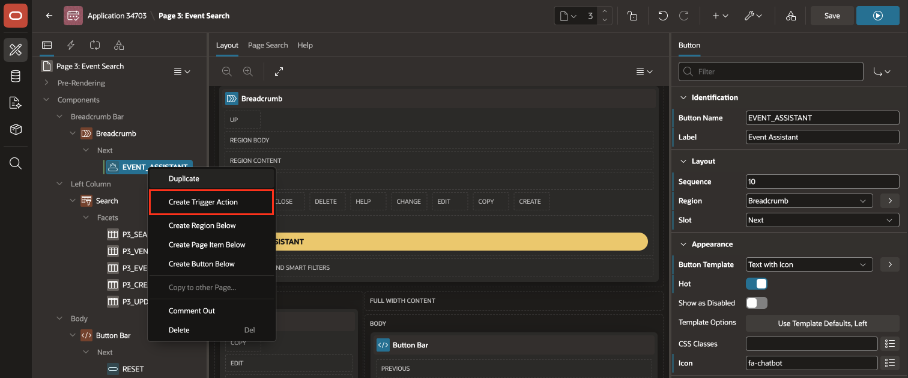

5. In the Property Editor, enter the following:

    - Under Identification

        - Name : **Event Assistant**

        - Action: **Show AI Assistant**

    - Generative AI > Service: Select **YOUR\_GEN\_AI\_SERVICE** created in lab 1

    - Welcome Message: **Hi! How can I help you today?**

    - Appearance > Title: **Event Assistant**

    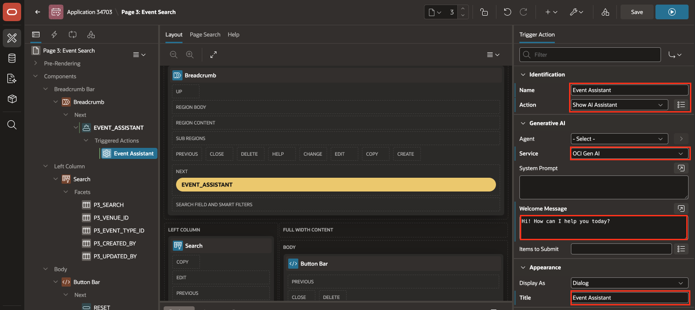

6. Click **Save and Run**.

    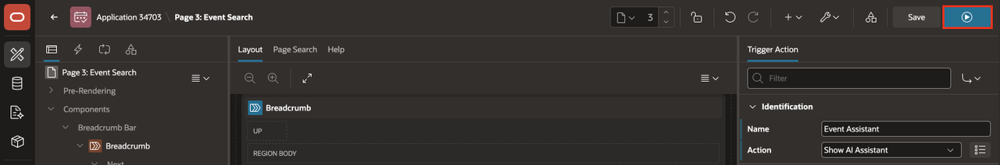

7. In the app, click the **Event Assistant** button and enter the prompt as **List AI Events**.

   The chat assistant currently returns results from a web search, not from our database. To fix this, we will create an AI agent with a RAG (Retrieval-Augmented Generation) source so that the Event Assistant fetches details only from the specified data source.

    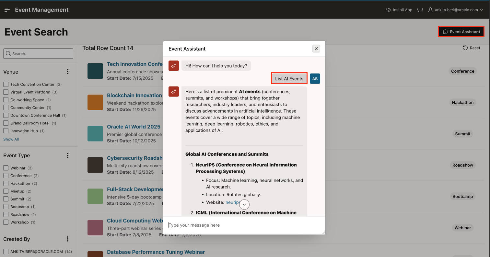

## Task 2: Create an AI Agent and a Tool

1. Switch to the Page Designer tab. Navigate to **Shared Components**.

    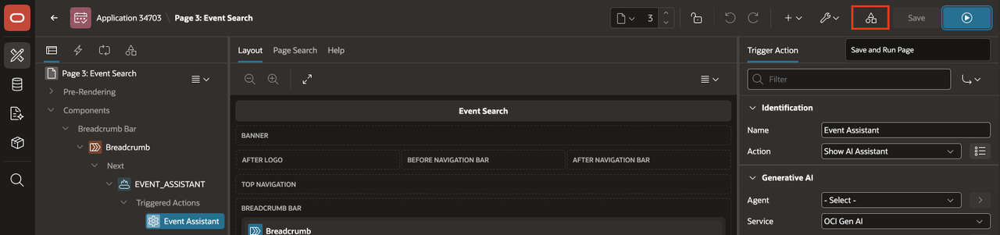

2. Under Generative AI, click **AI Agents**.

    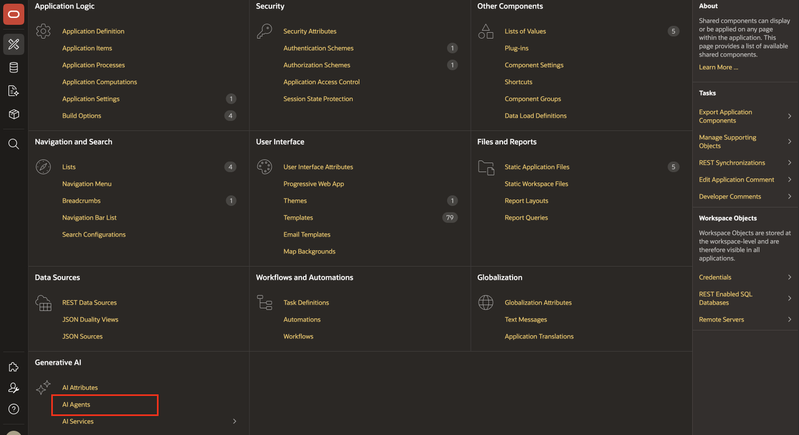

3. In the Generative AI Agents page, click **Create**.

    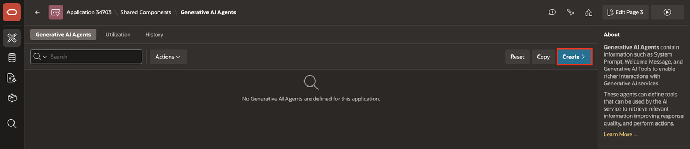

4. In the Generative AI Agent page, enter the following:

    - Identification > Name : **Event AI Configuration**

    - Under Generative AI:

        - Service: Select the AI service which you have configured in Lab 1.

        - System Prompt:

            ```
            <copy>

            You are an event assistant. Help answer questions using the data provided about the events.

            Use the data provided about the events as context.

            ```
            </copy>

    - Welcome Message: **Hi! I’m your Event Assistant. How can I help you today?**

5. Click **Create**.

    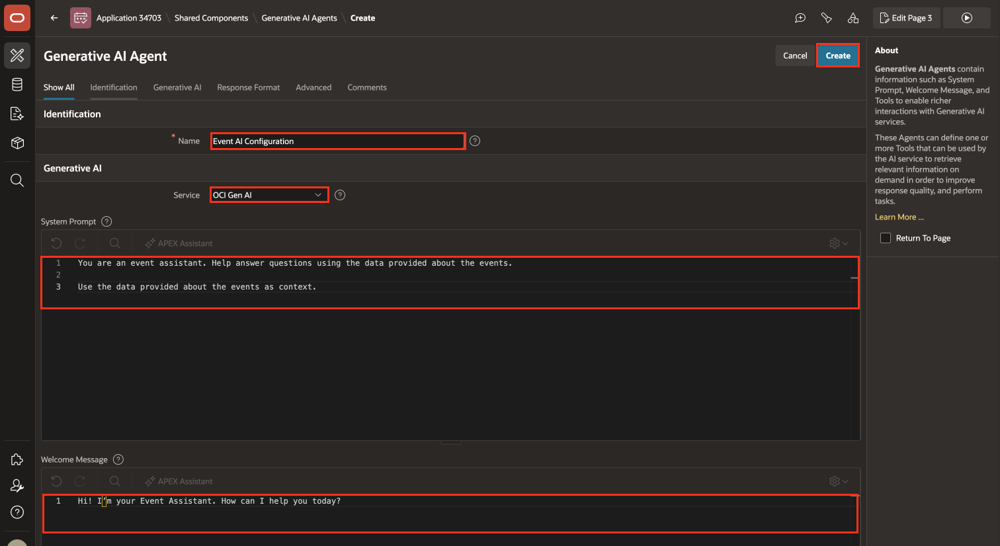

6. Scroll down and navigate to Tools and click **Add Tool**.

    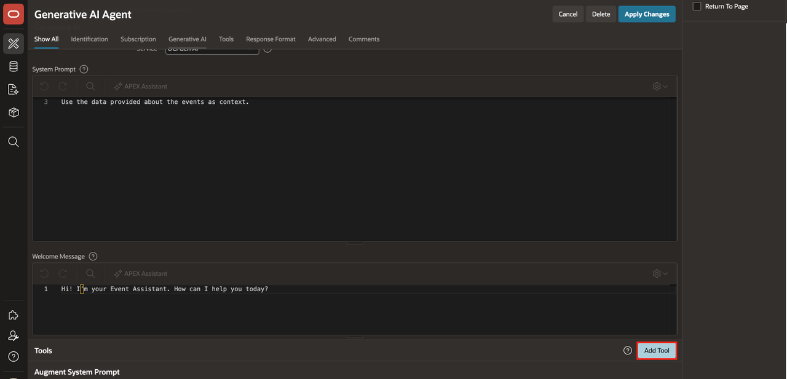

7. In the Generative AI Tool page, enter/select the following:

    - Under Identification

        - Name: **event_assistant**

        - Type: **Retrieve Data**

        - Execution Point: **Augment System Prompt**

    - Under Settings:

        - Data Description: **Event assistant to query about event details**

        - Type: **SQL Query**

        - SQL Query: Click **APEX Assistant**

    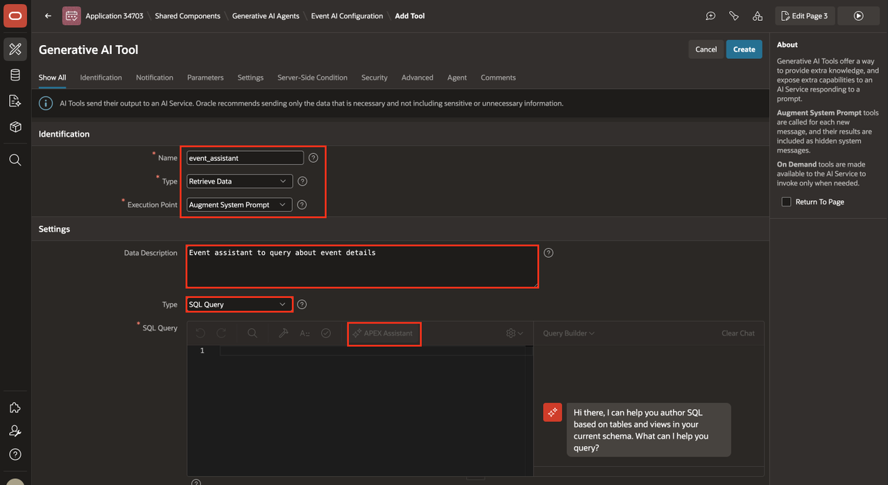

8. In the APEX Assistant box, enter the following prompt and press enter:

    Prompt 1:
    ```
    <copy>
    Fetch event id, start date, venue, name and event type
    </copy>
    ```

    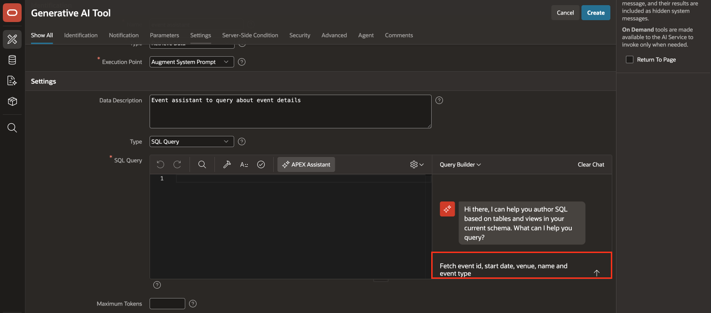

9. Click **Insert**, or replace the existing SQL query with the one provided below to generate the same output for this workshop:

    *Note: By replacing it with the provided code, we ensure that your application behaves consistently and matches the expected outcome.*

    ```
    <copy>
    select e.id,
       e.start_date,
       v.name      as venue,
       e.name,
       et.name     as event_type
    from ev_events        e
    join ev_venues        v
     on e.venue_id = v.id
    join ev_event_types   et
     on e.event_type_id = et.id;
    </copy>
    ```
    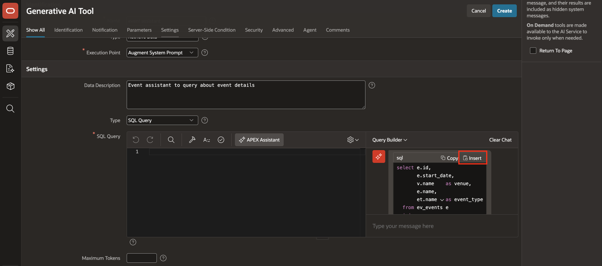

10. Under Server-side Condition, enter/select the following:

    - Type: Function Body

    - Expression 1:

        ```
            <copy>
            return :APP_PAGE_ID = 3;
            </copy>
        ```
        >Note: Page number may vary depending on your application. Replace the page number with your faceted search page.

    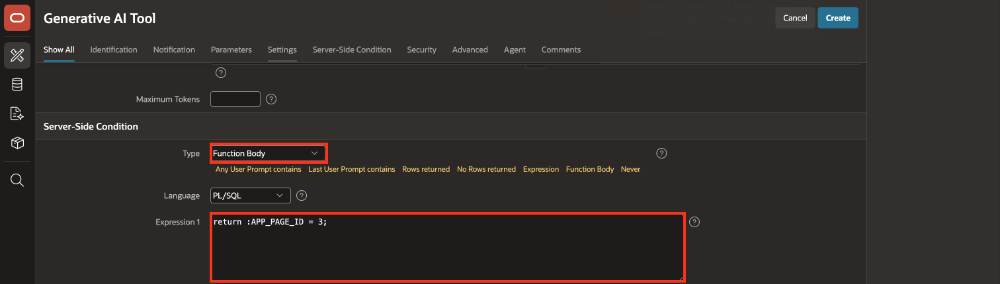

11. Click **Create**.

    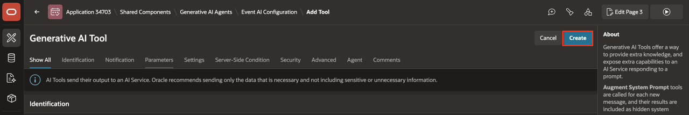

## Task 3: Configure an Event Chat Assistant

1. From the top-right corner, click **Edit Page 3**.

    >Note: Page number may vary depending on your application. Open your faceted search search page.

    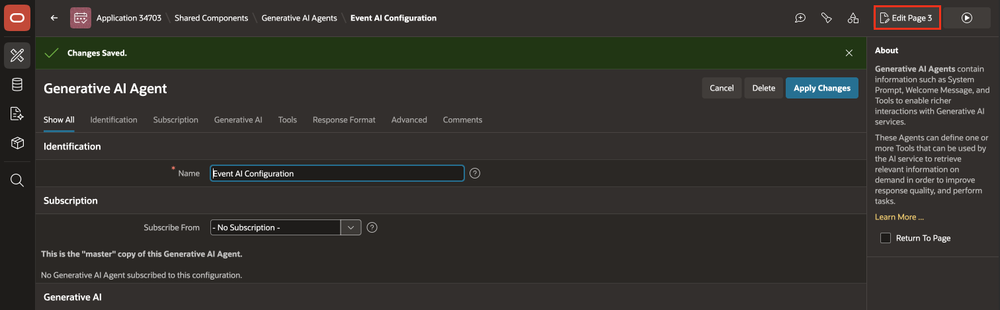

2. Navigate to **EVENT_ASSISTANT** button and select **Event Assistant** Triggered Actions and update the following:

    - Generative AI > Agent: **Event AI Configuration**

    - Under Quick Actions:

        - Message 1: **List all AI events**

        - Message 2: **List any Oracle APEX events**

    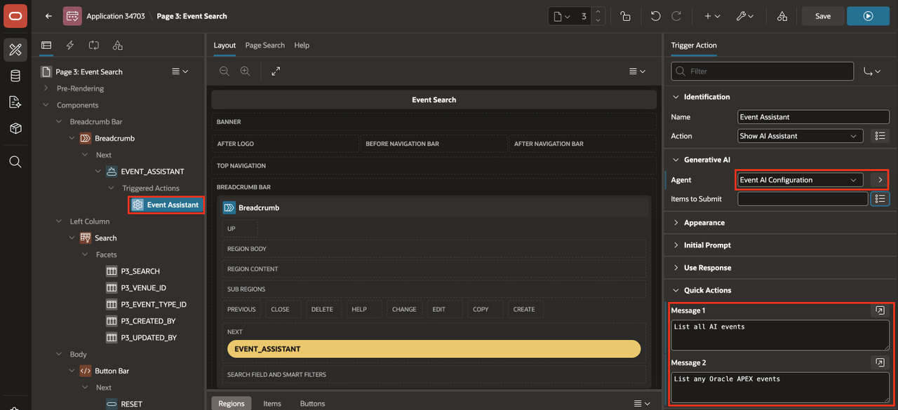

3. Click **Save and Run**.

    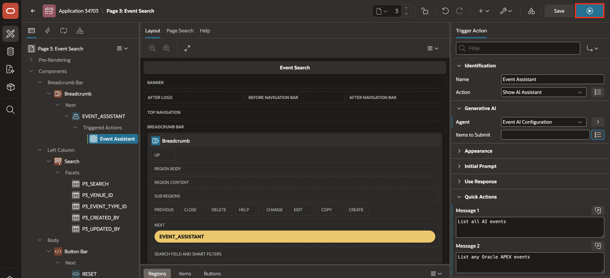

4. In the app, click the **Event Assistant** button and click **List all AI Events**. The chat assistant will now return results using a RAG (Retrieval-Augmented Generation) source, ensuring that details are fetched only from the specified data source.

    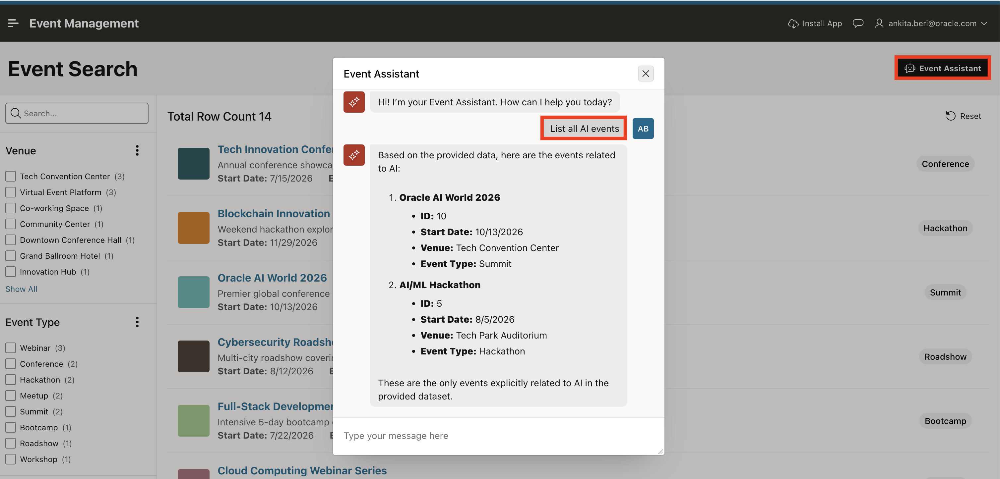

## Summary

In this lab, you created an Event Chat Assistant by adding a button, configuring AI settings, and setting up a dynamic action, allowing users to interactively ask questions about event details.

## Acknowledgements

- **Author** - Ankita Beri, Senior Product Manager
- **Last Updated By/Date** - Ankita Beri, Senior Product Manager, May 2026
