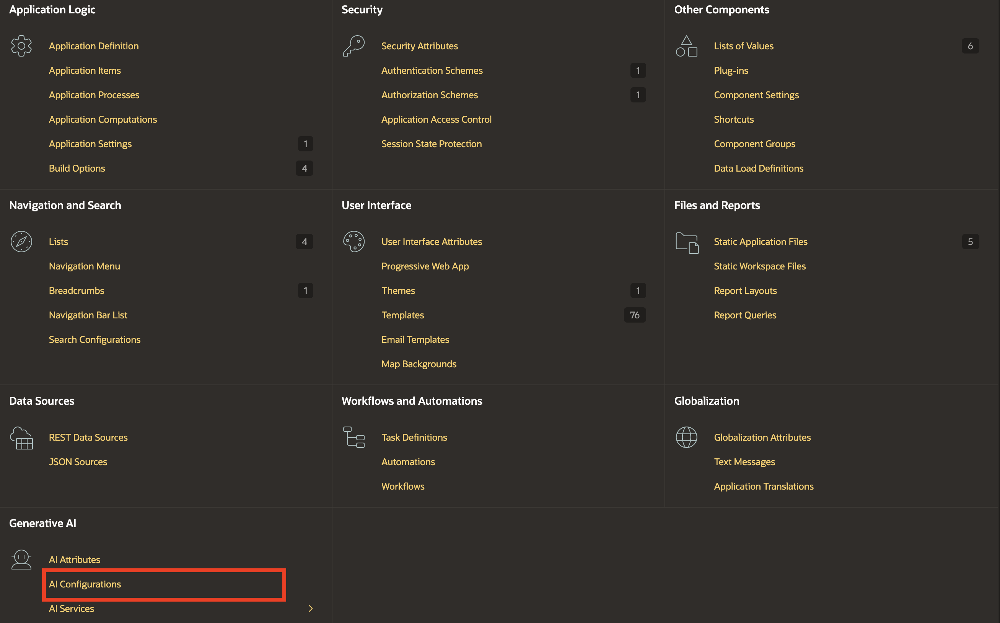
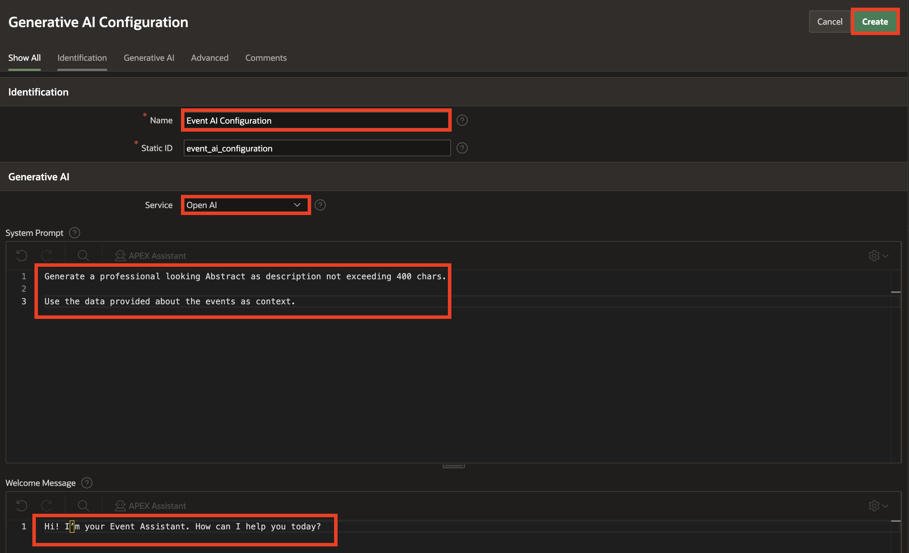
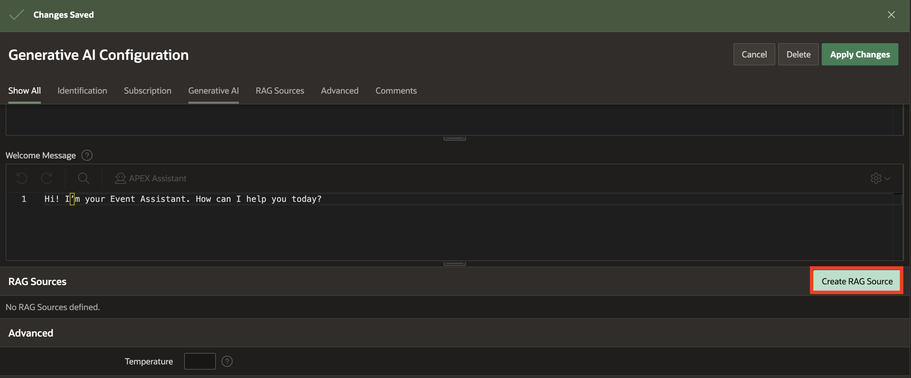
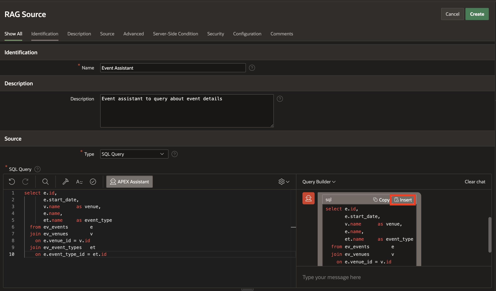
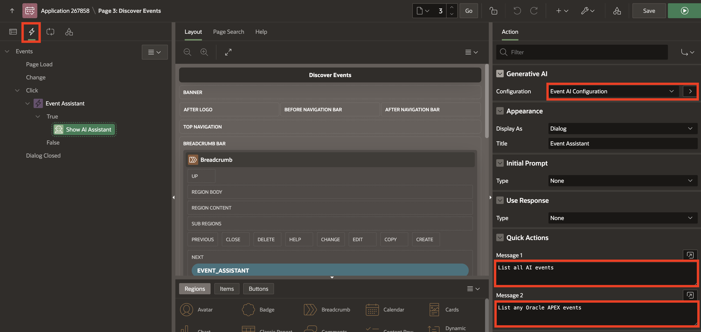

# Create an Event Chat Assistant

## Introduction

In this lab, you will learn how to enhance an Oracle APEX application by creating an Event Chat Assistant. Using the Show AI Assistant dynamic action, you will build a chatbot that can respond to user queries about event details. You will first configure the chatbot without a RAG (Retrieval-Augmented Generation) source to see how it works with generic responses, and then enhance it by creating an AI Configuration and RAG source so the chatbot fetches information directly from your event data. This approach demonstrates how to combine low-code development with AI-driven capabilities to deliver smarter, data-aware user experiences.

Estimated Time: 5 minutes

### Objectives

By the end of this lab, you will be able to:

- Create an Event Assistant button in your APEX application.

- Configure a Show AI Assistant dynamic action without using a RAG source.

- Create an AI Configuration and define a RAG Source to query event data.

- Connect the AI Configuration to the Show AI Assistant dynamic action so the chatbot fetches results exclusively from your event data source.

## Task 1: Set Up Event Chat Assistant without RAG Source

1. Close the dialog box. From the runtime developer toolbar, navigate to **Page 3**.

    >Note: Page number may vary depending on your application.

    

2. In the left pane, right-click **Breadcrumb** and click **Create Button**.

    

3. In the Property Editor, enter/select the following:

    - Under Identification:

        - Button Name: **EVENT_ASSISTANT**

        - Label: **Event Assistant**

    - Layout > Slot: **Next**

    - Under Appearance:

        - Button Template: **Text with Icon**

        - Hot: Toggle **On**

        - Icon: **fa-chatbot**

    

4. In the left pane, right-click **EVENT_ASSISTANT** button and click **Create Dynamic Action**.

    

5. In the Property Editor, enter the following:

    - Identification > Name : **Event Assistant**

    

6. Under **True** Action, click **Show**. In the Property Editor, enter/select the following:

    - Identification > Action: **Show AI Assistant**

    - Generative AI > Service: Select **YOUR\_GEN\_AI\_SERVICE**

    - Welcome Message: **Hi! How can I help you today?**

    - Appearance > Title: **Event Assistant**

7. Click **Save and Run**.

    

8. In the app, click the **Event Assistant** button and enter the prompt as **List AI Events**.

   The chat assistant currently returns results from a web search, not from our database. To fix this, we will create an AI configuration with a RAG (Retrieval-Augmented Generation) source so that the Event Assistant fetches details only from the specified data source.

    

## Task 2: Create AI Configuration and RAG Source

1. Navigate to **Shared Components**.

    

2. Under Generative AI, click **AI Configurations**.

    

3. In the Generative AI Configurations page, click **Create**.

    

4. In the Generative AI Configuration page, enter the following:

    - Identification > Name : **Event AI Configuration**

    - Under Generative AI:

        - Service: Select the AI service which you habe configured in Lab 1.

        - System Prompt:

            ```
            <copy>

            You are an event assistant. Help answer questions using the data provided about the events.

            Use the data provided about the events as context.

            ```
            </copy>

        - Welcome Message: **Hi! I’m your Event Assistant. How can I help you today?**

    - Under Server-side Condition:

        - Type: Function Body

        - Expression:

            ```
            <copy>
            return :APP_PAGE_ID = 3;
            </copy>
            ```
        >Note: Page number may vary depending on your application.

5. Click **Create**.

    

    

    

6. Click **Event AI Configuration**. Under RAG Sources, click **Create RAG Source**.

    

7. In the RAG Source page, enter/select the following:

    - Identification > Name: **Event Assistant**

    - Description: **Event assistant to query about event details**

    - Source > SQL Query: Click **APEX Assistant**

8. In the APEX Assistant box, enter the following prompt and press enter:

    Prompt 1:
    ```
    <copy>
    Fetch event id, start date, venue, name and event type
    </copy>
    ```

    

9. Click **Insert**.

    

10. Click **Create**.

    

## Task 3: Enable Event Chat Assistant with RAG Source

1. From the top-right corner, click **Edit Page 3**.

    >Note: Page number may vary depending on your application.

    

2. In the Dynamic Action tab, select True Action **Show AI Assistant** and update the following:

    - Generative AI > Configuration: **Event AI Configuration**

    - Under Quick Actions:

        - Message 1: **List all AI events**

        - Message 2: **List any Oracle APEX events**

    

3. Click **Save and Run**.

4. In the app, click the **Event Assistant** button and click **List all AI Events**. The chat assistant will now return results using a RAG (Retrieval-Augmented Generation) source, ensuring that details are fetched only from the specified data source.

    

## Summary

In this lab, you created an Event Chat Assistant by adding a button, configuring AI settings, and setting up a dynamic action, allowing users to interactively ask questions about event details.

## Acknowledgments

- **Author** - Ankita Beri, Senior Product Manager
- **Last Updated By/Date** - Ankita Beri, Senior Product Manager, November 2025
