# Generate Event Description with AI

## Introduction

In this lab, you will enhance your Oracle APEX application by integrating AI-powered text generation. Specifically, you will create a feature that automatically generates event descriptions based on event details stored in the database. By leveraging an augmented system prompt tool and a trigger action, you will see how APEX makes it easy to combine low-code development with AI services to deliver smarter, more user-friendly applications.

Estimated Time: 5 minutes

### Objectives

- Create a Generate Description button within the form page.

- Configure a Tool to fetch event details for AI input.

- Implement a Generate Text with AI trigger action to produce event descriptions automatically.

## Task 1: Add Generate Description Button

1. In the app, click any event name to open a dialog box. Then, from the Developer Toolbar, navigate to **Page 5**.

    >Note: Page number may vary depending on your application. Open the form page from your workspace.

    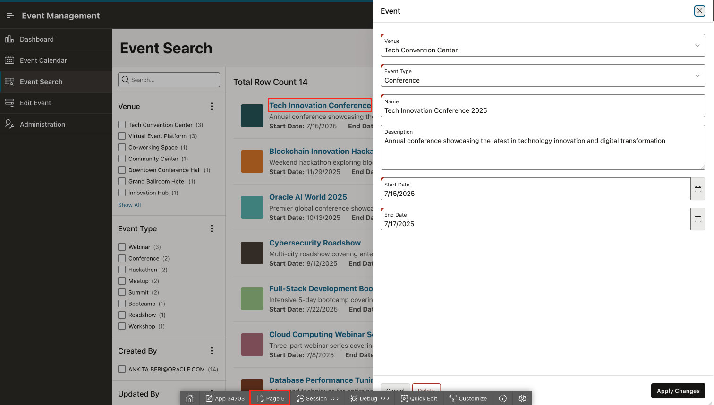

2. In the left pane, right-click **Region Body** and click **Create Button**.

    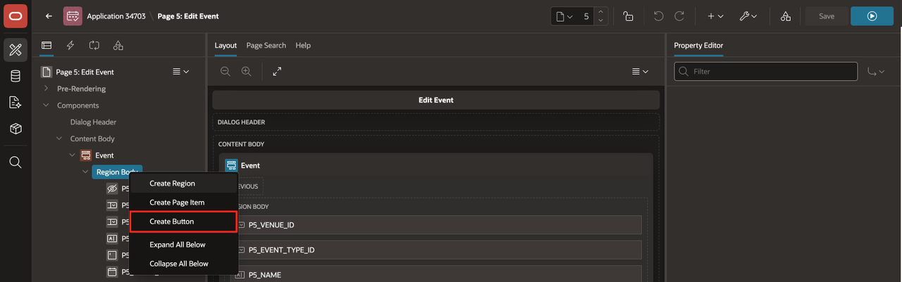

3. In the Property Editor, enter/select the following:

    - Under Identification:

        - Button Name: **GENERATE_DESCRIPTION**

        - Label: **Generate Description**

    - Under Appearance:

        - Button Template: **Text with Icon**

        - Hot: Toggle **On**

        - Icon: **fa-file-text**

    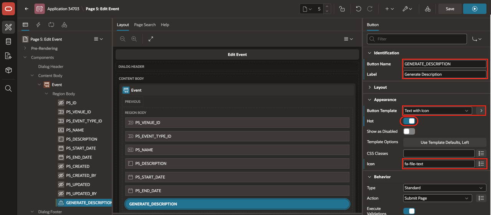

4. Drag and drop the **GENERATE\_DESCRIPTION** button below the **P5\_DESCRIPTION** page item.

    >Note: Page Item number may vary depending on your application.

    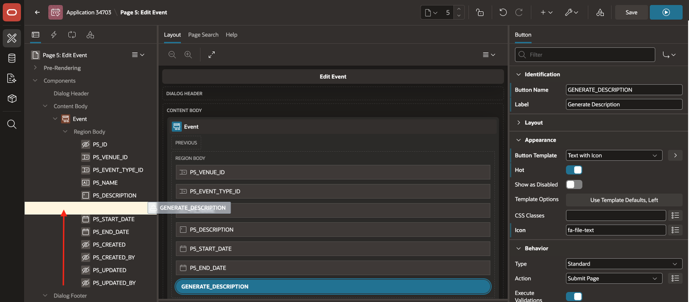

5. Click **Save**.

    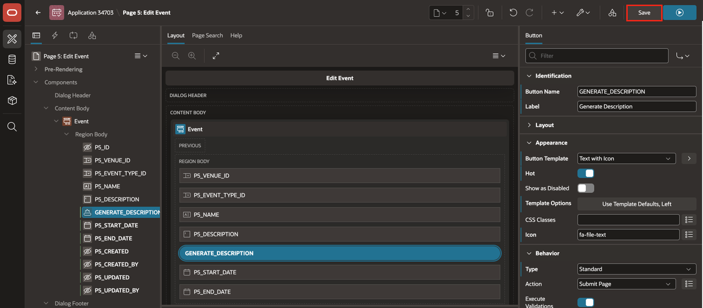

## Task 2: Define an AI Tool to Generate a Description

1. Navigate to **Shared Components**.

    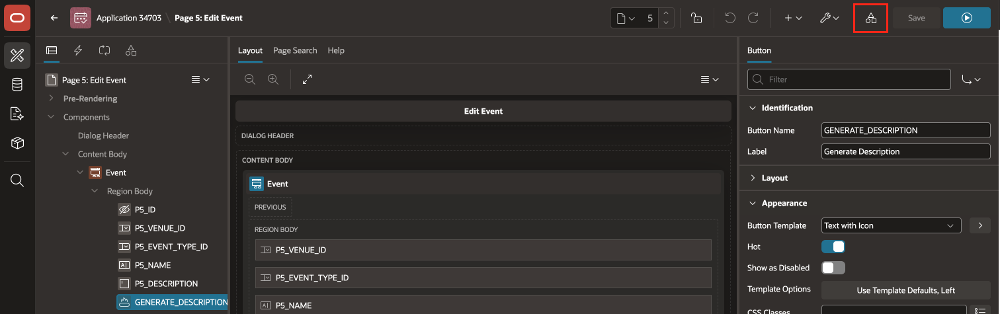

2. Under Generative AI, click **AI Agents**.

    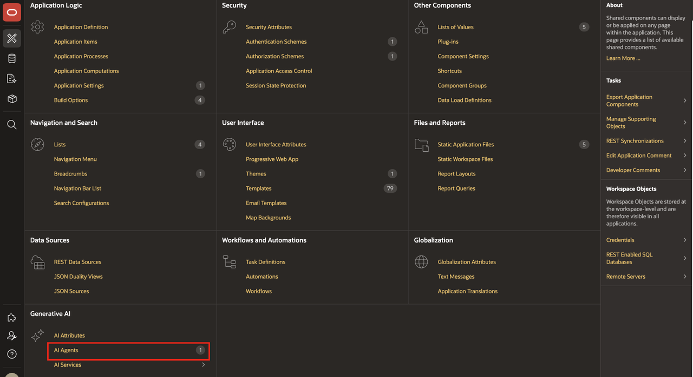

3. Select **Event AI Configuration**.

    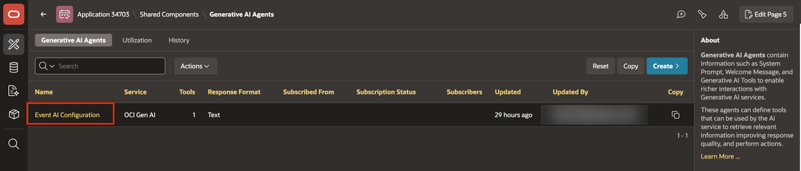

4. Under Tools, click **Add Tool**.

    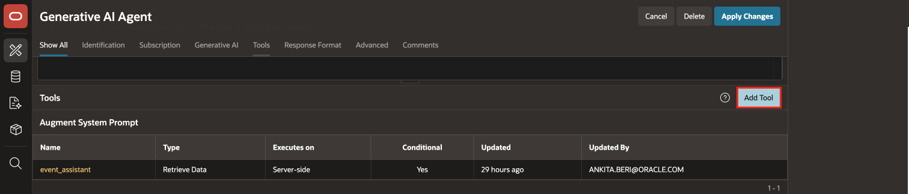

5. In the Generative AI Tool page, enter/select the following:

    - Under Identification:

        - Name: **generate_description**

        - Type: **Retrieve Data**

        - Execution Point: **Augment System Prompt**

    - Under Settings:

        - Data Description: **Retrieve the event details for a given event. Provide the data as a paragraph.**

        - Type: SQL Query

        - SQL Query: Copy and paste the following SQL into the code editor.

        ```
        <copy>
        select distinct ev.ID,
            ev.venue_id,
            ev.EVENT_TYPE_ID,
            ev.NAME,
            ev.START_DATE,
            evt.name event_type,
            ev.name venue
        from EV_EVENTS ev
            join EV_EVENT_TYPES evt
        on evt.id = ev.event_type_id
            join ev_venues eve
        on eve.id = ev.venue_id
            where ev.id = :P5_ID
        </copy>
        ```

    >Note: Page Item number may vary depending on your application. Make sure to replace the page number in the SQL query if your form page uses a different number.

    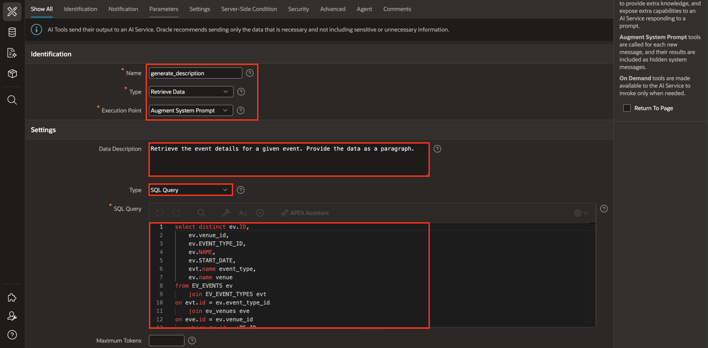

    - Under Server-side Condition:

        - Type: Function Body

        - Expression:

            ```
            <copy>
            return :APP_PAGE_ID = 5;
            </copy>
            ```
        >Note: Page number may vary depending on your application. Replace the page number with your form page number if it differs.

6. Click **Create**.

    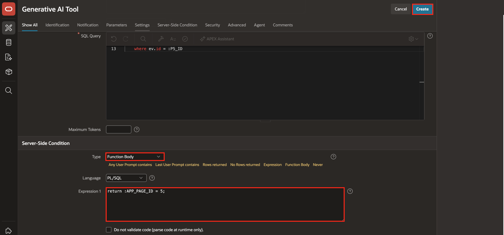

## Task 3: Create a Trigger Action to Generate a Description

1. On the top-right corner, click **Edit Page 5**. This navigates you to the form page.

    >Note: Page number may vary depending on your application.

    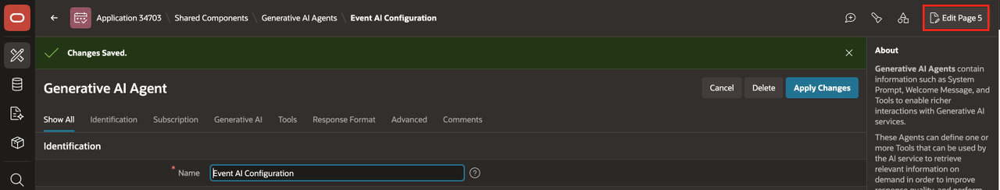

2. In the left pane, right-click **GENERATE_DESCRIPTION** and select **Create Trigger Action**.

    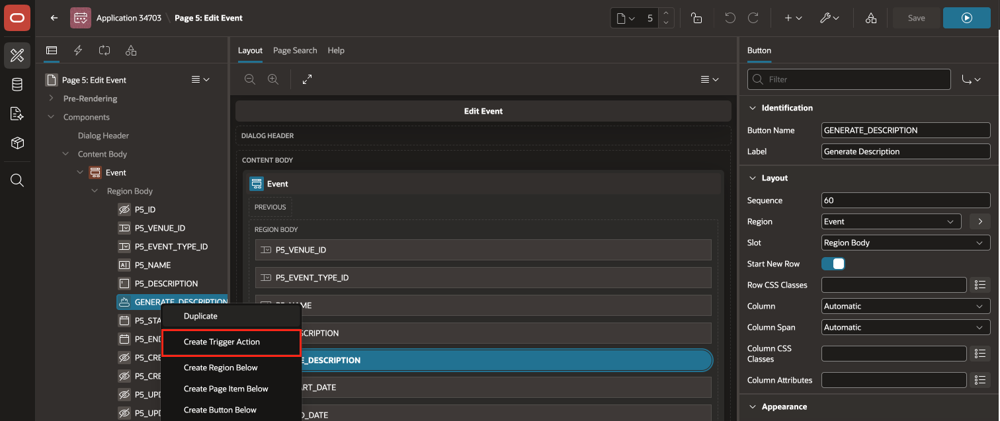

3. In the Property Editor, enter the following:

    - Under Identification:

        - Name: **Generate Description**

        - Action: **Generate Text with AI**

    - Generative AI > Agent: **Event AI Configuration**

    - Under Input Value:

        - Type: **Item**

        - Item: **P5_ID**

    - Under Use Response:

        - Type: **Item**

        - Item: **P5_DESCRIPTION**

    >Note: Page Item number may vary depending on your application.

    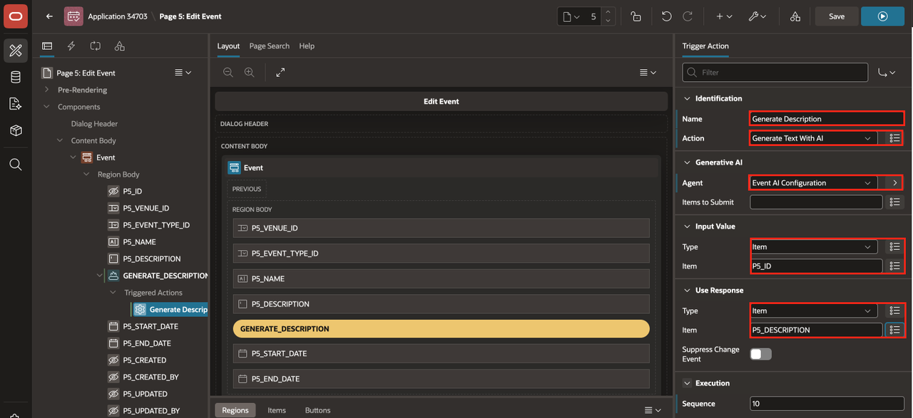

4. In the left pane, select **P5_ID**, update the following property, and click **Save**.

    - Session State > Storage: **Per Session (Persistent)**

    *Note: This stores the value for each session, allowing it to be accessed across requests.*

    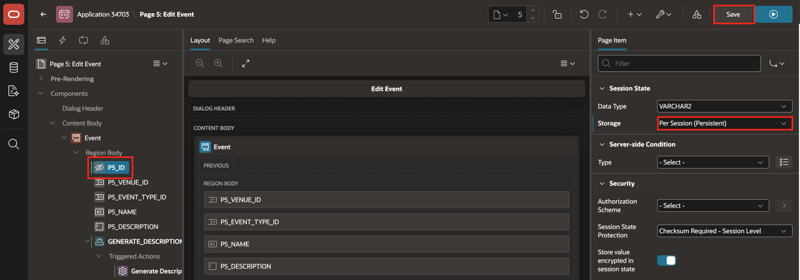

5. Refresh the application, and then open the form page. Click **Generate Description** to create an event description in the Description item. Click **Apply Changes** to save it to the table.

    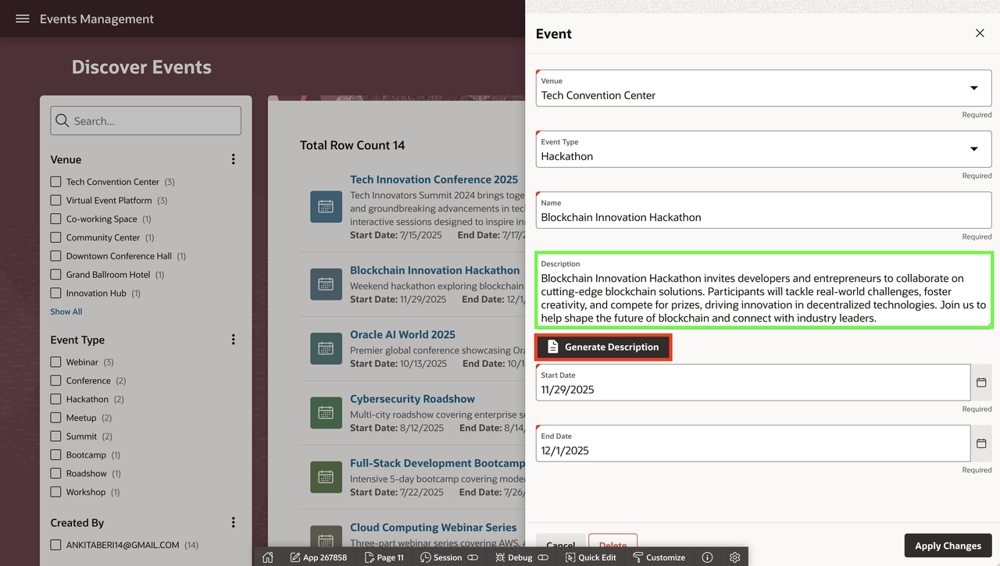

## Summary

In this lab, you built an AI-powered feature to generate event descriptions in Oracle APEX. You added a button, configured an AI tool, and created a trigger action to generate, display, and save event descriptions.

## Acknowledgements

- **Author** - Ankita Beri, Senior Product Manager
- **Last Updated By/Date** - Ankita Beri, Senior Product Manager, May 2026
