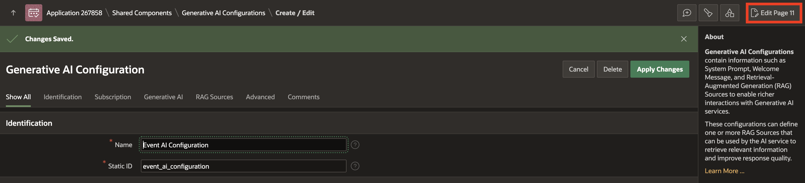
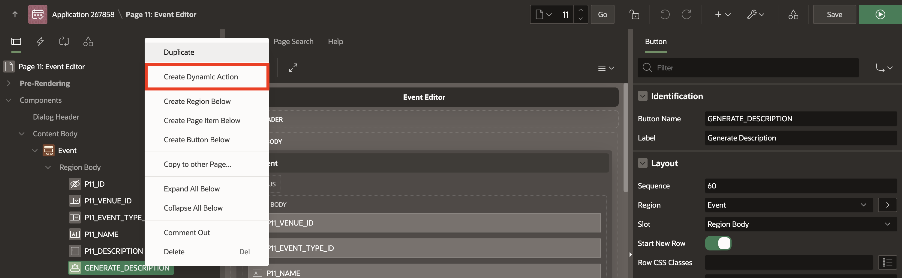

# Generate Event Description with AI

## Introduction

In this lab, you will enhance your Oracle APEX application by integrating AI-powered text generation. Specifically, you will create a feature that automatically generates event descriptions based on event details stored in the database. By leveraging a Retrieval-Augmented Generation (RAG) source and dynamic actions, you will see how APEX makes it easy to combine low-code development with AI services to deliver smarter, user-friendly applications.

Estimated Time: 5 minutes

### Objectives

- Create a Generate Description button within the form page.

- Configure a RAG Source to fetch event details for AI input.

- Implement a Generate Text with AI dynamic action to produce event descriptions automatically.

## Task 1: Add Generate Description Button

1. In the app, click any event name to open a dialog box. Then, from the developer toolbar, navigate to **Page 11**.

    >Note: Page number may vary depending on your application.

    

2. In the **Rendering** tab, right-click **Region Body** and click **Create Button**.

    

3. In the Property Editor, enter/select the following:

    - Under Identification:

        - Button Name: **GENERATE_DESCRIPTION**

        - Label: **Generate Description**

    - Under Appearance:

        - Button Template: **Text with Icon**

        - Hot: Toggle **On**

        - Icon: **fa-file-text**

4. Drag and drop **GENERATE\_DESCRIPTION** button under **P11\_DESCRIPTION** page item.

    >Note: Page Item number may vary depending on your application.

    

5. Click **Save**.

## Task 2: Define RAG Source

1. Navigate to **Shared Components**.

    

2. Under Generative AI, click **AI Configurations**.

    

3. Select **Event AI Configuration**.

    

4. Under RAG Sources, click **Create RAG Source**.

    

5. In the RAG Source page, enter/select the following:

    - Identification > Name: **Generate Description**

    - Description: **Retrieve the event details for a given event**

    - Source > SQL Query: Copy and paste the following SQL into the code editor.

        ```
        <copy>
        select distinct ev.ID,
            ev.venue_id,
            ev.EVENT_TYPE_ID,
            ev.NAME,
            ev.START_DATE,
            evt.name event_type,
            ev.name venue
        from EV_EVENTS ev
            join EV_EVENT_TYPES evt
        on evt.id = ev.event_type_id
            join ev_venues eve
        on eve.id = ev.venue_id
            where ev.id = :P11_ID
        </copy>
        ```
    >Note: Page Item number may vary depending on your application.

6. Click **Create**.

    

## Task 3: Add Generate Text with AI Dynamic Action

1. On the top right corner, click **Edit Page 11**.

    >Note: Page number may vary depending on your application.

    

2. In the **Rendering** tab, right-click **GENERATE_DESCRIPTION** and select **Create Dynamic Action**.

    

3. In the Property Editor, enter the following:

    - Identification > Name : **Generate Description**

    

4. Under **True** Action, click **Show**. In the Property Editor, enter/select the following:

    - Identification > Action: **Generate Text with AI**

    - Generative AI > Configuration: **Event AI Configuration**

    - Under Input Value:

        - Type: **Item**

        - Item: **P11_ID**

    - Under Use Response:

        - Type: **Item**

        - Item: **P11_DESCRIPTION**

    >Note: Page Item number may vary depending on your application.

5. Click **Save**.

    

6. Navigate to **Rendering** tab, select **P11_ID** and update the following and click **Save**.

    - Session State > Storage: **Per Session (Persistent)**

    *Note: This is to maintain for each session by storing the value in the database, to access it across requests.*

    

7. Run the application and open the form page. Click **Generate Description** to create an event description in the Description item. Click **Apply Changes** to save it to the table.

    

## Summary

In this lab, you built an AI-powered feature to generate event descriptions in Oracle APEX. You added a button, configured a RAG Source, and created a dynamic action to display and save the generated description.

## Acknowledgments

- **Author** - Ankita Beri, Senior Product Manager
- **Last Updated By/Date** - Ankita Beri, Senior Product Manager, November 2025
