# Appendix: Download Instructions

Estimated Time: TODO - x minutes

This lab consists of tasks that need to be executed on a case-by-case basis. If you are directed to this lab at any point of time, choose the appropriate task that needs to be executed to proceed.

## Objectives

In this lab, you will:

- [Download](files/event-management-hol-app.sql) and install the final export of the app.

## Introduction

TODO: Add introduction text here.

## Task 1: Import the App into an APEX Workspace

1. Navigate to **App Builder** icon from left navigation menu and click **Import**.

    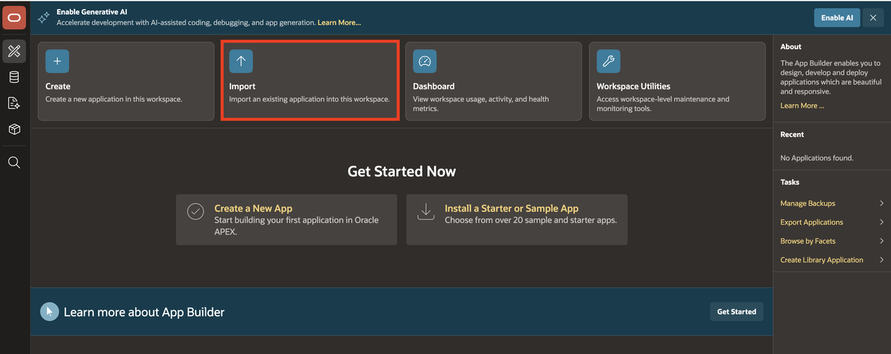

2. Drag and drop your downloaded zip file, then click **Next**.

    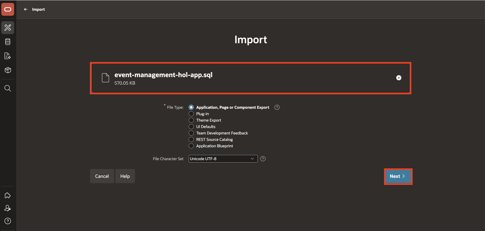

3. Click **Import Application**.

    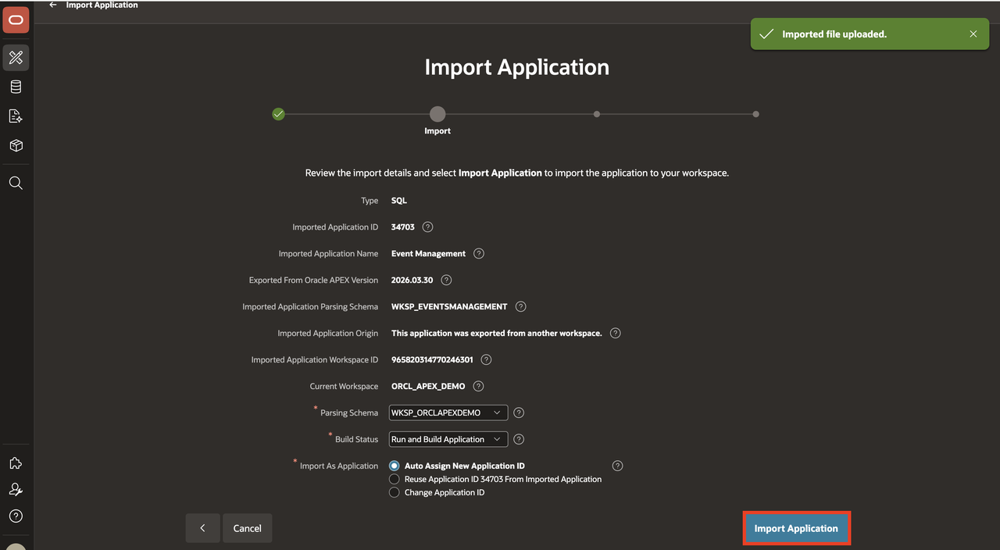

4. Click **Next**.

    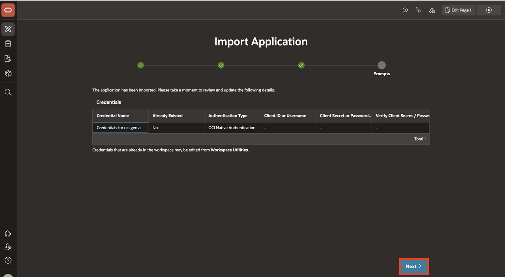

5. Click **Install Supporting Objects**.

    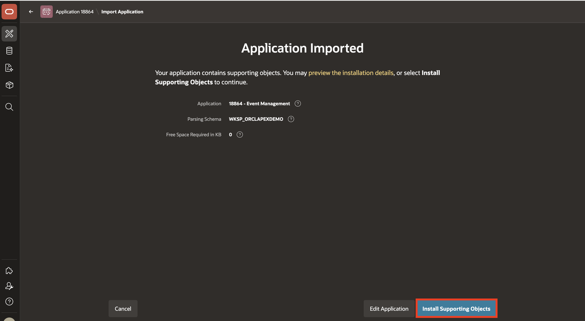

## Task 2: Update Web Credentials in Oracle APEX

Web credentials are used to authenticate connection to external REST services, or REST Enabled SQL services from APEX.

Creating Web Credentials securely stores and encrypts authentication credentials for use by Oracle APEX components and APIs. Credentials cannot be retrieved back in clear text. Credentials are stored at the workspace level and therefore are visible to all applications.

To update the Web Credential in Oracle APEX:

1. You need access to an OCI API Key Pair. To generate an OCI Key pair, refer to Lab 1 > Task 1 [Configure a Generative AI Service in APEX](?lab=0-configure-ai-keys)

    *Note: Skip this step if you already have the API key.*

2. From left navigation menu, navigate to **App Builder** icon and click **Workspace Utilities > All Workspace Utilities**.

    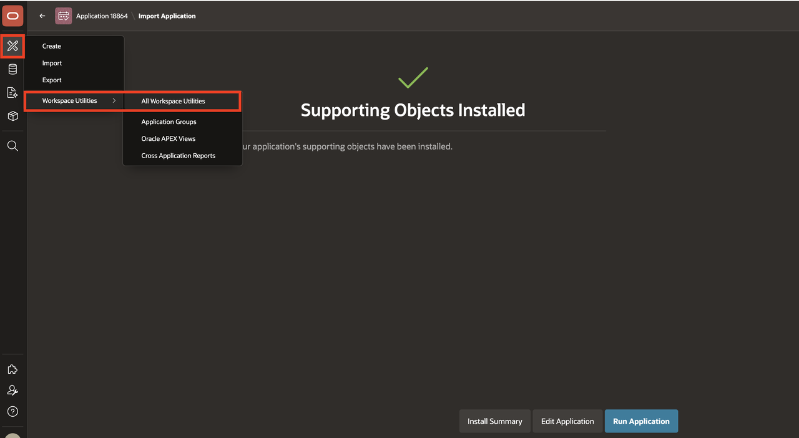

3. Select **Web Credentials**.

    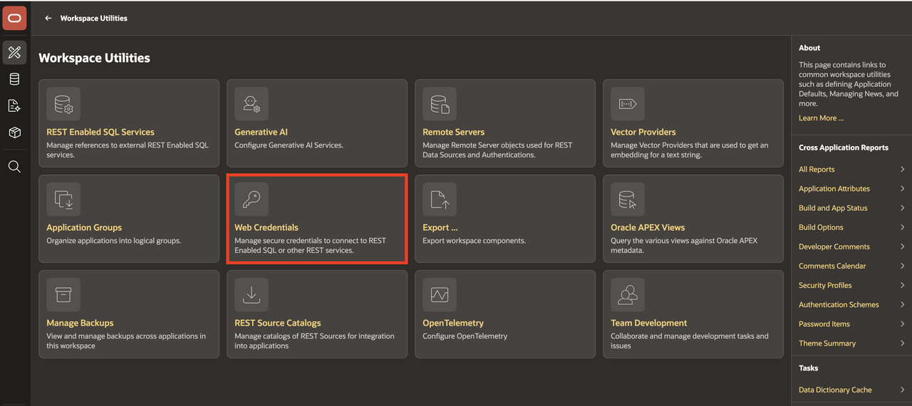

4. Click **Credentials for oci gen ai**.

    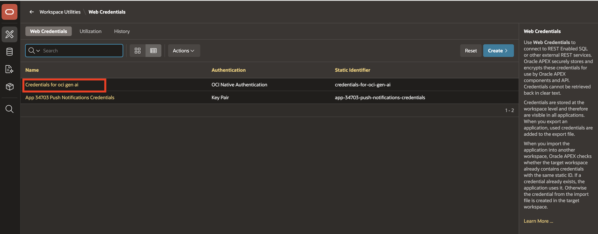

5. Enter the following details using the configuration file you copied while generating an API key in OCI Console.

    - **OCI User ID**: Enter the OCID of the Oracle Cloud user Account. You can find the OCID in the Configuration File Preview generated during the API Key creation.
    Your OCI User ID looks similar to **ocid1.user.oc1..aaaaaaaa\*\*\*\*\*\*wj3v23yla**

    - **OCI Private Key**: Open the private key (.pem file) downloaded in the previous task. Copy and paste the API Key.

    - **OCI Tenancy ID**: Enter the OCID for Tenancy. Your Tenancy ID looks similar to **ocid1.tenancy.oc1..aaaaaaaaf7ush\*\*\*\*cxx3qka**

    - **OCI Public Key Fingerprint**: Enter the Fingerprint ID. Your Fingerprint ID looks similar to **a8:8e:c2:8b:fe:\*\*\*\*:ff:4d:40**

6. Click **Apply Changes**.

    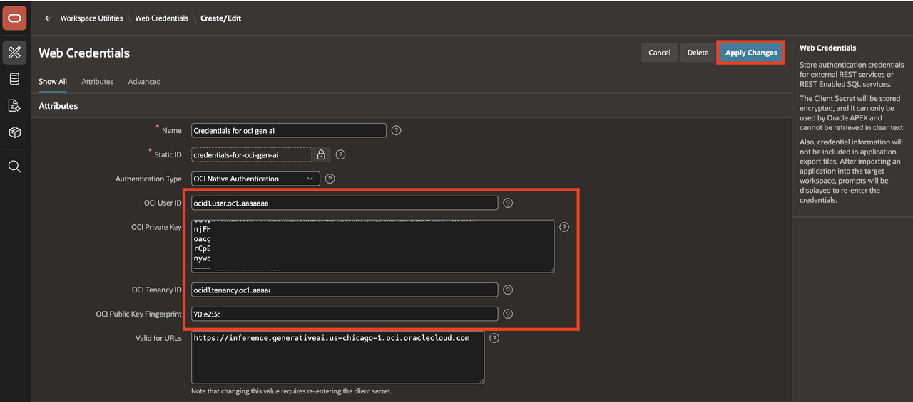

## Task 3: Configure Generative AI

1. Click **Workspace Utilities**.

    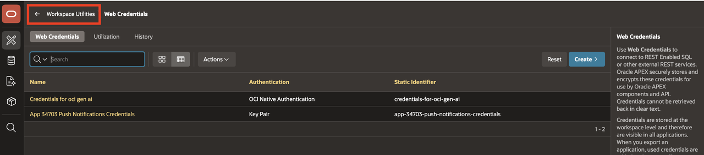

2. Click **Generative AI**.

    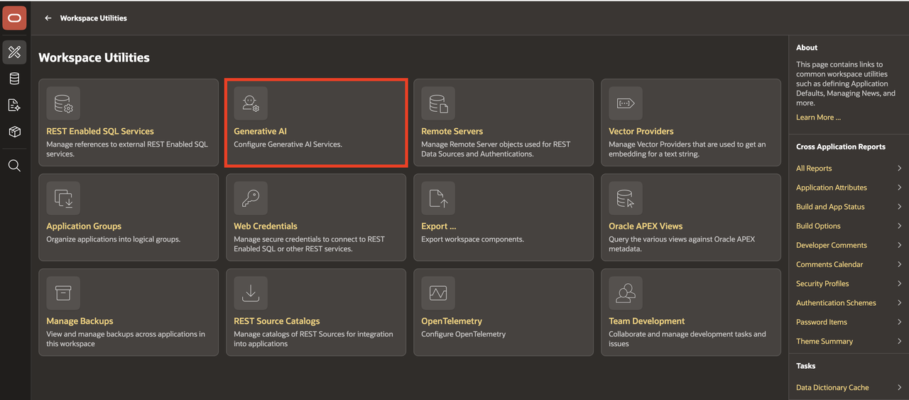

3. Click **OCI Gen AI**.

    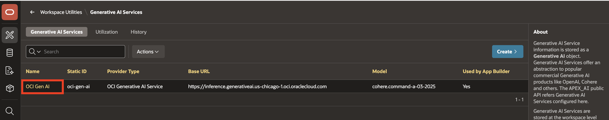

4. Enter your **Compartment ID** and **Region**, click **Apply Changes**. (Refer to the [Documentation](https://docs.oracle.com/en-us/iaas/Content/GSG/Tasks/contactingsupport_topic-Locating_Oracle_Cloud_Infrastructure_IDs.htm#:~:text=Finding%20the%20OCID%20of%20a,displayed%20next%20to%20each%20compartment.) to fetch your Compartment ID.)

    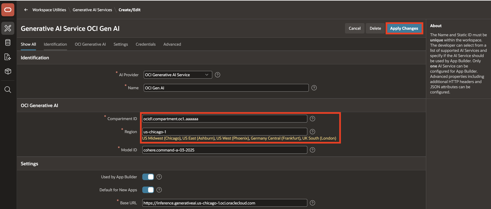

## Task 4: Run the Application

1. From the left navigation menu, click **App Builder** icon.

    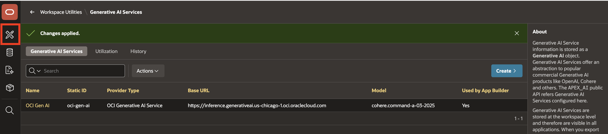

2. Find **Event Management** app and click **Play** icon to run the application.

    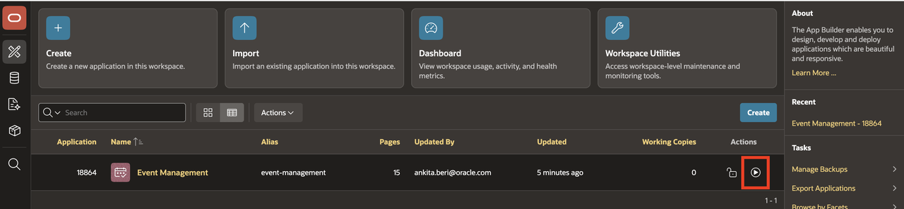

## Acknowledgments

- **Author** - Ankita Beri, Senior Product Manager
- **Last Updated By/Date** - Ankita Beri, Senior Product Manager, May 2026

## Acknowledgements

* **Author** - TODO: Your Name, Your Title, Your Organization
* **Last Updated By/Date** - TODO: Your Name, Month Year
