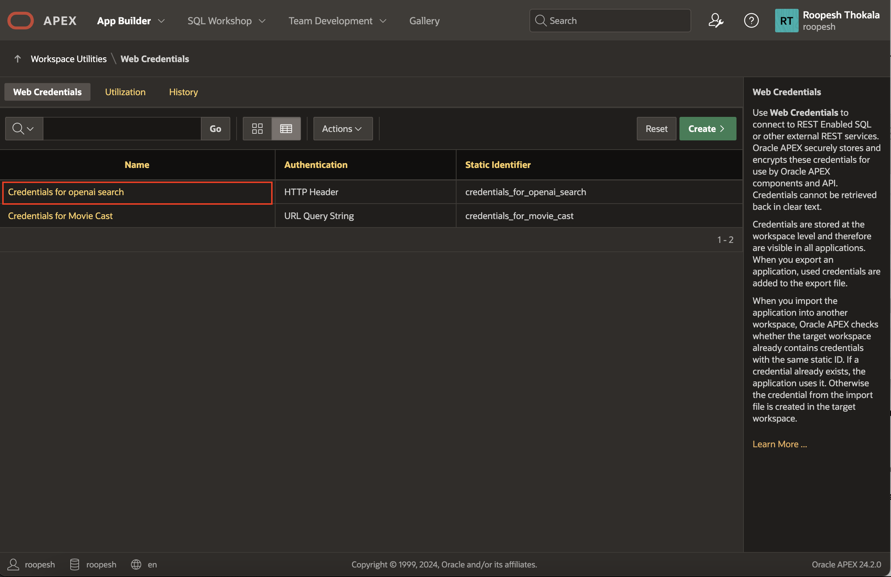

# Introduction

## About this Workshop

In this workshop, you will build a dynamic and interactive **Events Management Application** using Generative Development in Oracle APEX. This workshop is designed to showcase how AI-driven features of Oracle APEX can accelerate application development and simplify complex tasks, helping you create powerful applications with ease.

You will begin by creating a **custom data model using natural language**, quickly establishing the foundation for your application. Once the data model is ready, you will again use natural language to generate an initial application blueprint, demonstrating how AI can streamline and speed up the development process.

Next, you will enhance the application by using the **APEX Assistant** to generate SQL and HTML directly within the APEX Code Editor, simplifying the creation of both UI and data logic.

As you proceed, you will integrate advanced AI capabilities into the application. This includes building an **AI-powered Event Assistant** that uses **Retrieval-Augmented Generation (RAG)** to answer event-related questions through an interactive **chat interface**. You will also implement a feature that uses the **Generate Text with AI** dynamic action to automatically create event descriptions.

By the end of this workshop, you will understand how Oracle APEX brings together AI assistance, data-driven development, and enterprise-grade application architecture to help you build intelligent applications quickly and effectively.

Total Workshop Time: 60 minutes

### Objectives

- Create a Custom Data Model using Generative AI.
- Generate an application *blueprint* using APEX AI Assistant.
- Improve the application's UI and UX using the APEX AI Assistant to generate SQL and HTML directly in the Code Editor.
- Build an AI-powered Event Assistant that uses RAG to answer event-related queries through a chat interface.
- Add a feature to generate event descriptions using AI through the *Generate Text with AI* dynamic action.

## Prerequisites

- An APEX workspace.

- API key for the AI Provider of your choice. (OCI Gen AI, Open AI, Cohere)

- If you choose OCI Gen AI as your AI provider, the prerequisites are as follows:

    - A paid Oracle Cloud Infrastructure (OCI) account or a FREE Oracle Cloud account with $300 credits for 30 days to use on other services. Read more about it at: [oracle.com/cloud/free/](https://www.oracle.com/cloud/free/). The OCI account must be created in or subscribed to one of the regions that supports OCI Generative AI Service. Currently, OCI Generative AI Service is supported in the following regions:

        - Brazil East (Sao Paulo)
        - Germany Central (Frankfurt)
        - India South (Hyderabad)
        - Japan Central (Osaka)
        - UAE East (Dubai)
        - UK South (London)
        - US Midwest (Chicago)

    - OCI Generative AI service is available in limited regions. To see if your cloud region supports OCI Generative AI service, visit the [documentation](https://docs.oracle.com/en-us/iaas/Content/generative-ai/overview.htm#regions).

    - An OCI compartment. An Oracle Cloud account comes with two pre-configured compartments - The tenancy (root compartment) and ManagedCompartmentForPaaS (created by Oracle for Oracle Platform services).

    - The logged-in user should have the necessary privileges to create and manage Autonomous Database instances in this compartment. You can configure these privileges via an OCI IAM Policy. If you are using a Free Tier account, it is likely that you already have all the necessary privileges.

    *Note: This workshop assumes you are using Oracle APEX 24.2.2. Some of the features might not be available in prior releases and the instructions, flow, and screenshots might differ if you use an older version of Oracle APEX.*

## Labs

| S No. | Module | Est. Time |
|--- |--- | --- |
| 1 |[Configure Generative AI Service](?lab=0-configure-ai-keys) | 4 minutes |
| 2 |[Create a Data Model using AI](?lab=1-create-data-model-using-ai) | 4 minutes |
| 3 |[Create the Application using Generative AI](?lab=2-create-app) | 4 minutes |
| 4|[Enhance UI with APEX Assistant](?lab=4-ui-apex-assistant) | 4 minutes |
| 5 |[Create an Event Chat Assistant](?lab=5-chat-bot) | 5 minutes |
| 6 | [Generate Event Description with AI](?lab=6-generate-text) | 4 minutes |
| 7 |[OPTIONAL - Enhance Charts and Database Objects with APEX Assistant](?lab=3-apex-assistant) | 5 minutes |

### **Let's Get Started!**

- Click on **Getting Started** from the menu on the right. If you already have an Oracle Cloud account, click on **Lab 1: Configure AI Service and Create Data Model using AI**.

>**Note**: If you have a **Free Trial** account, when your Free Trial expires your account will be converted to an **Always Free** account. You will not be able to conduct Free Tier workshops unless the Always Free environment is available. **[Click here for the Free Tier FAQ page.](https://www.oracle.com/cloud/free/faq.html)**

## Downloads

If you are stuck or the App is not working as expected, you can download and install the completed App as follows:

1. **[Click here](https://c4u04.objectstorage.us-ashburn-1.oci.customer-oci.com/p/EcTjWk2IuZPZeNnD_fYMcgUhdNDIDA6rt9gaFj_WZMiL7VvxPBNMY60837hu5hga/n/c4u04/b/livelabsfiles/o/labfiles%2Fevent_management_app_hol.sql)** to download the completed application.

2. Import the event\_management\_hol.sql file into your workspace. Follow the Install Application wizard steps to install the app along with the Supporting Objects.

3. Once the application is installed, follow the below steps to update the Web Credentials.

    - Click the Down Arrow next to **App Builder**, click **Workspace Utilities** and then select **All Workspace Utilities**.

    

    - Select **Web Credentials**.

    - Click **Credentials for Open AI**.

    

    - In the **Web Credentials** page, enter/select the following:

        - Credential Name: **Authorization**

        - Credential Secret: Enter **YOUR_KEY**

    - Click **Apply Changes**.

    

## Learn More - *Useful Links*

- APEX on Autonomous:   [https://apex.oracle.com/autonomous](https://apex.oracle.com/autonomous)
- APEX Collateral:   [http://oracle.com/apex](https://www.oracle.com/apex)
- Tutorials:   [https://apex.oracle.com/en/learn/tutorials](https://apex.oracle.com/en/learn/tutorials)
- Community:  [https://apex.oracle.com/community](https://apex.oracle.com/community)
- External Site + Slack:   [http://apex.world](http://apex.world)

## Acknowledgments

- **Author** - Ankita Beri, Senior Product Manager
- **Last Updated By/Date** - Ankita Beri, Senior Product Manager, November 2025
