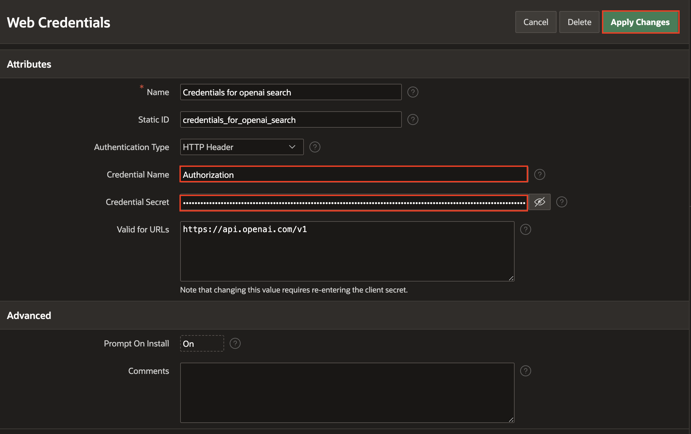

# Event Management App with AI-Assisted Development in Oracle APEX

## Introduction

In this hands-on lab, you will build a dynamic and interactive application using Oracle APEX AI Assistant. This lab is designed to showcase how AI-driven features of Oracle APEX can accelerate application development and simplify complex tasks, helping you create powerful applications with ease.

You will begin by creating a data model with the assistance of AI, quickly setting up the foundation for your application. Once the data model is ready, you will use the APEX Assistant to build an initial application framework, highlighting how AI can simplify and speed up the development process.

Next, you will customize your application using Oracle APEX low-code features, making adjustments with pre-built components that streamline the enhancement process. You also learn how to generate SQL queries with the help of APEX Assistant, simplifying the creation of complex queries for your application.

As you progress, you integrate AI-powered text generation into your application, enabling it to dynamically create and utilize text content. You will also implement an AI chat assistant by leveraging the Show AI Assistant dynamic Action of APEX of APEX, providing a responsive interface for real-time user interaction.

Estimated Time: 30 minutes

### Lab Objectives

* Obtain a free development environment
* Create a Data Model using AI
* Create an application on the new data structures using APEX Assistant
* Refine the application by generating SQL using APEX assistant
* Add functionality to Generate Text with AI
* Create an AI Chat Assistant to inquire about the Events.

>**Note**: This workshop assumes you are using Oracle APEX 24.2 and Oracle Database 23ai. Some of the features might not be available in prior releases and the instructions, flow, and screenshots might differ if you use an older version of Oracle APEX.

### **Let's Get Started!**

- Click on **Getting Started** from the menu on the right. If you already have an Oracle Cloud account, click on **Lab 1: Configure AI Service and Create Data Model using AI**.

>**Note**: If you have a **Free Trial** account, when your Free Trial expires your account will be converted to an **Always Free** account. You will not be able to conduct Free Tier workshops unless the Always Free environment is available. **[Click here for the Free Tier FAQ page.](https://www.oracle.com/cloud/free/faq.html)**

## Downloads

If you are stuck or the App is not working as expected, you can download and install the completed App as follows:

1. **[Click here](https://c4u04.objectstorage.us-ashburn-1.oci.customer-oci.com/p/EcTjWk2IuZPZeNnD_fYMcgUhdNDIDA6rt9gaFj_WZMiL7VvxPBNMY60837hu5hga/n/c4u04/b/livelabsfiles/o/labfiles%2Fevent_management_hol.sql)** to download the completed application.

2. Import the event_management_hol.sql file into your workspace. Follow the Install Application wizard steps to install the app along with the Supporting Objects.

3. Once the application is installed, follow the below steps to update the Web Credentials.

    - Click the Down Arrow next to **App Builder**, click **Workspace Utilities** and then select **All Workspace Utilities**.
        

    - Select **Web Credentials**.

    - Click **Credentials for Open AI*.

        

    - In the **Web Credentials** page, enter/select the following:

      - Credential Name: **Authorization**

      - Credential Secret: Enter **Bearer YOUR_KEY**

        

## Learn More - *Useful Links*

- APEX on Autonomous:   [https://apex.oracle.com/autonomous](https://apex.oracle.com/autonomous)
- APEX Collateral:   [https://apex.oracle.com](https://apex.oracle.com)
- Tutorials:   [https://apex.oracle.com/en/learn/tutorials](https://apex.oracle.com/en/learn/tutorials)
- Community:  [https://apex.oracle.com/community](https://apex.oracle.com/community)
- External Site + Slack:   [http://apex.world](http://apex.world)

## Acknowledgments

- **Author** - Ankita Beri, Product Manager
- **Last Updated By/Date** - Ankita Beri, Product Manager, August 2025
