# Regenerating the App

## Introduction
In the runtime environment, if you navigate to Milestones, and then from the report page, click the edit icon, the form page for maintaining milestones will be displayed. You will notice that there are only a few fields. Therefore, it may be better to utilize an Interactive Grid, which is similar to a spreadsheet, where several records can be maintained directly within the grid.

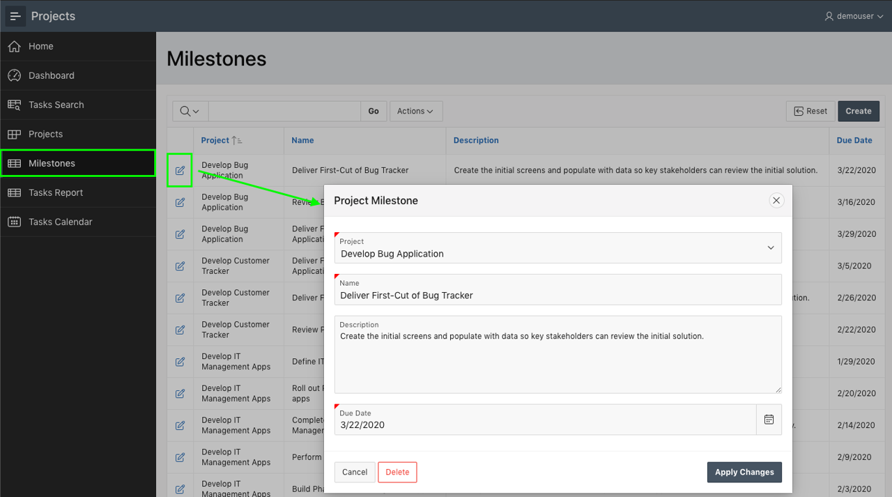

*Note: See how to go to your runtime environment from the previous lab.*

## Task 1: Delete Generated App
Given you are going to regenerate the app from the Create Application Wizard, it is best to delete the app you just generated to avoid confusion.

1. In the runtime environment, within the develop toolbar, click **Application xxxxx**.  

    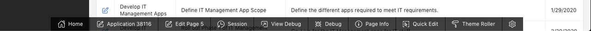  

    *Note: The Developer Toolbar is only shown to developers who run the application from the App Builder. End users will never be shown the Developer Toolbar*

2. From the App Home Page, under Tasks, click **Delete this Application**.  

    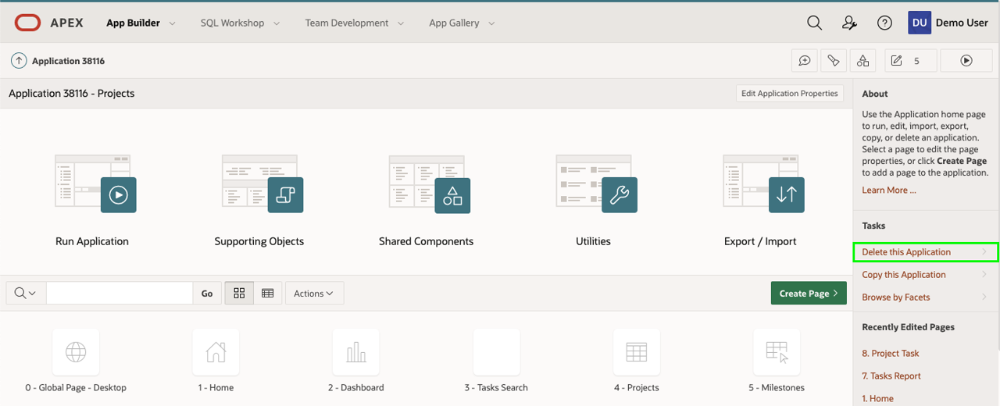  

3. On the Confirm Delete page, click **Permanently Delete Now**.

## Task 2: Reload the Projects App
The Create Application Wizard includes the ability to reload apps that you previously generated, making it easy to make some changes and generate a new and improved version of the initial app.

1. From the App Builder Home Page, click **Create**.

    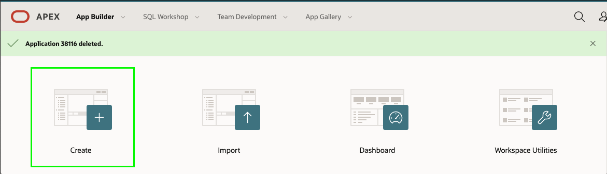

2. Click **New Application**.

3. Click **Load Blueprint**.    
    On Load Blueprint, for the latest app generated, click **Load**.  

    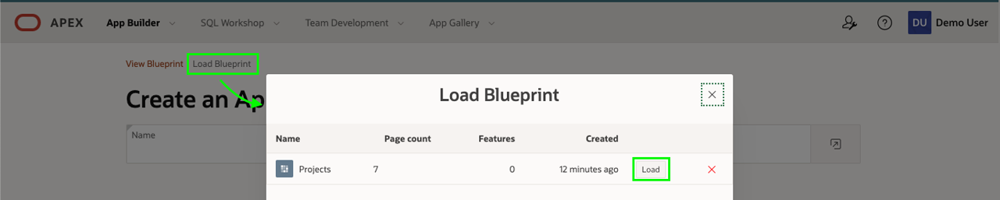  

    The previously defined app blueprint will be displayed.

## Task 3: Replacing the Milestone Pages
Rather than having two ways to maintain milestone records, you will delete the original report and form pages, and then add a new page, and reposition it in the list of pages.

1. In the list of pages, for Milestones, click **Edit**.
2. Click **Delete**.  

    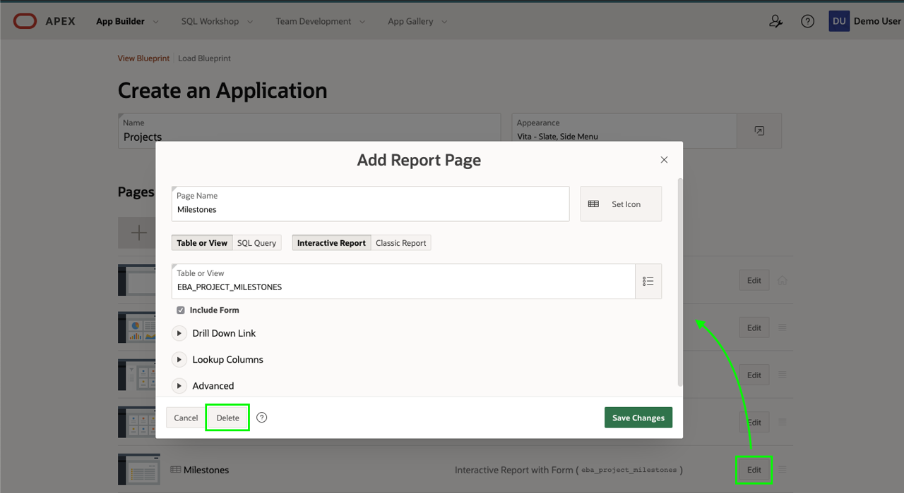

3. In the Create Application Wizard, click **Add Page**.
4. Click **Interactive Grid**.
5. On the Add Interactive Grid Page, enter the following:
    - Page Name - enter **Milestones**
    - Table or View - select **EBA\_PROJECT\_MILESTONES**

    - Click **Add Page**  

    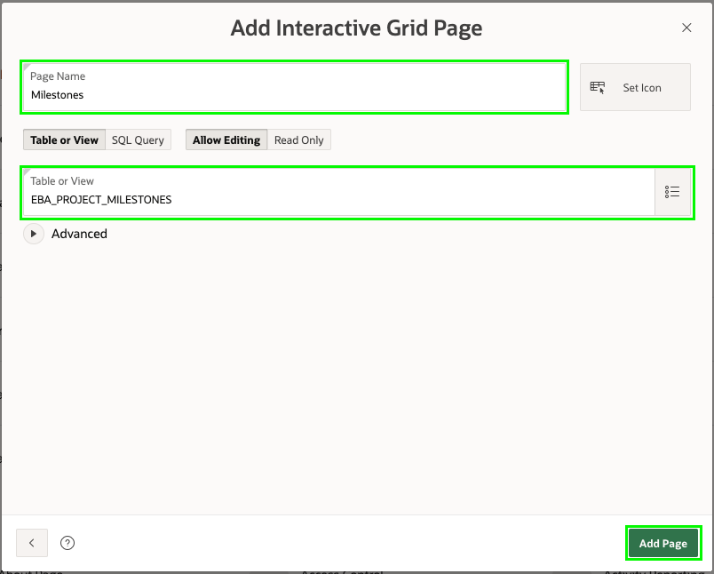

6. Now to reorder the new page.

    In the list of Pages, for the Milestones page, select the hamburger.    
    Drag the page up until it is under the Projects page and drop.

    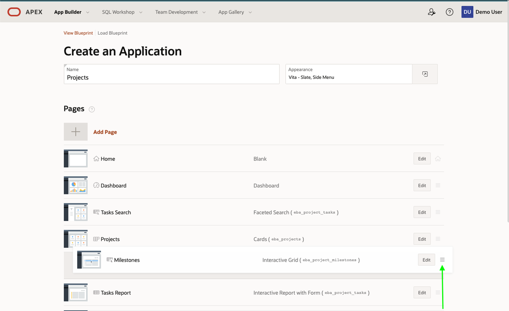

## Task 4: Add the Status Page
The **EBA\_PROJECT\_STATUS** table is used to maintain project statuses. This table should be maintainable; however, only application administrators should be able to modify records. As such, adding the Status page under Administration is the optimal solution.

1. In the Create Application Wizard, click **Add Page**.
2. Click **Interactive Grid**.
3. On the Add Interactive Grid Page, enter the following:
    - Page Name - enter **Statuses**
    - Table or View - select **EBA\_PROJECT\_STATUS**
    - Expand **Advanced**
        - Click **Set as Administration Page**

    - Click **Add Page**  

    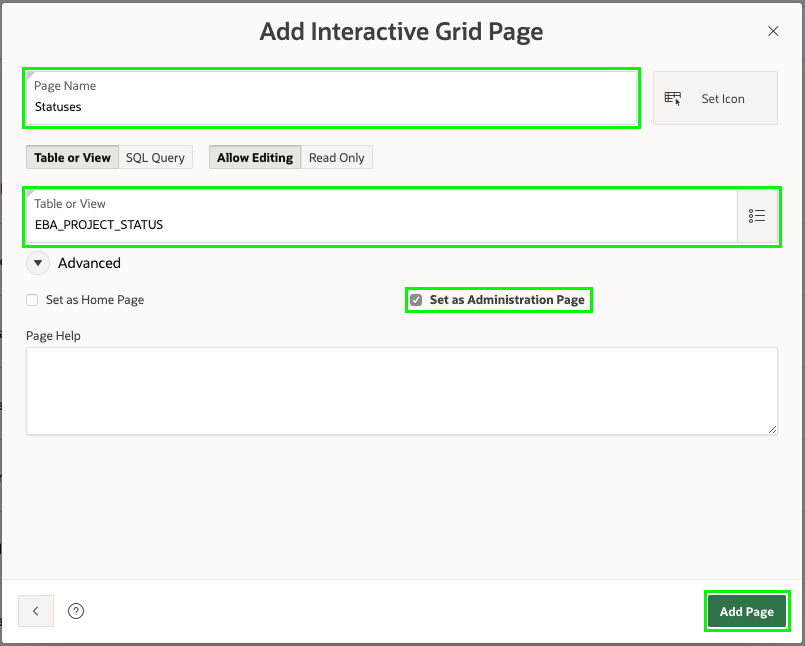

## Task 5: Completing the App
The Create Application Wizard also has the ability to add various features to your app, such as Access Control, Activity Reporting, Feedback, and more, to make your app more functionally complete and "production-ready".

1. In the Create Application Wizard, for Features, click **Check All**
2. Click **Create Application**

    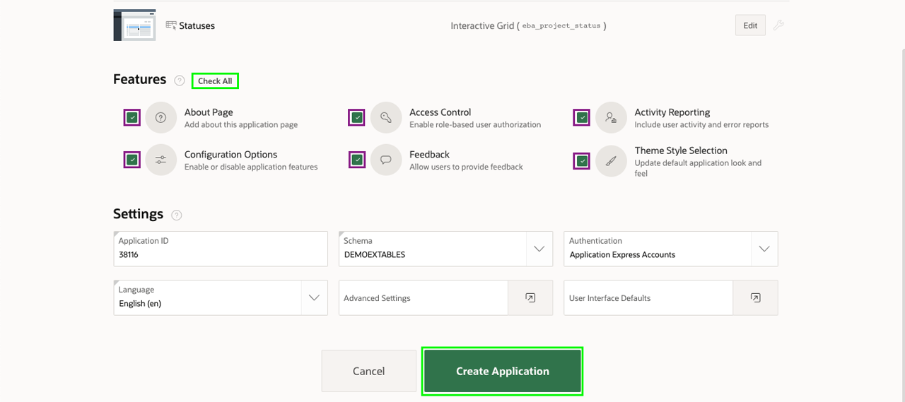
    *Note: Your new application will generally have a new Application Id*

    Your new application will be displayed in the App Builder.

3. Click **Run Application**.
4. Enter your user credentials.
5. Navigate to **Milestones**.
6. Double-click in any column to see how you can enter data directly into the grid.

    

    *Note: Project column will display a list of projects, Name and Description columns will be text areas, and Due Date column will be a date picker, based on the different data types.*

7. Click the navigation button at the top-left of the page, and navigate to **Administration** to review the capabilities provided.

    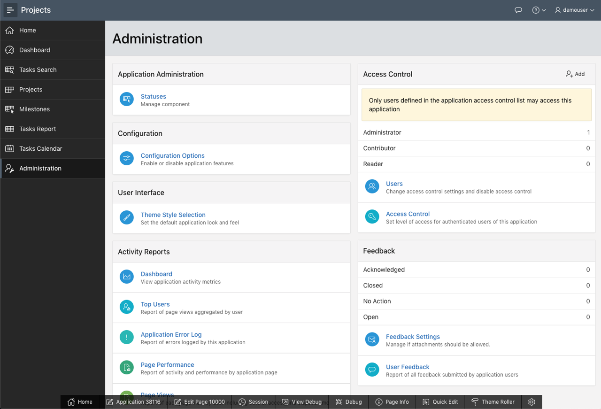

## **Summary**

This completes Lab 3. You now know how to regenerate an application and add additional features. [Click here to navigate to Lab 4](?lab=lab-4-improving-dashboard)

## **Acknowledgements**

 - **Author** -  Salim Hlayel, Principle Product Manager
 - **Contributors** - Arabella Yao, Product Manager Intern, DB Product Management
 - **Last Updated By/Date** - Madhusudhan Rao, Apr 2022

