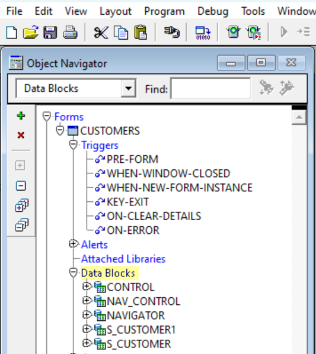

# Analyze the Sample Forms [Study]

## Introduction

This Lab analyses your current Forms environment and identifies the important business logic. The first part of the Lab provides an overview guide on understanding forms modules and how they compare to APEX modules. The second part provides the sample forms used in this live Lab.

*Note: This Lab assumes you have an Oracle Forms setup in your environment.*

Estimated Time: 10 Minutes

### Objectives

In this lab, you:

- Understand the current business logic in Oracle Forms and how to map it to Oracle APEX components.

## Task 1: Analyze Forms Business Logic

To modernize from Oracle Forms to APEX, you must understand the current business logic of your forms and where they are implemented. This is key for deciding how to adapt them to the APEX environment. The rule of thumb is always to push as much business logic as possible into the Oracle Database.

For example, the business logic in Oracle Forms resides in the Triggers and Program Units. You can incorporate this logic into Oracle APEX as SQL or PL/SQL code that invokes database packages, procedures, or functions. The same applies to database objects, which do not need alteration when transitioning from Forms to APEX.

However, in Oracle Forms, business logic is also intertwined with user interface items such as go\_item, set\_item\_property, etc. In this case, separating and pushing logic to the database is impossible. In some cases, pushing the business logic of the triggers and program units into the database might be challenging.

Analyze and map the logic to the appropriate APEX component. The APEX environment natively handles multiple events and logic blocks through processes, computations, and validations. Understand how these components work and the customizations you can apply to them. This understanding prevents you from rewriting code and business logic that APEX's components can handle automatically.

You can add business logic to Forms through the PL/SQL attached libraries, which you can usually call from form modules. When mapping to APEX, add this logic as an application-level process that can be called from any application's pages. Additionally, you may find a plug-in to install that achieves the purpose of your business logic and extends your application's functionality. Plug-ins are available on:

- [apex.oracle.com](https://apex.oracle.com/en/solutions/apps/)
- [apex.world](https://apex.world/ords/f?p=100:700)

Understanding how the mappings work on Data Blocks is also essential. In Forms, you can map Data Blocks into pages and page regions in APEX. There are different types of data blocks on Forms:

1. **Single Record Blocks**:
In Forms, you may use a single record block for data queries and modifying returned records. In APEX, you generally map Oracle Forms blocks that are insertable, updatable, and have a primary key to an Interactive Report with a form or an editable Interactive Grid. The Edit link on the Interactive Report allows access to a specific record for updating or deleting, and the interactive report lets you query the entries. An editable interactive grid lets you change several rows simultaneously without navigating to another form page.

2. **Tabular Forms**:
Tabular Forms blocks in Forms map to an Interactive Grid in APEX, allowing you to edit each item later as needed (select list, text field, number field, etc.).

3. **Master Detail Blocks**:
In Forms, Master Detail blocks highlight relationships between data blocks. In APEX, you can map this through the Master Detail region. The child region represents the "detail," and the parent region represents the "master," which can be a page region such as an interactive grid. Both regions connect through the foreign key relationship between the columns. You can define several child relationships deep and any number of child relationships wide.

4. **Non-Database Block**:
Any block in Forms not associated with a database table or view is a non-database block. These blocks usually hold menus, lists, buttons, and other components. In APEX, we define these components based on their type. For example, the page designer defines buttons, while shared components define navigation menus.

## Task 2: Analyze Sample Forms

To put the previous guidelines into perspective, let's see how we can analyze the business logic and components of one of our sample forms. For this example, we will use the Customer's form. Download the Sample Forms

We start by reviewing the existing components in the form to analyze which can be migrated to APEX, which will be mapped to APEX components, and which will be removed or rewritten.

1. **Data Blocks**: Five data blocks, including **S\_CUSTOMER1** and **S\_CUSTOMER**, are associated with the **S\_CUSTOMER** table. The **S\_CUSTOMER** block is editable and allows CRUD operations, so you can map it into the Form item in APEX to enable the same operations. However, the **S\_CUSTOMER1** block isn't editable, so you can't handle it the same way.

    The remaining three blocks **(CONTROL, NAV\_CONTROL, NAVIGATOR)** are non-database blocks that handle navigation in Forms and control the tree region, which isn't applicable in APEX.

    

2. **Triggers**: The Customer's form contains multiple triggers, but we are now mainly focused on the triggers associated with the S\_CUSTOMER block.

    The first trigger is **POST\_QUERY**. This trigger isn't translatable into APEX, as APEX automatically incorporates the trigger logic in the form's creation process. This is where the form items are initialized. Initialization options include initializing the form region items or retrieving data from the region source using the primary key value(s).

    The second trigger is **WHEN-MOUSE-DOUBLECLICK**. This trigger executes the procedure EDIT\_TEXTITEM, which invokes a pop-up window editor for the COMMENTS column. When mapping to APEX, we can ignore this trigger since APEX will automatically initialize this COMMENTS column in the form.

3. **LOVs**: There is only one list of values created which is **SALES\_REP\_LOV** executing the above SQL statement.

    

    

    In APEX, the LOV is created automatically with the form's creation. However, it may not display the intended values as in the SQL query.

    To change this in **Oracle APEX**:

    - Navigate to **App Builder** and select your application.

    - Click **Shared Components**.

    - Under **Other Components**, Click **List of Values**.

    - Click the list of values and update the Name and SQL Query.

    *Note: Remember that you can define additional display columns for item types that support multiple display columns.*

   

4. **Alerts**: We have two alerts in the Customer's form. The first alert, **DELETE\_ALERT**, is automatically created when the form is created in APEX, and you can customize the displayed message:

    To customize the display message in Oracle APEX, follow the following steps:

    - Navigate to **App Builder** and select your application.

    - Click **Shared Components**.

    - Under **Other Components**, Click **Shortcuts**.

    - Click **Create**.

    - Create Shortcut **From Scratch**.

    - Click Next.

    - For Name, enter **DELETE\_ALERT**.

    - For Type, select **Text with JavaScript Escaped Single Quotes**.

    - For a Shortcut, enter the original message.

    - Click **Create**.

    You have created the message and need to update the shortcut in the APEX Form.

    - Go to the **Customers** Form page.

    - In the left pane, click the page name.

    - Navigate to Property Editor and update **Function and Global Variable Declaration** to var htmldb\_delete\_message='"DELETE\_ALERT"';

    The second, **CONFIRM\_REVERT**, is handled natively by APEX through the Warn on Unsaved Changes property, which can warn users when navigating away from the page with unsaved changes.
  

5. **Program Units**: The customer form contains seven program units. However, we cannot map them in our APEX app because either APEX handles them natively during form creation or they are not applicable.
  

## Summary

This Lab provides a comprehensive approach to understanding and migrating Oracle Forms components to Oracle APEX, ensuring a smooth modernization process by leveraging APEX's native capabilities and customization options.

## Acknowledgements

- **Author** - Monica Godoy, Senior Principal Product Manager ; Ankita Beri, Product Manager
- **Last Updated By/Date** - Ankita Beri, Product Manager, July 2024
