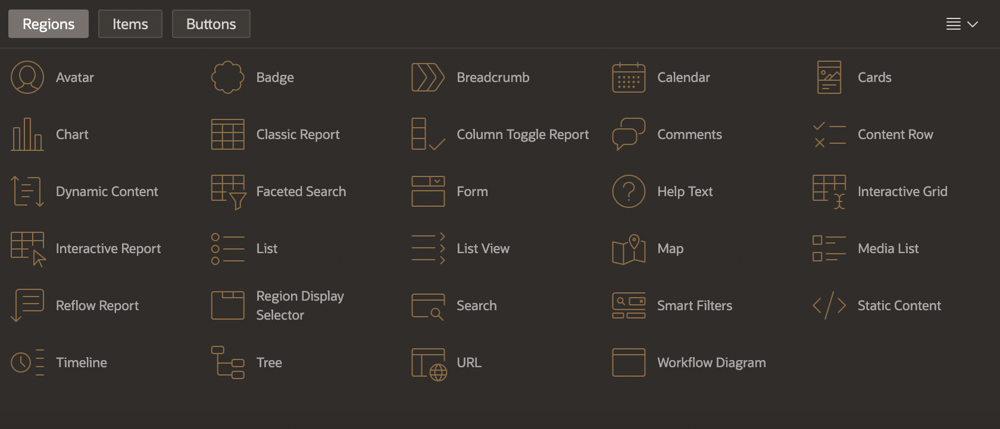
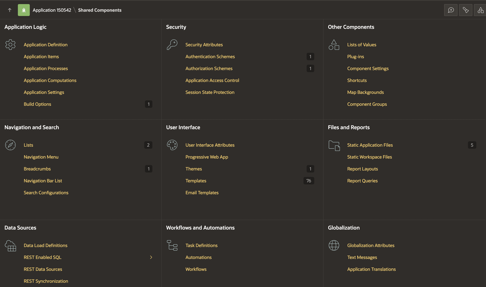

# Mapping Oracle Forms components to APEX [Study]

## Introduction

This lab focuses on understanding how to map Oracle Forms components to the most appropriate APEX components to achieve similar functionality. The lab provides guidelines for comparing Oracle Forms modules with those in APEX, noting that mapping may not always be a direct 1:1 relation.

Estimated Time: 10 Minutes

### Objectives

In this lab, you:

- Understand how to map Oracle Forms components to Oracle APEX components effectively.

## Task 1: Examine Form's Component

There are three main approaches to take when mapping modules from Forms to APEX:

- Discard Forms component/item.
- Move the component's logic into the database.
- Recreate components as an APEX item.

In the following sections, we will examine each of Form's components to determine how they best map into APEX.

1. **Alerts**:
You can store an alert message as a text message in Shared Components in an APEX application. Text messages allow you to build translatable text strings with substitution variables that PL/SQL packages, procedures, and functions can call.
You can also map alerts into [Dynamic Actions](https://docs.oracle.com/en/database/oracle/apex/24.1/htmdb/managing-dynamic-actions.html#GUID-7E564715-E963-44AA-B620-5FFB5EFA62EE), which execute to display an alert dialog and message when an event occurs.

  Another native approach for initiating alerts is to enable the [Confirmation option on buttons](https://docs.oracle.com/en/database/oracle/apex/24.1/htmdb/creating-buttons.html#GUID-F6DA76D1-2020-4930-8D26-12D0A3497C8E).

    

2. **Blocks**:
Blocks will usually correspond to a region type in APEX. As discussed in Lab 1, blocks are either associated with a database object or not. The block type and the data source type are what determine what [region type](https://docs.oracle.com/en/database/oracle/apex/24.1/aeacc/regions.html) we map to in APEX. For example, if in Forms, we have a report based on a view, this can be mapped to an Interactive Report region with data source view.

    

    

3. **Canvases**:
In Oracle Forms, the canvas is where the graphical user interface (GUI) or background of the Form is drawn. In Oracle APEX, the engine constructs the appearance of each page in an application using templates. [Templates](https://apex.oracle.com/pls/apex/r/apex_pm/ut12/templates) define how pages, page controls, and page components are displayed.
The mapping also involves identifying the [page type](https://docs.oracle.com/en/database/oracle/apex/24.1/htmdb/managing-pages-in-an-application.html), which defines the page's overall functionality and appearance.

    

4. **Coordinates**:
Depending on the coordinate system used in a Forms application, coordinates can be expressed in actual units such as inches, centimetres, and pixels. APEX has built-in [responsiveness](https://docs.oracle.com/en/database/oracle/apex/24.1/htmdb/understanding-the-universal-theme.html) that adjusts based on screen size. Page items and regions are adjusted in size and positioning depending on the screen to render responsively. Hence, APEX doesn't support the coordinates system as it is based on a grid layout that determines how elements are on a page.

5. **Editors**:
In Forms, editors provide standard editing features, including search and replace and cut, copy, and paste for text items. These can be mapped to the Rich Text Editor page item.

    

6. **Events**:
Events specify specific actions to occur based on an event that occurred in Forms. In APEX, we can define this behaviour using dynamic actions and events. Dynamic Actions Events allow us to specify client-side actions based on events.

    

7. **List of Values**:
The Values in Forms can be directly mapped to the [List of Values](https://docs.oracle.com/en/database/oracle/apex/24.1/htmdb/about-lists-of-values.html) in APEX. The values can be defined statically or dynamically from the database. Using SQL queries, we can specify the display and return values of list items. These lists can be reused across the entire application.

    

8. **Object Groups**:
In Forms, Object Groups are used to share components between multiple forms. These objects are collections of controls, including blocks, canvases, alerts, etc). In APEX, these are mapped to [Shared Components](https://docs.oracle.com/en/database/oracle/apex/24.1/htmdb/shared-components-page.html).

    

9. **Parameters**:
A parameter is a variable whose value can be set at runtime. Parameters are beneficial for modifying SELECT statements and setting PL/SQL variables at runtime. In APEX, this can be mapped to the [SET_PARAMETER](https://docs.oracle.com/en/database/oracle/apex/24.1/aeapi/SET_PARAMETER-Procedure.html) Procedure in the APEX\_INSTANCE\_ADMIN package, which provides utilities for managing an Oracle APEX runtime environment.

10. **Program Units**:
As discussed in Lab 1, Program Units implement business logic in Forms, which can be incorporated into APEX as a PL/SQL package, [page process, computation, or validation](https://docs.oracle.com/en/database/oracle/apex/24.1/htmdb/managing-computations-validations-and-processes.html).

11. **Property Classes**:
In Forms, a property class is a named object that contains a list of properties and their settings. An object based on a property class can inherit the settings of any property in that class. Property classes are not used within the generation of APEX applications. However, the concept is mapped to how a [theme](https://docs.oracle.com/en/database/oracle/apex/24.1/htmdb/about-themes.html#GUID-DA2773A1-4291-4C1F-B2DD-C3AC822BCCF0) is defined as a named collection of templates used to create the user interface of an application.

    

12. **Record Groups**:
In Forms, record groups to define the query for a list of values. As mentioned in the "List of Values" mapping, this is achieved in APEX by mapping it to a dynamic LOV and defining the SQL query for the values.

    

13. **Triggers**:
In Forms, a trigger is an event handler written in PL/SQL to augment the default processing behavior. As discussed in Lab 1, the trigger logic can be incorporated into APEX as a computation, validation, or PL/SQL process after creating the initial application to map the business logic.

14. **Visual Attributes**:
Visual attributes are the font, color, and pattern properties you can set for form and menu objects appearing in the Forms application's interface. You can style your applications using the default cascading style sheets (CSS) installed with APEX or by uploading your own CSS files.

    

15. **Windows**:
The window in Forms is the container for all visual objects that comprise the application, including canvases. Windows maps to a page in APEX since the page holds all of the visual objects for an application.

## Summary

This lab provides comprehensive guidelines for mapping various Oracle Forms components to APEX, ensuring functionality is retained or improved during modernization.

## Acknowledgements

- **Author** - Monica Godoy, Senior Principal Product Manager ; Ankita Beri, Product Manager
- **Last Updated By/Date** - Ankita Beri, Product Manager, July 2024
