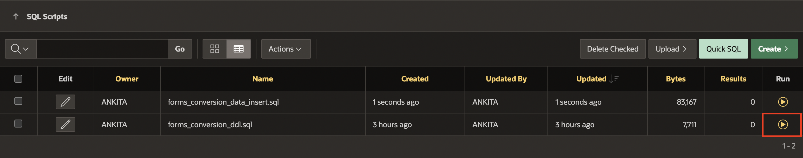

# Setup the Database objects

## Introduction

In this lab, you will create database objects that will be utilized by the APEX environment. The lab involves downloading and running SQL scripts to set up the necessary database schema and populate it with sample data. These steps are foundational for creating an APEX application that leverages these database objects.

Estimated Time: 10 Minutes

### Objectives

- Upload and run the provided SQL scripts in the SQL Workshop to create database schema and insert sample data.

### Download Sample Scripts

To create database objects, you need to download the following two files:

- [Forms\_conversion\_ddl.sql](https://c4u04.objectstorage.us-ashburn-1.oci.customer-oci.com/p/EcTjWk2IuZPZeNnD_fYMcgUhdNDIDA6rt9gaFj_WZMiL7VvxPBNMY60837hu5hga/n/c4u04/b/livelabsfiles/o/forms_conversion_ddl.sql) as sample DDL script.

- [Forms\_conversion\_data\_insert.sql](https://c4u04.objectstorage.us-ashburn-1.oci.customer-oci.com/p/EcTjWk2IuZPZeNnD_fYMcgUhdNDIDA6rt9gaFj_WZMiL7VvxPBNMY60837hu5hga/n/c4u04/b/livelabsfiles/o/forms_conversion_data_insert.sql) as sample data insert script.

## Task 1: Create Database Objects in APEX Workspace

1. Login into your APEX Workspace.

2. On APEX Workspace, Click **SQL Workshop** and select **SQL Scripts**.

    

3. Click **Upload**. Now upload the previously downloaded scripts one after the other into the file(**forms\_conversion\_ddl.sql** and **forms\_conversion\_data\_insert.sql**) and Click **Upload**.

    

    

    

4. The two scripts are now uploaded to the SQL Scripts Workspace page. You need to run them to create and populate the database objects. At the **forms\_conversion\_ddl.sql** script level, Click the arrow under the label **Run** and then **Run Now** to confirm.

    

    

5. Object creation script output is visible on the page after execution. You can see the total number of statements executed and the total number of errors encountered (see "Statements Processed", "Successful" and "With Errors").

    

6. Now click **SQL Scripts** again and run the second script to populate the tables, **forms\_conversion\_data\_insert.sql** under **Run** label and then **Run Now**.

    

    

7. You can see the data load results in the execute script output.

    

    *Note: Check this population script in advance as probably a proper date format setting (i.e., “MM/DD/YYYY” instead of DD/MM/YYYY”) would be needed to load data without errors.*

8. Navigate to **SQL Workshop** and select **Object Browser** to view the tables and the created objects. On the right tab, under Table, click **S\_CUSTOMER**.

    

9. The screenshot below shows the details of the table created, from the table column structure to the populated data, from the triggers to the created constraints.

    

## Summary

Now that the workspace has been populated with database objects and data content, we can proceed to the next lab creating an APEX Application using these database objects.

## Acknowledgements

- **Author** - Monica Godoy, Senior Principal Product Manager ; Ankita Beri, Product Manager
- **Last Updated By/Date** - Ankita Beri, Product Manager, July 2024
