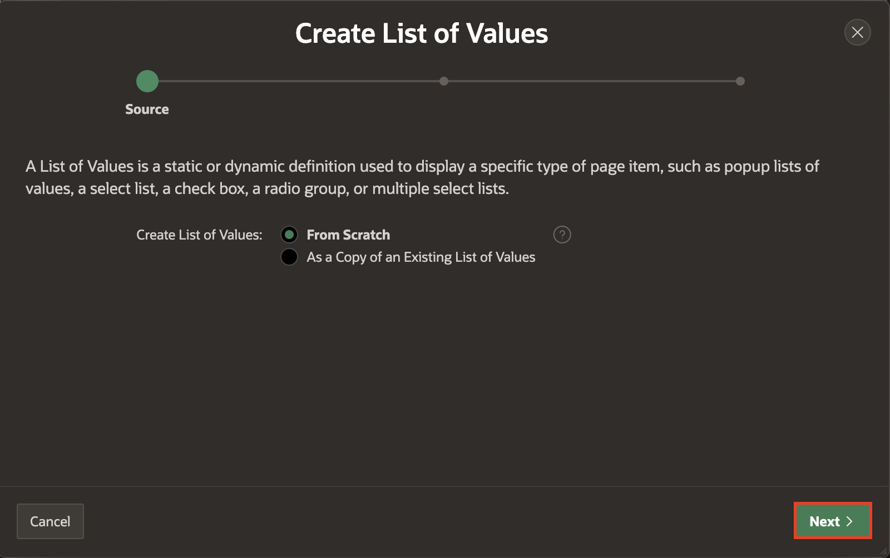

# Enhance Oracle Forms functionalities using APEX

## Introduction
After following the guidelines in the previous labs on best practices to modernize Forms in APEX, Let’s see how you can further enhance the applications created with APEX’s functionalities.

In this lab, you will build on the business logic analysis which was performed on the “Customers’ form” in Lab 1. After migrating and enhancing the business logic, it’s time to modernize the application within APEX.

You will make the following enhancements to the Customers component:
- Configure Credit Rating to use a Static LOV.
-	Customize the Customer Form.
- Customize the Faceted Search.
- Customize the Interactive Report.

You will also further improve the application through enhancing the following components:
-	Navigation Menu
-	Authentication Scheme
-	UI Enhancements

## Task 1: Configure Credit Rating to use a Static LOV

1. The table **S_CUSTOMER** has a column named **CREDIT_RATING** with a check constraint. The column can only contain the following values: **EXCELLENT, GOOD, POOR**. It's important to create a list of values to prevent end-users from entering invalid options.

    

2. To create the list of values, Click **App Builder** and select your application: **Modernization**.

    

    

3. Click **Shared Components**.

    

4. Under **Other Components**, Click **List of Values**.

    

5. Click **Create**.

    

6. Create List of Values from Scratch and Click **Next**.

    

7.	Under Name and Type, enter/select the following:

    - Name: **S_CUSTOMER.CREDIT_RATING**  

    - Type: **Static**.

    Click **Next**.

    

8. Enter the following Display Values and Return Values:

    | Display Value | Return Value |
    |---------------|--------------|
    |Excellent      |	EXCELLENT |
    |Good           |	GOOD |
    | Poor          | POOR |
    {: title="List of Values"}

	Click **Create List of Values**.

  

9. Click **Create** to create another list of values.


10. For Name: Enter **SALES_REP_LOV** and Click **Next**.

    

11. Under **List of Values Source**, enter/select the following:

    - Source Type: **SQL Query**

    - Enter a SQL SELECT statement: Copy and Paste the below query into the code editor:

    ```
    <copy>
    select Distinct e.FIRST_NAME ||' '|| e.LAST_NAME AS d,
       e.id as r
    from s_emp e, s_customer c
    where e.id = c.sales_rep_id;
    <copy>
    ```

    Click **Next**.

    

## Task 2: Customize the Customer Form

When you create a form using the wizard, it automatically creates an item for each column in the table. Depending on the column type, it creates a Text Field, Text area, Date Picker or Number Field item.

Once the page is created, you can go to the page and make the changes you need. Select a different type of element, edit the label and more. Moreover, you can organize items by dragging and drop them.

To use the list of values previously created:

1.	Navigate to Application ID and select your application.

    

2.	Select **3 - Customer**.

    

3. Organize items by dragging and dropping them.

    

4.	In the left pane, select **PX_CREDIT_RATING**. In the Property Editor, update the following:

    - Identification > Type: **Radio Group**

    - Settings > Number of Columns: **3**

    - Under List of Values:

        - Type: **Shared Component**

        - List of Values: **S_CUSTOMER.CREDIT_RATING**

        - Display Extra Values: **Toggle Off**

        - Display Null Value: **Toggle Off**

	 Click **Save**.

   

## Task 3: Customize the Faceted Search
You can define which facets are going to be used to filter the data, some are defined automatically, but you can create or delete them as needed. Also, you can drag and drop facets to change their display order.

1. From the Page designer, Navigate to the Faceted Search Page.

    

2.	In the left pane, under **Search**, Right-click **Facets** and click **Create Facet**.

    

3. Create the following three facets one after the other:

| NAME |	TYPE |	LABEL |	LIST OF VALUES TYPE |	LIST OF VALUES |
|----- | ----- | ----- | -------------------- | -------------- |
|PX_CITY |	Checkbox Group |	City |	Distinct Values |	  |
| PX_NAME	| Checkbox Group |	Name |	Distinct Values	|   |
| PX_SALES_REP_ID	| Checkbox Group |Sales Rep	| Shared Component|	SALES_REP_LOV|

4.	Now organize the facets in the following order:
    |Facets|
    |------|
	  |PX_CREDIT_RATING|
	  |PX_REGION_ID|
    |	PX_COUNTRY |
    | PX_CITY |
    | PX_NAME |
    | PX_SALES_REP_ID |

    

5.	Click Save.
